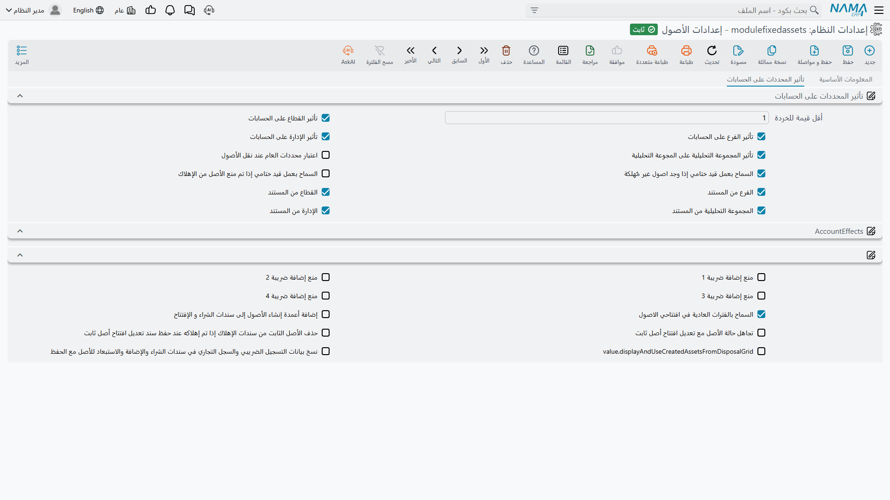
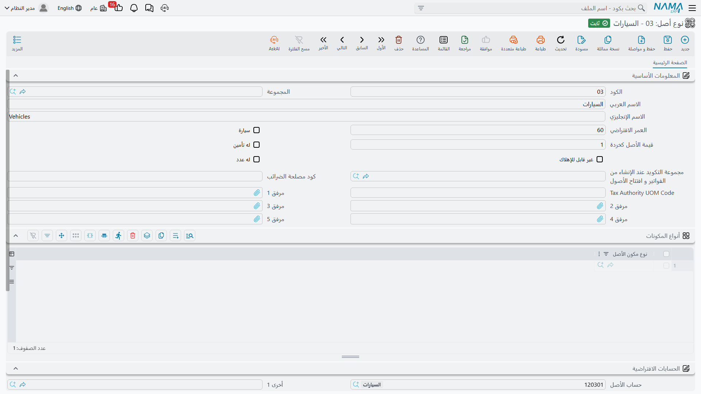
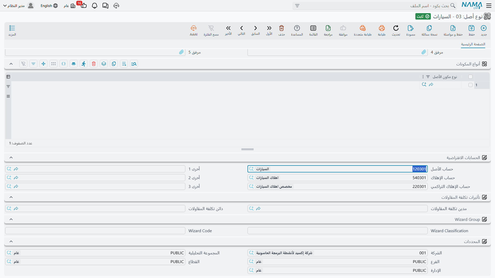
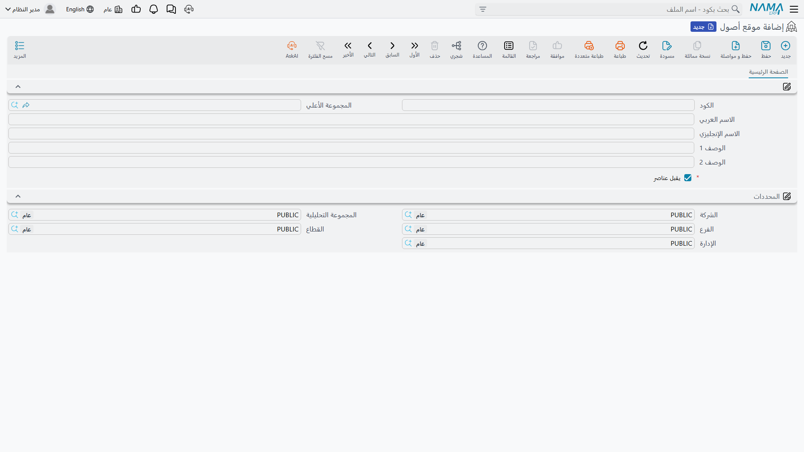
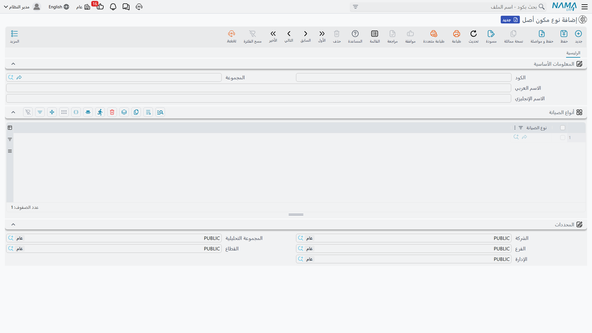
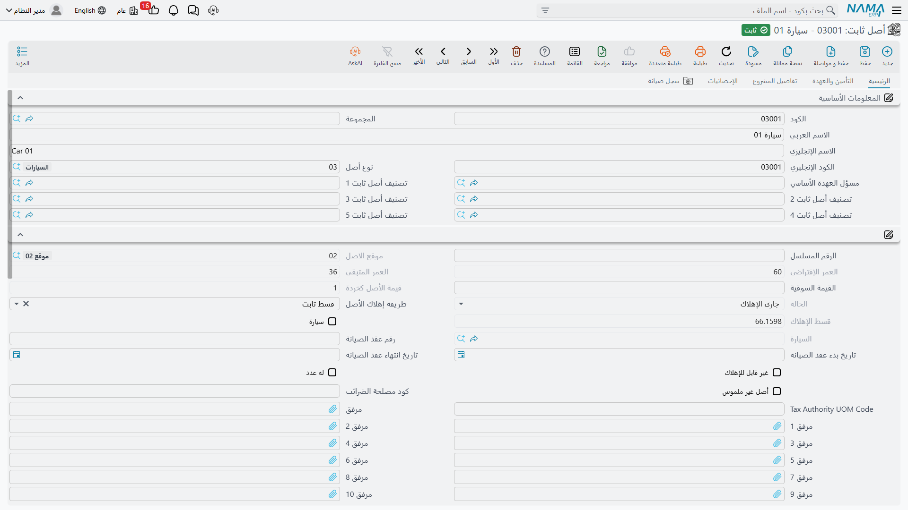
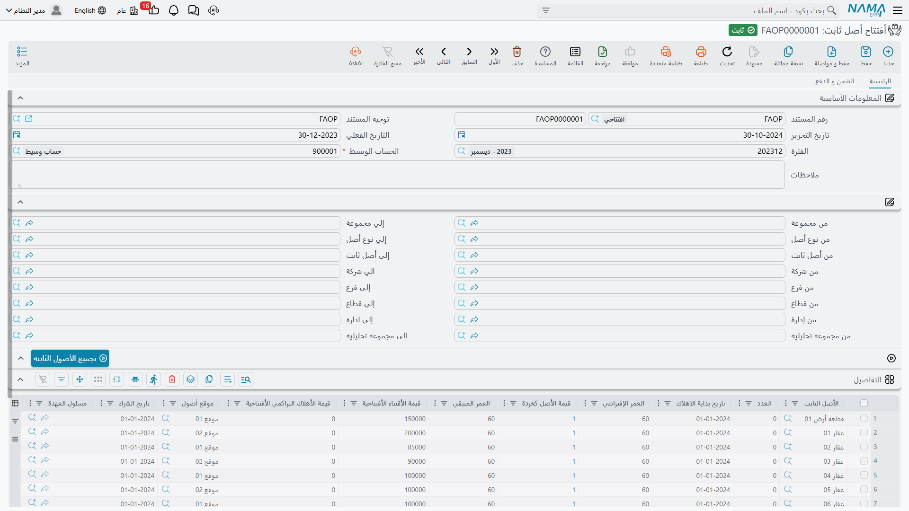
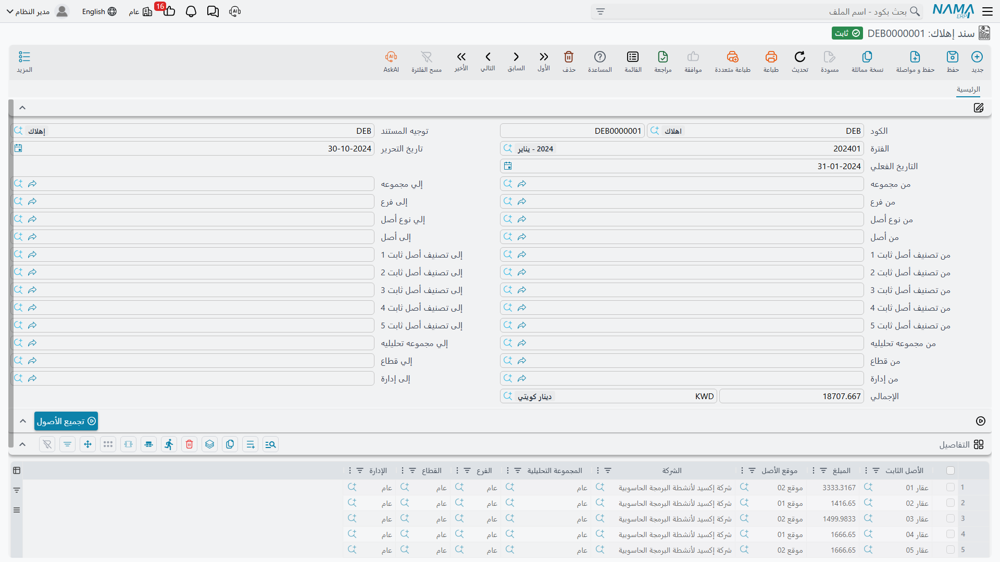

# البدء والتأسيس

تأسيس الأصول الثابتة في قاعدة بيانات جديدة ليس صعبًا، لكن الترتيب فيه أهم منه في أغلب الوحدات. فكل ما يعرفه الأصل عن نفسه تقريبًا — حساباته، وعمره المتوقع، وقيمته كخردة، بل ومكوناته — منسوخ نزولًا من شيء أسّسته قبله. ابنِ القطع بترتيب خاطئ فستجد نفسك أنشأت أصولًا بلا حسابات، ثم اكتشفت ذلك بعد أن رفض أول سند إهلاك أن يُعتمد.

هذه الصفحة تمشي في التأسيس كما ستفعله شركة الواحة للصناعات فعلًا، بالترتيب الذي يجنّبك إعادة العمل.

> **شركة الواحة للصناعات** ستبدأ التشغيل في **1 يناير 2026**. تدير مصنعًا واحدًا في الرياض بصالتين، ويضم سجل أصولها آلات وسيارات وأثاثًا مكتبيًا. بعض هذه الأصول اشتُري قبل سنوات وأُهلك جزئيًا؛ أما ماكينة القص `MCH-0007` فتُشترى جديدة في أول يوم من النظام الجديد.

## قراران قبل أن تكتب أي شيء

كلاهما رخيص الآن وغالٍ بعد أن توجد الأصول.

### إيقاع الفترات المالية

تُهلك الوحدة **مرة واحدة لكل فترة مالية**، وتعدّ العمر الافتراضي والعمر المتبقي **بالفترات لا بالسنوات**. فحين تقول لها إن عمر ماكينة القص 60 فأنت تقول ستين فترة مالية. والحساب الذي يشتق العمر المتبقي من التواريخ يعمل بالشهور كذلك.

فالوحدة إذن تتوقع تقويمًا ماليًا **شهريًا**، وهذا هو الشكل الذي تضبطه في وحدة الحسابات قبل أن تبدأ. فالستون تعني خمس سنوات فقط إذا كانت الفترة شهرًا.

ونتائج الإيقاع الشهري تستحق أن تُعرف مقدمًا:

- الأصل الذي يُقتنى في أي يوم من الفترة يأخذ **قسطًا كاملًا** عن تلك الفترة. لا تجزئة لجزء الشهر.
- يُشغَّل الإهلاك فترة بعد فترة بالترتيب. لا يمكنك تخطّي مارس وتشغيل أبريل.
- يُمنع إقفال الفترة المالية ما دام أصل جارٍ إهلاكه لم يُهلَك في الفترة السابقة — إلا إذا خفّفت ذلك عمدًا من [إعدادات الوحدة](/ar/modules/fixedassets/fixedassets-configuration.md).

### هل تُنشأ بطاقات الأصول قبل المستند أم بواسطته

تصل قيمة كل أصل على مستند — سند شراء للأصول الجديدة، وسند افتتاح لما تملكه من قبل. والذي يختلف بين تركيب وآخر هو هل *يجد* ذلك المستند بطاقة أصل أنشأها أحدهم قبله، أم *يُنشئها* هو.

وكلاهما يعمل. فتسجيل الأصول أولًا يمنحك التحكم في التكويد والتصنيف والحسابات، وهو الخيار الصحيح حين تبني الإدارة المالية السجل بتأنٍّ. وترك المستندات تُنشئ البطاقات أسرع، ويناسب الشركات التي يصلها كشف الأصول كقائمة سطور فواتير.

وتضبط ذلك بخيار **إضافة أعمدة إنشاء الأصول إلى سندات الشراء و الإفتتاح** على سجل الإعدادات؛ ومعالج التأسيس يطرح عليك السؤال نفسه بصيغة *"إنشاء الاصول من خلال الشراء والافتتاحي"*.

وتغيير رأيك لاحقًا لا يكسر شيئًا، لكن الأصول التي أُنشئت في ظل النظام القديم تحتفظ بما أُعطيت من تكويد وتصنيف، فالسجل المبني بالطريقتين سجل غير متسق القراءة. فاحسم الأمر مرة واحدة.

وما دمت على تلك الشاشة فاحسم أيضًا مسائل المحددات — هل يأتي الفرع والقطاع والإدارة والمجموعة التحليلية على قيود الأصل من بطاقة الأصل أم من المستند الذي حرّكه. فهذه تُقرأ في كل مرة يُعالج فيها مستند، وضبطها قبل وجود أول قيد يوفّر عليك إعادة توليد القيود لاحقًا. وكل الخيارات مشروحة في [إعدادات الوحدة](/ar/modules/fixedassets/fixedassets-configuration.md).

## الخطوة 1 — أنواع الأصول وحساباتها

ابدأ من هنا دائمًا. **نوع الأصل** هو القالب الذي ينسخ عنه كل أصل من عائلته، والحسابات الثلاثة التي يحملها هي التي ستُقيَّد عليها الوحدة كلها.

تُنشئ الواحة ثلاثة أنواع للبداية:

| الكود | الاسم | العمر الافتراضي | قيمة الخردة |
|---|---|---|---|
| `FAT-MCH` | آلات ومعدات | 60 | حسب الأصل |
| `FAT-VEH` | سيارات | 60 | 12,000 |
| `FAT-FRN` | أثاث | 120 | 0 |

والجزء الذي لا يجوز تخطّيه على كل نوع هو مجموعة **الحسابات الافتراضية**. فالوحدة لا تدع توجيه المستند يختار حسابات الأصل نفسه أبدًا؛ بل تقرؤها دائمًا من بطاقة الأصل، والبطاقة ترثها من نوعها.

وثلاث من الخانات تحمل معنى عند الوحدة:

| الخانة | ما تستخدمها الوحدة فيه |
|---|---|
| **حساب الأصل** | تكلفة الأصل. يُجعل مدينًا عند الاقتناء ودائنًا عند التخلص. |
| **حساب الإهلاك** | مصروف الإهلاك، ويُجعل مدينًا كل فترة. |
| **حساب الإهلاك التراكمي** | الحساب المقابل، ويُجعل دائنًا كل فترة ويُصفَّى عند التخلص. |

وللنوع `FAT-MCH` توجّه الواحة الخانات الثلاث إلى تكلفة الآلات، ومصروف الإهلاك، ومجمع إهلاك الآلات. وكل أصل تعطيه هذا النوع لاحقًا يرث الثلاثة.

وشيئان آخران على النوع يستحقان الملء الآن:

- **العمر الافتراضي** — يُنسخ على سطور سندات الشراء والافتتاح، فلا يضطر من يسجّل الفاتورة إلى تذكّر أن الآلات تعمر 60 فترة.
- **قيمة الأصل كخردة** — تُنسخ على سطور **شراء** الأصول. أما سطور الافتتاح فلا تأخذها من النوع، فتدخل القيمة المتبقية بنفسك على سند الافتتاح.

ويحمل النوع أيضًا مؤشرات تصف العائلة — سيارة، له تأمين، غير قابل للإهلاك، له عدد — وقائمة بأنواع المكونات. وكل هذا يُنسخ على الأصل لحظة اختيارك نوعه. وثمة دقيقة: **حسابات النوع تُعاد كتابتها على الأصل مع كل حفظ**، فتعامَل مع النوع باعتباره المرجع في الحسابات بدل تعديلها أصلًا أصلًا. والصورة الكاملة في [أنواع الأصول](/ar/modules/fixedassets/master-files/fixedassets-asset-types.md).

::: tip الأراضي وما لا يُهلَك
أشِّر على النوع بأنه **غير قابل للإهلاك** فلا تلتقط سندات الإهلاك الأصول التي ترثه — وهي، بخلاف الأصول العادية، يمكن حفظها بلا حسابات إطلاقًا.
:::

## الخطوة 2 — التصنيفات

مستويات التصنيف الخمسة هي الطريقة التي ستشرّح بها الواحة سجلها في التقارير: المستوى 1 = **معدات إنتاج**، والمستوى 2 = **ماكينات قص**، وهكذا نزولًا إلى العمق الذي تستخدمه الشركة فعلًا.

وكن واضحًا فيما هي له. إنها **تجمّع وتفلتر وتُقرِّر**. فهي لا تحلّ حسابًا، ولا تعطي قيمًا افتراضية، ولا تغيّر سلوكًا. وإن كنت تبحث عن مكان تعلّق فيه حسابات إهلاك مختلفة فذلك المكان هو نوع الأصل لا التصنيف.

وقاعدتان تحكمان السلسلة: يسجّل التصنيف المستوى الأعلى منه كأب له، ويحمل كل مستوى نوع الأصل الذي ينتمي إليه، ويجب أن يطابق نوع المستوى الأعلى. واختيار تصنيف على الأصل يملأ تلقائيًا المستويات فوقه ونوع الأصل. ولست مضطرًا لاستخدام المستويات الخمسة — ابدأ بواحد وزد العمق حين يطلبه تقرير. انظر [تصنيفات الأصول](/ar/modules/fixedassets/master-files/fixedassets-classifications.md).

## الخطوة 3 — المواقع

**موقع الأصول** مكان مادي، والمواقع تشكّل شجرة: الموقع، ثم المبنى، ثم الصالة. تؤسّس الواحة `LOC-R` — مصنع الرياض، وتحته `LOC-R2` — صالة 2 و`LOC-R3` — صالة 3.

والمفردات التي تبنيها هنا هي التي ستتكلمها مستندات الحركة. ولاحظ أن حقل موقع الأصل لا يُكتب على الأصل أبدًا — بل هو وجهة أحدث حركة موقع، تكتبها سندات الشراء والاستلام والافتتاح والنقل. فابنِ الشجرة إلى العمق الذي سيسجّله موظفوك فعلًا. انظر [مواقع الأصول](/ar/modules/fixedassets/master-files/fixedassets-locations.md).

## الخطوة 4 — أنواع المكونات

**نوع مكون الأصل** يسمّي جزءًا قابلًا للصيانة: عمود دوران، أو وحدة تحكم، أو مضخة تبريد، أو محرك، أو ضاغط. ويسرد كل نوع منها أنواع الصيانة التي تنطبق عليه.

والمكونات موجودة لغرض واحد: **تاريخ الصيانة**. فهي لا تحمل تكلفة ولا إهلاكًا خاصًا بها؛ وعمود دوران ماكينة القص ليس أصلًا منفصلًا، بل شيء يمكنك تسجيل خدمة عليه. فلا تؤسّس أنواع المكونات الآن إلا إذا كانت الواحة تنوي استخدام جانب الصيانة من الوحدة — وإن كانت تنوي فأسّسها *قبل* إنشاء الأصول، لأن سرد أنواع المكونات على نوع الأصل يعني أن كل أصل من ذلك النوع يولد وجدول مكوناته مملوء.

وقاعدة تخطط لها من الآن: **لا يمكن اعتماد سجل صيانة لأصل بلا مكونات.** فإن كانت الصيانة في النطاق فالمكونات ليست اختيارية. انظر [مكونات الأصل](/ar/modules/fixedassets/master-files/fixedassets-components.md) و[الصيانة](/ar/modules/fixedassets/maintenance/fixedassets-maintenance-overview.md).

## الخطوة 5 — دفاتر المستندات وتوجيهاتها

الآن تُوصَّل المحاسبة. فكل مستند في الأصول الثابتة يصدر من **دفتر مستندات**، ويحمل الدفتر **توجيهًا** يقول أي حسابات تصيبها قيود المستند.

وتذكّر تقسيم العمل: **حسابات الأصل تأتي من الأصل**، فالتوجيه لا يضبط جانب الأصل أبدًا. وما يضبطه كل توجيه هو ما عدا ذلك — جانب المورد أو النقدية في الشراء، وطرفا مصروف الإهلاك، وحسابا المكسب والخسارة في التخلص، وحسابات الضريبة والخصم.

ولبداية تشغيل واحدة تحتاج الواحة على الأقل إلى:

| المستند | ما يجب أن يحسمه توجيهه |
|---|---|
| سند شراء أصل ثابت | الجانب الدائن — حساب مراقبة الموردين — وحسابات الضريبة، وهل يجوز للمستند إنشاء بطاقات الأصول. |
| أفتتاح أصل ثابت | لا شيء على جانب الحسابات: سند الافتتاح يبني سطوره الثلاثة بنفسه، وتسمّي أنت الحساب الوسيط على كل مستند. |
| سند إهلاك | طرفا مصروف الإهلاك يُقرآن من الأصل؛ والتوجيه هو موضع بقية إعدادات سند الإهلاك. |
| تخلص من الأصل | حساب المتحصلات، وحسابا المكسب والخسارة منفصلين. |

وإن كان التركيب قد شغّل معالج التأسيس فبعض هذا موجود سلفًا: يستورد المعالج مجموعة افتراضية من أنواع الأصول، وينشئ توجيه شراء جانبه الدائن موجّه إلى المورد، وتوجيه تخلص بحسابَي مكسب وخسارة مملوءين. فافحص ما صنعه قبل أن تبني توجيهاتك.

ابدأ القراءة من [كيف تعمل توجيهات الأصول الثابتة](/ar/modules/fixedassets/document-terms/fixedassets-terms-basics.md) التي تشرح ما يتحكم فيه التوجيه في هذه الوحدة وأي المستندات له توجيه أصلًا؛ أما الحسابات نفسها فمغطاة في [توجيهات الاقتناء](/ar/modules/fixedassets/document-terms/fixedassets-terms-acquisition.md) و[توجيهات الإهلاك والتخلص](/ar/modules/fixedassets/document-terms/fixedassets-terms-depreciation-and-disposal.md).

## الخطوة 6 — الأصول نفسها

بعد أن تستقرّ الملفات الرئيسية تصير بطاقات الأصول سريعة. أعطِ الأصل كودًا وأسماءً، واختر نوعه — وشاهد الحسابات والمؤشرات وجدول المكونات تصل من النوع — ثم اختر تصنيفاته ومحدداته، ومسؤول عهدته الأساسي إن كنت تعرفه.

وما **لن** تجده هو مكان تكتب فيه التكلفة أو العمر الافتراضي أو قيمة الخردة أو الموقع. فالأصل الجديد يُحفظ بحالة **إبتدائى**، بلا قيمة وبلا قسط. إنه قوقعة تنتظر مستندًا. وهذا مقصود تمامًا، ولهذا كانت هذه الخطوة قصيرة. انظر [بطاقة الأصل الثابت](/ar/modules/fixedassets/master-files/fixedassets-asset-master.md).

وأمام الشركات التي تشغّل وحدة المقاولات أيضًا طريق آخر، ويحسن أن تعرف ما **ليس** هو. فـ**سند إنشاء أصول** ليس شاشة تسجيل بالجملة: إنه المستند الذي يرسمل مشروع مقاولات مكتملًا كأصل من أصولك أنت — يسمّي المشروع على كل سطر، ويأخذ كود الأصل من السطر، وينسخ بنود عقد المشروع على الأصل، ويرفض إنشاء أصل ثانٍ لمشروع له أصل بالفعل. وهو ينشئ بطاقات الأصول في حالتها الابتدائية ثم يولّد سند شراء يُدخلها الخدمة. ولاحظ أنه **لا** يضع تكلفة الأصل؛ فالأصول المنشأة بهذا الطريق تصل بقيمة صفر، ولا بد أن تصلها القيمة عبر سند الشراء المولَّد أو عبر سند إضافة بعد ذلك. ولا يظهر عنصره في القائمة إلا برخصة المقاولات. انظر [سند إنشاء الأصول](/ar/modules/fixedassets/master-files/fixedassets-creation-document.md).

## الخطوة 7 — الأرصدة الافتتاحية

الآن أدخِل الأصول التي كانت الواحة تملكها من قبل. **سند أفتتاح أصل ثابت** هو المكان الذي تنضم فيه آلة اشتُريت عام 2023 وأُهلكت جزئيًا إلى النظام الجديد دون التظاهر بأنها اشتُريت أمس.

تذكر لكل أصل: قيمة الاقتناء الأصلية، ومجمع الإهلاك المأخوذ بالفعل، والعمر الافتراضي وقيمة الخردة، وتاريخ بداية الإهلاك، وتاريخ الشراء، والموقع. ويسمّي رأس المستند **الحساب الوسيط**، وهو حساب المعلَّقات الذي تتوازن عنده دفعة الافتتاح كلها.

وثلاثة أمور يجب ضبطها على هذا المستند:

1. **يجب أن تكون الفترة المالية افتتاحية**، ما لم تكن قد فعّلت *السماح بالفترات العادية في افتتاحي الاصول*. وهذا إصرار من الوحدة على أن الأرصدة الافتتاحية تقع خارج فترات النشاط.
2. **لا يجوز أن يتجاوز مجمع الإهلاك قيمة الاقتناء ناقص قيمة الخردة.** يفحص المستند ذلك، والسطر المرفوض يكون في الغالب رقمًا قديمًا كتب الأصل تحت قيمته المتبقية أصلًا.
3. **أدخِل قيمة الخردة بنفسك.** فسطر الافتتاح، بخلاف سطر الشراء، لا يأخذها من نوع الأصل.

وهناك زر **تجميع الأصول الثابته** يسحب كل أصل ما زال في حالته الابتدائية داخل النطاقات التي تحددها أعلى المستند، مملوءًا بالعمر الافتراضي وقيمة الخردة من نوع كل أصل. استخدمه ثم صحّح الأرقام بدل كتابة كل سطر.

وعند اعتماد المستند يأخذ كل أصل قيمة اقتناءه ومجمع إهلاكه الافتتاحيين، وتنتقل حالته إلى **جارى الإهلاك** — وهنا الجزء الذي يغفله الناس: تحسب الوحدة التاريخ الذي يُعتبر الأصل مهلَكًا حتى عنده، فيبدأ أول سند إهلاك من الفترة الأولى في النظام الجديد بلا ازدواج ولا فجوة. أما التصحيحات بعد ذلك فتمرّ عبر مستند **تعديل أفتتاح أصل ثابت** الذي يعدّل السند الأصلي بدل إضافة افتتاح ثانٍ. انظر [الأرصدة الافتتاحية](/ar/modules/fixedassets/acquisition/fixedassets-opening-balances.md).

أما المشتريات الجديدة فلا تدخل من هنا بالطبع. فـ `MCH-0007` يصل على سند شراء في 1 يناير 2026 بمبلغ 240,000 — انظر [سند الشراء](/ar/modules/fixedassets/acquisition/fixedassets-purchase-document.md).

## الخطوة 8 — أول سند إهلاك

ساعة الحقيقة. في نهاية يناير 2026 تُنشئ الواحة **سند إهلاك** لفترة يناير.

والروتين هو: اختر الفترة المالية، واضغط **تجميع الأصول** لسحب كل أصل مستحق، وراجع السطور، ثم اعتمد. وسطر `MCH-0007` يقرأ:

> (240,000 − 24,000) ÷ 60 = **3,600**

ويجعل القيد حساب مصروف الإهلاك مدينًا وحساب مجمع الإهلاك دائنًا، وكلاهما مأخوذ من بطاقة الماكينة نفسها. وكل أصل آخر في السند يفعل الشيء ذاته بحساباته هو، ولهذا كانت الخطوة الأولى مهمة.

وافحص ثلاثة أشياء في أول تشغيل قبل أن تثق بالتأسيس:

- **هل حضر كل ما ينبغي أن يحضر؟** لا يُجمَع الأصل إلا إذا كان جاريًا وقابلًا للإهلاك ولم يُهلَك لهذه الفترة وبلغ تاريخ بدء إهلاكه. والأصل الغائب عن أول تشغيل يكون في الغالب أصلًا ما زال في حالته الابتدائية لأن لا سند شراء ولا افتتاح أعطاه قيمة.
- **هل تبدو الأقساط صحيحة؟** القسط الصفري يعني إما أن لا عمر متبقيًا وإما أن القيمة الدفترية بلغت قيمة الخردة.
- **هل رُحِّلت القيود فعلًا؟** اعتماد المستند يرفع **طلب أعمال** يُعالج في الخلفية، فيظهر القيد بعد الحفظ بلحظة. وإن لم يظهر فافتح شاشة طلبات الأعمال، وفلتِر على الفاشلة، وحدّد السطور، ثم من قائمة **المزيد** اختر *إعادة المعالجة* أو *إعادة الاعتماد*.

وحين يخرج أول تشغيل نظيفًا يستقر الإيقاع: سند إهلاك واحد لكل فترة، قبل إقفالها. انظر [تشغيل الإهلاك](/ar/modules/fixedassets/depreciation/fixedassets-depreciation-document.md)، و[سند الإهلاك المجمع](/ar/modules/fixedassets/depreciation/fixedassets-aggregated-depreciation.md) حين يكبر السجل بما يجعلك تريد إجراءً واحدًا يُنتج مستندات كثيرة.

## ما لا تؤسّسه إلا عند الحاجة

بقية الوحدة اختيارية ويمكن أن تنتظر حتى يوجد سبب:

- **العهد** — سجل منفصل للحواسيب المحمولة والهواتف والعدد التي تُسلَّم للموظفين، وله رخصته الخاصة. وهو ليس سجل أصول ثابتة ولا شيء فيه يُهلَك. ابدأ من [العهد](/ar/modules/fixedassets/custody/fixedassets-custody-overview.md).
- **إعتمادات الأصول** — السلسلة التي تُنزل الآلات المستوردة بتكلفتها الحقيقية شاملةً الشحن والجمارك والتخليص. ابدأ من [إعتمادات الأصول](/ar/modules/fixedassets/letters-of-credit/fixedassets-lc-overview.md).
- **الصيانة** — الأنواع وبنود الصيانة والخطط والسجلات. ابدأ من [الصيانة](/ar/modules/fixedassets/maintenance/fixedassets-maintenance-overview.md).
- **الجرد** — مطابقة السجل بالواقع مرة في السنة. انظر [جرد الأصول](/ar/modules/fixedassets/movement/fixedassets-stocktaking.md).

وحين تريد أن ترى السجل من الخارج فالتقارير الخمسة المشحونة موصوفة في [التقارير](/ar/modules/fixedassets/reports/fixedassets-reports.md).
