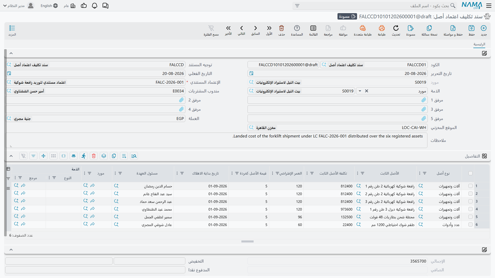
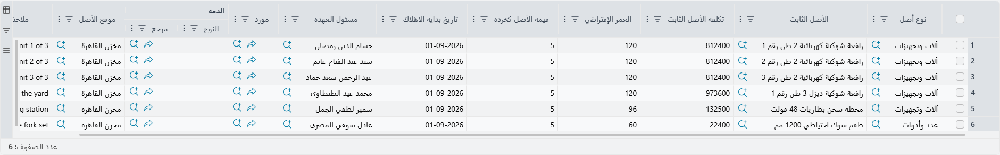

# سند تكليف الاعتماد

حتى هذه اللحظة كلّف الاستيراد 615,000 ولا أحد يملك مكبساً. فالمال جالس في حساب وسيط، مقسوماً ثمانية
أقسام على ماكينتين وأربعة أنواع من المصروف، وكارتا الأصلين ما زالا قوقعتين فارغتين في حالتهما
المبدئية.

و**سند تكليف اعتماد أصل** هو الذي ينهي ذلك. فهو يجمع كل ما وُزِّع على كل ماكينة، ويكتب الإجمالي عليها
تكلفةً لها، ويدخلها الخدمة، ويشغّل ساعة إهلاكها — ويغلق الاعتماد المستندي. وهو المستند الوحيد في
السلسلة الذي يغيّر أصلاً.

تجده في **الأصول ‹ إعتمادات الأصول ‹ سند تكليف اعتماد أصل**.

## اختيار الاعتماد يكفيك أكثر الكتابة

اختر **الإعتماد المستندي** فيبني المستند نفسه بنفسه. يقرأ
[الفاتورة المبدئية](/ar/modules/fixedassets/letters-of-credit/fixedassets-lc-proforma-invoice.md)
للاعتماد، ويفرد صفّ تفاصيل لكل ماكينة — صفاً لكل أصل مسمّى، وبعدد الكمية للسطر الذي يسمّي نوع أصل
فقط — ثم يقرأ كل
[سند مصروف](/ar/modules/fixedassets/letters-of-credit/fixedassets-lc-expenses.md) مرحَّل على الاعتماد
ويملأ ما تراكم على كل ماكينة.

وقائمة الاختيار لا تعرض إلا الاعتمادات المفتوحة. فالاعتماد الذي رُحِّل سند تكليفه مغلق ولا يظهر.

وفي `LC-2026-004` يظهر صفّان يحملان بالفعل:

| الأصل الثابت | تكلفة الأصل الثابت |
|---|---|
| `PRS-0001` مكبس أ | 369,000 |
| `PRS-0002` مكبس ب | 246,000 |

ويُعاد حساب هذا الرقم من سطور التوزيع في **كل حفظ**، والقيمة المحفوظة هي المعتبَرة — أما ما تراه لحظة
اختيارك الاعتماد فهو استعراض يخبرك أن المستند وجد شيئاً. احفظه ثم اقرأ العمود مرة أخرى قبل الترحيل.

## بيانات الرأس

| الحقل | ملاحظات |
|---|---|
| **الكود** (الدفتر / الكود) | الدفتر الذي يرقّم المستند |
| **توجيه المستند** | مطلوب — وهو يقرّر الحساب الذي تُخرَج منه التكلفة دائناً. راجع [توجيهات العهد والاعتمادات](/ar/modules/fixedassets/document-terms/fixedassets-terms-custody-and-lc.md) |
| **تاريخ التحرير** و**التاريخ الفعلي** | والتاريخ الفعلي يصير تاريخ شراء كل أصل |
| **الإعتماد المستندي** — مطلوب | الاعتماد الذي يُغلَق |
| **مورد** | يُملأ من الاعتماد وغير قابل للتعديل |
| **الذمة** و**مندوب المشتريات** | حقول مرجع للتقارير |
| **الموقع المخزني** | موقع افتراضي لأصول هذا المستند |
| **مرفق 1 – 5** و**ملاحظات** | إذن الإفراج الجمركي، وإذن التسليم، والملاحظات |

وتعرض منطقة الإجماليات **الإجمالي** — مجموع تكاليف وصول الماكينات، وهو 615,000 في هذه الشحنة —
ومجموعة المحددات تعمل كما في غيرها. والمستند يعمل بالعملة الرئيسية للأستاذ؛ وسطور المصروف الموزَّعة
تحتفظ تحته بعملاتها ويُحوَّل كلٌّ منها على حدة.

## السطور: التكلفة تدخل، ومحددات الإهلاك تخرج

نصف الجدول مملوء لك ونصفه عليك.

**ما يملؤه النظام:**

| العمود | |
|---|---|
| **نوع أصل** و**الأصل الثابت** | مأخوذان من الفاتورة المبدئية. وقائمة اختيار الأصل لا تعرض إلا أصول ذلك النوع التي ما زالت في حالتها **المبدئية** — فالأصل الذي رُسمِل بسند شراء أو افتتاح لا يُرسمَل هنا مرة أخرى |
| **تكلفة الأصل الثابت** | تكلفة الوصول المحسوبة. غير قابلة للتعديل — فهي حصيلة حساب السلسلة كلها لا رقم يُكتَب باليد |

**ما تملؤه أنت، مرة لكل ماكينة:**

| العمود | |
|---|---|
| **العمر الإفتراضي** | عدد الفترات التي ستُهلَك الماكينة عليها |
| **قيمة الأصل كخردة** | ما يُتوقَّع أن تساويه في النهاية. ولا يجوز أن تساوي التكلفة المحسوبة |
| **تاريخ بداية الاهلاك** | مطلوب، إلا أن يكون الأصل غير قابل للإهلاك |
| **مسئول العهدة** | الموظف الذي تُسلَّم له الماكينة |
| **موقع الأصل** | المكان الذي تذهب إليه فعلياً |
| **مورد** و**الذمة** و**ملاحظات** | مرجع |

وتكمل الواحة الصفّين هكذا:

| الأصل | تكلفة الوصول | العمر | قيمة الخردة | بداية الإهلاك | مسئول العهدة | الموقع |
|---|---|---|---|---|---|---|
| `PRS-0001` مكبس أ | 369,000 | 120 | 36,900 | 1 مارس 2026 | خالد المطيري | `LOC-R2` مصنع الرياض – صالة 2 |
| `PRS-0002` مكبس ب | 246,000 | 120 | 24,600 | 1 مارس 2026 | خالد المطيري | `LOC-R2` مصنع الرياض – صالة 2 |

## كيف يُتوصَّل إلى كل رقم

لا يثق المستند بالاستعراض. ففي كل حفظ يعود إلى الاعتماد ويعيد الحساب:

1. يجمع **كل** سطر توزيع يتبع هذا الاعتماد، من كل سند مصروف مرحَّل — متجاهلاً فلاتر المحددات، لأن
   تكاليف الشحنة قد تكون أُدخلت تحت فروع مختلفة.
2. يُسقِط السطور التي قال عنها بند مصروفها أو توجيهها **عدم التأثير في التكاليف**. فتلك التكاليف تبقى
   في الأستاذ حيث وضعها سند المصروف؛ ولا تصير قيمة أصل أبداً.
3. يساهم كل سطر باقٍ بقيمة مصروفه، زائد الضرائب المحتسبة في التكلفة، ناقص خصمه.
4. تُجمَع السطور التي تسمّي **أصلاً بعينه** لكل أصل، ويكون المجموع تكلفة ذلك الأصل.
5. وتُجمَع السطور التي تسمّي **نوع أصل** فقط لكل نوع، ثم تُقسَم على عدد صفوف ذلك النوع في هذا المستند
   — وهكذا يصير سطر الدفعة على الفاتورة المبدئية تكلفةً لكل وحدة على حدة.
6. و**إجمالي** المستند هو مجموع السطور.

وللمكبسين يكون هذا مجرد جمع العمودين من الصفحة السابقة:
300,000 + 24,000 + 36,000 + 9,000 = **369,000** للمكبس أ، و200,000 + 16,000 + 24,000 + 6,000 =
**246,000** للمكبس ب.

## ماذا يفعل الترحيل بالأصول

يكتب الترحيل، لكل سطر:

| على الأصل | القيمة |
|---|---|
| تكلفة الأصل | **369,000** للمكبس أ، و**246,000** للمكبس ب |
| **الحالة** | **إبتدائى** ← **جارى الإهلاك**، أو **غير قابل للإهلاك** للأصل الموسوم بذلك |
| تاريخ الشراء | التاريخ الفعلي للمستند |
| تاريخ بداية الإهلاك | 1 مارس 2026 |
| **مسئول العهدة** و**الموقع** | كما أُدخلا على السطر، ويُسجَّل الموقع موقعاً حالياً للأصل |

ويُسجَّل العمر الافتراضي وقيمة الخردة خصائصَ للأصل، وهي ما يقرؤه سند الإهلاك من مارس فصاعداً. فقسط
المكبس أ الأول هو (369,000 − 36,900) ÷ 120 = **2,767.50** للفترة، وقسط المكبس ب هو
(246,000 − 24,600) ÷ 120 = **1,845.00** — وراجع
[مفاهيم الإهلاك](/ar/modules/fixedassets/depreciation/fixedassets-depreciation-concepts.md) لمعرفة
كيف يُعاد اشتقاق ذلك كل فترة.

وأخيراً ينتقل `LC-2026-004` إلى **مغلقة**.

## ما الذي يصل إلى الأستاذ

القيد يصفّي الحساب الوسيط إلى حسابات الأصول نفسها:

| | الحساب | مدين | دائن |
|---|---|---|---|
| من ح/ | `12310 آلات ومعدات` — الحساب الرئيسي لـ `PRS-0001` | 369,000 | |
| من ح/ | `12310 آلات ومعدات` — الحساب الرئيسي لـ `PRS-0002` | 246,000 | |
| إلى ح/ | `13910 أصول تحت الاعتمادات` — سطر لكل سطر مصروف موزَّع، كلٌّ بعملته ومعدله | | 615,000 |
| | | **615,000** | **615,000** |

والجانب المدين هو **الحساب الرئيسي للأصل نفسه**، المأخوذ من كارت الأصل — الذي ورثه عادةً من
[نوع الأصل الثابت](/ar/modules/fixedassets/master-files/fixedassets-asset-types.md). فتقع أنواع
الماكينات المختلفة على حسابات تكلفة مختلفة تلقائياً، بلا ضبط على مستوى المستند. أما الجانب الدائن
فهو الحساب الذي يسمّيه توجيه المستند، وهو الحساب الوسيط نفسه الذي قيّدته سندات المصروف مديناً، فيتقاصّ
القيدان ويعود الحساب الوسيط إلى الصفر بالنسبة لهذا الاستيراد.

ويُنشَأ القيد على صورة طلب أعمال يُعالَج في الخلفية؛ ويظهر الفشل في شاشة طلبات الأعمال ويُعاد تشغيله
منها.

## الإجراءات في هذه الشاشة

ليس في مستند التكلفة أزرار خاصة به، ولا يحتاج إليها: فاختيارك **الاعتماد المستندي** في الرأس هو الذي
يبني السطور ويجلب التكلفة الموزَّعة. فإن بدا رقم على غير الصواب فالجواب أعلى السلسلة — في الفاتورة
المبدئية أو في مستندات المصروفات — لا في زر هنا.

## ما الذي يمنع ترحيله

سند التكليف أصرم مستندات السلسلة، لأنه آخر فرصة لالتقاط خطأ قبل أن يصير تكلفةً دائمةً لأصل.

| يُرفَض حين | ما العمل |
|---|---|
| أصل قابل للإهلاك بلا **تاريخ بداية الاهلاك** | املأه |
| العمر المتبقي لماكينة يخرج صفراً | أعطها عمراً افتراضياً |
| قيمة الخردة تساوي التكلفة المحسوبة | لن يبقى ما يُهلَك — صحّح إحداهما |
| الأصل يحمل بالفعل قيداً من مستند آخر | تلك الماكينة رُسمِلت في مكان آخر؛ ولا تُرسمَل مرتين |
| تكرار الأصل نفسه في سطرين | احذف المكرر |
| نوع الأصل على السطر يخالف نوع الأصل نفسه | صحّح السطر |
| أصل حصل على مصروفات **وليس على المستند** | أضِفه — فالماكينة التي حُمِّلت لا بد أن تُرسمَل |
| نوع أصل حصل على مصروفات **وليس على المستند** | كذلك، لسطور الدفعات |
| عدد أنواع الأصول على المستند لا يساوي عددها في المصروفات الموزَّعة | وهي المشكلة نفسها منظوراً إليها من الجهة الأخرى |

والثلاثة الأخيرة هي فحوص التغطية، وهي سبب بناء المستند نفسه من الاعتماد بدل كتابته باليد: فكل وحدة
تكلفة دخلت الحساب الوسيط لا بد أن تخرج منه إلى ماكينة، وإلا لما صفا الحساب الوسيط أبداً.

## نقض ما فُعِل

إلغاء ترحيل سند التكليف يعكس كل شيء: تُرفَع تكلفة الأصول وقيود خصائصها، وتعود الماكينات إلى حالتها
المبدئية، ويعود الاعتماد إلى **مبدئى** مفتوحاً من جديد.

وهذا هو الطريق للفاتورة المتأخرة. ففاتورة أرضيات تصل بعد ثلاثة أسابيع من رسملة المكبسين تُعالَج
بإلغاء ترحيل سند التكليف، وإدخال سند مصروف إضافي، ثم إعادة ترحيل سند التكليف بالأرقام الجديدة — لا
بتعديل الأصول. وحذف سند التكليف ممنوع ما دام أصل من أصوله يحمل قيداً من مستند آخر، للسبب نفسه.

وبعد أن يُغلَق الاعتماد وتعمل المكابس يبقى الاعتماد سجلاً لكيفية التوصّل إلى الرقمين: أي فواتير، من أي
جهات، موزَّعة بأي قاعدة. وهذا عادةً أول ما يطلبه المراجع، وهو سبب كون السلسلة أربعة مستندات لا مستنداً
واحداً.
