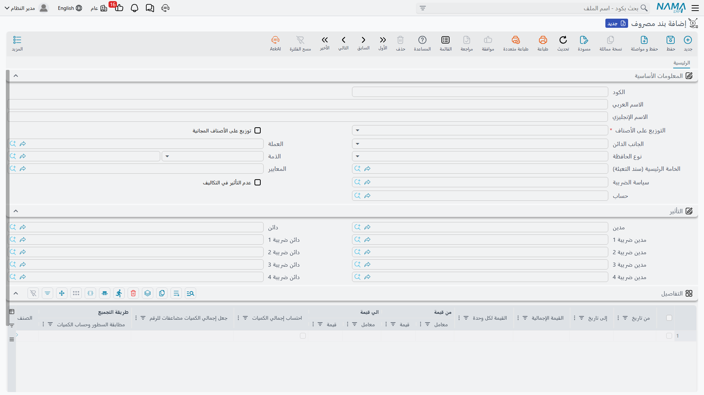
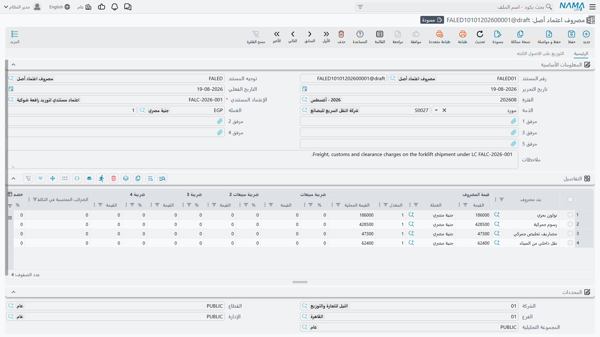
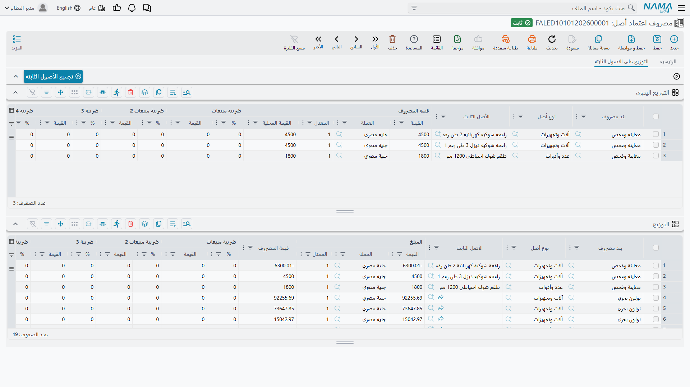

# مصروفات الاعتماد وتوزيعها

هنا يكفّ الاستيراد عن كونه أوراقاً ويصير مالاً. فكل فاتورة تقع على الشحنة — فاتورة المورّد نفسه،
وفاتورة خط الملاحة، وفاتورة المؤمِّن، والبيان الجمركي، وفاتورة مكتب التخليص، وعمولة البنك — تُدخَل على
**سند مصروف اعتماد أصل**، ويُقسَّم كلٌّ منها فوراً على الماكينات المدرَجة في
[الفاتورة المبدئية](/ar/modules/fixedassets/letters-of-credit/fixedassets-lc-proforma-invoice.md).

ولك أن تنشئ على الاعتماد الواحد ما شئت من سندات المصروف، والعادة أن تنشئ سنداً لكل فاتورة كلما وصلت،
على مدى أسابيع. والتوزيع يقع لكل مستند، ولكل سطر، وتتراكم النتائج على الاعتماد حتى يجمعها
[سند التكليف](/ar/modules/fixedassets/letters-of-credit/fixedassets-lc-cost-document.md).

::: danger السطر الذي ينساه الجميع
قيمة البضاعة على المورّد تُدخَل على سند مصروف مثل بقية التكاليف. فالـ 500,000 التي على الفاتورة
المبدئية أساس توزيع؛ لا ترسمل شيئاً بذاتها. وإن أسقطت سطر البضاعة رُسمِل المكبسان بقيمة النولون
والجمارك فقط.
:::

## أولاً: بند المصروف

قبل أن يعمل هذا كله تحتاج ملفاً صغيراً لكل **نوع** من المصروفات التي ستحمّلها: الرسوم الجمركية،
والنولون البحري، والتأمين البحري، وأتعاب التخليص، وعمولة البنك، والنقل الداخلي — وقيمة البضاعة نفسها.
وذلك الملف هو **بند مصروف**، ويقع في مجموعة القوائم نفسها التي فيها الاعتماد، في
**الأصول ‹ إعتمادات الأصول ‹ بند مصروف**. وهو ملف مشترك: فسلسلة اعتمادات المشتريات في وحدة سلاسل
الإمداد تستعمل الكارتات نفسها للبضاعة المستوردة، فالمنشأة التي تستورد مخزوناً وآلات معاً تحتفظ بكتالوج
واحد لبنود المصروف ومجموعتَي دفاتر مستندات.

وبند المصروف كارت صغير، ولا يهم منه للأصول المستوردة إلا حفنة حقول:

| الحقل | ماذا تضع فيه |
|---|---|
| **الكود** و**الاسم العربي** و**الاسم الإنجليزي** | `FREIGHT` — الشحن / Ocean freight |
| **التوزيع على الأصناف** — مطلوب | كيف يُوزَّع هذا المصروف على الماكينات. وهو مغزى الملف كلّه؛ انظر الجدول أدناه |
| **حساب** | الحساب الذي تُقيَّد عليه التكلفة مدينة — وهو عادةً حساب وسيط واحد باسم «أصول تحت الاعتمادات» تشترك فيه كل بنود المصروف. ولا بد أن يكون حساباً **تفصيلياً**: فالحساب الذي يحمل نوع ذمة يُرفَض عند الحفظ |
| **سياسة الضريبة** | إن كان المصروف خاضعاً للضريبة، فالسياسة التي تعطي النسب |
| **عدم التأثير في التكاليف** | فعّله للمصروف الذي يُقيَّد ولكن **لا يجوز** أن يدخل في قيمة الماكينات — غرامة أرضيات مثلاً. فالقيد يصل الأستاذ، وسند التكليف يتجاهله فحسب |
| **العملة** | اختياري، مجرّد قيمة افتراضية مريحة |

وكتالوج الواحة لهذا الاستيراد أربعة كارتات، **حساب** كلٍّ منها هو `13910 أصول تحت الاعتمادات`:

| الكود | الاسم | التوزيع |
|---|---|---|
| `GOODS` | قيمة البضاعة | توزيع على القيم |
| `FREIGHT` | الشحن البحري | توزيع على القيم |
| `CUSTOMS` | الرسوم الجمركية | توزيع على القيم |
| `CLEAR` | أتعاب التخليص | يدوي |

::: info حساب بند المصروف هو الجانب المدين، والجانب الدائن يُختار على المستند
بند المصروف يعطي الحساب الذي تُقيَّد عليه التكلفة **مدينة**. أما من يُقيَّد **دائناً** — المورّد أم
البنك أم مكتب التخليص أم حساب بعينه — فيُختار على كل سطر من سطور سند المصروف، لا هنا. وخلافاً لمستندات
المشتريات في سلاسل الإمداد، لا تنسخ سلسلة الأصول الثابتة أي إعداد للجانب الدائن من بند المصروف إلى
السطر، فالسطر هو موضع هذا القرار وهو المكان الوحيد الذي يؤثّر فيه.
:::

## قواعد التوزيع

حقل **التوزيع على الأصناف** هو ما يجعل لبند المصروف قيمة. فهو يقرّر بأي شيء تتناسب التكلفة:

| التوزيع | التسمية الإنجليزية | يتناسب مع | استعمله في |
|---|---|---|---|
| **توزيع على القيم** | Distribute on value | السعر الكلي لكل سطر على الفاتورة المبدئية | قيمة البضاعة والرسوم الجمركية والتأمين وعمولة البنك — كل ما يُحسَب على القيمة. وهو الافتراض الآمن |
| **توزيع على الوزن** | Distribute On Weight | عمود **الوزن** | النولون البحري والبري والمناولة في الميناء |
| **توزيع على الحجم** | Distribute On Volume | عمود **الحجم** | الشحن الجوي وحيّز الحاويات |
| **توزيع على المساحة** | Distribute On Area | عمود **المساحة** | ما يُحسَب على مساحة السطح أو الأرضية |
| **توزيع على الطول** | Distribute On Length | عمود **الطول** | رسوم الأطوال الزائدة |
| **توزيع على الكثافة** | Distribute On Density | عمود **الكثافة** | تعريفات الشحن المتخصصة المسعّرة بالكثافة |
| **توزيع على الكميات** | Distribute on quantity | كمية كل سطر | رسم ثابت لكل وحدة في سطر دفعة |
| **يدوي** | Manual | لا شيء — تكتب المبلغ لكل ماكينة بنفسك | فاتورة فصّلها المورّد أصلاً لكل ماكينة |

واثنان منها يستحقان تنبيهاً.

**توزيع على الكميات** يتصرّف على غير ما يوحي به اسمه حين تسمّي سطور الفاتورة المبدئية أصولاً بعينها:
فتلك السطور كميتها 1 دائماً، فتنقسم التكلفة بالتساوي بينها مهما اختلفت أحجامها وقيمها. وهذا هو ما
تريده فعلاً لرسم ثابت على كل ماكينة، وهو قطعاً ليس ما تريده للنولون.

و**يدوي** هو مخرج الطوارئ، وهو الجواب الصحيح أكثر مما يتوقع الناس. فحين تقول فاتورة المخلّص «مكبس أ:
9,000، مكبس ب: 6,000» فلن تعيد أي معادلة إنتاج ذلك بأمانة كتابته باليد.

وأياً كان الأساس الذي تختاره فلا بد أن يكون عموده مملوءاً على الفاتورة المبدئية. فاختيار **توزيع على
الوزن** في شحنة سطورها بلا أوزان يترك ذلك المصروف بلا ما يُقسَم عليه.

## سند المصروف

### بيانات الرأس

**رقم المستند** ودفتره، و**توجيه المستند**، و**تاريخ التحرير**، و**التاريخ الفعلي**، و**الفترة**،
و**الإعتماد المستندي** (مطلوب — وهو ما يخبر المستند على أي ماكينات يقسّم)، و**الذمة** اختيارياً،
و**العملة** و**المعدل**، وخمس خانات مرفقات لصور الفواتير، وحقل ملاحظات. واختيار الاعتماد يجلب عملته.

و[توجيه المستند](/ar/modules/fixedassets/document-terms/fixedassets-terms-custody-and-lc.md) هو ما
يخبر النظام بكيفية بناء القيد، فهذا المستند — بخلاف الفاتورة المبدئية — يحتاج توجيهاً.

### السطور: التكاليف كما وردت في الفواتير

سطر لكل فاتورة، أو لكل سطر فاتورة:

| العمود | ملاحظات |
|---|---|
| **بند مصروف** — مطلوب | نوع هذا المصروف، ومن ثمّ كيفية توزيعه |
| **قيمة المصروف** — القيمة والعملة والمعدل والقيمة المحلية | المبلغ كما ورد. وكل سطر يحمل **عملته ومعدله** بنفسه، فيجتمع النولون باليورو والجمارك بالعملة المحلية على مستند واحد. وإن تركت العملة فارغة استُعملت عملة الرأس بمعدل 1 |
| **ضريبة مبيعات** 1 إلى 4، لكل منها نسبة وقيمة | تُملأ من سياسة ضريبة بند المصروف ومن سياسة التوجيه |
| **الضرائب المحتسبة في التكلفة** | الجزء من الضريبة الذي يُرسمَل بدل أن يُستَرد |
| **خصم 1** — نسبة وقيمة | خصم على سطر الفاتورة |
| عمود **الجانب الدائن** | من المستحق له هذا المال — انظر أدناه |
| **الذمة** و**نوع الحافظة** و**الحساب** | الطرف المقابل، حين يقتضيه الجانب الدائن المختار |
| **مرجع 1** و**مرجع 2** و**ملاحظات** | رقم فاتورة المورّد وأي ملاحظة |

وعمود **الجانب الدائن** هو الذي يجب ضبطه، لأنه ما يحوّل «40,000 نولون» إلى التزام حقيقي لجهة حقيقية:

| الاختيار | يُقيَّد دائناً على |
|---|---|
| **حساب المورد** | المورّد المسمّى على الاعتماد |
| **الحساب البنكي** | حساب البنك المسمّى على الاعتماد |
| **حساب شركة التخليص** | شركة التخليص المسمّاة على الاعتماد |
| **حساب شركة التأمين** | شركة التأمين المسمّاة على الاعتماد |
| **حساب محدد** | الحساب المكتوب على هذا السطر |
| **ذمة محددة** | حساب السطر إن وُجد، وإلا فذمة السطر |
| **ذمة المستخدم الحالي** | كارت موظف من أدخل المستند |

والأربعة الأولى هي سبب العناية بملء الجهات على الاعتماد: فبوجودها يختصر السطر كلّه إلى «اقيّد على شركة
التخليص» ويتولى النظام الباقي.

وسند مصروف الواحة على `LC-2026-004`، وكلّه بالعملة المحلية:

| السطر | بند المصروف | المبلغ | الجانب الدائن |
|---|---|---|---|
| أ | `GOODS` قيمة البضاعة | 500,000 | حساب المورد ← الخليج لتجارة الآلات |
| ب | `FREIGHT` الشحن البحري | 40,000 | حساب محدد ← `21450 نولون مستحق` |
| ج | `CUSTOMS` الرسوم الجمركية | 60,000 | حساب شركة التخليص ← الفارس للتخليص الجمركي |
| د | `CLEAR` أتعاب التخليص | 15,000 | حساب شركة التخليص ← الفارس للتخليص الجمركي |
| | **الإجمالي** | **615,000** | |

### صفحة التوزيع

الصفحة الثانية هي موضع ضبط التقسيم وقراءة نتيجته.

وفيها زر واحد، **تجميع الأصول الثابته**، وجدولان.

فالضغط على **تجميع الأصول الثابته** يقرأ الفاتورة المبدئية للاعتماد، وينشئ — **لكل سطر بنده يوزَّع
يدوياً** — صفاً لكل ماكينة في جدول **التوزيع اليدوي**، بنوع الأصل والأصل مملوءَين مسبقاً والمبلغ
متروكاً لك. تضغطه الواحة مرة واحدة فيظهر لها صفّان لسطر `CLEAR`، فتكتب 9,000 للمكبس أ و6,000 للمكبس ب.

ولا بد أن تتطابق المبالغ اليدوية. فلكل بند مصروف يجب أن يساوي إجمالي الصفوف اليدوية إجمالي سطور
المستند التي تستعمل ذلك البند — 9,000 + 6,000 = 15,000. وإن لم تتساوَ رُفض الترحيل، والرسالة تسمّي بند
المصروف وكلا الإجماليين.

والجدول الثاني، **التوزيع**، هو الجواب: صف لكل ماكينة لكل بند مصروف، يبيّن المبلغ وعملته ومعدله وقيمة
المصروف بعملة الأستاذ. وهو غير قابل للتعديل لأنه محسوب.

::: info سطور التوزيع تُنتَج عند الترحيل لا عند الحفظ
المسودة المحفوظة تعرض جدول التوزيع فارغاً. فالتوزيع يجري حين يُرحَّل المستند. وهذا طبيعي وليس علامة على
خطأ — رحّل المستند فيمتلئ الجدول.
:::

## التوزيع على القيم، سطراً سطراً

هذه شحنة الواحة محسوبة بتمامها. والمعادلة واحدة في كل مرة:

> **نصيب الماكينة الواحدة** = (القيمة المحلية لسطر المصروف × أساس هذه الماكينة) ÷ إجمالي ذلك الأساس
> على كل سطور الفاتورة المبدئية

والأساس يأتي من الفاتورة المبدئية، وهي تدرج المكبس أ بـ 300,000 والمكبس ب بـ 200,000، فيكون لبند مصروف
موزَّع على القيم:

- نصيب المكبس أ من كل شيء = 300,000 ÷ 500,000 = **0.60**
- نصيب المكبس ب من كل شيء = 200,000 ÷ 500,000 = **0.40**

**السطر أ — قيمة البضاعة، 500,000، توزيع على القيم**

- المكبس أ: 500,000 × 300,000 ÷ 500,000 = **300,000**
- المكبس ب: 500,000 × 200,000 ÷ 500,000 = **200,000**

**السطر ب — الشحن البحري، 40,000، توزيع على القيم**

- المكبس أ: 40,000 × 0.60 = **24,000**
- المكبس ب: 40,000 × 0.40 = **16,000**

**السطر ج — الرسوم الجمركية، 60,000، توزيع على القيم**

- المكبس أ: 60,000 × 0.60 = **36,000**
- المكبس ب: 60,000 × 0.40 = **24,000**

**السطر د — أتعاب التخليص، 15,000، توزيع يدوي**

لا يُحسَب أصلاً — يُؤخَذ كما هو من جدول التوزيع اليدوي:

- المكبس أ: **9,000**
- المكبس ب: **6,000**

**ثمانية سطور توزيع، وإجمالي كل ماكينة:**

| بند المصروف | `PRS-0001` مكبس أ | `PRS-0002` مكبس ب | إجمالي السطر |
|---|---|---|---|
| قيمة البضاعة | 300,000 | 200,000 | 500,000 |
| الشحن البحري | 24,000 | 16,000 | 40,000 |
| الرسوم الجمركية | 36,000 | 24,000 | 60,000 |
| أتعاب التخليص | 9,000 | 6,000 | 15,000 |
| **تكلفة الوصول** | **369,000** | **246,000** | **615,000** |

وهذان الإجماليان، 369,000 و246,000، هما ما سيكتبه سند التكليف على المكبسين.

### حين لا تنقسم الأنصبة بالتساوي

يُقرَّب كل نصيب إلى عدد الخانات العشرية التي تستعملها عملة السطر، والأنصبة المقرَّبة نادراً ما تعود
فتساوي الفاتورة بالضبط. والنظام لا يترك الفارق معلَّقاً: بل يقارن مجموع الأنصبة الموزَّعة بمبلغ سطر
المصروف نفسه، ويضع الفارق كلّه على **أول** سطر توزيع من سطور ذلك المصروف.

وشحنة الواحة تنقسم بلا كسور في كل مبلغ، فلا يظهر شيء. لكن اجعل أتعاب التخليص 15,000.05 واقسمها
بالتساوي على ماكينتين متطابقتين فيظهر:

- نصيب كل ماكينة الخام هو 15,000.05 × 0.5 = 7,500.025، ويُقرَّب إلى **7,500.03**؛
- ومجموع النصيبين المقرَّبين 15,000.06 — أي أكثر بوحدة واحدة مما وردت به الفاتورة؛
- فيُطبَّق الفارق، وهو −0.01، على السطر الأول، فيبقى **7,500.02** و**7,500.03**.

فيكون إجمالي الموزَّع 15,000.05، وهو عين الفاتورة. ويحسن أن تعرف ذلك حين تقرأ جدول التوزيع فترى نصيب
ماكينة يزيد أو ينقص كسراً عن النسبة التي توقّعتها. فالتوزيع يعود دائماً إلى الفاتورة حتى آخر خانة
عشرية، وأول ماكينة في القائمة هي التي تمتصّ الباقي.

## ما الذي يصل إلى الأستاذ

سند المصروف يقيّد. زوج مدين ودائن لكل سطر توزيع — أي لكل ماكينة لكل بند مصروف — زائد ما يضبطه التوجيه
من سطور ضرائب وخصومات:

| | الحساب | مدين | دائن |
|---|---|---|---|
| من ح/ | `13910 أصول تحت الاعتمادات` — حساب بند `GOODS` | 500,000 | |
| من ح/ | `13910 أصول تحت الاعتمادات` — `FREIGHT` | 40,000 | |
| من ح/ | `13910 أصول تحت الاعتمادات` — `CUSTOMS` | 60,000 | |
| من ح/ | `13910 أصول تحت الاعتمادات` — `CLEAR` | 15,000 | |
| إلى ح/ | الخليج لتجارة الآلات | | 500,000 |
| إلى ح/ | `21450 نولون مستحق` | | 40,000 |
| إلى ح/ | الفارس للتخليص الجمركي (60,000 + 15,000) | | 75,000 |
| | | **615,000** | **615,000** |

فتجلس المبالغ المدينة في الحساب الوسيط منتظرة. ولم يُمسّ مكبس بعد — فالمكبسان `PRS-0001` و`PRS-0002`
عند سجل الأصول ما زالا كارتين فارغين في حالتهما المبدئية. وسند التكليف هو الذي ينقل الـ 615,000 من
الحساب الوسيط إلى الماكينتين.

ويُقيَّد كل سطر بعملته ومعدله **هو**، فتُحوَّل فاتورة نولون باليورو وفاتورة جمارك بالعملة المحلية على
المستند نفسه كلٌّ بمعدل سطره. ويُنشَأ القيد على صورة طلب أعمال يُعالَج في الخلفية: يُحفَظ المستند
فوراً، والقيد الفاشل يُعاد تشغيله من شاشة طلبات الأعمال بدل إعادة إدخاله.

## ما الذي يمنع ترحيل سند المصروف

| يُرفَض حين | لأن |
|---|---|
| لا فاتورة مبدئية على الاعتماد | لا يوجد ما يُوزَّع عليه |
| جدول التفاصيل فارغ | لا يوجد ما يُوزَّع |
| سطر بلا قيمة مصروف | كذلك |
| بند مصروف موزَّع على القيم وإجمالي الفاتورة المبدئية صفر | لا يوجد ما يُقسَم عليه |
| بند مصروف موضوع على **يدوي** وجدول التوزيع اليدوي خالٍ من صفوفه | لم تُكتَب المبالغ أصلاً |
| الصفوف اليدوية لبند مصروف لا تساوي سطور المستند التي تستعمله | التقسيم لن يساوي الفاتورة |
| الاعتماد مغلق بالفعل | الاستيراد رُسمِل؛ ألغِ ترحيل سند التكليف أولاً |

وسند المصروف التابع لاعتماد مغلق لا يُحذَف كذلك، للسبب نفسه: أرقامه صارت داخل تكلفة أصل.

وإلغاء ترحيل سند مصروف مرحَّل يعكس قيده ويمسح سطور توزيعه، فتخرج تلك التكاليف من أي إعادة حساب يجريها
سند التكليف بعد ذلك.

التالي:
[سند تكليف الاعتماد](/ar/modules/fixedassets/letters-of-credit/fixedassets-lc-cost-document.md).
