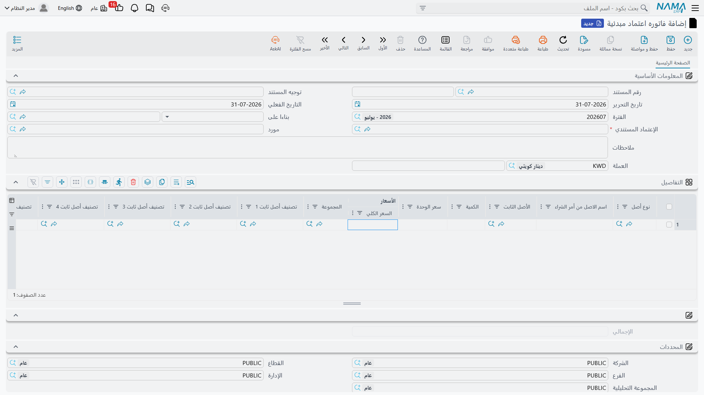

# الفاتورة المبدئية

**فاتوره اعتماد مبدئية** (Fixed Asset ProformaInvoice) أقصر مستندات السلسلة وأكثرها إساءةً للفهم.
تُدرِج الماكينات القادمة تحت الاعتماد وما يطلبه المورّد ثمناً لكل منها، ثم لا تفعل شيئاً على الإطلاق —
لا قيد محاسبي، ولا تغيير على أي أصل، ولا قيمة تُكتب في أي مكان.

وليس ذلك نقصاً فيها. بل هو غرضها كلّه. فالذي تنتجه هذه الفاتورة **نسبة**.

::: danger مرة أخرى
الأسعار على هذه الفاتورة **أساس توزيع، لا تكلفة**.

فإدراج المكبس أ بـ 300,000 والمكبس ب بـ 200,000 يخبر النظام أن المكبس أ يأخذ 60 % مما يُنفَق على هذه
الشحنة وأن المكبس ب يأخذ 40 %. ولا يخبره أن 500,000 أُنفِقت. وقيمة المورّد البالغة 500,000 لا تصير
تكلفةً إلا حين تُدخَل سطرَ مصروف على
[سند مصروف](/ar/modules/fixedassets/letters-of-credit/fixedassets-lc-expenses.md).
:::

تجدها في **الأصول ‹ إعتمادات الأصول ‹ فاتوره اعتماد مبدئية**.

## فاتورة واحدة لاعتماد واحد

يحمل الاعتماد المستندي فاتورة مبدئية **واحدة لا غير**. وترحيل فاتورة ثانية على اعتماد له فاتورة
بالفعل مرفوض، والرسالة تشير إلى حقل الاعتماد. فإن عدّل المورّد الفاتورة المبدئية — بإضافة ماكينة أو
تصحيح سعر — عدّلتَ الفاتورة القائمة بدل إدخال ثانية.

ولا بد أن يكون الاعتماد ما زال مفتوحاً؛ فالفاتورة المبدئية لا تُرحَّل على اعتماد أغلقه سند تكليفه.

::: tip اختر الاعتماد قبل أن تكتب أي شيء آخر
اختيار الاعتماد هو ما يجلب العملة والمورّد إلى المستند، فمكانه الأول — قبل سطور التفاصيل. أدخِله ثم
املأ الجدول.
:::

## بيانات الرأس

| الحقل | ماذا يفعل |
|---|---|
| **رقم المستند** (الدفتر / الكود) | الدفتر الذي يرقّم المستند |
| **توجيه المستند** | اختياري على هذا المستند؛ فهو لا يقيّد شيئاً، ولذلك تتركه أغلب التطبيقات |
| **تاريخ التحرير** و**التاريخ الفعلي** | تاريخ فاتورة المورّد، والتاريخ الذي يُعتد به للمستند |
| **الفترة** | الفترة المالية التي ينتمي إليها المستند |
| **الإعتماد المستندي** — مطلوب | الاعتماد الذي تتبعه هذه الفاتورة |
| **مورد** | يُملأ من الاعتماد وغير قابل للتعديل — فالاعتماد قد حدّد المورّد أصلاً |
| **العملة** و**المعدل** | عملة الفاتورة، تُدفَع إليها من الاعتماد عند اختياره |
| **ملاحظات** | نص حر |

ومجموعة المحددات في الأسفل — الشركة والقطاع والفرع والإدارة ومجموعة التحليل — تعمل كما في كل مستند
آخر.

## السطور: سطر لكل ماكينة

كل سطر يجيب عن سؤالين: *أي أصل هذا؟* و*ما مقداره، بالوحدة التي ستُقسَّم بها التكاليف؟*

### تسمية الأصل

كل سطر يسمّي **إما** أصلاً ثابتاً بعينه **وإما** نوع أصل — لا الاثنين معاً، ولا واحداً منهما. وترحيل
سطر مملوء بالاثنين، أو سطر خالٍ منهما، مرفوض.

والأسلوبان يعنيان شيئين مختلفين:

- **تسمية أصل بعينه** هي الحالة المعتادة للماكينات. فكارت الأصل موجود بالفعل في حالته المبدئية، وهذا
  السطر يقول «هذه الماكينة، بهذا السعر». والسطر الذي يسمّي أصلاً تكون **كميته 1** دائماً — يفرضها
  النظام عند الحفظ، لأن كارت أصل بعينه هو ماكينة بعينها.
- **تسمية نوع أصل فقط** لدفعة من وحدات متماثلة لم تُفرَد بعد: خمسة عشر محركاً متطابقاً وردت في سطر
  واحد على فاتورة المورّد. والتكاليف الموزَّعة على ذلك السطر تُقسَّم على عدد السطور من ذلك النوع التي
  ينتهي سند التكليف إلى حملها.

ولا يجوز أن يتكرر الأصل نفسه في سطرين، وإلا حُسب نصيبه من الشحنة مرتين.

وفي `LC-2026-004` كارتا المكبسين موجودان بالفعل، فكلا السطرين يسمّي أصلاً:

| السطر | الأصل الثابت | الكمية | سعر الوحدة | السعر الكلي |
|---|---|---|---|---|
| 1 | `PRS-0001` مكبس أ | 1 | 300,000 | 300,000 |
| 2 | `PRS-0002` مكبس ب | 1 | 200,000 | 200,000 |
| | | | **الإجمالي** | **500,000** |

### الأسعار

لك أن تكتب **سعر الوحدة** فيُحسَب سعر السطر، أو أن تكتب **السعر الكلي** مباشرة. وفي كل حفظ يعيد
النظام الحساب: السطر الذي لا يساوي سعره الكلي الكميةَ × سعر الوحدة يُصحَّح إلى الكمية × سعر الوحدة،
و**الإجمالي** هو مجموع السطور. ومع كون الكمية 1 على كلا المكبسين يتطابق سعر الوحدة وسعر السطر.

وهذا الإجمالي، 500,000، هو مقام كل ما يأتي بعده. فتوزيع مصروف **على القيم** معناه ضربه في
300,000 ÷ 500,000 للمكبس أ، وفي 200,000 ÷ 500,000 للمكبس ب.

::: info إجمالي فاتورة صفر يمنع التوزيع على القيم
إن كان إجمالي الفاتورة صفراً — ماكينات مدرَجة بلا أسعار — فلن يُرحَّل بند مصروف موضوع على «توزيع على
القيم»، إذ لا يوجد ما يُقسَم عليه. ويُرفَض سند المصروف برسالة تسمّي بند المصروف. فإما أن تعطي السطور
أسعاراً، وإما أن توزّع تلك التكاليف بالوزن أو الحجم أو يدوياً.
:::

### أعمدة القياس

وإلى جوار الأسعار يقف **الوزن** و**الحجم** و**الطول** و**المساحة** و**الكثافة**. وهذه هي الأسس
البديلة. فالنولون البحري يُحسَب على حيّز الحاوية لا على قيمة الفاتورة، وتوزيعه بالقيمة يُحمِّل الماكينة
الغالية أكثر مما تستحق ويُخفِّف عن الثقيلة. فإن ملأت الأوزان أمكن توزيع النولون بالوزن، وإن ملأت
الأحجام أمكن توزيعه بالحجم.

ولا شيء يجبرك على ملئها. إنما تحتاجها إن كان بند مصروف في هذا الاستيراد موضوعاً على التوزيع بواحد
منها — وحينها إن كان العمود فارغاً في كل السطور لم يجد ذلك المصروف ما يُقسَم عليه.

وللمكبسين يكون الوزن هو الأساس الأمين للنولون:

| السطر | الأصل | السعر | الوزن |
|---|---|---|---|
| 1 | `PRS-0001` مكبس أ | 300,000 | 12,000 كجم |
| 2 | `PRS-0002` مكبس ب | 200,000 | 8,000 كجم |

وهو ما يعطي هنا الانقسام نفسه 60/40 الذي تعطيه القيمة. أما في شحنة فيها ماكينة رخيصة ثقيلة وأخرى
غالية خفيفة فالأساسان يتجاذبان بشدة في اتجاهين متضادين — وهذا بالضبط سبب وجودهما معاً.

### الأعمدة الوصفية

وبقية الجدول تنقل معلومة أكثر مما تحرّك حساباً: **المجموعة**، ومستويات **تصنيف أصل ثابت** الخمسة،
وعمود **المواصفات الفنية** لموديل المورّد ونص تجهيزاته، وعمود **اسم الاصل من أمر الشراء** للوصف الذي
طُلبت به الماكينة، وهو نادراً ما يكون الوصف الذي ستُسجَّل به.

## ماذا يحدث عند الترحيل

القليل جداً، وذلك بقصد. يُتحقَّق من المستند — أصل واحد أو نوع واحد لكل سطر، ولا أصل مكرر، واعتماد ما
زال مفتوحاً، ولا فاتورة ثانية على الاعتماد نفسه — ثم يُسجَّل على الاعتماد. لا يصل قيد إلى الأستاذ،
ولا يُمسّ أصل. وصار
[الاعتماد](/ar/modules/fixedassets/letters-of-credit/fixedassets-letter-of-credit.md) يشير إلى هذه
الفاتورة، فتستطيع سندات المصروف أن تبدأ في الوصول.

ومن هنا فصاعداً تُقرأ الفاتورة ولا يغيّرها شيء. فكل سند مصروف يقرأ سطورها ليعرف على ماذا يقسّم، وسند
التكليف يستعملها ليعرف أي ماكينات يغطّيها الاعتماد.

التالي:
[مصروفات الاعتماد وتوزيعها](/ar/modules/fixedassets/letters-of-credit/fixedassets-lc-expenses.md)،
حيث يظهر المال فعلاً.
