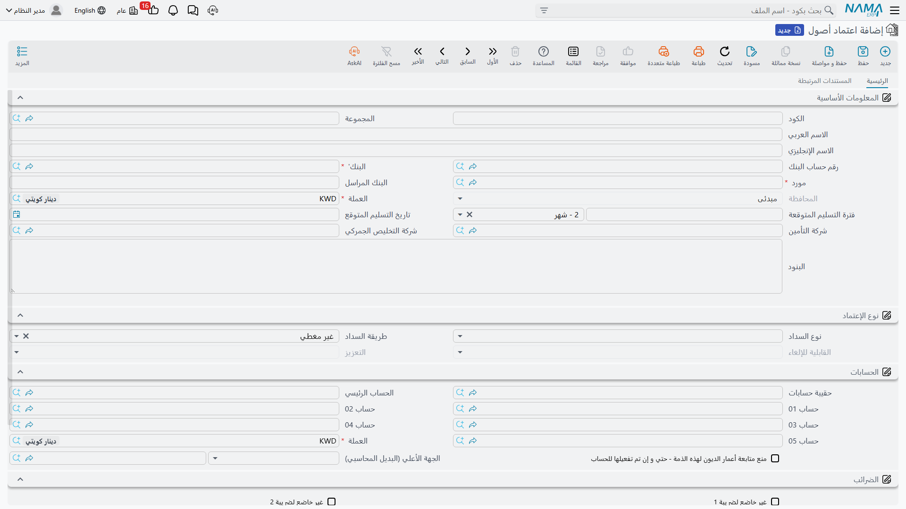
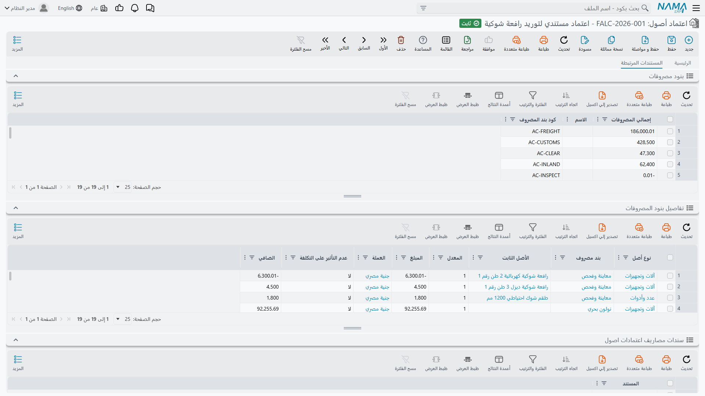
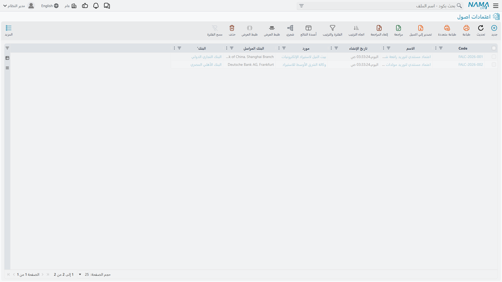

# اعتماد الأصول

كل ما يخصّ صفقة استيراد واحدة لا بد أن يُعلَّق على وتد واحد: الفاتورة المبدئية، ونصف دزينة من فواتير
المصروفات من أربع جهات مختلفة، وأخيراً المستند الذي يحوّل ذلك كله إلى تكلفة أصل. و**اعتماد الأصول**
(Fixed asset Letter of Credit) هو ذلك الوتد.

وهو **ملف رئيسي** لا مستند، وذلك بقصد. فلا دفتر ولا
[توجيه](/ar/modules/fixedassets/document-terms/fixedassets-terms-basics.md) ولا ترحيل ولا قيد محاسبي.
تفتحه كما تفتح كارت مورّد أو مخزن: تملؤه وتحفظه، ومن بعدها يشير إليه كل مستند من مستندات الاستيراد.
ووظيفته الثانية أن يكون المكان الذي تنظر فيه حين يسألك أحدهم: «كم أنفقنا على مكابس الرياض حتى الآن؟»
— فهو يحمل تفصيله الجاري بنفسه.

تجده في **الأصول ‹ إعتمادات الأصول ‹ اعتماد أصول**، في المجموعة نفسها التي تضم المستندات الثلاثة وملف
بند المصروف. والمجموعة كلها تحتاج ترخيص `fixedassets-lc`.

## فتح الاعتماد `LC-2026-004`

تستورد شركة الواحة للصناعات مكبسين هيدروليكيين. ويُفتَح الاعتماد قبل وجود أي شيء آخر — قبل الفاتورة
المبدئية، وقبل وصول فاتورة واحدة.

### الأطراف

تسمّي بيانات الرأس كل جهة سيُستحق لها مال في هذا الاستيراد، وتسمّيها هنا لا على الفواتير لأن سندات
المصروف تقرأها من الاعتماد. فلا تحتاج فاتورة نولون أو جمارك أن تعيد ذكر من هو مكتب التخليص؛ يكفي أن
تقول «اقيّد هذا في حساب شركة التخليص» فيقرأ النظام الاسم من الاعتماد.

| ما تملؤه | لماذا يهم لاحقاً |
|---|---|
| **الكود** و**الاسم العربي** و**الاسم الإنجليزي** | بها يُبحَث عن الاعتماد ويُطبَع — `LC-2026-004`، *مكابس – مصنع الرياض* |
| **المجموعة** | مجموعة الترقيم التي تعطي الكارت رقمه |
| **مورد** — مطلوب | الجهة المستحقة لقيمة البضاعة. يُنسَخ تلقائياً إلى الفاتورة المبدئية وسند التكليف |
| بنك المورّد — مطلوب | البنك على الطرف الآخر من الاعتماد |
| **رقم حساب البنك** | حسابك أنت الذي يُسحَب عليه الاعتماد، ويمكن تقييد سطر مصروف عليه مباشرة |
| **البنك المراسل** | البنك المراسل، كملاحظة حرة |
| **شركة التخليص الجمركي** | مكتب التخليص. وسطر المصروف المقيَّد على «حساب شركة التخليص» يقع على هذه الجهة |
| **شركة التأمين** | شركة التأمين. والفكرة نفسها لفاتورة التأمين البحري |

وفي `LC-2026-004` المورّد هو **الخليج لتجارة الآلات**، وشركة التخليص هي **الفارس للتخليص الجمركي**،
وحساب البنك هو الحساب الجاري للمصنع.

::: tip املأ جهات التخليص والتأمين حتى لو لم تكن متأكداً
لا يكلّفك ملؤها شيئاً ويوفّر عملاً حقيقياً بعد ذلك. فإن تُركت فارغة اضطر كل سطر مصروف إلى ذكر حساب أو
ذمة بعينها يدوياً، بدل أن يقول ببساطة «اقيّد على شركة التخليص».
:::

### شروط الصفقة

وبقية المجموعة الأولى تسجّل الصفقة نفسها: **العملة** التي فُتح بها الاعتماد، و**فترة التسليم المتوقعة**
(قيمة ووحدة، والوحدة شهور بشكل افتراضي)، و**تاريخ التسليم المتوقع**، وحقل **البنود** الطويل لشروط
الشحن والسداد كما اتُّفق عليها مع البنك. ثم مجموعة صغيرة باسم **نوع الإعتماد** تصنّف كيفية تمويله —
أهو على تسهيلات موردين أم تسهيلات بنكية، ومغطّى كلياً أم جزئياً أم غير مغطّى. وهذه حقول وصف وفرز
تُعرِّف الصفقة أكثر مما تحرّكها.

و**العملة** أهمّها. فهي عملة الاعتماد، وهي التي تُدفَع إلى الفاتورة المبدئية وإلى كل سند مصروف لحظة
اختيارك الاعتماد عليهما. وتظل سطور المصروف قادرة على حمل عملة أخرى — نولون باليورو ورسوم جمركية
بالعملة المحلية — لكن عملة الاعتماد هي نقطة البداية.

### مجموعة الحسابات، واستعمال الاعتماد ذمةً

يحمل الاعتماد مجموعة حسابات كاملة — حقيبة حسابات، وحساب رئيسي، وحسابات 01 إلى 05، وعملته، وجهة أعلى —
ومجموعة إعفاءات ضريبية، تماماً كالمورّد أو العميل. وليس ذلك زينة: فالاعتماد المستندي أحد ما تستطيع
وحدة الحسابات تحليل حساب مراقبة به. فإن أردت حساب «أصول تحت الاعتمادات» يمكن قراءة رصيده لكل اعتماد
على حدة بدل أن يكون كتلة واحدة، فهذا ما يجعله ممكناً، وقيود سندات المصروف الوسيطة هي ما يملؤه.

وأخيراً مجموعة **المحددات** — الشركة والقطاع والفرع والإدارة ومجموعة التحليل — وتعمل كما تعمل في كل
مكان آخر.

## صفحة المستندات المرتبطة

الصفحة الثانية صفحة قراءة. تجمع، بفلترة على هذا الاعتماد وحده:

- **الفاتورة المبدئية** بإجماليها؛
- كل **سند مصروف** أُنشئ على الاعتماد؛
- كل **سند تكليف**؛
- ملخّص **بنود المصروفات** — سطر لكل نوع مصروف بإجمالي ما وُزِّع تحته، وهو أسرع جواب عن «كم بلغ نولون
  هذه الشحنة حتى الآن؟»؛
- و**تفصيل ذلك الملخّص** — كل سطر موزَّع: أي بند مصروف، وأي نوع أصل، وأي أصل، والمبلغ، والعملة
  والمعدل، والصافي.

والقائمتان الأخيرتان هما النافعتان أثناء الاستيراد. فهي السطور الموزَّعة نفسها التي سيجمعها سند
التكليف لاحقاً لكل أصل، فما تراه فيهما هو ما سيُرسمَل به كل مكبس. وإن بدا رقم خاطئاً في هذه المرحلة
فتصحيح سند المصروف أرخص بكثير من فكّ سند تكليف مرحَّل.

::: info القوائم تُبنى عند الترحيل لا عند الحفظ
لا يوجد السطر الموزَّع إلا بعد ترحيل سند المصروف الذي أنتجه. وسند المصروف المحفوظ كمسودة لا يضيف
لهذه القوائم شيئاً — وهذا بالضبط سبب النظر فيها: فهي تعرض التكلفة المرحَّلة.
:::

## الإجراءات في هذه الشاشة

ليس في الاعتماد المستندي نفسه أزرار خاصة به — فهو الوتد الذي تُعلَّق عليه بقية المستندات، لا مستنداً
يولّد شيئاً. وما يبدو إجراءً فيه هو صفحة **المستندات المرتبطة** الموصوفة أعلاه: تلك الجداول قوائم حيّة
بمستندات المصروفات والفواتير المبدئية ومستندات التكلفة المحرَّرة على هذا الاعتماد، وفتح أحدها منها هو
طريقك للتنقل في السلسلة.

## حالة الاعتماد، وما الذي يغلقه

يخبرك حقل حالة غير قابل للتعديل على الرأس أين يقف الاعتماد. وله في الأصول الثابتة وضعان معتبران لا
ثالث لهما:

| الحالة | المعنى |
|---|---|
| **مبدئى** | الاعتماد مفتوح. تُدخَل عليه الفاتورة المبدئية وسندات المصروف وسند التكليف |
| **مغلقة** | انتهى الاستيراد ورُسمِل |

ولا شيء على الاعتماد نفسه ينقله بين الحالتين. **ترحيل سند التكليف يغلقه**، و**إلغاء ترحيل ذلك السند
يفتحه**. وهذه القاعدة الواحدة تفسّر معظم ما يلاحظه الناس:

- قائمة اختيار الاعتماد على **سند التكليف** لا تعرض إلا الاعتمادات غير المغلقة — فالمغلق قد أخذ سند
  تكليفه ولم يبقَ ما يُرسمَل.
- لا تُرحَّل **فاتورة مبدئية** إلا والاعتماد ما زال مفتوحاً.
- و**سند المصروف** التابع لاعتماد مغلق لا يُرحَّل ولا يُحذَف. ففاتورة النولون المتأخرة تحتاج إلغاء
  ترحيل سند التكليف أولاً: تلغيه فيُفتَح الاعتماد، ثم تُدخِل المصروف، ثم تُعيد ترحيل سند التكليف
  بالأرقام المصحَّحة.

## البحث عن الاعتمادات لاحقاً

شاشة القائمة هي الشاشة المعتادة، وأنفع ما يُفلتَر به: المورّد، وشركتا التخليص والتأمين، والعملة،
والمحددات، والحالة — والأخيرة تفصل الاستيرادات الجارية عن الاستيرادات التي رُسمِلت.

فلكل صفقة استيراد اعتماد واحد، ويبقى إلى الأبد. وبعد سنوات من تشغيل المكابس يظل الاعتماد هو موضع
الجواب عن: «كم دفعنا فعلاً حتى دخلت تلك الماكينة الصالة، ولمن دفعنا؟»

التالي:
[الفاتورة المبدئية](/ar/modules/fixedassets/letters-of-credit/fixedassets-lc-proforma-invoice.md)،
وهي التي تُدرِج الماكينات التي يغطّيها الاعتماد.
