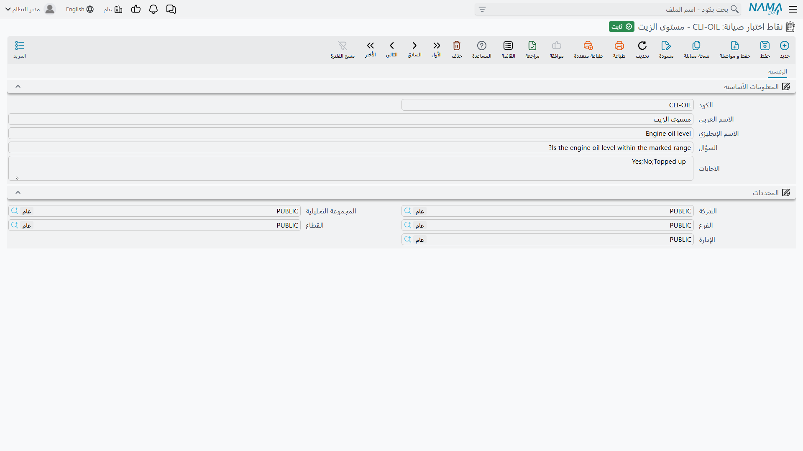
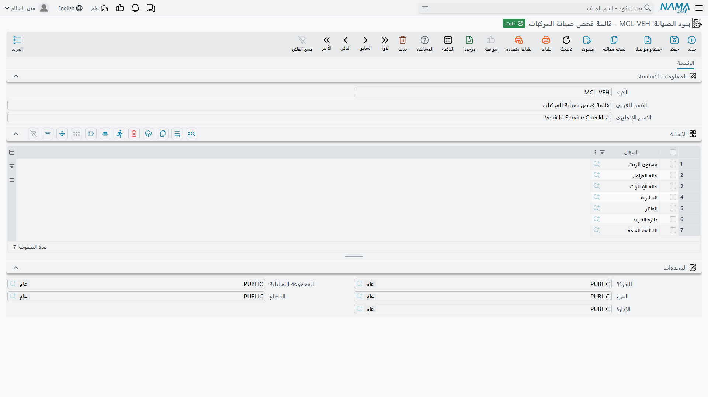

# قوائم الاختبارات ونقاطها

اطلب من فني أن «يعمل صيانة لماكينة CNC» تحصل على عمل مختلف كل ربع سنة بحسب من يحضر. أعطِه ورقة
فيها أربعة أسئلة تحصل على العمل نفسه كل ربع سنة، ومعه إجابة مكتوبة عن كل سؤال تبقى موجودة بعد
سنتين حين يسأل أحدهم: هل غُيّر سائل التبريد فعلاً؟

تلك الورقة هي **بنود الصيانة**، والأسئلة التي فيها هي **نقاط اختبار صيانة**. كلاهما ملف رئيسي تحت
**الأصول > الصيانة**، وكلاهما يحتاج رخصة `fixedassets-maintenance`، والعلاقة بينهما ببساطة أن
القائمة حزمة مسمّاة من النقاط.

## نقاط اختبار صيانة — سؤال واحد لكل نقطة

نقطة الاختبار سؤال فحص واحد قابل لإعادة الاستخدام. وهي صغيرة عن قصد، لأن الغاية كلها أن يُعاد
استخدام السؤال نفسه في كل ورقة تحتاجه: «هل الأغطية والواقيات سليمة؟» ينتمي إلى الفحص الدوري وإلى
العمرة السنوية وإلى استلام ما بعد الإصلاح، وتريد كتابته مرة واحدة.

تجدها في **الأصول > الصيانة > نقاط اختبار صيانة**.

| الحقل | الغرض منه |
|---|---|
| **الكود** | معرّفك للنقطة، مثل `CLI-01`. |
| **الاسم العربي / الاسم الإنجليزي** | مقبض قصير للنقطة، مثل «اهتزاز عمود الدوران». |
| **السؤال** (Criteria) | السؤال نفسه، كما سيقرؤه الفني في السجل. |
| **الاجابات** (Answers) | الإجابات المتوقعة، تُكتب **في سطر واحد مفصولة بفواصل**. |

### كيف تتصرف الإجابات

يستحق هذا الدقة، لأن الحقل يبدو أكثر تقييداً مما هو عليه.

حقل الإجابات **قائمة اقتراحات لا قائمة قيم مسموحة**. فحين يعبّئ الفني سجل الصيانة، يكون عمود
**الإجابة** في جدول الاختبارات صندوق نص عادياً مع اقتراح أثناء الكتابة: ما إن يبدأ الكتابة حتى
تُعرض عليه القيم التي سردتها هنا. يمكنه اختيار إحداها، ويمكنه كتابة شيء مختلف تماماً — «رمان بلي
عمود الدوران يصدر صوتاً على المحور X، مرصود للعمرة السنوية» — فيُحفظ النص كما كُتب حرفياً.

ولا يوجد خلف ذلك نموذج نجاح/رسوب. لا شيء يقيّم الإجابات ولا يجمعها ولا يرفع علماً ولا يمنع اعتماداً
لأن إجابة جاءت على غير المتوقع. قيمة الحقل هي اتساق الصياغة: امنح الفنيين `سليم,حدّي,خارج الحدود`
يصبح تقرير العام القادم قابلاً للقراءة، لأن أربعة أشخاص مختلفين كتبوا الكلمات الثلاث نفسها.

::: tip اكتب الإجابات بحيث تُقرأ جيداً في البحث
لأن الإجابات تنتهي نصاً حراً، فالكلمات التي تقترحها هي الكلمات التي ستبحث بها لاحقاً. القصيرة
المميزة المتسقة أفضل من الوصفية — العثور على `مستبدل` في سجلات سنة أسهل من العثور على `تم استبداله
أثناء الزيارة`.
:::

## بنود الصيانة — الورقة

القائمة تجمع النقاط في ورقة الفحص الخاصة بصنف واحد من الأعمال. تجدها في
**الأصول > الصيانة > بنود الصيانة**.

الشاشة كود واسم عربي واسم إنجليزي، وجدول **الاسئله** بعمود واحد يختار نقطة اختبار. رتّب السطور
بالترتيب الذي تريد أن يعمل به الفني — فمن أعلى إلى أسفل هو ما سيصل إلى السجل.

هذا هو الملف الرئيسي كله. لا تحقق فيه ولا خيارات ولا آثار خاصة به؛ وجوده لكي يُسحَب إلى المستندات.

## كيف تصل القائمة إلى المستند

ثلاثة طرق تنتهي كلها إلى المكان نفسه — جدول **نقاط الفحص** في سجل الصيانة أو في طلب سجل الصيانة،
سطر لكل سؤال وعمود الإجابة فارغ في انتظار التعبئة.

1. **أن تختار القائمة مباشرة.** حقل «اختبارات الصيانة» في رأس السجل يفجّر أسئلته في الجدول لحظة
   اختياره.
2. **أن يجلبها نوع الصيانة.**
   [نوع الصيانة](/ar/modules/fixedassets/maintenance/fixedassets-maintenance-types.md) يسمّي قائمة
   اختبارات افتراضية؛ فاختيار سطر خطة نوع صيانته يحمل قائمة يملأ الجدول دون أن تسمّي القائمة أصلاً.
3. **أن يجلبها الطلب.** عند تحرير سجل بناءً على طلب سجل صيانة، يعبر الجدول كاملاً — الأسئلة *وأي*
   إجابات سُجِّلت على الطلب.

::: info الأسئلة تُنسَخ ولا تُربَط
الجدول في المستند يحمل نسخته الخاصة من كل سؤال. عدّل القائمة الرئيسية الشهر القادم — أضف سؤالاً أو
احذف آخر أو أعد صياغة ثالث — فتظل السجلات المنشأة قبل ذلك حاملة الورقة نفسها التي عُبِّئت عليها.
وهذا هو السلوك المطلوب من سجل خدمة: أن يُظهر ما سُئل فعلاً في يوم الزيارة.
:::

## الإجراءات في هاتين الشاشتين

لا نقطة الاختبار ولا قائمة الفحص فيها زر خاص بها. وكلتاهما دليل: تكتبه وتحفظه، ثم يقرؤه لاحقاً نوع
الصيانة وسجل الصيانة. أما النسخ الذي قد تتوقعه — ظهور أسئلة القائمة في السجل — فلا يُضغط له زر؛ بل
يحدث حين يلتقط السجل نوع صيانته.

## ورقة فحص CNC لدى شركة الواحة

النقاط الأربع التي يقوم عليها مثال `MCH-0007`:

| الكود | السؤال | الاجابات |
|---|---|---|
| `CLI-01` | هل اهتزاز عمود الدوران ضمن الحدود؟ | `سليم,حدّي,خارج الحدود` |
| `CLI-02` | مستوى سائل التبريد وحالته | `سليم,أُضيف,مستبدل` |
| `CLI-03` | هل الأغطية والواقيات سليمة؟ | `نعم,لا` |
| `CLI-04` | هل رُوجع سجل أخطاء وحدة التحكم ومُسح؟ | `نعم,لا` |

وهي محزومة في القائمة `CL-CNC` — **فحص دوري لماكينة CNC** بهذا الترتيب — و`CL-CNC` مضبوطة بوصفها
قائمة الاختبارات الافتراضية لنوع الصيانة `MT-90D` — صيانة دورية.

والنتيجة أن أحداً في شركة الواحة لا يبني ورقة فحص يدوياً. سطر الخطة يقول «صيانة دورية»؛ والسجل
يلتقط سطر الخطة؛ فتصل الأسئلة الأربعة؛ ويجيب الفني في 1 أبريل بـ `سليم` و`مستبدل` و`نعم` و`نعم`؛
ويظل هذا الرباعي مقروءاً في السجل بعد سنوات، إلى جوار اسم المقاول والـ 1,800 التي كلّفتها الزيارة.
أما ما تفعله تلك الـ 1,800 — وما لا تفعله — بقيمة الماكينة فتجده في صفحة
[سجلات الصيانة](/ar/modules/fixedassets/maintenance/fixedassets-maintenance-records.md).
