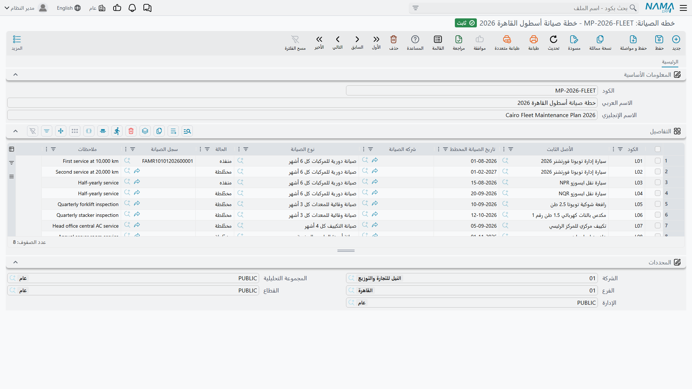

# خطط الصيانة

خطة الصيانة هي تقويم خدمة السنة مكتوباً: *هذه الماكينة، وهذا الصنف من الصيانة، في هذا التاريخ،
بواسطة هذا المقاول* — مكرراً بعدد الزيارات التي تنوي القيام بها.

ومن المفيد قول نوع هذا الكائن من البداية، لأنه يحدد طريقة استخدامك له. الخطة **ملف رئيسي** لا
مستند. ليس لها دفتر ولا كود مستند ولا تاريخ فعلي ولا فترة ولا
[توجيه](/ar/modules/fixedassets/document-terms/fixedassets-terms-basics.md)؛ لا تقيّد شيئاً ولا
تولّد شيئاً ولا تذكّر أحداً. هي قائمة عمل يقرؤها الناس ويعملون عليها، وتُشطب سطورها — تلقائياً —
بواسطة سجلات الصيانة التي تنفّذها.

تجدها في **الأصول > الصيانة > خطه الصيانة**، تحت رخصة `fixedassets-maintenance`.

## كيف تنظّم الخطط

لا قاعدة تحكم ما تغطيه الخطة الواحدة، والنظام لا يفرض شيئاً. وعملياً تنجح ثلاثة أشكال:

- **خطة لكل أصل في السنة** — `MP-CNC-2026` تحمل زيارات ماكينة CNC الأربع الربعية. أسهلها قراءةً،
  وأسهلها تسليماً للمسؤول عن تلك الماكينة.
- **خطة لكل مقاول** — كل زيارة تدين بها شركة الخليج لتجارة الآلات هذا العام على كل الماكينات التي
  تخدمها. مريحة عند التفاوض على تجديد العقد.
- **خطة لكل مصنع في السنة** — كل ما يستحق في مصنع الرياض في 2026 مهما بلغ عدد الأصول.

ولأن السطر يسمّي أصله بنفسه، فالأشكال الثلاثة صحيحة بالتساوي. اختر ما يناسب الشخص الذي سيعمل على
القائمة فعلاً.

## الشاشة

كود واسم عربي واسم إنجليزي، وجدول **التفاصيل** الذي يحمل الزيارات، ومجموعة المحددات المعتادة.

كل سطر في جدول التفاصيل زيارة مخططة واحدة:

| العمود | ما يحمله |
|---|---|
| **الكود** | معرّف السطر داخل هذه الخطة. فريد داخل الخطة، ويُولَّد لك إن تركته فارغاً — انظر أدناه. |
| **الأصل الثابت** | الماكينة المستحقة للخدمة. |
| **تاريخ الصيانة المخطط** | التاريخ المخطط. إلزامي. |
| **شركه الصيانة** | المقاول المتوقع أن ينفّذ العمل. |
| **نوع الصيانة** | صنف الصيانة في هذه الزيارة. إلزامي. |
| **الحالة** | *مخطّطة* أو *منفذه* أو *ملغي*. تبدأ مخطّطة. |
| **سجل الصيانة** | يملؤه النظام: السجل الذي نفّذ الزيارة. |
| **ملاحظات** | ملاحظات حرة — ترتيبات الدخول، أو القطعة التي يجب طلبها أولاً. |

### أكواد السطور، ولماذا تهم

كود السطر هو المقبض الذي يستخدمه سجل الصيانة ليعثر على سطره، فيستحق لحظة انتباه.

اتركه فارغاً يكتبه النظام لك عند الحفظ، مبنياً على ترتيب السطر وتاريخه المخطط: السطر الأول المؤرخ
1 أبريل 2026 يصير `0120260401`، والسطر الثاني المؤرخ 30 يونيو 2026 يصير `0220260630`. قبيح، لكنه
لا يلتبس ويقبل الفرز.

واكتب كودك الخاص إن أردت شيئاً ينطقه الإنسان — `CNC-Q1` و`CNC-Q2`. والقاعدة الوحيدة التي تفرضها
الخطة أن **لا يتشارك سطران في الخطة نفسها كوداً واحداً**؛ فإن حفظت بكود مكرر أُخبرت بأي كود تكرر.

### الحالات الثلاث

| العربية | الإنجليزية | المعنى |
|---|---|---|
| مخطّطة | Planned | مجدولة وما زالت معلّقة. كل سطر جديد يبدأ هنا. |
| منفذه | Executed | منفّذة — يكتبها سجل الصيانة الذي نفّذها. |
| ملغي | Cancelled | أُلغيت. تُضبط يدوياً حين لا تحدث الزيارة. |

ولحالة *ملغي* أثر حقيقي: سجل الصيانة الذي يشير إلى سطر ملغى يُرفض عند الاعتماد. فإلغاء السطر يخرجه
من اللعبة فعلاً لا يضع عليه وسماً فحسب.

## العمل على القائمة

لا شيء يدفع إليك زيارة مستحقة، فاعتد السحب. افتح الخطة (أو قائمة الخطط)، وفلتر جدول التفاصيل على
**الحالة = مخطّطة**، ورتّب بـ**تاريخ الصيانة المخطط**، فكل ما تاريخه اليوم أو قبله عمل مستحق.

وهناك موضعان آخران يعرضان المعلومة نفسها من الطرف الآخر. صفحة **سجل صيانة** داخل بطاقة الأصل تسرد
الخطط التي يظهر فيها ذلك الأصل، و— وهو الأنفع يومياً — جدول المكونات في الصفحة الرئيسية للأصل يحمل
**تاريخ الصيانة التالية المتوقع** الذي كتبه آخر سجل. ذلك التاريخ تذكير خاص بكل ماكينة لا يستلزم من
أحد أن يفتح خطة أصلاً.

## الإجراءات في هذه الشاشة

ليس في خطة الصيانة أزرار خاصة بها. فلا يوجد زر *ولّد زيارات السنة* ولا مجدول خلفه: بل تضيف سطراً لكل
زيارة مخطَّطة بأصلها ومكوّنها ونوعها وتاريخ استحقاقها، ثم تحفظ. ثم تُغلَق سطور الخطة بسجلات الصيانة
كلما وقعت الزيارات فعلاً — وهو ما يصفه القسم التالي.

## كيف يغلق السجل سطراً

الرابط بين الخطة والعمل يُعقَد في **السجل** لا في الخطة. ولسجل الصيانة حقلان لذلك: **خطة الصيانة**
و**كود سطر الخطه**.

املأ الحقلين، فيفعل السجل عند الاعتماد أمرين:

1. كل سطر في تلك الخطة يطابق كوده ينقلب إلى **منفذه** ويُختم بهذا السجل في عمود «سجل الصيانة».
2. يُختم سطر المكوّن في بطاقة الأصل بتواريخ الزيارة — وتفصيله في صفحة
   [سجلات الصيانة](/ar/modules/fixedassets/maintenance/fixedassets-maintenance-records.md).

استخدم قائمة الاقتراحات في حقل «كود سطر الخطه» بدل الكتابة. فهي تعرض بالضبط أكواد الخطة المختارة
التي ليست منفذة وليست ملغاة — أي الزيارات المعلّقة — فالاختيار منها يضمن أنك تغلق سطراً حقيقياً.
أما الكود المكتوب يدوياً الذي لا يطابق أي سطر في الخطة فيُقبَل بصمت، ولا يغلق شيئاً.

وإلغاء اعتماد السجل يعيد سطر الخطة إلى **مخطّطة** ويفرّغ عمود «سجل الصيانة». وتوجيه سجل معتمد إلى
سطر خطة آخر يحرّر السطر القديم ويعيده مخطّطاً قبل أن يعلّم الجديد منفذاً، فلا تنتهي الخطة بسطرين
يدّعيان السجل نفسه.

## خطة شركة الواحة لعام 2026 على `MCH-0007`

تُخدَم ماكينة القص كل 90 يوماً بواسطة شركة الخليج لتجارة الآلات. خطة واحدة `MP-CNC-2026` بأربعة
سطور، تُركت كلها بلا أكواد ليرقّمها النظام:

| الكود | الأصل الثابت | تاريخ الصيانة المخطط | شركه الصيانة | نوع الصيانة | الحالة |
|---|---|---|---|---|---|
| `0120260401` | `MCH-0007` | 1 أبريل 2026 | الخليج لتجارة الآلات | صيانة دورية | مخطّطة |
| `0220260630` | `MCH-0007` | 30 يونيو 2026 | الخليج لتجارة الآلات | صيانة دورية | مخطّطة |
| `0320260928` | `MCH-0007` | 28 سبتمبر 2026 | الخليج لتجارة الآلات | صيانة دورية | مخطّطة |
| `0420261227` | `MCH-0007` | 27 ديسمبر 2026 | الخليج لتجارة الآلات | صيانة دورية | مخطّطة |

والتواريخ متباعدة بـ 90 يوماً لأن تلك هي فترة نوع «صيانة دورية» — لكن انتبه إلى أن المهندس كتبها
واحداً واحداً. الفترة لم تفرشها؛ لكنها ستظل تقترح التالية مع كتابة كل سجل، وبذلك تُصاغ خطة 2027 دون
حساب.

وفي 2 أبريل، بعد تسجيل الزيارة الأولى واعتمادها، يقرأ السطر الأول:

| الكود | تاريخ الصيانة المخطط | الحالة | سجل الصيانة |
|---|---|---|---|
| `0120260401` | 1 أبريل 2026 | **منفذه** | `FAMR-000031` |

وتبقى ثلاثة سطور *مخطّطة*، ويعرض مكوّن عمود الدوران في الماكينة 30 يونيو بوصفه تاريخ صيانته
التالية المتوقع.
