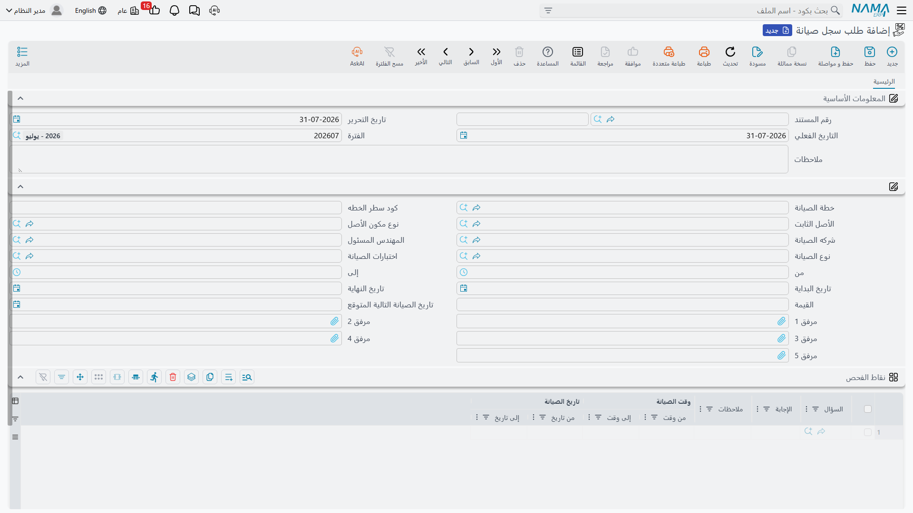
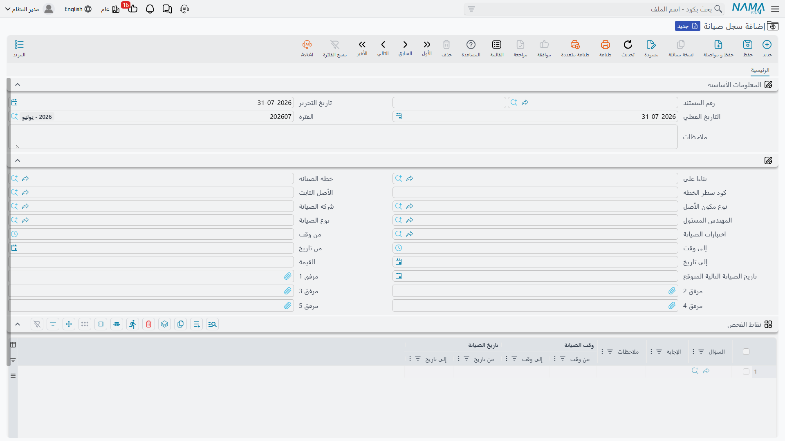
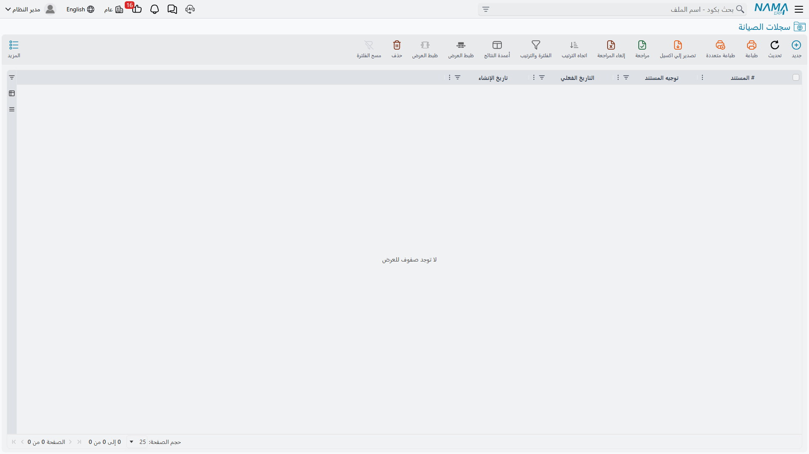

# سجلات الصيانة وطلباتها

كل ما سبق في هذه المنطقة تمهيد. **سجل صيانة** هو الشيء نفسه: المستند الذي يغلقه الفني في نهاية
الزيارة، ويقول فيه ما الذي عُمل، وعلى أي جزء من أي ماكينة، وبواسطة من، وبين أي ساعتين، وعلى أي ورقة
فحص، وبأي تكلفة، ومتى تُتوقَّع الزيارة القادمة.

ويسبقه اختيارياً **طلب سجل صيانة** — الطلب الذي يُحرَّر قبل تنفيذ العمل. والشاشتان متطابقتان تقريباً
عن قصد: الطلب مسودّة السجل، والسجل يُحرَّر عادةً *بناءً عليه*.

كلاهما تحت **الأصول > الصيانة**، وكلاهما يحتاج رخصة `fixedassets-maintenance`. وكلاهما مستند — له
دفتر وكود وتاريخ تحرير وتاريخ فعلي وفترة — لكن لا يحمل أي منهما توجيهاً ولا ينتج أي منهما قيداً
محاسبياً.

## الطلب: توثيق الطلب

**الأصول > الصيانة > طلب سجل صيانة.**

يُحرَّر الطلب حين يُحدَّد العمل ولمّا يُنفَّذ بعد: مهندس المصنع يرى زيارة أبريل قادمة في الخطة، أو
مشغّل يبلّغ عن صوت غريب. والطلب يلتقط النطاق — الأصل، والمكوّن، وصنف الصيانة، والمقاول والمهندس
المقترحان، والنافذة الزمنية التي ينبغي أن يقع فيها العمل، وقيمة تقديرية، وقائمة الاختبارات التي
سيُفحص العمل عليها.

واعتماد الطلب **لا يغيّر شيئاً على الإطلاق**. لا يمسّ الخطة ولا الأصل ولا سطر المكوّن ولا الأستاذ
العام، ولا يُعلَّم أي سطر بأنه مستوفى حين يُنفَّذ العمل لاحقاً. قيمته أنه موجود بوصفه توثيقاً
للطلب، وأنه يمكن تداوله واعتماده كأي مستند آخر، وأن كل ما فيه يمكن صبّه في السجل بحقل واحد.

## السجل: ما نُفِّذ فعلاً

**الأصول > الصيانة > سجل صيانة.**

أعلى الشاشة كتلة المستند المعتادة: **رقم المستند** (الدفتر والكود)، و**تاريخ التحرير**،
و**التاريخ الفعلي**، و**الفترة**، و**ملاحظات**.

وتحتها الحقول التي تصف العمل:

| الحقل | الغرض منه |
|---|---|
| **بناءا على** | يشير إلى طلب سجل الصيانة الذي ينفّذه هذا السجل. اختياره ينسخ الطلب — انظر أدناه. هذا الحقل في السجل وحده؛ فالطلب لا شيء يُبنى عليه. |
| **خطة الصيانة** | الخطة التي تنتمي إليها الزيارة. |
| **كود سطر الخطه** | أي سطر من تلك الخطة يُنفَّذ. استخدم قائمة الاقتراحات — فهي تعرض سطور الخطة المعلّقة بالضبط. |
| **الأصل الثابت** | الماكينة. |
| **نوع مكون الأصل** | أي جزء منها. لا يعرض المرجع إلا المكونات المسرودة في بطاقة ذلك الأصل. |
| **شركه الصيانة** | المقاول الذي نفّذ العمل. |
| **المهندس المسئول** | الموظف الذي يملك المهمة داخلياً. |
| **نوع الصيانة** | صنف الصيانة. لا يعرض المرجع إلا الأنواع التي يسمح بها نوع المكوّن. |
| **اختبارات الصيانة** | ورقة الفحص. اختيارها يملأ الجدول أدناه بأسئلتها. |
| **من تاريخ / إلى تاريخ** و**من وقت / إلى وقت** | متى جرى العمل. |
| **القيمة** | ما كلّفته الزيارة. تُسجَّل بوصفها تاريخاً — انظر قسم التكلفة أدناه. |
| **تاريخ الصيانة التالية المتوقع** | موعد الزيارة القادمة. يُقترح من فترة تكرار نوع الصيانة، ويمكنك استبداله بحرية. |
| **مرفق 1–5** | تقرير المقاول، والصور، وأمر الشغل الموقّع. |

ثم جدول **نقاط الفحص** — ورقة الفحص، سطر لكل سؤال:

| العمود | ما يحمله |
|---|---|
| **السؤال** | السؤال، يصل مع قائمة الاختبارات. |
| **الإجابة** | ما وجده الفني. صندوق نص تُعرض فيه إجابات النقطة المقترحة أثناء الكتابة. |
| **ملاحظات** | ما يستحق قوله عن تلك النقطة بعينها. |
| **تاريخ الصيانة — من / إلى** و**وقت الصيانة — من / إلى** | توقيتات لكل سؤال، للأعمال التي يستحق فيها توقيت كل مهمة على حدة. |

وأخيراً مجموعة المحددات، كما في كل مستند.

### تحرير سجل بناءً على طلب

املأ **بناءا على** بالطلب، فينسخ النظام المهندس المسؤول وشركة الصيانة والقيمة والخطة وقائمة
الاختبارات والأصل وكود سطر الخطة ونوع الصيانة وتواريخ وأوقات البداية والنهاية والمرفقات الخمسة
وجدول نقاط الفحص كاملاً — بأسئلته وبأي إجابات عليه.

وما لا يُنسَخ هو حساب التاريخ. فتاريخ الصيانة التالية المتوقع في الطلب حُسِب من التاريخ الفعلي
*للطلب*؛ فإن حمل السجل تاريخاً فعلياً مختلفاً، أعد اختيار نوع الصيانة — أو اكتب التاريخ — حتى يكون
ما يُختم به الأصل مقيساً من اليوم الذي جرى فيه العمل فعلاً.

## قاعدتان تحسمان قبول الاعتماد

كلتاهما عن المكونات، ومعرفتهما قبل أول سجل أفضل من معرفتهما بعده.

**نوع المكوّن يجب أن ينتمي إلى الأصل.** كل سجل صيانة يُقيَّد على جزء من الماكينة، فحقل «نوع مكون
الأصل» يجب أن يُملأ وأن يطابق أحد سطور جدول «مكونات الأصل» في بطاقة الأصل. والشاشة لا تضع علامة
الإلزام على الحقل، لكن الاعتماد بدونه يُرفض، ويُرفض كذلك الاعتماد على أصل لا مكونات له إطلاقاً. فإن
واجهتك رسالة *«نوع مكون الأصل لا ينتمي إلى الأصل الثابت»* فالعلاج في بطاقة الأصل لا في السجل — اذهب
وعرّف [مكوناته](/ar/modules/fixedassets/master-files/fixedassets-components.md) أولاً.

**نوع الصيانة يجب أن يكون مسموحاً لذلك المكوّن.** فكل نوع مكوّن يحمل قائمته الخاصة بأنواع الصيانة
المسموح بها؛ فإن لم تكن فارغة وجب أن يكون نوع صيانة السجل واحداً منها. والقائمة الفارغة تعني أن كل
الأنواع مسموحة.

وهناك تحقق إضافي في السجل وحده: سطر الخطة **الملغى** لا يقبل سجلاً. أعِد تفعيل السطر، أو وجّه السجل
إلى سطر آخر.

## ماذا يفعل اعتماد السجل

ثلاثة أمور، لا مالي فيها.

1. **يُغلق سطر الخطة.** كل سطر في الخطة المسمّاة يطابق كوده كود سطر الخطة في السجل يصير **منفذه**
   ويُختم بهذا السجل.
2. **يُحدَّث سطر المكوّن في بطاقة الأصل.** يبحث النظام عن سطر المكوّن الذي يطابق نوع مكوّن السجل —
   وأن يكون نوع صيانته مطابقاً لنوع صيانة السجل أو فارغاً — فيكتب عليه تاريخ بداية الصيانة وتاريخ
   نهايتها وتاريخ الصيانة التالية المتوقع ورابطاً يعود إلى هذا السجل. وهنا تعيش إجابة «متى تستحق
   الزيارة القادمة»، مقروءة من بطاقة الأصل دون فتح أي خطة.
3. **ولا شيء غير ذلك.** لا قيد يومية، ولا طلب أعمال، ولا تغيير في تكلفة الأصل ولا في مجمّع إهلاكه
   ولا في قيمته الدفترية ولا في عمره المتبقي ولا في قسط إهلاكه.

وإلغاء اعتماد السجل يتراجع عن ذلك كله: يعود سطر الخطة **مخطّطة** ويُفرَّغ عمود سجله، وتُمسح من سطر
المكوّن التواريخ الثلاثة والرابط. وإن عدّلت سجلاً معتمداً ووجّهته إلى سطر خطة آخر، حُرِّر السطر
القديم وعاد مخطّطاً قبل أن يُعلَّم الجديد منفذاً.

## قيمة الصيانة تاريخ لا قيمة

حقل **القيمة** يحمل ما كلّفته الزيارة. يُحفَظ ويُبحَث فيه ويُطبَع، وهو بالضبط الرقم الذي تريده حين
تقارن فاتورة خدمة هذا الربع بفاتورة الربع الماضي، أو مقاولاً بمقاول.

لكنه ليس محاسبة. سجل الصيانة لا يقيّد شيئاً في الأستاذ العام، والمبلغ لا يمسّ الأصل: التكلفة تبقى
حيث كانت، ومجمّع الإهلاك يبقى حيث كان، ويُحسَب قسط الشهر القادم كأن الزيارة لم تقع. أما فاتورة
المقاول فتصل إلى الأستاذ العام عبر مسار المشتريات والدائنين المعتاد، مصروفاً، كأي خدمة أخرى
تشتريها.

وهذه هي المعالجة الصحيحة للصيانة بمعناها المعتاد — فتغيير الزيت لا يجعل الماكينة أثمن. أما حين يكون
المبلغ المنفَق على الأصل مستحقاً فعلاً للرسملة، لأنه يطيل عمر الماكينة أو يزيد طاقتها لا يعيدها إلى
حالها، فذاك مستند آخر:
[سند الإضافة والخصم](/ar/modules/fixedassets/depreciation/fixedassets-additions-and-deductions.md)
يضيف المبلغ إلى أساس تكلفة الأصل ويعيد اشتقاق القسط منه. فتسجيل تطوير حقيقي بوصفه سجل صيانة يحفظه
حكايةً، وتسجيله بوصفه إضافة يحفظه مالاً.

::: info قطع الغيار ليست جزءاً من هذا المستند
لا يوجد في سجل الصيانة حقل صنف ولا كمية ولا مخزن ولا رابط بمستند مخزني. فإن سُحبت قطع من مخازنك،
اصرفها بمستند سلسلة الإمداد المناسب؛ والاثنان غير مرتبطين، فاذكر مرجع الصرف في ملاحظات السجل إن
أردت العثور عليه لاحقاً.
:::

## أول زيارة على `MCH-0007` لدى شركة الواحة

**25 مارس 2026 — الطلب.** يحرّر مهندس المصنع طلب سجل صيانة على `MCH-0007`، نوع المكوّن **عمود
الدوران**، نوع الصيانة **صيانة دورية**، الخطة `MP-CNC-2026`، كود سطر الخطة `0120260401`، المقاول
شركة الخليج لتجارة الآلات، المهندس المسؤول خالد المطيري، والقيمة التقديرية **1,800**. واختيار نوع
الصيانة يقترح تاريخ صيانة تالية 23 يونيو — أي 90 يوماً من تاريخ الطلب نفسه. واختيار قائمة «فحص دوري
لماكينة CNC» يملأ الجدول بأسئلتها الأربعة. الاعتماد: لا شيء يتحرك.

**1 أبريل 2026 — السجل.** يُنشأ سجل الصيانة `FAMR-000031` تاريخه الفعلي 1 أبريل وحقل **بناءا على**
مضبوط على الطلب، فينسخ كل شيء. يعيد المهندس اختيار نوع الصيانة ليُعاد حساب تاريخ الصيانة التالية من 1 أبريل،
فيصير **30 يونيو 2026** — وهو السطر الثاني في الخطة. وتدخل نتائج الفني في الجدول:

| السؤال | الإجابة | ملاحظات |
|---|---|---|
| هل اهتزاز عمود الدوران ضمن الحدود؟ | سليم | |
| مستوى سائل التبريد وحالته | مستبدل | 20 لتراً وفلتر جديد |
| هل الأغطية والواقيات سليمة؟ | نعم | |
| هل رُوجع سجل أخطاء وحدة التحكم ومُسح؟ | نعم | تحذيرا تجاوز حد من فبراير |

جرى العمل من 09:00 إلى 13:30 في 1 أبريل، والتكلفة المؤكدة **1,800**.

**الاعتماد.** يصير سطر الخطة `0120260401` *منفذه* ويسمّي هذا السجل. وفي بطاقة الأصل يقرأ سطر مكوّن
عمود الدوران الآن: بداية الصيانة 1 أبريل 2026، ونهايتها 1 أبريل 2026، والصيانة التالية المتوقعة
30 يونيو 2026، مع رابط إلى السجل. وتعرض صفحة سجل الصيانة في بطاقة الأصل الزيارة في قائمتها.

وأرقام الماكينة كما هي: التكلفة 240,000، ومجمّع الإهلاك 10,800 بعد ثلاث فترات، والقسط 3,600 في
أبريل كما كان في مارس. فالـ 1,800 معلومة عن تاريخ خدمة الماكينة، لا أكثر.

