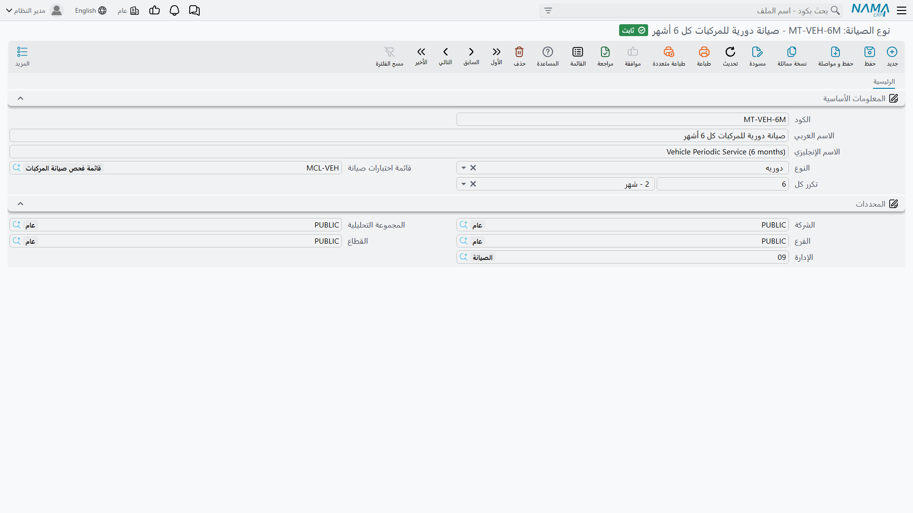

# أنواع الصيانة

الورشة لا تنفّذ «صيانة». هي تنفّذ خدمة روتينية كل 90 يوماً، وعمرة سنوية، ونداء الطوارئ حين يتعطل
شيء في الثانية صباحاً. ثلاثة أعمال مختلفة بثلاث قوائم فحص مختلفة وثلاث فترات تكرار مختلفة وثلاثة
أطقم مختلفة من الناس — و**نوع الصيانة** هو الطريقة التي تفرّق بها بينها.

وكل ما يليه يقرأ منه: الخطة تجدول *نوعاً* في تاريخ، والسجل هو سجل *لنوع*، ومكوّن الأصل يحدد أي
الأنواع مشروعة له. اضبط الحفنة الصغيرة من الأنواع في البداية، فيستقيم بقية العمل.

تجدها في **الأصول > الصيانة > نوع الصيانة**، وتحتاج — كغيرها في هذا المجلد — رخصة
`fixedassets-maintenance`.

## ما الموجود على الشاشة

ملف رئيسي صغير: صفحة واحدة، ومجموعة حقول واحدة، ومعها مجموعة المحددات المعتادة.

| الحقل | الغرض منه |
|---|---|
| **الكود** | معرّفك للنوع، مثل `MT-90D`. |
| **الاسم العربي / الاسم الإنجليزي** | اسم النوع بالعربية وبالإنجليزية. |
| **النوع** (Type) | طبيعة العمل — انظر أدناه. تصنيف للتقارير لا يغيّر أي سلوك. |
| **قائمة اختبارات صيانة** (Maintenance CheckList) | ورقة الفحص المصاحبة لهذا الصنف من الأعمال. اختيار هذا النوع في سطر خطة أو في سجل يسحب أسئلة هذه القائمة إلى المستند. |
| **تكرر كل** (Repeated Every) | قيمة ووحدة — الفترة التي يعود بها هذا الصنف من الصيانة. |

لا يوجد على هذه الشاشة أي تحقق، ولا حقل إلزامي عدا الكود والاسم المعتادين، فالإعداد سريع والتصحيح
أسرع.

### النوع — الطبائع الأربع

| العربية | الإنجليزية | الاستخدام المعتاد |
|---|---|---|
| وقائيه | Preventive | عمل يُنفَّذ لمنع عطل لم يقع بعد — عمرة، أو رمان بلي يُستبدل في موعده. |
| دوريه | Periodic | الخدمة الروتينية التي تعود على التقويم. |
| طارئه | Incidental | النداء غير المخطط بعد عطل مفاجئ. |
| أخري | Other | ما لا ينتمي إلى الثلاثة السابقة. |

هذا وسم لا مفتاح: النظام يعامل الطبائع الأربع معاملة واحدة. وقيمته في التقارير وفي فلترة قائمة
السجلات — «أرِني كل عمل طارئ على المكابس هذا العام» سؤال يستحق أن تكون قادراً على طرحه.

### تكرر كل — من أين يأتي تاريخ الاستحقاق التالي

الفترة زوج: **القيمة** و**الوحدة**. وقائمة الوحدات تمتد من الثواني إلى السنوات، لكنك عملياً ستستخدم
الأيام أو الأسابيع أو الشهور أو السنوات. «كل 90 يوماً»، «كل 6 شهور»، «كل سنة».

ومهمتها الوحيدة هي هذه: حين تختار نوع الصيانة هذا في سجل صيانة — أو في طلب سجل صيانة — يأخذ النظام
**التاريخ الفعلي** للمستند نفسه، ويضيف إليه الفترة، ويضع الناتج في حقل **تاريخ الصيانة التالية
المتوقع**. فاختيار «صيانة دورية» في سجل مؤرخ 1 أبريل 2026 وفترته 90 يوماً يملأ الحقل بـ
**30 يونيو 2026**.

وهذا اقتراح لا قرار. يمكنك استبداله قبل الاعتماد — فإذا أخبرك المقاول في يوم الزيارة أن هذه
الماكينة تحتاج متابعة بعد ستة أسابيع لا بعد ثلاثة شهور، اكتب تاريخ الستة أسابيع واعتمد. وما يوجد في
الحقل لحظة الاعتماد هو ما يُختم به سطر المكوّن في بطاقة الأصل بوصفه تاريخ صيانته التالية المتوقع.

::: tip الفترة آلة حاسبة لا مجدوِل
ضبط الفترة لا يضع شيئاً في طابور. هو يملأ حقل تاريخ، ويصبح هذا التاريخ مرئياً على الأصل. أما
الزيارات نفسها فتُكتب يدوياً في
[خطه الصيانة](/ar/modules/fixedassets/maintenance/fixedassets-maintenance-plans.md)، والسجلات التي
تغلقها يحرّرها إنسان.
:::

## أي الأنواع يقبلها الأصل

نوع الصيانة ليس صالحاً لأي أصل تشاء. البوابة هي **نوع مكون الأصل**.

كل نوع مكون أصل — عمود الدوران، وحدة التحكم، مضخة سائل التبريد — يحمل جدول **أنواع الصيانة** الخاص
به، وفيه أصناف الصيانة المشروعة لهذا الصنف من الأجزاء. وعند تعبئة سجل الصيانة، لا يعرض عليك مرجع
نوع الصيانة إلا الأنواع الموجودة في ذلك الجدول، ويُرفض الاعتماد إن تجاوزته بشيء آخر. والجدول الفارغ
يعني «بلا قيد» — أي نوع مسموح على هذا المكوّن.

فالإعداد يسير في هذا الاتجاه: أنشئ أنواع الصيانة أولاً، ثم اسردها على أنواع المكونات التي تقبلها،
ثم دع مكونات الأصل ترثها من [نوع الأصل](/ar/modules/fixedassets/master-files/fixedassets-asset-types.md).
تفاصيل ذلك الجدول في صفحة
[مكونات الأصل](/ar/modules/fixedassets/master-files/fixedassets-components.md).

وهناك موضع آخر يستخدم النوع: سطر المكوّن في بطاقة الأصل يسمّي نوع صيانة إلى جوار نوع المكوّن. هذا
الاقتران هو ما يبحث عنه السجل المعتمد حين يقرر أي سطر مكوّن يختمه بتواريخ الزيارة.

## الإجراءات في هذه الشاشة

ليس في نوع الصيانة أزرار خاصة به — فهو ملف رئيسي قصير تملؤه وتحفظه.

## أنواع شركة الواحة

تُبقي شركة الواحة قائمتها قصيرة — فطول قائمة أنواع الصيانة علامة على أن شيئاً كان ينبغي أن يكون
قائمة اختبارات صار نوعاً.

| الكود | الاسم | الطبيعة | قائمة الاختبارات | تكرر كل |
|---|---|---|---|---|
| `MT-90D` | صيانة دورية | دوريه | فحص دوري لماكينة CNC | 90 يوماً |
| `MT-ANN` | عمرة سنوية | وقائيه | العمرة السنوية للماكينات | سنة |
| `MT-BRK` | نداء أعطال | طارئه | *(بلا)* | *(بلا)* |

`MT-90D` هو النوع الذي يجري في بقية هذه الصفحات. يحمل قائمة «فحص دوري لماكينة CNC»، فيصل كل سجل من
هذا النوع ومعه الأسئلة الأربعة نفسها جاهزة، وفترته البالغة 90 يوماً هي التي تحوّل 1 أبريل إلى
اقتراح بـ 30 يونيو.

أما `MT-BRK` فقد تُرك عمداً بلا قائمة اختبارات وبلا فترة تكرار. العطل غير متوقع وليست له ورقة فحص
قياسية، وتركهما فارغين يعني أن السجل يأتي فارغاً بلا اقتراح لتاريخ استحقاق تالٍ — وهو الصواب تماماً
للعمل غير المخطط.
