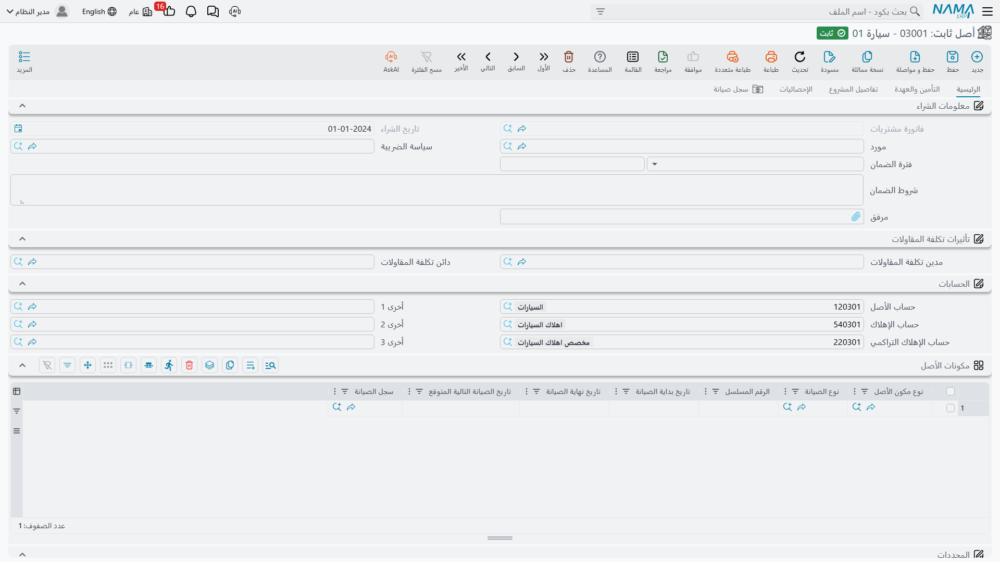
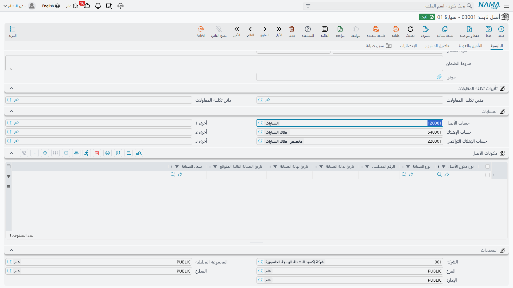
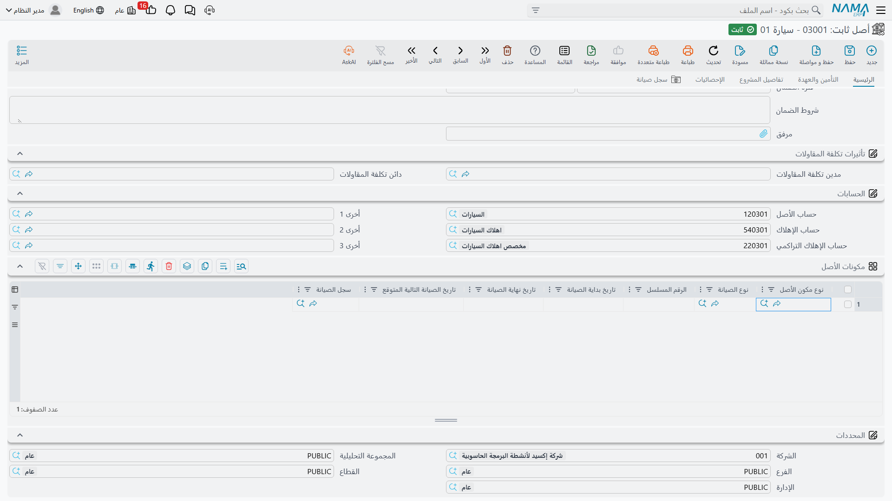
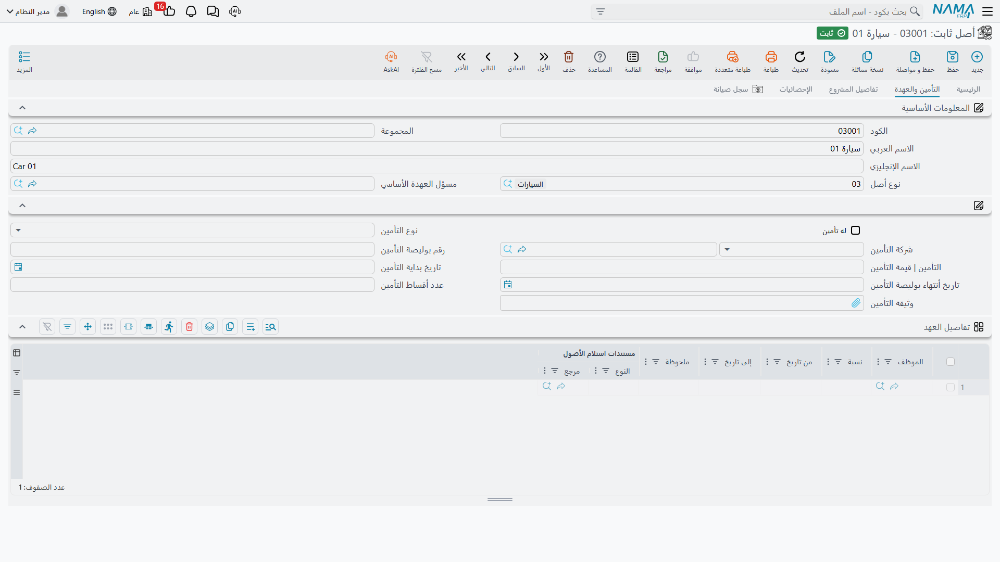
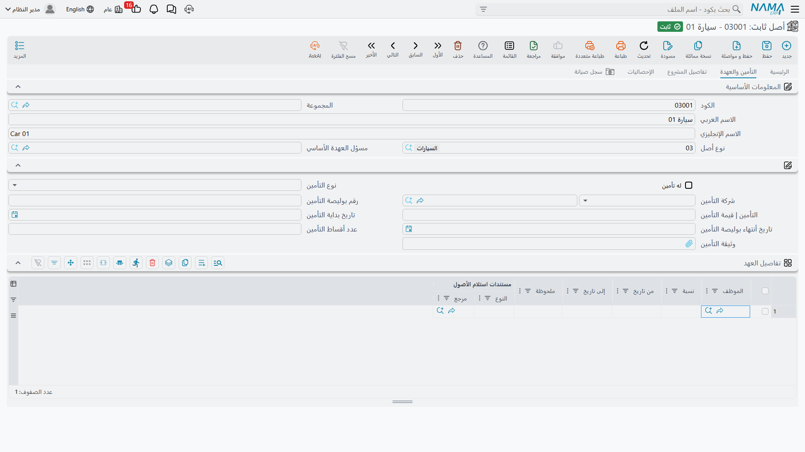
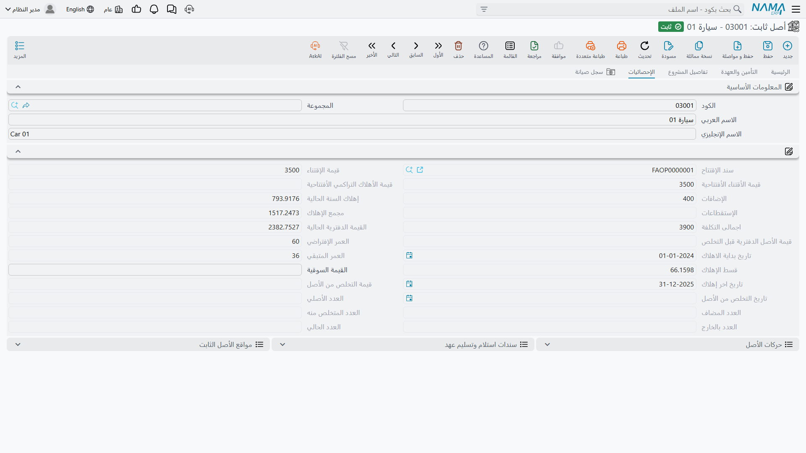
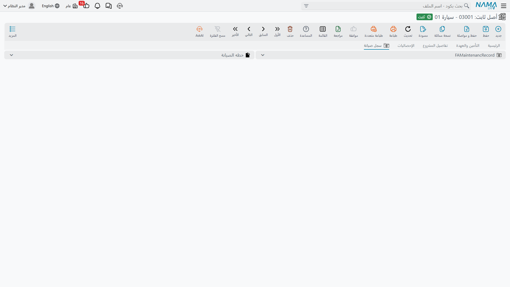

# بطاقة الأصل الثابت

قاعدة واحدة تشرح هذه الشاشة كلها، وقراءتها أولًا توفّر عليك ساعة من البحث عن حقل لا وجود له:

> **الحقول المالية على الأصل الثابت تكتبها المستندات. أنت لا تكتبها أبدًا.**

التكلفة، والإضافات، والاستقطاعات، ومجمع الإهلاك، والقيمة الدفترية، والعمر المتبقي، والقسط الحالي، وقيمة التخلص، وتاريخ الشراء، والموقع — لا شيء من ذلك يُحرَّر هنا. كلها مخرجات. فخلف البطاقة تاريخُ حركات، سطر لكل حدث مالي، وكلما مسّ مستندٌ الأصل أُعيد تشغيل هذا التاريخ كله مرتَّبًا بالتاريخ وأُعيد بناء الأرقام على الشاشة منه. ولهذا تتّسق دائمًا، ولهذا يكون تصحيح رقم خاطئ بحثًا عن المستند الذي كتبه لا تحريرًا للأصل.

أما ما **تكتبه** أنت فهوية الأصل: كوده وأسماؤه، ونوعه، ورقمه المسلسل، وتصنيفاته، ومن يحمله، وأوراق تأمينه، والحسابات التي يُقيَّد عليها. وبالتقريب: النصف العلوي من الصفحة الأولى لك، وما عداه تقرير.

> البطاقة التي نمشي فيها هي **`MCH-0007` — ماكينة قص CNC**، اشترتها شركة الواحة للصناعات في 1 يناير 2026 بمبلغ **240,000**، بعمر **60 شهرًا** وقيمة كخردة **24,000**، وتقف في **مصنع الرياض – صالة 2**. وننظر إليها كما كانت في نهاية ديسمبر 2026، بعد اثنتي عشرة دورة إهلاك.

| | |
|---|---|
| القائمة | **الأصول ← الملفات ← أصل ثابت** |
| النوع | ملف رئيسي |
| كود الرخصة | `fixedassets` |

تحمل القائمة تاريخ الشراء والقيمة السوقية والموقع والحالة كأعمدة، وهو ما يجعلها سجل عمل صالحًا بذاته: رشّح بالحالة لتجد كل ما ينتظر سند شراء، أو بالموقع لترى ما يقف في صالة بعينها.

وللبطاقة نفسها خمس صفحات، ونأخذها بترتيب الشاشة.

## الصفحة 1 — الرئيسية

### المعلومات الأساسية

كتلة الهوية، وكلها بيدك.

| الحقل | الاسم على الشاشة | ملاحظات |
|---|---|---|
| الكود | الكود | `MCH-0007`. يُكوَّد تلقائيًا حين يُنشئ الأصلَ مستندٌ، من مجموعة التكويد على نوعه. |
| المجموعة | المجموعة | المجموعة التي يُصنَّف الأصل تحتها. |
| الاسم العربي / الاسم الإنجليزي | الاسم العربي / الاسم الإنجليزي | الاسم العربي أولًا، ثم الإنجليزي. |
| الكود الإنجليزي | الكود الإنجليزي | كود بديل. |
| نوع أصل | نوع أصل | `FAT-MCH`. اختياره يملأ الحسابات ومفاتيح السلوك وجدول المكونات — انظر [أنواع الأصول الثابتة](/ar/modules/fixedassets/master-files/fixedassets-asset-types.md). |
| مسؤل العهدة الأساسي | مسؤل العهدة الأساسي | الموظف المسؤول عن الأصل. ويحمل `MCH-0007` خالد المطيري. |
| تصنيف أصل ثابت 1..5 | تصنيف أصل ثابت 1..5 | خمسة مستويات للتقارير؛ واختيار مستوى أدنى يملأ ما فوقه. انظر [التصنيفات](/ar/modules/fixedassets/master-files/fixedassets-classifications.md). |

### الكتلة التي تحتها

المجموعة التالية بلا عنوان على الشاشة، وتخلط بين حقول تكتبها وأرقام تقرؤها فقط. وهذه هي أكثر أجزاء البطاقة التي يحاول الناس تحريرها، فعمود «تُكتب؟» هو المهم فيها.

| الحقل | الاسم على الشاشة | تُكتب؟ |
|---|---|---|
| الرقم المسلسل | الرقم المسلسل | نعم — وإن كان سند الشراء سيستبدله بالرقم المسلسل المكتوب على سطره. |
| موقع الأصل | موقع الاصل | **لا.** تكتبه المستندات التي تحرّك الأصل. انظر [مواقع الأصول](/ar/modules/fixedassets/master-files/fixedassets-locations.md). |
| العمر الإفتراضي | العمر الإفتراضي | **لا.** بالشهور. وهو `60` لـ `MCH-0007`. |
| العمر المتبقي | العمر المتبقي | **لا.** بالشهور، وينقص واحدًا بعد كل إهلاك. وهو `48` في نهاية 2026. |
| القيمة السوقية | القيمة السوقية | نعم — رقم استرشادي حر. والإهلاك لا يلتفت إليه البتّة. |
| قيمة الأصل كخردة | قيمة الأصل كخردة | **لا.** `24,000`. |
| الحالة | الحالة | **لا.** `جارى الإهلاك`. انظر [حالات الأصل](/ar/modules/fixedassets/master-files/fixedassets-asset-status.md). |
| طريقة إهلاك الأصل | طريقة إهلاك الأصل | نعم — قسط ثابت أو إعادة تقييم، وحتى أول حركة على الأصل فقط. |
| قسط الإهلاك | قسط الإهلاك | **لا.** `3,600`، ويُعاد حسابه بعد كل حدث. |
| سيارة / السيارة | سيارة / السيارة | نعم. ولا يُتاح حقل السيارة إلا بعد تعليم «سيارة». |
| غير قابل للإهلاك | غير قابل للإهلاك | نعم. للأراضي وما شابهها. والأصل غير القابل للإهلاك لا يحتاج حسابات إهلاك ولا يجمعه سند إهلاك. |
| له عدد | له عدد | نعم. يجعل البطاقة عددًا من الوحدات المتماثلة لا شيئًا واحدًا. |
| كود مصلحة الضرائب | كود مصلحة الضرائب | نعم — كود الصنف الذي يحمله الأصل على الفاتورة الإلكترونية عند بيعه. |
| المرفقات | مرفق، مرفق 1..10 | نعم — الفاتورة، والشهادة، والصور. |

وإلى جانب كود مصلحة الضرائب حقلٌ لكود وحدة القياس لدى المصلحة، يخدم الغرض نفسه في الفاتورة الإلكترونية.

وتحت هذه الكتلة زرّان. **إنشاء سيارة** يُنشئ بطاقة مركبة تحمل كود الأصل وأسماءه ومسؤول عهدته، ويربط الاثنين — وهو مفيد حين تكون الشاحنة الموجودة في سجل الأصول موجودةً كذلك في الأسطول. وهو لا يفعل شيئًا إلا إذا كانت علامة **سيارة** مؤشَّرة ولم تكن هناك مركبة مربوطة بعد؛ فإن أزلت العلامة اكتفى ضغطُه بفكّ الربط.

وحين تكون وحدة العقارات مثبَّتة يظهر زر **تحويل لعقار** الذي يحوّل الأصل إلى عقار. وهو يسأل سؤالين — نوع العقار (مبنى أو أرض أو دور أو بلوك أو وحدة إيجارية، والوحدة الإيجارية هي المعروضة افتراضيًا) والمجموعة الرئيسية التي تقع فيها البطاقة الجديدة — ثم يفتح العقار الجديد في نافذة منبثقة، مملوءًا بكود الأصل وأسمائه وقيمته السوقية ومشيرًا إلى الأصل. ولا بد أن يكون الأصل محفوظًا قبل ضغطه؛ والعقار نفسه لا يُنشأ إلا بحفظ ما فتحته النافذة. وصورة التحويل الجملية هي زر **تحويل لعقارات** في شاشة القائمة: تختار الأصول، وتجيب عن السؤالين نفسيهما، فتُنشأ البطاقات لك.

### معلومات الشراء

| الحقل | الاسم على الشاشة | من أين يأتي |
|---|---|---|
| فاتورة المشتريات | فاتورة مشتريات | **للقراءة فقط.** سند شراء الأصل الذي أدخله الخدمة — وهو أسرع طريق من الأصل إلى الورق الذي أنشأه. |
| تاريخ الشراء | تاريخ الشراء | **للقراءة فقط.** التاريخ الفعلي لذلك المستند. |
| المورد | مورد | يُكتب، ويدفعه إلى هنا أيضًا سند الشراء أو الافتتاح. |
| سياسة الضريبة | سياسة الضريبة | تُكتب، حين تكون خاصية ضريبة المبيعات مفعّلة. |

وتقرأ هذه المجموعة في `MCH-0007`: فاتورة المشتريات `FAPD-0031`، وتاريخ الشراء 1 يناير 2026، والمورد شركة الخليج لتجارة الآلات.

### الحسابات

الحسابات الثلاثة التي يلجأ إليها كل قيد في الوحدة:

| الخانة | الاسم على الشاشة | لماذا تُستعمل |
|---|---|---|
| حساب الأصل | حساب الأصل | التكلفة. مدين عند الاقتناء وعند الإضافة، ودائن عند التخلص. |
| حساب الإهلاك | حساب الإهلاك | **مصروف** الإهلاك، مدين في كل دورة. |
| حساب الإهلاك التراكمي | حساب الإهلاك التراكمي | الحساب المقابل، دائن في كل دورة ويُصفَّى عند التخلص. |

تصل من نوع الأصل، ويجوز لك تجاوز أي منها على هذا الأصل — والحساب الذي تكتبه هنا يبقى ولا تستبدله قيمة النوع أبدًا. أما ما لا تستطيعه فتفريغ حساب: امسحه واحفظ، فيُنسَخ حساب النوع إلى الخانة الفارغة عند الحفظ التالي مباشرة. ولإزالة حساب نهائيًا احذفه من نوع الأصل أو انقل الأصل إلى نوع آخر.

وإلى جانبها ثلاث خانات باسم «أخرى 1» و«أخرى 2» و«أخرى 3». لا تستعملها الأصول الثابتة من تلقاء نفسها؛ فهي خانات احتياطية يمكن أن يُوجَّه إليها توجيه مستند.

والأصل القابل للإهلاك لا يُحفَظ حتى تمتلئ الحسابات الثلاثة الأولى. أما غير القابل للإهلاك فلا يحتاج أيًّا منها.

### مكونات الأصل

الأجزاء القابلة للصيانة في الماكينة — عمود الدوران، ووحدة التحكم، ومضخة التبريد — لكل منها رقمه المسلسل وتواريخ صيانته. تصل السطور من نوع الأصل ويمكنك الإضافة إليها. ولا تحمل تكلفة ولا إهلاكًا من عندها؛ إنما وُجدت لتُسجَّل الصيانة على *جزء* لا على الماكينة كلها. انظر [المكونات وأنواع المكونات](/ar/modules/fixedassets/master-files/fixedassets-components.md).

### المحددات

المحددات الخمسة — الشركة، والمجموعة التحليلية، والفرع، والقطاع، والإدارة. تقول أي شركة وأي جزء من العمل يملك الأصل، أما هل يأخذ سطر القيد محدِّده من الأصل أم من المستند فذلك من إعدادات الوحدة. وسند النقل يعيد كتابتها.

وحين تكون وحدة المقاولات مثبَّتة تظهر مجموعة **تأثيرات تكلفة المقاولات** بطرفٍ مدين وآخر دائن، يقرؤهما سند الإهلاك حين يُضبط توجيهه على أخذ طرفَي تكلفة المقاولات من الأصل.

## الصفحة 2 — التأمين والعهدة

يعيد أعلى الصفحة هوية الأصل، ثم يأتي ملف التأمين: هل الأصل مؤمَّن عليه، ونوع التأمين وشركته، ورقم البوليصة، وقيمة التأمين، وتاريخ البداية، وتاريخ انتهاء البوليصة، وعدد الأقساط، ووثيقة التأمين نفسها. وكل ذلك يُكتب بيدك. وإن كان الأصل مرتبطًا ببطاقة سيارة نُسخت تفاصيل التأمين من السيارة عند اختيارها — ثم يدفعها الأصل إلى السيارة مرة أخرى عند الحفظ.

وتحتها جدول **تفاصيل العهد** — وهو تاريخ، لا جدول إدخال.

| العمود | الاسم على الشاشة | المعنى |
|---|---|---|
| الموظف | الموظف | من حمل الأصل. |
| النسبة | نسبة | حصة الأصل التي يحملها هذا الموظف. |
| من تاريخ / إلى تاريخ | من تاريخ / إلى تاريخ | مدة حمله له. والسطر المفتوح بلا تاريخ نهاية. |
| ملحوظة | ملحوظة | نص حر. |
| مستندات استلام الأصول | مستندات استلام الأصول | المستند الذي فتح السطر. |

ويكتب هنا مستندان. **سند استلام وتسليم العهد** يُغلق سطر الحامل السابق قبل تاريخه الفعلي بيوم ويفتح سطرًا جديدًا للحامل الجديد؛ أما هل يتغيّر «مسؤل العهدة الأساسي» في الصفحة الأولى كذلك فيتوقّف على التوجيه وعلى ما إذا كان مسؤول العهدة الحالي هو المسلِّم. و**مستند استلام الأصل** يضيف سطرًا لكل سطر استلام بنسبته. وإلغاء أيٍّ من المستندين يزيل السطر الذي أضافه. انظر [الاستلام](/ar/modules/fixedassets/acquisition/fixedassets-receipts.md) و[سند تسليم واستلام العهد](/ar/modules/fixedassets/acquisition/fixedassets-delivery-receipt.md).

## الصفحة 3 — تفاصيل المشروع

هذه الصفحة تهمّ شركات المقاولات ولا تهمّ سواها. تسمّي **المشروع** الذي خرج منه الأصل، وتحمل جدولًا ببنود عقود ذلك المشروع — كود البند، والبند القياسي، ووصفه، وتاريخَي بداية الضمان ونهايته اللذين وعد بهما عقد المشروع.

والجدول يُملأ نيابةً عنك. يُكتب حين يحوّل [سند إنشاء أصول](/ar/modules/fixedassets/master-files/fixedassets-creation-document.md) مشروعًا منتهيًا إلى أصل، ويمكن تحديثه في أي وقت بزرّ **تحديث بنود المشروع** في هذه الصفحة، الذي يعيد قراءة كل عقد على مشروع الأصل ويعيد جمع البنود المعلَّمة لتنتقل إلى الأصل. والضغط عليه يستبدل ما في الجدول.

## الصفحة 4 — الإحصائيات

هذه هي التقرير المالي عن الأصل، و**كل حقل فيها للقراءة فقط**. وهذا `MCH-0007` في نهاية ديسمبر 2026:

| الحقل | الاسم على الشاشة | القيمة | ما هو |
|---|---|---|---|
| سند الافتتاح | سند الإقتتاح | — | سند الافتتاح، للأصول القادمة من نظام سابق. |
| قيمة الإقتناء | قيمة الإقتناء | 240,000 | تكلفة الاقتناء، من سند الشراء أو الافتتاح. |
| قيمة الاقتناء الافتتاحية | قيمة الأقتناء الأفتتاحية | — | التكلفة المذكورة في سند الافتتاح. |
| قيمة الإهلاك التراكمي الافتتاحية | قيمة الأهلاك التراكمي الأفتتاحية | — | الإهلاك المأخوذ قبل دخول الأصل إلى نما. |
| الإضافات | الإضافات | 0 | كل ما رُسمِل على الأصل بعد ذلك. |
| الإستقطاعات | الإستقطاعات | 0 | كل ما خُصم من قيمته. |
| إهلاك السنة الحالية | إهلاك السنة الحالية | 43,200 | الإهلاك المحمَّل داخل السنة المالية الجارية. |
| مجمع الإهلاك | مجمع الإهلاك | 43,200 | الإهلاك المتراكم. وإعادة التقييم تصفّره. |
| إجمالي قيمة الأصل | إجمالي قيمة الأصل | 240,000 | قيمة الاقتناء زائد الإضافات ناقص الاستقطاعات. |
| القيمة الدفترية الحالية | القيمة الدفترية الحالية | 196,800 | إجمالي القيمة ناقص مجمع الإهلاك. |
| قيمة الأصل الدفترية قبل التخلص | قيمة الأصل الدفترية قبل التخلص | — | تُملأ عند التخلص؛ القيمة الدفترية لحظة خروج الأصل. |
| العمر الإفتراضي | العمر الإفتراضي | 60 | بالشهور. |
| تاريخ بداية الاهلاك | تاريخ بداية الاهلاك | 01/01/2026 | أول فترة يجوز إهلاك الأصل فيها. |
| العمر المتبقي | العمر المتبقي | 48 | بالشهور. |
| قسط الإهلاك | قسط الإهلاك | 3,600 | ‏(196,800 − 24,000) ÷ 48 = 3,600. |
| القيمة السوقية | القيمة السوقية | — | رقم استرشادي حر. |
| تاريخ اخر إهلاك | تاريخ اخر إهلاك | 31/12/2026 | يمنع تحميل الفترة نفسها مرتين. |
| قيمة التخلص من الأصل | قيمة التخلص من الأصل | — | يملؤها سند التخلص. |
| تاريخ التخلص من الأصل | تاريخ التخلص من الأصل | — | وكذلك. |

وللأصل **ذي العدد** تحمل الصفحة كذلك كتلة عدادات — كم وحدة أُضيفت إلى البطاقة، وكم تخلّصت منها، وكم منها خارج المنشأة الآن، وكم بقي. وتحافظ عليها مستندات الحركة والتخلص الجزئي. ولا تدخل هذه العدادات حساب الإهلاك أبدًا؛ والموضع الوحيد الذي يمسّ فيه العدد المال هو [التخلص الجزئي](/ar/modules/fixedassets/disposal/fixedassets-partial-disposal.md)، الذي يُنزل التكلفة ومجمع الإهلاك بالتناسب.

### أين تبحث عن التاريخ

ثلاث قوائم أسفل صفحة الإحصائيات هي أنفع ما في البطاقة كلها.

**حركات الأصل** هي دفتر الأصل المالي — سطر لكل حدث مرتَّبًا بالتاريخ، يعرض التاريخ الفعلي، والإضافة، والاستقطاع، والقيمة المهلَكة، ومجمع الإهلاك الجاري، وقيمة الأصل الناتجة، والعمر المتبقي، وقيمة الخردة، والأهم: **المستند الذي سبّب الحركة**. فإذا بدا رقم في هذه الصفحة خاطئًا فهنا تعرف لماذا. ويحمل `MCH-0007` ثلاثة عشر سطرًا في نهاية 2026: سطر الشراء، واثنتا عشرة دورة إهلاك بـ 3,600.

**مواقع الأصل الثابت** هي تاريخ التنقّل — من أين، وإلى أين، وبأي تاريخ، وبأي مستند.

**سندات استلام وتسليم عهد** تعدّد عمليات التسليم المسجّلة على الأصل.

## الصفحة 5 — سجل الصيانة

قائمتان: **سجلات الصيانة** التي نُفّذت على هذا الأصل، و**خطط الصيانة** التي تجدولها. ولا يُدخَل هنا شيء — الصفحة تجيب عن سؤال: متى صينت هذه الماكينة آخر مرة، ومتى موعدها القادم. والتواريخ التي تُختم على جدول المكونات تأتي من هذه السجلات. انظر [الصيانة](/ar/modules/fixedassets/maintenance/fixedassets-maintenance-overview.md).

## ما ترفض الشاشة حفظه

أربعة فحوص تجري عند اعتماد الأصل، ويحسن معرفتها لأن رسائلها مقتضبة.

1. **الأصل القابل للإهلاك يحتاج حساباته الثلاثة.** بلا حساب أصل وحساب إهلاك وحساب إهلاك تراكمي لا حفظ. علِّم «غير قابل للإهلاك» فيسقط الشرط.
2. **لا يتكرر المكوّن.** لا يجوز أن يتكرر الجمع بين نوع المكون ونوع الصيانة مرتين في جدول المكونات — *«نوع مكون الأصل … مكرر»*.
3. **سلسلة التصنيفات يجب أن تتماسك.** إن ملأت تصنيفًا والمستوى الذي فوقه، وجب أن يكون الأعلى هو الأب الحقيقي للأدنى.
4. **طريقة الإهلاك تُقفَل بأول حركة.** فما إن توجد حركة واحدة على الأصل حتى تمتنع الطريقة عن التغيير — *«لا يمكن تغيير طريقة الإهلاك … لأنها مستخدمة في حركات الأصل بالمستند …»*. فالاختيار بين القسط الثابت وإعادة التقييم قرار يُتخذ قبل إدخال الأصل الخدمة.

وخارج لحظة الاعتماد تحمي الوحدة تاريخ الأصل كذلك: فلا يُحذف مستند ولا يُعاد تأريخه بما يقفز به فوق حركة أحدث على الأصل نفسه. فإن رُفض تصحيح برسالة تسمّي مستندًا آخر، فذلك المستند هو الواقف في الطريق.

## كيف تقرأ بطاقة أصل عمليًا

المستخدم المتمرّس يقرأ `MCH-0007` في ثلاث نظرات:

1. **الصفحة 1** — ما هو، ولمن، وعلى أي حسابات يُقيَّد.
2. **الصفحة 4** — كم يساوي الآن، وكم بقي من عمره.
3. **قائمة حركات الأصل** — كيف صار إلى ذلك، وأي مستند تفتح بعده.

وكل ما عدا ذلك في قائمة الوحدة إنما هو طريقة لكتابة سطور في تلك القائمة الثالثة.
