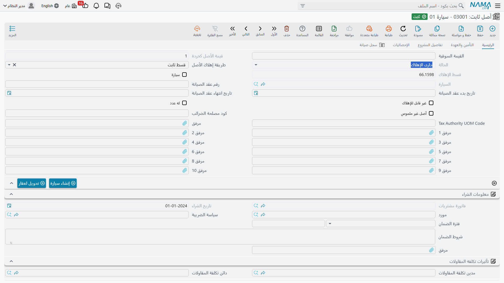
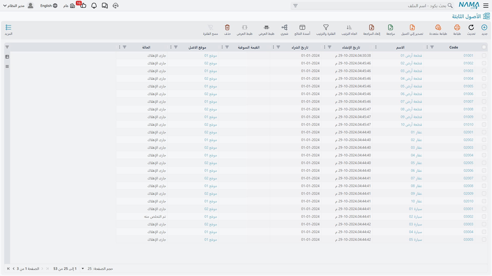

# حالات الأصل

حقل «الحالة» على الأصل الثابت كلمة واحدة، ولا يمكن كتابته، وهو يقرّر ما يُسمح لك بفعله أكثر مما يقرّره أي حقل آخر في البطاقة. ونصف أسئلة «النظام لا يسمح لي» في هذه الوحدة يجيب عنها النظر إليه.

والقيم خمس.

| الحالة | ماذا تعني |
|---|---|
| إبتدائى | مسجَّل ولم يدخل الخدمة بعد. البطاقة موجودة، وليس لها تكلفة ولا عمر ولا قسط. |
| جارى الإهلاك | حيّ. له تكلفة وعمر متبقٍّ، وكل دورة إهلاك ستلتقطه. |
| مهلك | استُنفد تمامًا — إما أن العمر المتبقي بلغ صفرًا وإما أن القيمة الدفترية بلغت قيمة الخردة. |
| غير قابل للإهلاك | معلَّم بأنه لا يُهلَك أبدًا. والأرض هي الحالة القياسية. |
| تم التخلص منه | خرج من الخدمة. ولن يمسّه شيء في الوحدة بعد ذلك. |

## كيف ينتقل الأصل بينها

يمرّ `MCH-0007` بأربع من الخمس في حياته، والانتقالات كلها تحرّكها المستندات.

**يولد إبتدائيًا.** سواء أنشأت الأصل بيدك أو أنشأه مستندٌ لك، يبدأ **إبتدائى**. وهو في هذه اللحظة قوقعة: هوية ونوع وحسابات وتصنيفات، بلا مال. والأصل الابتدائي خامل عن قصد — فهو ينتظر المستند الذي سيعطيه تكلفة.

**يدخل الخدمة.** يملأ **سند شراء أصل ثابت** (240,000، و60 شهرًا، وخردة 24,000، وبداية إهلاك 1 يناير 2026) أو **سند افتتاح أصل** التكلفةَ والعمرَ وتاريخَ بداية الإهلاك، فيصير الأصل **جارى الإهلاك** — إلا أن يكون معلَّمًا غير قابل للإهلاك، فيصير **غير قابل للإهلاك** ويبقى كذلك.

**يُهلَك.** كل دورة تُنقص العمر المتبقي واحدًا وتضيف إلى مجمع الإهلاك. وتبقى الحالة «جارى الإهلاك» ما دام في العمر بقية وفي القيمة فضل فوق قيمة الخردة.

**يُستنفَد.** فإذا بلغ العمر المتبقي صفرًا، أو هبطت القيمة الدفترية إلى قيمة الخردة، صار الأصل **مهلك** وصار قسطه صفرًا. وكان `MCH-0007` سيبلغ ذلك بعد ستين دورة، عند قيمة دفترية 24,000.

**يخرج.** **سند التخلص** — بيع 31 ديسمبر 2027 بمبلغ 200,000 — يجعل الأصل **تم التخلص منه**، وهنا تنتهي القصة.

واثنان من هذه الانتقالات يجريان إلى الوراء أيضًا:

- **إلغاء المستند الذي أدخل الأصل الخدمة يعيده إبتدائيًا.** فإلغاء اعتماد سند الشراء أو الافتتاح يفرّغ الأصل من جديد.
- **الأصل المهلك يمكن أن يعود إلى الحياة.** رَسمِل تطويرًا بسند إضافة، أو مدّ العمر المتبقي بسند خصائص، فتعود إليه قيمة وعمر — فترجع حالته **جارى الإهلاك** وتلتقطه الدورة التالية.

## ماذا تمنع كل حالة

هذا هو الجزء الجدير بالحفظ. اقرأه هكذا: «لا تستطيع أن تفعل كذا والأصل في حالة كذا».

| تريد أن… | إبتدائى | جارى الإهلاك | مهلك | غير قابل للإهلاك | تم التخلص منه |
|---|---|---|---|---|---|
| تُهلِكه | ✗ *«لا يمكن الإهلاك لأن الحالة إبتدائية»* | ✔ | ✗ *«الأصل … مهلك بالفعل»* | ✗ — غير القابل للإهلاك لا يُهلَك أبدًا | ✗ |
| يُجمَع تلقائيًا في سند إهلاك | ✗ يُتخطّى | ✔ | ✗ يُتخطّى | ✗ يُتخطّى | ✗ يُتخطّى |
| يُجمَع في سند إعادة تقييم | ✗ يُتخطّى | ✔ | ✔ | — | ✗ يُتخطّى |
| تسجّل إضافة أو استقطاعًا | ✗ | ✔ | ✔ | ✔ | ✗ |
| تسجّل تخلصًا جزئيًا | ✗ | ✔ | ✔ | ✔ | ✗ |
| تتخلص منه | ✗ — لا شيء لتتخلص منه | ✔ | ✔ | ✔ | ✗ |
| تختاره في سند افتتاح | ✔ | ✔ | ✔ | ✔ | ✗ مستبعَد من البحث |
| تعدّه في سند جرد | ✔ | ✔ | ✔ | ✔ | ✗ مستبعَد |

وثلاثة من هذه السطور تستحق جملة مستقلة.

**لا شيء يمسّ أصلًا متخلَّصًا منه.** وهذه ليست قاعدة في كل مستند على حدة، بل فحص واحد تجريه كل مستندات الأصول الثابتة قبل أن تمسّ أصلًا — *«لا يمكن عمل حركة على الأصل … لأنه تم التخلص منه»*. فإن جرى التخلص من أصل بالخطأ فالطريق هو عكس سند التخلص، لا الالتفاف حوله.

**الأصل الابتدائي لا يقبل شيئًا تقريبًا.** فالإضافات والاستقطاعات والتخلص الجزئي والإهلاك ترفضه كلها، لأنه لا توجد قيمة تُضاف إليها أو تُخصم منها أو تُستنفَد. والمستندات الوحيدة التي تقبل أصلًا ابتدائيًا هي المصمَّمة لإدخاله الخدمة: سند الشراء، وسند الافتتاح، وسند تكلفة الاعتماد المستندي.

**طريقة الإهلاك بوابة أيضًا.** فحتى الأصل السليم الجاري إهلاكه يرفضه سند الإهلاك إن كانت طريقته إعادة التقييم — فهذه الأصول يتولاها [سند إعادة التقييم](/ar/modules/fixedassets/depreciation/fixedassets-revaluation.md)، وهو طريق مختلف إلى النتيجة نفسها.

## استعمال الحالة فلترًا عمليًا

الحالة عمود مفهرس في السجل، فهي أسرع طريق للإجابة عن أسئلة نهاية الفترة.

- **رشِّح على «إبتدائى»** لتجد الأصول التي أنشأها أحدهم ولم يُدخلها الخدمة قط — بطاقات ستجلس صامتة خارج كل دورة إهلاك حتى يُرفع لها سند شراء أو افتتاح.
- **رشِّح على «جارى الإهلاك»** لترى المجتمع الذي ينبغي أن تجمعه دورة الإهلاك. فإن لم يطابق العدد سطور المستند فالفارق عادةً أصول تاريخ بداية إهلاكها بعد الفترة، أو أصول يحجزها [سند منع الإهلاك](/ar/modules/fixedassets/depreciation/fixedassets-prevent-depreciation.md).
- **رشِّح على «مهلك»** لتجد الأصول التي ما زالت قائمة في المصنع بلا قيمة دفترية — وهي المرشّح الطبيعي للتخلص أو لمدّ العمر.
- **رشِّح على «تم التخلص منه»** لتطابق ما خرج من السجل في الفترة مع ما يظهر في دفتر الأستاذ.

ولمعرفة ما تفعله الوحدة بكل مستند من هذه المستندات، ابدأ من [بطاقة الأصل الثابت](/ar/modules/fixedassets/master-files/fixedassets-asset-master.md) واتبع الروابط منها.
