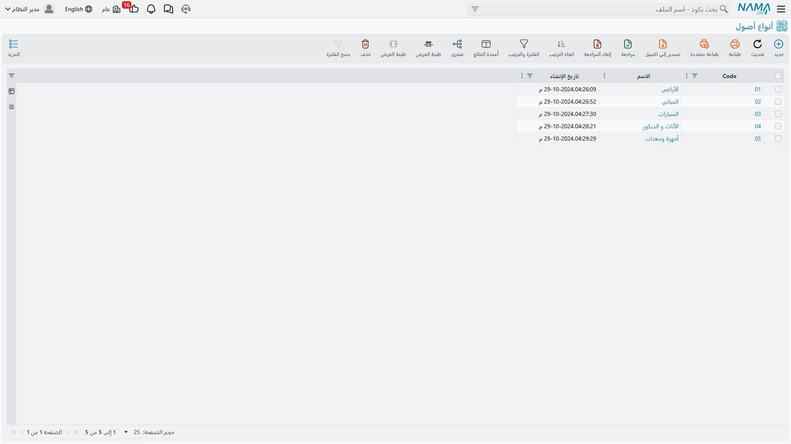

# أنواع الأصول الثابتة

تملك شركة الواحة للصناعات أربعين آلة. وكل واحدة منها يجب أن تُقيَّد على حساب التكلفة نفسه، وأن يُحمَّل إهلاكها على حساب المصروف نفسه، وأن يتراكم إهلاكها في الحساب المقابل نفسه. وكل واحدة منها يُتوقَّع أن تخدم خمس سنوات وأن تساوي عُشر ثمنها في نهايتها. وكتابة هذه القرارات أربعين مرة هي الطريق الذي تفسد به السجلات.

**نوع الأصل** موجود لتقرّرها مرة واحدة. هو القالب المحاسبي لعائلة من الأصول — آلات، سيارات، مبانٍ، حاسبات — وهو أول ملف يُعِدّه المدير المالي قبل أن يُنشئ أحد أصلًا واحدًا.

> نبني في هذه الصفحة النوع **`FAT-MCH` — آلات ومعدات**، وهو النوع الذي تنتمي إليه ماكينة القص `MCH-0007`.

| | |
|---|---|
| القائمة | **الأصول ← الملفات ← نوع أصل** |
| النوع | ملف رئيسي |
| كود الرخصة | `fixedassets` |

## ماذا يقرّر النوع فعلًا

شاشة النوع صفحة واحدة، وفيها أربعة أنواع مختلفة من القرارات. ويستحقّ الفصل بينها، لأن كلًّا منها يصل إلى الأصل من طريق مختلف وفي لحظة مختلفة.

### الحسابات

مجموعة **الحسابات الافتراضية** هي سبب وجود النوع أصلًا. تحمل خانات الحسابات نفسها التي يحملها الأصل، وتستعمل الوحدة ثلاثًا منها بالضبط:

| الخانة | الاسم على الشاشة | ماذا تفعل بها الوحدة |
|---|---|---|
| حساب الأصل | حساب الأصل | حساب التكلفة. يُجعل مدينًا عند الاقتناء ودائنًا عند التخلص. |
| حساب الإهلاك | حساب الإهلاك | حساب **مصروف** الإهلاك، يُجعل مدينًا في كل سند إهلاك. |
| حساب الإهلاك التراكمي | حساب الإهلاك التراكمي | الحساب المقابل، يُجعل دائنًا في كل سند إهلاك ويُصفَّى عند التخلص. |

وفي `FAT-MCH` هي `12310 آلات` و`51100 مصروف إهلاك — آلات` و`12319 مجمع إهلاك — آلات`.

وإلى جانبها ثلاث خانات أخرى (أخرى 1 و2 و3). لا تلجأ إليها وحدة الأصول الثابتة من تلقاء نفسها؛ فهي خانات احتياطية يمكن أن يُوجَّه إليها توجيه مستند إن احتاجت المنشأة حسابًا رابعًا أو خامسًا على الأصل. اعتبرها احتياطًا لا جزءًا من الإعداد القياسي.

وكل حساب تختاره هنا يجب أن يكون **حسابًا ذا حافظة تقبل الأصول الثابتة** — والبحث نفسه يفرض ذلك، فإن لم يظهر لك حساب تتوقعه فهذا هو السبب.

::: info لماذا تسكن الحسابات في الأصل لا في التوجيه
في معظم وحدات نما يقرّر توجيه المستند طرفَي القيد. أما الأصول الثابتة فمختلفة: طرف الأصل يُقرأ دائمًا من بطاقة الأصل نفسها، وهي ورثته من هذا النوع. أما التوجيه فيوفّر الطرف *الآخر* — المورد، والنقدية، وحسابات الأرباح والخسائر. ولهذا ينتج نوع الأصل الخالي من الحسابات أصولًا لا يمكن حفظها.
:::

### الافتراضات الخاصة بالإهلاك

حقلان يحملان توقّعات العائلة المعتادة:

| الحقل | الاسم على الشاشة | المعنى |
|---|---|---|
| العمر الافتراضي | العمر الافتراضي | عمر الخدمة، **معدودًا بالشهور** لا بالسنوات. وهو `60` في `FAT-MCH`. |
| قيمة الأصل كخردة | قيمة الأصل كخردة | ما يُتوقَّع أن يساويه الأصل عند انتهاء عمره. وهو `24,000` في `FAT-MCH`. |

وهذان الحقلان **افتراضان للمستندات** لا قيمتان تُكتَبان على الأصل. فاختيار `FAT-MCH` على سطر **سند شراء أصل ثابت** يملأ العمر الافتراضي وقيمة الخردة معًا على ذلك السطر. واختياره على سطر **سند افتتاح أصل** يملأ العمر الافتراضي، أما قيمة الخردة على سطر الافتتاح فتُكتب باليد. وفي الحالتين سطر المستند هو الذي يحمل الأرقام في النهاية، والمستند هو الذي يكتبها على الأصل — انظر [سند الشراء](/ar/modules/fixedassets/acquisition/fixedassets-purchase-document.md) و[الأرصدة الافتتاحية](/ar/modules/fixedassets/acquisition/fixedassets-opening-balances.md).

أما إنشاء أصل بيدك من السجل فلا يعطيه عمرًا افتراضيًا من نوعه. الأصل المصنوع باليد يبقى في حالته الابتدائية بلا عمر ولا قسط حتى يعطيه سند شراء أو سند افتتاح كليهما.

### مفاتيح السلوك

أربعة مفاتيح تصف سلوك العائلة، وتُنسَخ كلها إلى الأصل عند اختيار النوع:

| المفتاح | الاسم على الشاشة | أثره على الأصل |
|---|---|---|
| له عدد | له عدد | الأصل يمثّل عددًا من الوحدات المتماثلة، فينطبق عليه سجل الأعداد والتخلص الجزئي. وعشرة مكاتب متماثلة في بطاقة واحدة هي المثال الكلاسيكي. |
| غير قابل للإهلاك | غير قابل للإهلاك | العائلة لا تُهلَك أبدًا — والأرض هي المثال المعتاد. هذه الأصول لا تحتاج حسابات إهلاك ولا يجمعها سند إهلاك أبدًا. |
| سيارة | سيارة | أفراد العائلة مركبات، وهو ما يفتح الربط ببطاقة السيارة. |
| له تأمين | له تأمين | أفراد العائلة يُؤمَّن عليهم عادةً، فيُتوقَّع ملء صفحة التأمين على الأصل. |

### الترقيم

**مجموعة التكويد عند الإنشاء من الفواتير و افتتاح الأصول** هي المجموعة التي تُصنَّف تحتها الأصول الجديدة من هذه العائلة حين تُنشئها المستندات تلقائيًا، وهي التي تمنحها كودها. ويجب أن تكون مجموعة نهائية معرّفة للأصول الثابتة. اضبطها مرة واحدة فتخرج كل آلة تُشترى بسند شراء بكود من سلسلة الآلات.

### أنواع المكونات

جدول **أنواع المكونات** يعدّد الأجزاء القابلة للصيانة التي يحملها عادةً فرد من هذه العائلة. وهي في `FAT-MCH`: عمود الدوران، ووحدة التحكم، ومضخة التبريد.

والجدول قالب بكل معنى الكلمة: اختر `FAT-MCH` على أصل جديد فتظهر هذه السطور الثلاثة في جدول مكونات الأصل نفسه، جاهزة لتُعطى أرقامًا مسلسلة. انظر [المكونات وأنواع المكونات](/ar/modules/fixedassets/master-files/fixedassets-components.md).

## ماذا يحدث لحظة اختيار النوع

كل ما سبق يصل دفعة واحدة. افتح أصلًا ثابتًا جديدًا واختر `FAT-MCH`، فقبل أن تكتب شيئًا آخر تمتلئ الشاشة بـ:

1. الحسابات الثلاثة (وأي خانة احتياطية يحملها النوع)؛
2. مفاتيح: له عدد، وغير قابل للإهلاك، وسيارة، وله تأمين؛
3. جدول المكونات، سطر لكل نوع مكون على النوع؛
4. طرفَي تكلفة المقاولات، إن كانت وحدة المقاولات مثبَّتة.

والنسخ نفسه يجري على الخادم كلما أنشأ مستندٌ أصلًا نيابةً عنك، فالأصل المولود على سند شراء مُعَدّ تمامًا كالأصل الذي صنعته بيدك.

## تجاوز النوع على أصل بعينه

السؤال المتكرر: هل يجوز لأصل بعينه أن يخالف عائلته؟ نعم — مع تفصيلة يحسن معرفتها قبل المحاولة.

**يمكنك تجاوز أي حساب على الأصل نفسه.** ضع حساب مجمع إهلاك مختلفًا على `MCH-0007` فسيبقى كما وضعته. فقيمة النوع تُنسَخ إلى خانات حسابات الأصل عند كل حفظ، لكن إلى الخانات **الفارغة** فقط — والقيمة التي كتبتها لا تُستبدَل أبدًا.

**ولا يمكنك تفريغ حساب.** امسح حسابًا على الأصل واحفظ، فتعود قيمة النوع إليه فورًا، لأن النسخ نفسه — للفارغ فقط — يجري مرة أخرى عند الحفظ التالي مباشرة. فإن كان لا بد ألّا يوجد حساب البتّة، فاحذفه من نوع الأصل أو وجّه الأصل إلى نوع آخر.

والقاعدة نفسها مقروءة من الجهة الأخرى تجيب عن ثاني أكثر الأسئلة تكرارًا: **تغيير الحسابات على النوع لا يصل إلى الأصول الموجودة بالفعل.** فخاناتها ممتلئة، فيمرّ النسخ فوقها. الحساب الجديد على `FAT-MCH` سيظهر على الأصول التي تُنشأ بعده فقط، وعلى أي أصل ما زالت الخانة المقابلة فيه فارغة. وتصحيح عائلة كاملة بأثر رجعي عمل تحرير على الأصول، لا سطر واحد على النوع.

::: warning الأصل القابل للإهلاك لا يُحفَظ بغير حساباته الثلاثة
حساب الأصل وحساب الإهلاك وحساب الإهلاك التراكمي مطلوبة كلها قبل أن يُعتمد أصل قابل للإهلاك. وعمليًا يعني هذا أن النوع يجب أن يوفّرها، وإلا اضطُرّ من يُنشئ الأصل إلى كتابة الثلاثة في كل مرة.
:::

## ما لا يقرّره النوع

**طريقة الإهلاك.** لا يوجد حقل طريقة على النوع. كل أصل يولد على طريقة القسط الثابت، ويُحوَّل إلى إعادة التقييم — إن لزم — على بطاقة الأصل نفسها، وقبل أن تكون له أي حركة. انظر [كيف يعمل الإهلاك](/ar/modules/fixedassets/depreciation/fixedassets-depreciation-concepts.md).

**التصنيفات.** كل مستوى من مستويات التصنيف الخمسة يحمل نوعًا، لكنها موجودة للتجميع والتقارير؛ ولا توفّر حسابات ولا افتراضات من عندها. انظر [التصنيفات](/ar/modules/fixedassets/master-files/fixedassets-classifications.md).

**أي شيء مالي.** النوع لا يُقيّد شيئًا، ولا يحمل رصيدًا، ولا يمسّه مستند. يُقرأ لحظة إنشاء الأصل أو حفظه، وهذا كل شيء.

## إعداد FAT-MCH من أوله إلى آخره

1. **الأصول ← الملفات ← نوع أصل**، بطاقة جديدة. الكود `FAT-MCH`، والاسم العربي `آلات ومعدات`، والاسم الإنجليزي `Machinery & Equipment`.
2. العمر الافتراضي `60` — وتذكّر أنها ستون **شهرًا**.
3. قيمة الأصل كخردة `24,000`.
4. «له عدد» مغلق (كل آلة وحدة واحدة)، و«غير قابل للإهلاك» مغلق، و«سيارة» مغلق، و«له تأمين» مفتوح.
5. مجموعة التكويد عند الإنشاء: مجموعة `MCH`، فتخرج الآلات التي تنشئها المستندات بأكواد مثل `MCH-0007` و`MCH-0008`.
6. الحسابات الافتراضية: `12310 آلات`، و`51100 مصروف إهلاك — آلات`، و`12319 مجمع إهلاك — آلات`.
7. أنواع المكونات: `عمود الدوران` و`وحدة التحكم` و`مضخة التبريد`.
8. احفظ.

ومن هنا فصاعدًا تُنشأ أي آلة في الواحة باختيار `FAT-MCH` ولا شيء غيره: الحسابات والمفاتيح وسلسلة الأكواد وقائمة المكونات تتبعه كلها. والصفحة التالية تمشي في بطاقة الأصل التي تحطّ عليها هذه الإعدادات — [بطاقة الأصل الثابت](/ar/modules/fixedassets/master-files/fixedassets-asset-master.md).
