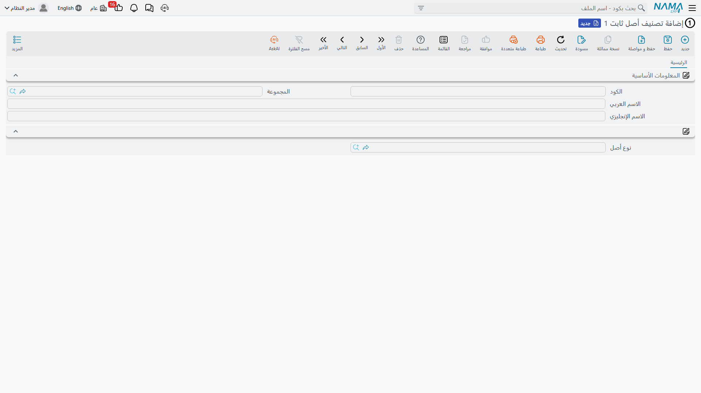
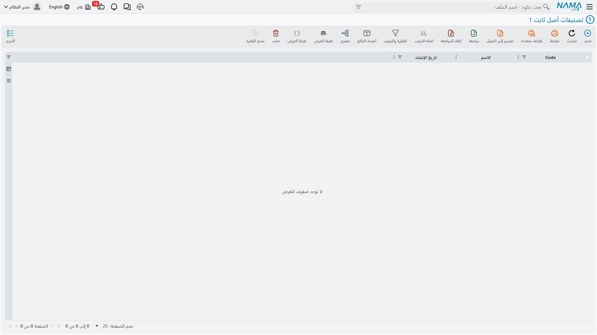

# تصنيفات الأصول الثابتة

لدى شركة الواحة للصناعات ثلاثمائة أصل ونوع أصل واحد لآلاتها كلها. وهذا حسن للمحاسبة — فكل آلة تُقيَّد على الحسابات الثلاثة نفسها — لكنه بلا فائدة لحظة يسأل مدير المصنع: كم استثمرت الشركة في معدات القص تحديدًا؟ أو حين تطلب شركة التأمين كشفًا بمعدات الإنتاج مقسّمًا على العائلات الفرعية.

ومستويات **تصنيف أصل ثابت** الخمسة موجودة لهذا بالضبط. خمسة ملفات رئيسية مستقلة يتسلسل بعضها في بعض، فتعطيك شجرة من خمسة مستويات تشرّح بها السجل.

| | |
|---|---|
| القائمة | **الأصول ← الملفات ← تصنيف أصل ثابت 1..5** |
| النوع | خمسة ملفات رئيسية |
| كود الرخصة | `fixedassets` |

## كن واضحًا فيما هي له

قبل إعدادها يحسن أن نقول بصراحة ما **لا** تفعله، لأن الاسم يوحي بأكثر مما يقدّمه النظام:

- **لا تحلّ الحسابات.** فلا قيد في الوحدة كلها ينظر إلى تصنيف. الحسابات تأتي دائمًا من الأصل، وهو ورثها من [نوعه](/ar/modules/fixedassets/master-files/fixedassets-asset-types.md).
- **ولا توفّر افتراضات.** فاختيار تصنيف لا يملأ عمرًا افتراضيًا ولا قيمة خردة ولا طريقة إهلاك ولا غير ذلك على الأصل.
- **ولا تغيّر سلوكًا.** فلا مستند ولا فحص ولا حساب يتصرّف تصرّفًا مختلفًا بسببها.

وما هي إذن؟ مجموعة من العناوين المفهرسة على بطاقة الأصل: شيء تجمّع به، وترشّح عليه، وتطبعه في تقرير، وتستعمله مدًى عند جمع الأصول في مستند. وهذا شيء نافع حقًّا، وهو كل ما هي.

## السلسلة

كل مستوى ملف رئيسي قائم بذاته، وكل مستوى من الثاني فما دون يشير إلى أبيه.

| الحقل | الاسم على الشاشة | موجود في |
|---|---|---|
| الكود | الكود | الخمسة |
| المجموعة | المجموعة | الخمسة |
| الاسم العربي / الاسم الإنجليزي | الاسم العربي / الاسم الإنجليزي | الخمسة |
| نوع أصل | نوع أصل | الخمسة |
| تصنيف أصل ثابت 1..4 | تصنيف أصل ثابت 1..4 | المستويات الأعلى، على المستويات التي تحتها |
| تصنيف الأعلى | تصنيف الأعلى | المستويات من 2 إلى 5 |

فبطاقة المستوى الثالث تسمّي نوعها وتصنيفها من المستوى الأول وأباها المباشر؛ وبطاقة المستوى الخامس تسمّي المستويات من 1 إلى 3 وأباها في المستوى الرابع. ولا تحمل هذه الشاشات مجموعة محددات — فهي بطاقات بحث خالصة.

وشجرة الواحة لماكينة القص تقرأ هكذا:

| المستوى | الكود | الاسم |
|---|---|---|
| 1 | `C1-PROD` | معدات إنتاج |
| 2 | `C2-CUT` | ماكينات قص |
| 3 | `C3-CNC` | تحكم رقمي |

## كيف تحطّ على الأصل

في الصفحة الرئيسية للأصل تجلس حقول التصنيف الخمسة تحت المعلومات الأساسية، وهي تملأ بعضها بعضًا. اختر `C3-CNC` في المستوى الثالث فيمتلئ المستويان الثاني والأول من أبوّة البطاقة نفسها، ومعهما نوع الأصل — ولا تحتاج أبدًا إلى النزول في الشجرة يدويًا.

وقاعدتان تسريان عند حفظ الأصل:

- **يجب أن تتماسك السلسلة.** فإن ملأتَ تصنيفًا والمستوى الذي فوقه، وجب أن يكون الأعلى هو الأب الحقيقي للأدنى. وضبط المستوى الثالث على `C3-CNC` والمستوى الثاني على شيء ليس أباه مرفوض.
- **ويجوز ترك مستويات فارغة.** فملء المستوى الثالث دون الأول مسموح. الشجرة تيسير لا إلزام — والشركة التي لا تريد إلا مستوى واحدًا من التجميع تستعمل المستوى الأول وتترك الباقي.

وحين يُنشئ مستندٌ أصلًا نيابةً عنك، تُنسَخ تصنيفات سطر المستند إلى الأصل الجديد، فينتج سند شراء لعشر آلات متماثلة عشر بطاقات مصنَّفة تصنيفًا واحدًا.

## أين تؤتي ثمرتها

**كمعايير للتقارير والقوائم.** المستويات الخمسة كلها حقول مرجع مفهرسة على الأصل الثابت، فهي متاحة معاييرَ وأعمدةً في كل موضع يُعرض فيه السجل أو يُطبع. و«أرِني كل أصل تصنيفه الأول معدات إنتاج، مجمَّعًا بالتصنيف الثاني» هو شكل السؤال الذي وُجدت له، وهو الطريق المعتاد لتضييق [تقارير الوحدة](/ar/modules/fixedassets/reports/fixedassets-reports.md).

**كمديات جمع على المستندات.** حين يجمع سند إهلاك أو إعادة تقييم الأصول التي سيعمل عليها، يقبل مدًى «من كود» و«إلى كود» على كل مستوى من المستويات الخمسة إلى جانب بقية الفلاتر. فتستطيع الواحة أن تُشغّل سند إهلاك لـ `C1-PROD` وآخر لأثاث المكاتب، فيبقى مراجعان أمام مجموعتين نظيفتين من السطور بدل مستند واحد بثلاثمائة سطر. انظر [تشغيل الإهلاك](/ar/modules/fixedassets/depreciation/fixedassets-depreciation-document.md).

**كتجميع في كشف الأصول.** ولأن التصنيف على الأصل لا على الحركة، يبقى سجل الأصول المطبوع بالتصنيف ثابتًا عبر الزمن — فنقل الآلة بين الإدارات يغيّر محدداتها لا تصنيفها.

## طريقة عملية للإعداد

قرِّر المستويات من أعلى إلى أسفل قبل أن تُنشئ أي بطاقة، وأبقِها ضحلة:

1. **المستوى الأول — العائلة التي يفكّر بها المدير.** معدات إنتاج، سيارات، مبانٍ، أجهزة مكتبية. من خمس إلى عشر بطاقات.
2. **المستوى الثاني — العائلة الفرعية التي يُسأل عنها.** ماكينات قص، مكابس، رافعات شوكية.
3. **المستوى الثالث فما دون — فقط إن كان هناك سؤال حقيقي يحتاجه.** ومعظم التركيبات تقف عند مستويين، ولا بأس في ذلك.

ولأن التصنيفات لا تغذّي شيئًا سوى الاختيار، فإن إضافة مستوى لاحقًا لا تكلّف إلا جهد تصنيف البطاقات القائمة؛ فلا شيء يُعاد حسابه ولا شيء يحتاج إعادة قيد. وهذا يجعلها أأمن جزء في الإعداد للبدء به صغيرًا — على عكس [أنواع الأصول](/ar/modules/fixedassets/master-files/fixedassets-asset-types.md)، حيث تكون الحسابات التي تختارها في اليوم الأول هي الحسابات التي سيستعملها كل قيد.
