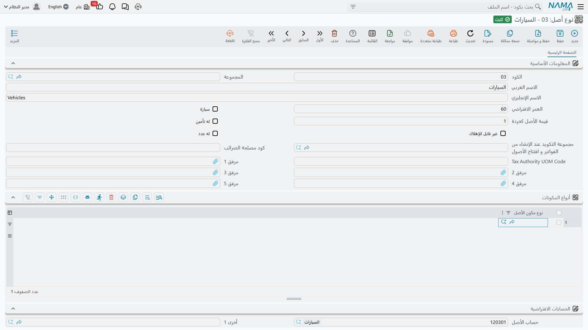

# المكونات وأنواع المكونات

ماكينة القص `MCH-0007` أصل واحد، وتكلفة واحدة، وجدول إهلاك واحد. لكنها ليست شيئًا واحدًا في نظر مهندس الصيانة: فعمود الدوران يُخدم كل ربع سنة، ووحدة التحكم تُفحص سنويًا، ومضخة التبريد تُستبدل عند عطبها. وتسجيل ذلك كله على «الماكينة» يضيّع المعلومة الوحيدة التي تهمّ المهندس — أي جزء صِين، ومتى موعد الجزء القادم.

و**المكونات** هي الطريقة التي تحفظ بها الوحدة هذا التفصيل. فكل أصل يحمل جدولًا بأجزائه القابلة للصيانة، ولكل جزء رقمه المسلسل وتاريخ صيانته وتاريخ استحقاقه القادم.

::: info المكونات لا تحمل مالًا
المكوّن ليس أصلًا أصغر. فلا تكلفة له ولا قيمة ولا إهلاك من عنده — بل لا يوجد على السطر حقل مبلغ أصلًا. فـ 240,000 تخصّ الماكينة. والمكونات موجودة لتُسجَّل الصيانة على جزء، لا لشيء آخر. فإن استُبدل مكوّن استبدالًا يستحق الرسملة حقًّا، فتلك [إضافة](/ar/modules/fixedassets/depreciation/fixedassets-additions-and-deductions.md) على الأصل، لا تعديل في هذا الجدول.
:::

## دليل أنواع المكونات

**نوع مكون أصل** هو التعريف القابل لإعادة الاستعمال لصنف من الأجزاء — عمود دوران، وحدة تحكم، مضخة تبريد، محرك، ضاغط، موتور مصعد.

| | |
|---|---|
| القائمة | **الأصول ← الملفات ← نوع مكون أصل** |
| النوع | ملف رئيسي |
| كود الرخصة | `fixedassets` |

تحمل الشاشة الكود والمجموعة والاسمين، ثم جدولًا واحدًا هو العامل الحقيقي: **أنواع الصيانة**. وكل سطر فيه يسمّي [نوع صيانة](/ar/modules/fixedassets/maintenance/fixedassets-maintenance-types.md) يمكن أن يخضع له هذا الصنف من الأجزاء.

وفي بطاقة الواحة `CT-SPINDLE — عمود الدوران` تحمل هذه القائمة **صيانة دورية** و**إصلاح طارئ**. والأثر قائمةٌ أقصر وأأمن في كل موضع يُختار فيه نوع صيانة لعمود دوران — وفحصٌ عند الاعتماد، فيُرفض السجل الذي يسمّي نوع صيانة لا يقبله نوع المكون برسالة *«نوع الصيانة … لا ينتمي إلى نوع مكون الأصل …»*.

أما نوع المكوّن الذي جدول أنواع صيانته فارغ فلا يفرض قيدًا البتّة؛ كل شيء مسموح.

## وضع المكونات على الأصل

قلّما تملأ الجدول على الأصل بيدك. فـ **نوع الأصل** يحمل جدول أنواع مكوناته، واختيار النوع على الأصل ينشر تلك القائمة في مكوّنات الأصل.

ولأن `FAT-MCH — آلات ومعدات` يعدّد عمود الدوران ووحدة التحكم ومضخة التبريد، تصل كل آلة تُنشأ بهذا النوع وفيها السطور الثلاثة جاهزة. ومن هناك تضيف أو تحذف أو تحرّر بما يطابق الآلة الفعلية.

| العمود | الاسم على الشاشة | من يملؤه |
|---|---|---|
| نوع مكون الأصل | نوع مكون الأصل | أنت (أو نوع الأصل). مطلوب. |
| نوع الصيانة | نوع الصيانة | أنت. والقائمة المعروضة محصورة في أنواع الصيانة التي يقبلها نوع المكوّن المختار. |
| الرقم المسلسل | الرقم المسلسل | أنت — الرقم المسلسل للجزء نفسه، وهو غالبًا الرقم المهمّ عند المطالبة بالضمان. |
| تاريخ بدء الصيانة | تاريخ بدء الصيانة | سجل الصيانة. |
| تاريخ انتهاء الصيانة | تاريخ انتهاء الصيانة | سجل الصيانة. |
| تاريخ الصيانة التالية المتوقعة | تاريخ الصيانة التالية المتوقعة | سجل الصيانة. |

والثلاثة الأخيرة تُختم على السطر حين تُسجَّل زيارة صيانة، وهو مقصد الجدول كله — كما في الفقرة التالية.

**وقاعدة واحدة عند الحفظ:** لا يجوز أن يتكرر الجمع بين نوع المكون ونوع الصيانة في الجدول. فسطران يقولان «عمود الدوران / صيانة دورية» مرفوضان برسالة *«نوع مكون الأصل … مكرر»*. فإن كان في الآلة عمودا دوران حقًّا فميّز بينهما بنوع صيانة مختلف لكل سطر، أو سجّل الثاني بنوع مكوّن خاص به.

## لماذا يجب ملء الجدول قبل تسجيل أي صيانة

هذه هي القاعدة العملية التي تُعثِر التركيبات الجديدة، وتستحق أن تُقال صريحة:

> **لا يمكن اعتماد سجل صيانة ولا طلب سجل صيانة لأصل لا مكوّنات له.** فالسجل يسمّي نوع مكوّن، وهذا النوع يجب أن يكون موجودًا في جدول الأصل. وتركه فارغًا يفشل كذلك.

فترتيب الإعداد إذن: أنواع المكونات ← قائمة المكونات على نوع الأصل ← الأصول ← ثم الصيانة. والمهندس الذي يفتح سجل صيانة لآلة جدولها فارغ سيُوقَف برسالة *«نوع مكون الأصل … لا ينتمي إلى الأصل الثابت …»*، والعلاج على الأصل لا على السجل.

## ماذا تكتب زيارة الصيانة عائدةً

تسجيل [سجل الصيانة](/ar/modules/fixedassets/maintenance/fixedassets-maintenance-records.md) يغلق الدائرة. فحين تُعتمد خدمة الواحة الربعية على عمود دوران `MCH-0007` — تاريخ البدء 1 أبريل 2026، وتاريخ الانتهاء 1 أبريل 2026، والصيانة التالية المتوقعة 30 يونيو 2026 — تجد الوحدة السطر المطابق في جدول المكونات وتكتب عليه:

- تاريخ بدء الصيانة،
- وتاريخ انتهاء الصيانة،
- وتاريخ الصيانة التالية المتوقعة،
- ورابطًا إلى السجل نفسه.

وإلغاء السجل يمسح الأربعة، وتعديله ينقل التواريخ إلى قيمها الجديدة.

والنتيجة أن جدول المكونات على الأصل يصير لوحة حالة حيّة: لكل جزء من الماكينة، متى صِين آخر مرة ومتى يستحق التالية. وهذا — لا محرّك جدولة — هو ما يعطيه لك جانب الصيانة في الأصول الثابتة: تاريخ الاستحقاق القادم ملاحظة كتبتها آخر زيارة، لا مهمة ستنطلق من تلقاء نفسها. انظر [كيف تعمل الصيانة](/ar/modules/fixedassets/maintenance/fixedassets-maintenance-overview.md).

## الإجراءات في هاتين الشاشتين

ليس في دليل أنواع المكونات أزرار خاصة به، ولا في جدول المكونات على الأصل — فلا يوجد زر *انسخ المكونات
من النوع*، ولهذا يجب ملء الجدول لكل أصل على حدة. والشيء الوحيد الذي يملأ نفسه هو الاتجاه المعاكس:
فسجل الصيانة المعتمد يكتب تاريخي آخر زيارة والزيارة القادمة عائدين إلى سطر المكوّن.

## إعداد الواحة لماكينة القص

1. أنشئ ثلاثة أنواع مكونات: `CT-SPINDLE — عمود الدوران`، و`CT-CTRL — وحدة التحكم`، و`CT-PUMP — مضخة التبريد`. وعدِّد في كل منها أنواع الصيانة التي يقبلها — صيانة دورية للثلاثة، مع إصلاح طارئ على العمود والمضخة.
2. على نوع الأصل `FAT-MCH`، أضف أنواع المكونات الثلاثة إلى جدول أنواع المكونات.
3. أنشئ `MCH-0007` واختر `FAT-MCH`، فتظهر السطور الثلاثة.
4. اكتب الرقم المسلسل لكل جزء على سطره، واختر **صيانة دورية** نوعَ صيانة على سطر عمود الدوران.
5. احفظ. ومن الآن تستطيع [خطة صيانة](/ar/modules/fixedassets/maintenance/fixedassets-maintenance-plans.md) الماكينة أن تجدول زيارات على عمود الدوران، وكل زيارة منجزة تختم تواريخها عائدةً على ذلك السطر.
