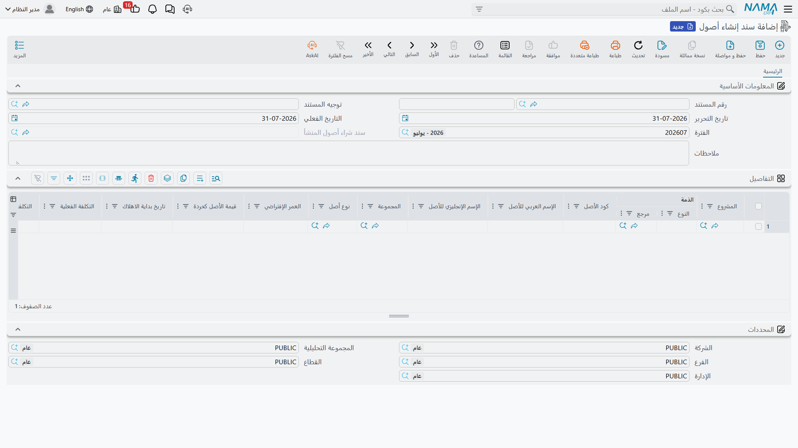

# سند إنشاء أصول

تقضي شركة مقاولات سنةً في بناء مستودع. تتراكم التكاليف على المشروع — مواد ومقاولو باطن وإشراف — ثم تقرّر الشركة ألّا تسلّمه لعميل بل أن تحتفظ به وتستعمله. في تلك اللحظة يجب أن يتوقّف المستودع عن كونه مشروعًا وأن يصير أصلًا ثابتًا في دفاتر الشركة نفسها، له كود وعمر وتاريخ لبداية الإهلاك.

و**سند إنشاء أصول** هو المستند الذي يقول هذه الجملة. وهو ليس شاشة عامة لإنشاء الأصول جملةً: هو مستند رسملة المقاولات، وهو المستند الوحيد في الأصول الثابتة الذي يعرف ما المشروع.

| | |
|---|---|
| القائمة | **الأصول ← الملفات ← سند إنشاء أصول** |
| النوع | مستند — له دفتر وتوجيه وتاريخ تحرير وتاريخ فعلي وفترة مالية — تضعه القائمة تحت «الملفات» |
| كود الرخصة | **`contracting`** |

::: warning هذا المستند يحتاج رخصة المقاولات
وحده من بين بنود قائمة الأصول، هذا المستند محكوم برخصة **`contracting`** لا برخصة من رخص الأصول الثابتة. فالعميل الذي اشترى الأصول الثابتة ولم يشترِ المقاولات لن يجد `سند إنشاء أصول` في القائمة أصلًا. وهذا متّسق مع وظيفة المستند — فعموده المحوري مشروع مقاولات، وبغير المقاولات لا شيء يُوضع فيه.
:::

> تُنهي شركة الواحة للصناعات مشروع **`P-2026-014` — مستودع الرياض** وتحتفظ به. فيصير المستودع الأصل **`BLD-0003`**، نوعه **مبانٍ**، وعمره الافتراضي **300 شهر**، وقيمته كخردة **250,000**، وبداية إهلاكه **1 أكتوبر 2026**. وإجمالي تكلفة المشروع: **8,400,000**.

## من أين يأتي المستند

الطريق المقصود ليس القائمة. ففي شاشة **المشروع** في وحدة المقاولات زرّ **إنشاء سند أصل ثابت**، يفتح سند إنشاء أصول جديدًا في نافذة منبثقة وفيه سطر واحد يشير بالفعل إلى المشروع الذي كنت تنظر إليه. فتكمل بيانات الأصل وتحفظ.

والوصول إلى المستند من قائمة الأصول واختيار المشروع بيدك يفعل الشيء نفسه بالضبط — فالزرّ اختصار لا عملية أخرى.

## الشاشة

### الرأس

رأس المستند المعتاد — رقم المستند (الدفتر والكود)، و**توجيه المستند**، وتاريخ التحرير، والتاريخ الفعلي، والفترة، والملاحظات. والتاريخ الفعلي هو المهم: فهو الذي يُنسَخ إلى سند الشراء الذي يولّده هذا المستند.

وحقل واحد في الرأس مخرَج لا مدخل: **سند شراء أصول المنشأ** يعرض سند الشراء الذي أنتجه هذا المستند عند اعتماده. وقبل ذلك يكون فارغًا.

### جدول التفاصيل

سطر لكل أصل سيُنشأ.

| العمود | الاسم على الشاشة | ماذا يفعل |
|---|---|---|
| المشروع | المشروع | مشروع المقاولات الذي تجري رسملته. وهو محور المستند كله. |
| كود الأصل | كود الأصل | الكود الذي سيحمله الأصل الجديد — `BLD-0003`. واتركه فارغًا فيُكوَّد الأصل تلقائيًا من مجموعة التكويد على نوعه. |
| الإسم العربي للأصل / الإسم الإنجليزي للأصل | الإسم العربي للأصل / الإسم الإنجليزي للأصل | اسما الأصل الجديد. |
| المجموعة | المجموعة | المجموعة التي يُصنَّف الأصل تحتها، وتُستعمل حين لا يحمل النوع مجموعة تكويد. |
| نوع أصل | نوع أصل | أهم عمود: يمنح الأصل الجديد حساباته ومجموعة تكويده ومفاتيح «له عدد» و«سيارة» و«له تأمين» و«غير قابل للإهلاك». انظر [أنواع الأصول الثابتة](/ar/modules/fixedassets/master-files/fixedassets-asset-types.md). |
| العمر الإفتراضي | العمر الإفتراضي | بالـ**شهور**. وهو `300` للمستودع. |
| قيمة الأصل كخردة | قيمة الأصل كخردة | `250,000`. |
| تاريخ بداية الاهلاك | تاريخ بداية الاهلاك | `01/10/2026`. |
| الأصل الثابت | الأصل الثابت | مخرَج — الأصل الذي أنشأه السطر. واملأه مقدَّمًا فيُحدَّث ذلك الأصل القائم بدل إنشاء أصل جديد. |

وتحت الجدول مجموعة المحددات المعتادة.

ولا توجد أزرار في هذه الشاشة. فلا شيء يُجمَع ولا شيء يُولَّد بالطلب — كل شيء يقع عند الاعتماد.

## القاعدة الوحيدة التي يفرضها

**أصل ثابت واحد لكل مشروع.** فعند الاعتماد يفحص المستند هل يشير أصل آخر في قاعدة البيانات إلى المشروع المكتوب في السطر، ويرفض إن وجد — *«يوجد أصل آخر … يعتمد على هذا المشروع …»*.

والفحص يعمّ قاعدة البيانات كلها بصرف النظر عن الشركة أو الفرع، فالأصل التابع لشركة أخرى يوقفك أيضًا. وهذا مقصود: فمقصد المستند أن يقول «هذا المشروع صار ذلك الأصل»، وهي جملة لا تصحّ إلا مرة واحدة.

## ماذا يجب أن يحمل التوجيه

[توجيه](/ar/modules/fixedassets/document-terms/fixedassets-terms-acquisition.md) هذا المستند فيه إعدادان اثنان فقط، وكلاهما مطلوب:

| حقل التوجيه | الاسم على الشاشة | ما هو |
|---|---|---|
| دفتر شراء أصل ثابت | دفتر شراء أصل ثابت | دفتر سند شراء الأصل الثابت الذي يولّده هذا المستند. |
| توجيه شراء أصل ثابت | توجيه شراء أصل ثابت | توجيه سند الشراء المولَّد — وهنا تسكن كل الإعدادات المحاسبية الحقيقية. |

واترك أيًّا منهما فارغًا يقف الاعتماد برسالة تطالبك بملء دفتر سند الشراء وتوجيهه في توجيه هذا المستند.

وللدفتر الذي تختاره أثر يستحق التفكير مقدَّمًا. فإن كان دفترًا عاديًا كان سند الشراء المولَّد مستندًا عاديًا قابلًا للتحرير. وإن كان دفترًا نظاميًا صار المستند المولَّد مقفلًا كسجل نهائي لا يُفتح ولا يُعدَّل بعد ذلك. والفقرة التالية تشرح لماذا يهمّ هذا الاختيار أكثر مما يبدو.

## ماذا يفعل الاعتماد فعلًا

مرحلتان، بهذا الترتيب.

**المرحلة الأولى — بطاقة أصل لكل سطر.** يُنشأ لكل سطر أصل ثابت يحمل الأسماء التي كتبتها والكود من السطر وكل ما يوفّره نوع الأصل: الحسابات (في الخانات التي ما زالت فارغة)، ومجموعة التكويد، ومفاتيح السلوك الأربعة. ويُربط الأصل الجديد بالمشروع، وتكون حالته **إبتدائى**.

وفي الوقت نفسه يُملأ جدول **بنود المشروع** على الأصل: تُقرأ كل عقود المشروع، ويصير كل بند عقد معلَّم بالانتقال إلى الأصل سطرًا يحمل كود البند والبند القياسي والوصف وتاريخَي الضمان. وفي `P-2026-014` ينقل ذلك ضمان الإنشاءات وضمان الأعمال الكهروميكانيكية من العقد `PC-2026-041`. ويمكن إعادة هذا الجمع لاحقًا من زرّ **تحديث بنود المشروع** على الأصل — انظر [بطاقة الأصل الثابت](/ar/modules/fixedassets/master-files/fixedassets-asset-master.md).

**المرحلة الثانية — سند شراء واحد مولَّد للمستند كله.** تُنشئ الوحدة [سند شراء أصل ثابت](/ar/modules/fixedassets/acquisition/fixedassets-purchase-document.md) في الدفتر والتوجيه المأخوذين من توجيه سند الإنشاء، وتنسخ إليه التاريخ الفعلي وتاريخ التحرير والفترة والمحددات والملاحظات، وتبني سطر شراء لكل سطر إنشاء، ثم **تعتمده**. ولا يُترك مسودةً أبدًا.

وسند الشراء المولَّد هذا هو الذي يُدخل الأصول الخدمة فعلًا:

- تنتقل الحالة من «إبتدائى» إلى **جارى الإهلاك**، أو إلى **غير قابل للإهلاك** إن كان النوع كذلك؛
- ويُضبط تاريخ الشراء على تاريخه الفعلي، ويشير حقل «فاتورة مشتريات» على الأصل إليه؛
- ويُكتب على الأصل العمر الافتراضي والعمر المتبقي وقيمة الخردة وتاريخ بداية الإهلاك.

ويظهر المؤشر إليه في حقل **سند شراء أصول المنشأ** في الرأس.

## وهو لا يضبط تكلفة الأصل

هذا هو الجزء الذي يُخطَّط له، ومعرفته قبل الاعتماد خير من معرفته بعده.

ليس في جدول سند الإنشاء سعر. وتكلفة اقتناء الأصل تأتي من السعر المكتوب على سطر الشراء، وسند الإنشاء ليس فيه عمود يغذّيه — فـ**الأصول التي ينشئها تصل بتكلفة صفر**. فـ `BLD-0003` يُنشأ، ويصير جاري الإهلاك، وله عمر 300 شهر وقيمة خردة 250,000، وليس على حساب تكلفته شيء. ولو تُرك هكذا لما أهلك شيئًا ذا معنى.

فلا بد أن تصل الـ 8,400,000 إلى الأصل بأحد طريقين، وتختار بينهما حين تختار الدفتر في التوجيه:

1. **سعِّر سند الشراء المولَّد.** افتح سند شراء الأصل الذي أنتجه الاعتماد، واكتب القيمة على السطر، ثم أعِد اعتماده. وهذا هو الطريق الطبيعي، لأنه يضع التكلفة حيث يُعمل القيد — وهو متاح فقط حين يكون دفتر الشراء في التوجيه دفترًا عاديًا. فاختر دفترًا عاديًا إن كنت تنوي العمل بهذه الطريقة.
2. **أضف القيمة بعد ذلك بسند إضافة.** ارفع [سند إضافة و إستبعاد](/ar/modules/fixedassets/depreciation/fixedassets-additions-and-deductions.md) على `BLD-0003` بمبلغ 8,400,000. وهذا يعمل مهما كان الدفتر، وهو الطريق حين يكون سند الشراء المولَّد مقفلًا بدفتر نظامي.

وفي الحالتين يحطّ الحساب حيث تتوقّع: بتكلفة 8,400,000 وقيمة خردة 250,000 وعمر 300 شهر يُهلَك المستودع

> (8,400,000 − 250,000) ÷ 300 = **27,166.67** لكل فترة

اعتبارًا من أكتوبر 2026.

فاعتبر سند الإنشاء إذن المستند الذي *يعرّف* الأصل — كوده ونوعه وعمره ومشروعه وضماناته — واعتبر سند الشراء أو سند الإضافة المستند الذي *يقوّمه*.

## المحاسبة والتعديل والإلغاء

**سند الإنشاء لا يُقيّد شيئًا بنفسه.** فكل الأثر المحاسبي يأتي من سند الشراء المولَّد، بالحسابات المضبوطة على توجيه الشراء — وهي عادةً حساب تكلفة الأصل في مقابل حساب الدائنين أو حساب المشروعات تحت التنفيذ المختار هناك. وهل يظهر ذلك القيد فورًا أم على هيئة طلب أعمال يُعالَج في الخلفية فيقرّره توجيه الشراء كذلك.

و**تعديل** سند الإنشاء يعيد تشغيل العملية كلها: تُحدَّث الأصول ويُعاد بناء سند الشراء المولَّد في مكانه.

و**إلغاؤه** يحذف سند الشراء المولَّد والأصول التي أنشأها. وهذا هو السلوك الصحيح مع خطأ، والخطِر مع مستند دخل الخدمة، فتعامل مع الإلغاء على أنه تراجع عن اعتماد وقع سهوًا لا وسيلة لتصحيح أصل حيّ.

## أمران يُخلط بينه وبينهما

**ليس هو طريقة تسجيل شراء من مورد.** فشراء آلة من شركة الخليج لتجارة الآلات [سند شراء أصل ثابت](/ar/modules/fixedassets/acquisition/fixedassets-purchase-document.md)، وهو يحمل سعرًا ويقيّد على المورد. ولا تستعمل سند الإنشاء إلا حين يكون الأصل قد خرج من مشروع بنيته بنفسك.

**وليس هو ما يولّده سند التخلص.** فسند التخلص قد يعترف بأصول جديدة استُخلصت من الأصل الخارج — وحدة فرعية ما زالت صالحة، أو مركبة بديلة في صفقة استبدال — والذي يولّده لها هو **سند شراء أصل ثابت**، لا سند إنشاء أصول. انظر [التخلص من الأصل](/ar/modules/fixedassets/disposal/fixedassets-disposal.md).

وأخيرًا، لا يُشحن نموذج طباعة لهذا المستند. فإن احتجت ورقة تثبت الرسملة فاطبع سند الشراء المولَّد بدلًا منه — انظر [نماذج الطباعة](/ar/modules/fixedassets/reports/fixedassets-print-forms.md).
