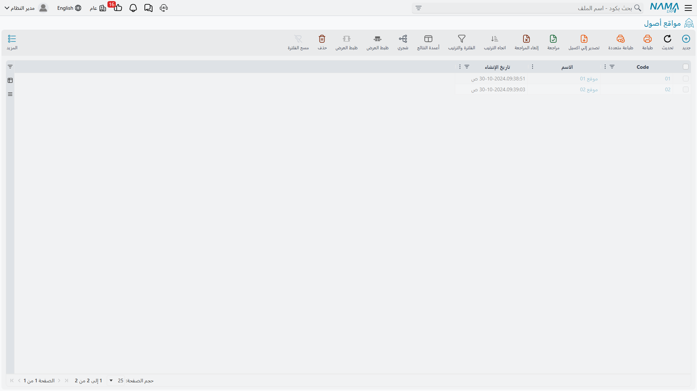

# مواقع الأصول

سجل أصول لا يستطيع أن يقول لك أين تقف الآلة نصف سجل. وملف **موقع أصول** هو المفردات التي تجيب بها الوحدة عن هذا السؤال — شجرة من الأماكن المادية، من الموقع كله نزولًا إلى الغرفة.

| | |
|---|---|
| القائمة | **الأصول ← الملفات ← موقع أصول** |
| النوع | ملف رئيسي هرمي |
| كود الرخصة | `fixedassets` |

وتحتفظ شركة الواحة للصناعات بشجرة صغيرة:

```
RIYADH — مصنع الرياض
   ├── LOC-R1 — مصنع الرياض – صالة 1
   ├── LOC-R2 — مصنع الرياض – صالة 2
   └── LOC-R3 — مصنع الرياض – صالة 3
JEDDAH — فرع جدة
```



## البطاقة نفسها

الشاشة نحيفة عن قصد — فالموقع عنوان له موضع في شجرة، ولا شيء غير ذلك.


| الحقل | الاسم على الشاشة | ملاحظات |
|---|---|---|
| الكود | الكود | `LOC-R2`. |
| المجموعة الأعلى | المجموعة الأعلي | الموقع الذي يعلو هذا الموقع. وتركه فارغًا يجعل البطاقة جذرًا. |
| الاسم العربي / الاسم الإنجليزي | الاسم العربي / الاسم الإنجليزي | الاسم العربي أولًا ثم الإنجليزي. |
| الوصف 1 / الوصف 2 | الوصف 1 / الوصف 2 | نص حر — رقم بائكة، أو بوابة، أو مرجع في المخطط. |
| المحددات | الشركة، المجموعة التحليلية، الفرع، القطاع، الإدارة | محددات البطاقة. |

ولا فحص على البطاقة ولا سلوك خلفها. ابنِ الشجرة عميقة أو مسطّحة بحسب ما يحتاجه مصنعك؛ فالوحدة لا تمشي فيها، إنما تسجّل على أي عقدة يقف الأصل.

::: tip المواقع ليست محددات
يغري المرء أن يصوغ الفروع والإدارات مواقعَ. لا تفعل — فالأصل يحمل محدداته الخمسة أصلًا، وهي التي يستعملها دفتر الأستاذ. الموقع مكان مادي، وتغييره وحده لا يُقيّد شيئًا. استعمل المحددات للصورة المحاسبية والمواقع لمخطط المصنع.
:::

## حقل الموقع على الأصل لا يُكتب

افتح `MCH-0007` تجد **موقع الاصل** في الصفحة الرئيسية يعرض `LOC-R2` — ولا سبيل إلى تحريره. فالموقع، كسائر الأجزاء المتحرّكة في البطاقة، تكتبه المستندات.

وتحتفظ الوحدة تحت ذلك بـ **تاريخ مواقع**: سطر لكل انتقال، يسجّل من أين جاء الأصل، وإلى أين ذهب، وبأي تاريخ، وبأي مستند. والحقل على الأصل ما هو إلا وجهة أحدث سطر.


والتاريخ موجود في صفحة الإحصائيات على هيئة قائمة **مواقع الأصل الثابت**، وفيها تاريخ الإنشاء والتاريخ الفعلي والموقع «من» والموقع «إلى» والمستند الذي سبّب الحركة.

## أي المستندات يكتبه

أربعة مستندات تضع سطورًا في هذا التاريخ:

| المستند | ماذا يسجّل |
|---|---|
| **سند شراء أصل ثابت** | أول موقع للأصل — حيث يقول سطر الشراء إنه سُلِّم. وهكذا وصل `MCH-0007` إلى الصالة 2 في 1 يناير 2026. |
| **سند افتتاح أصل** | الشيء نفسه، للأصول القادمة من نظام سابق. |
| **سند نقل الأصل** | كل انتقال بعد ذلك. وهو المستند الذي تضع به الماكينة في الصالة 3. |
| **سند تكلفة الاعتماد المستندي** | موقع حطّ الآلات المستوردة، لحظة تسوية تكلفتها. |

ومستند خامس يمسّ الحقل دون أن يكتب تاريخًا: **مستند استلام الأصل** يضبط موقع الأصل من سطره ضمن التوقيع على الاستلام. فهو يسجّل من استلم الأصل وأين ذهب، ولا يُقيّد شيئًا.

ومستندان يبدوان وكأنهما ينقلان الأصل وهما لا ينقلانه: **سند خروج أصول** و**سند رجوع أصول** يُرسلان وحدات معدودة خارج المنشأة مؤقتًا ثم يعيدانها، ولا يعدّلان إلا العدادات. أما موقع الأصل وإهلاكه فيمضيان بلا تغيير. انظر [خروج الأصول ورجوعها](/ar/modules/fixedassets/movement/fixedassets-movement-in-out.md).

## نقل MCH-0007 من الصالة 2 إلى الصالة 3

النقل نفسه **سند نقل أصل**: الأصل، من `LOC-R2`، إلى `LOC-R3`، بتاريخ فعلي. وعند الاعتماد:

1. يُضاف سطر جديد إلى تاريخ المواقع — من `LOC-R2` إلى `LOC-R3`، بتاريخ اليوم، باسم هذا السند.
2. يصير حقل **موقع الاصل** على الأصل `LOC-R3`.
3. **ولا يُقيَّد شيء.** فلا الشركة تغيّرت، ولا محدِّد محاسبي، ولا أي من حسابات الأصل الثلاثة — فليس هناك قيد يُعمل. النقل المكاني الخالص مجاني.

والنقطة الثالثة هي التي تفاجئ الناس، وتستحق أن تُحمل معك: سند النقل ليس مستند *موقع*، بل مستند يستطيع أن يغيّر الموقع والمحددات والحسابات ومسؤول العهدة دفعة واحدة — ولا يقيّد شيئًا إلا حين يصل التغيير إلى المحاسبة. والصورة الكاملة، وفيها ما يحدث حين تنتقل الماكينة إلى شركة أخرى، في [نقل الأصل](/ar/modules/fixedassets/movement/fixedassets-transfer-document.md).

::: info النقل بتاريخ سابق
الموقع على الأصل هو وجهة **أحدث** سطر فيه. فإن سجّلت نقلًا بتاريخ سابق لانتقال مسجَّل بالفعل، كسب التاريخُ سطره في موضعه الصحيح ولم يتغيّر موقع الأصل الحالي — وهو الصواب، لأن انتقالًا لاحقًا قرّر بالفعل أين تقف الماكينة الآن.
:::

## قراءة التاريخ

ولأن كل سطر يسمّي مستنده، فإن قائمة المواقع في صفحة الإحصائيات أسرع أثر تدقيقي في الوحدة. فالآلة التي ظهرت في الصالة الخطأ على بعد نقرة واحدة من سند النقل الذي وضعها هناك؛ والآلة التي تاريخها فارغ لم يمنحها سند شرائها موقعًا قط، وهذه هي الشكوى الحقيقية عادةً خلف عبارة «حقل الموقع فارغ ولا أستطيع ملأه».

والعلاج في هذه الحالة ليس على الأصل. العلاج سند نقل ينقل الماكينة إلى حيث هي فعلًا.
