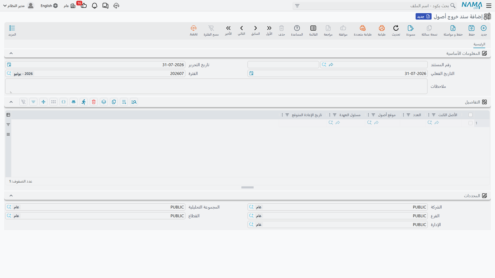
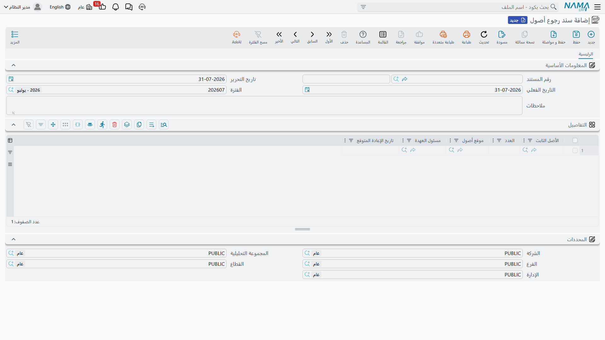

# خروج الأصول من المنشأة ورجوعها

تشارك شركة الواحة للصناعات في معرض تجاري بالدمام. فتخرج ثلاثة من المكاتب العشرة المسجَّلة تحت الأصل
`FRN-0021` على الشاحنة في الأول من مارس، وتعود يوم العاشر. لم تُبَع، ولم يُعَد إسنادها، بل لم تنتقل
بأي معنى يعني سجل الأصول — إنما كانت تسعة أيام **خارج المنشأة** فحسب.

هذا هو كل الغرض من المستندين في هذه الصفحة. **سند خروج أصول** يسجّل خروج وحدات، و**سند رجوع أصول**
يسجّل رجوعها. وبينهما يحفظان رقماً واحداً: كم وحدة من هذا الأصل موجودة الآن بالخارج.

## ما لا يفعلانه

قل هذا صراحةً لمن يخلط بينهما وبين النقل، فالخلط سهل: المستندان في مجلد القائمة نفسه الذي فيه سند
النقل، وكلاهما يتكلم عن مواقع ومسئولي عهدة.

سند الخروج أو الرجوع **لا**:

- يغيّر موقع الأصل — فبعد إخراج المكاتب يظل السجل يعرضها في `LOC-R2`، مصنع الرياض، صالة 2؛
- يغيّر محددات الأصل ولا حساباته ولا من يحمله؛
- يُنتج أي قيد محاسبي. فلا توجيه على هذين المستندين ولا محاسبة خلفهما؛
- يوقف الإهلاك ولا يخفّضه ولا يمسّه بحال. فـ`FRN-0021` تُحمَّل في مارس القسط نفسه الذي حُمِّلته في
  فبراير، سواء أكانت ثلاثة مكاتب في الدمام أم كانت العشرة في الصالة.

فإن كانت المكاتب تنتقل فعلاً فذلك
[نقل](/ar/modules/fixedassets/movement/fixedassets-transfer-document.md). وإن كانت لن تعود أصلاً فذلك
[تخلص جزئي](/ar/modules/fixedassets/disposal/fixedassets-partial-disposal.md). وهذان المستندان للحالة
الوسطى: غابت مدةً، ويُنتظر رجوعها.

## للأصول القابلة للعدّ وحدها

الآلية كلها قائمة على عدّ وحدات، فهي لا تعمل إلا على الأصول التي **لها** وحدات. والأصل يكون قابلاً
للعدّ حين يُسجَّل كذلك — عشرة مكاتب متطابقة تحت كود واحد، أو مئتا كرسي قابل للتكديس، أو مجموعة عُدد
يدوية. ولا يعرض منتقي الأصل في المستندين إلا الأصول **القابلة للعدّ** و**الجارية**، ويُرفض أي سطر
يذكر غير ذلك برسالة *«يجب أن يكون الأصل الثابت قابلاً للعدّ»*.

وماكينة القص المفردة ليست قابلة للعدّ، فلا تظهر `MCH-0007` على هذين المستندين قط. أما الماكينة التي
تغادر الموقع أسبوعين لإصلاح خارجي فتُسجَّل — إن أردت تسجيلها — بملاحظة أو بسجل صيانة، لا هنا.

## سند الخروج

تجده في **الأصول > عهد الأصول > سند خروج أصول**، تحت ترخيص `fixedassets`. ولا توجيه له ولا مرفقات؛
فهو مستند خفيف بقصد.

الرأس هو الدفتر والكود وتاريخ التحرير والتاريخ الفعلي والفترة والملاحظات، ومعها محددات المستند. وكل
ما عدا ذلك في جدول **التفاصيل**:

| العمود | ما تضعه فيه |
|---|---|
| **الأصل الثابت** | الأصل القابل للعدّ. مطلوب |
| **العدد** | كم وحدة تخرج. مطلوب |
| **موقع أصول** | إلى أين تذهب، يُسجَّل على السطر |
| **مسئول العهدة** | من يأخذها، يُسجَّل على السطر |
| **تاريخ الإعادة المتوقع** | متى تنتظر عودتها، يُسجَّل على السطر ملاحظةً |

ولمعرض الدمام سطر واحد: `FRN-0021`، العدد 3، والإعادة المتوقعة في 10 مارس.

وباعتماده يصير **العدد بالخارج** للأصل — الظاهر في صفحة **الإحصائيات** — ثلاثة. ويبقى **العدد الحالي**
عشرة، لأن الشركة ما زالت تملك عشرة مكاتب، غاية الأمر أن ثلاثة منها في الدمام.

## سند الرجوع

**سند رجوع أصول** هو الشاشة نفسها بالجدول نفسه، وهو الطريق الوحيد لنزول العدد بالخارج.

ففي 10 مارس تُدخل سطراً واحداً — `FRN-0021` والعدد 3 — وتعتمد. فيعود العدد بالخارج إلى صفر ويصير
الأصل كله محسوباً في الموقع من جديد.

والرجوع الجزئي أمر طبيعي تماماً: تُخرج ثلاثين كرسياً، وترجع عشرين يوم الثلاثاء وعشرة يوم الجمعة، بسند
رجوع لكل دفعة.

## العدّ يُفحص على الخط الزمني كله

يُفحص المستندان معاً لا واحداً واحداً، والفحص أدقّ مما يبدو أول وهلة. فكل سندات الخروج والرجوع التي
مسّت الأصل تُعاد بترتيب التاريخ الفعلي، ويُرفض المستند الذي تعتمده إن اختلّ المجموع الجاري في أي
لحظة:

- لا يمكن أن يكون بالخارج وحدات أكثر مما يملكه الأصل. فسند خروج ثانٍ لثمانية من المكاتب العشرة بينما
  ثلاثة غائبة يُرفض بذكر الإجماليات — *«إجمالي العدد 10 وإجمالي العدد بالخارج 11»*؛
- ولا يمكن إرجاع أكثر مما خرج. فرجوع أربعة مكاتب والغائب ثلاثة يُرفض كذلك؛
- ولا يجوز تكرار الأصل نفسه في جدول واحد، ولا أن يكون الجدول فارغاً.

ولأن الذي يُعاد هو الخط الزمني كله، فقد يُرفض مستند **بتاريخ سابق** بسبب شيء يقع **لاحقاً**. أدخل سند
خروج بتاريخ 5 مارس للمكاتب السبعة الباقية، فيفشل الفحص عند 10 مارس حيث يدفع رجوع الثلاثة المجموعَ
الجاري فوق ما يملكه الأصل. فمتى بدا الرفض بلا معنى في ضوء وضع اليوم، فانظر إلى الأمام كما تنظر إلى
الوراء.

وإلغاء اعتماد مستند يرفع وحداته من المجموع الجاري ويعيد حساب العدّادات مما بقي، فالتصحيحات آمنة —
فأنت لا ترقّع رقماً مخزَّناً بيدك أبداً.

## قراءة العدّادات

العدّادات في صفحة **الإحصائيات** على الأصل، والاثنان اللذان ستستعملهما فعلاً هما:

- **العدد بالخارج** — الوحدات الموجودة خارج المنشأة الآن، ويحفظه هذان المستندان؛
- **العدد الحالي** — الوحدات التي يقول السجل إنك تملكها، ترفعه سندات الشراء والافتتاح ويخفضه
  [التخلص الجزئي](/ar/modules/fixedassets/disposal/fixedassets-partial-disposal.md).

اطرح أحدهما من الآخر يخرج لك ما ينبغي أن يُوجَد في الموقع — وهو بالضبط الرقم الذي يحاول
[الجرد](/ar/modules/fixedassets/movement/fixedassets-stocktaking.md) التأكد منه.

::: tip أغلق الإعارات قبل الجرد
الأصل الذي له وحدات بالخارج أصلٌ لن تتوازن ورقة جرده. فتتبَّع سندات الرجوع المعلَّقة قبل الجرد بدل
تفسير الفرق بعده، واعتبر ما بقي بالخارج بعد تاريخ إعادته المتوقع بمدة سؤالاً لمسئول العهدة المذكور
على السطر، لا نقصاً في الجرد.
:::
