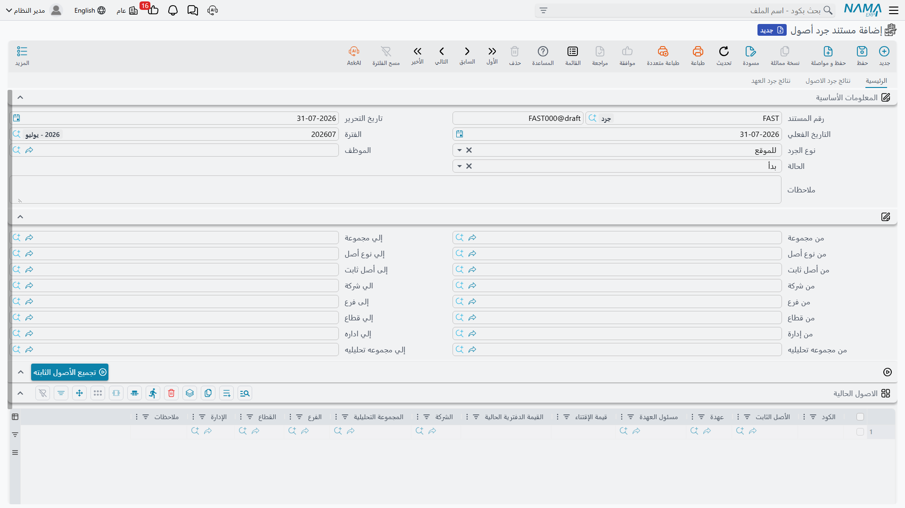
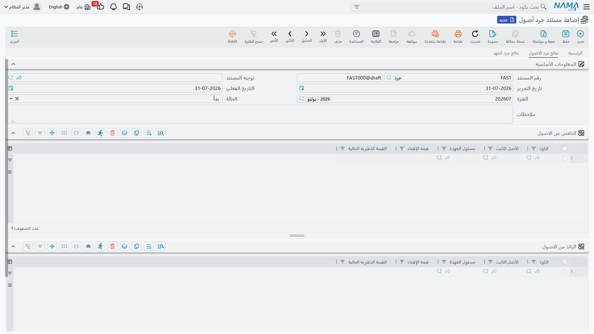
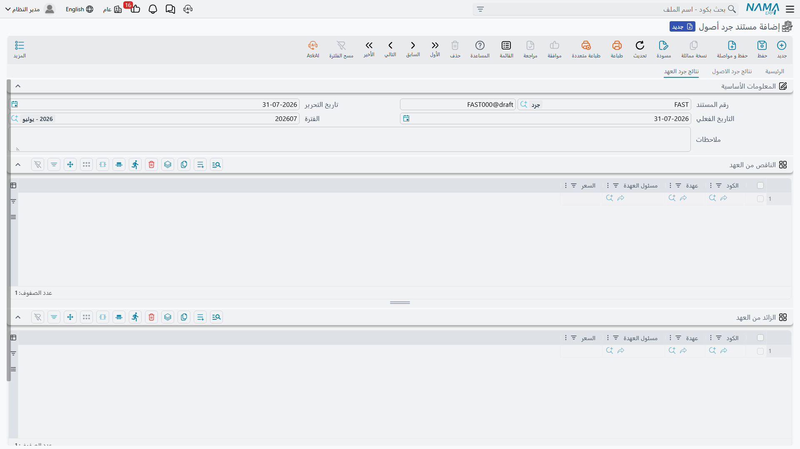

# جرد الأصول الثابتة

مرة في العام يمشي أحدهم في المصنع ومعه قارئ باركود ليعرف ما الموجود فعلاً. السجل يقول إن شركة الواحة
للصناعات تملك أربعين أصلاً واثنتي عشرة عهدة في مصنع الرياض. والجرد يجد ثمانية وثلاثين أصلاً، أحدها
مكتب يخصّ الدمام، وطابعة مسجَّلة على إدارة أخرى بالكامل.

و**مستند جرد أصول** هو موضع هذه المقارنة. ويحسن أن نكون صريحين في وصفه، فالاسم يقول «مستند»، والناس
تتوقع من مستندات هذه الوحدة أن تفعل شيئاً:

> **مستند الجرد تقرير مطابقة تحفظه.** يقارن ما يتوقعه السجل بما عددته، فيُخرج أربع قوائم: أصول ناقصة،
> وأصول زائدة، وعهد ناقصة، وعهد زائدة. ولا يكتب شيئاً في المقابل. فلا يُشطب أصل، ولا يُنشأ أصل، ولا
> يُصحَّح مسئول عهدة، ولا يُنتج قيد محاسبي ولا طلب أعمال. واعتماده لا يغيّر شيئاً على الإطلاق.

وهذا ليس نقصاً فيه، بل هو التوزيع الصحيح للعمل. فالقرار بأن الرافعة المفقودة ينبغي إعدامها قرارٌ
محاسبي معه ربح أو خسارة، ومكانه سند تخلص وراءه توجيه، لا ورقة عدّ. أما ما يدين به مستند الجرد لك
فقائمة دقيقة مؤرَّخة بالفروق، وهو يفي بها.

تجده في **الأصول > عهد الأصول > مستند جرد أصول**، تحت ترخيص `fixedassets`، ولا يستعمل توجيه مستند.

## طريقتان لتحديد نطاق الجرد

يحمل الرأس حقل **نوع الجرد**، وهو الذي يقرر ما الذي يُنتظر من السجل:

| نوع الجرد | القائمة المتوقعة هي |
|---|---|
| **للموقع** | كل أصل وكل عهدة مُقيَّدة تحت **محددات المستند نفسه** — الشركة والقطاع والفرع والإدارة والمجموعة التحليلية — ولم يتم التخلص منها |
| **للموظف** | كل أصل وكل عهدة يحملها **الموظف** المذكور في الرأس |

«للموقع» هو الجرد السنوي لموقع أو فرع. وانتبه إلى ما يقوده: **محددات المستند نفسه** المضبوطة في
مجموعة المحددات أسفل الصفحة. فاضبطها على فرع مصنع الرياض تكن تجرد كل ما يقيّده السجل تحت مصنع
الرياض. وأي محدد تتركه فارغاً لا يُستعمل في تضييق القائمة.

و«للموظف» هي الحالة الشائعة الأخرى — فحص حاسب وهاتف لموظف على وشك ترك العمل، أو تأكيد دوري لما وقّع
عليه مهندس. وهي تجلب الأصول و[العهد](/ar/modules/fixedassets/custody/fixedassets-custody-overview.md)
التي يحملها ذلك الشخص، والموظف مطلوب فيها.

ويحمل الرأس كذلك **الحالة** بقيمتين: **بدأ** و**منهي**. والمستند الجديد يبدأ بحالة «بدأ»، وذلك مهم كما
ترى في فقرة حساب الفروق أدناه.

## بناء ورقة العدّ

جدول **الاصول الحالية** هو الجرد نفسه: سطر لكل شيء وجده الفريق فعلاً. وله ثلاث طرق للملء، والجرد
الحقيقي يستعملها كلها عادةً.

**1. اضغط تجميع الأصول الثابته.** يملأ الزر الجدول سلفاً بأصول من السجل ليكون مع الفريق ما يمشي به.
وفوقه ستة عشر حقل «من / إلى» — المجموعة ونوع الأصل وكود الأصل والشركة والفرع والقطاع والإدارة
والمجموعة التحليلية — تضيّق ما يجلبه الزر. وكل مدى مقارنة أكواد، والحقل الفارغ يعني «بلا حدّ من هذا
الطرف»، فوضع `FA-1000` في «من أصل ثابت» و`FA-1999` في «إلى أصل ثابت» يجلب تلك الكتلة من الأكواد دون
غيرها. ولا تُجمَّع الأصول التي تم التخلص منها أبداً.

والمديات وسيلة لملء الورقة، وهذا كل شيء. فهي تضيّق ما يجلبه الزر، ولا تضيّق ما يُقارَن به الجرد؛ إذ
تظل المقارنة تستعمل نوع الجرد ومحددات الرأس دائماً.

**2. امسح الباركود في عمود الكود.** وهذه هي طريقة العمل الحقيقية. صوِّب القارئ إلى ملصق الأصل أو
العهدة فتنزل القيمة في عمود الكود، فيبحث عنها النظام — في العهد أولاً ثم في الأصول الثابتة — ويملأ
المرجع ومسئول العهدة وقيمة الاقتناء والقيمة الدفترية الحالية. ومع تفعيل وضع الباركود ينتقل الجدول
إلى السطر التالي وحده، فيستطيع فريق من شخصين أن يجرد صالة دون لمس لوحة المفاتيح.

**3. اختر السطر يدوياً.** اختر **الأصل الثابت** أو **العهدة** في السطر فتُملأ التفاصيل نفسها.

وللجدول قاعدتان: كل سطر يحتاج أصلاً أو عهدة، ولا يُعدّ الكود الواحد مرتين — فالمسح المكرر يُرفض
برسالة *«لا يمكن جرد هذا الصنف مرتين»*، وهو المطلوب تماماً حين يمسح شخصان الصالة نفسها.

::: tip لا توجد علامة «غير موجود» — الغياب هو النقص
هذه هي الآلية التي يجب أن يُخبَر بها الجميع. ورقة العدّ تسرد ما **وجدتَه**. فإذا جمع الفريق توقّع
السجل في الجدول ثم عجز عن العثور على ماكينتين، **حذف السطرين**. فما يبقى في الجدول هو الجرد، وكل ما
توقعه السجل ولم يعد في الجدول يصير نقصاً. فلا شيء يُعلَّم بأنه مفقود — إنما هو غائب فحسب.
:::

## كيف تُحسب الفروق

تجري المقارنة حين تُضبط **الحالة** على **منهي**، وتُعاد مع كل حفظ بعد ذلك. أما والحالة «بدأ» فتبقى
جداول النتائج الأربعة كما هي، وهو ما يتيح لجرد يمتد عدة أيام ألا تُربك نتائجُه الناقصة أحداً.

وحين تجري المقارنة يبني النظام القائمة المتوقعة من نوع الجرد ومحددات الرأس، ويُسقط ورقة العدّ في
قائمة مقابلة، ثم يقارن:

- متوقَّع ولم يُعدّ ← **ناقص**؛
- معدود وغير متوقَّع ← **زائد**.

وتُقارَن الأصول والعهد كلٌّ على حدة، ولذلك كانت النتائج أربعة جداول في صفحتين لا اثنين في صفحة.

الصفحة الثانية **نتائج جرد الاصول** فيها **الناقص من الاصول** و**الزائد من الاصول**. ويعرض كل سطر
الأصل ومسئول عهدته و**قيمة الإقتناء** و**القيمة الدفترية الحالية** — فتصير قائمة النقص في الوقت نفسه
قيمةً للمشكلة. وهذه الأعمدة القيمية تستقر عند حفظ المستند، فاقرأها من مستند محفوظ لا في أثناء
الإدخال.

والصفحة الثالثة **نتائج جرد العهد** تفعل الشيء نفسه بالعهد في **الناقص من العهد** و**الزائد من
العهد**، وتعرض العهدة وحاملها وسعرها.

::: info لا يوجد إلا نوعان من الفروق
ناقص وزائد. فالأصل الموجود في غير مكانه لا يظهر بوصفه «موقعاً خطأً»، وإنما يظهر **زائداً** في جرد
المكان الذي وُجد فيه، و**ناقصاً** في جرد المكان الذي كان ينبغي أن يكون فيه. ويحسن معرفة ذلك قبل
التخطيط لجرد موقعاً بعد موقع: أجرِ كل المواقع قبل أن تخلص إلى نتيجة، وقابِل زائد أحدها بناقص الآخر.
:::

## جرد في مصنع الرياض

تجرد الواحة مصنع الرياض في 30 يونيو 2026.

1. مستند جرد جديد، تاريخه الفعلي 30 يونيو، **نوع الجرد = للموقع**، ومجموعة المحددات مضبوطة على فرع
   مصنع الرياض، والحالة **بدأ**. والسجل يحمل هناك أربعين أصلاً واثنتي عشرة عهدة.
2. يضبط الفريق مدى أكواد الأصول على كتلة المصنع ويضغط **تجميع الأصول الثابته**، فتنزل ثمانية وثلاثون
   سطراً في ورقة العدّ.
3. وعلى مدى يومين يمسحون الأكواد. فيتأكد كل ما في الورقة إلا الرافعة الشوكية `MCH-0012` التي لا يجدها
   أحد، وخزانة واحدة — فيُحذف السطران. ويمسحون كذلك مكتباً `FRN-0058` يحمل ملصق الدمام، وطابعةً تبيّن
   أنها العهدة `CDY-0041` بحوزة إدارة أخرى، فيُضاف كلاهما سطرين جديدين.
4. تُضبط الحالة على **منهي** ويُحفظ المستند. فتخرج النتائج:
   - *الناقص من الاصول*: `MCH-0012` (قيمتها الدفترية 22,000)، والخزانة، وأصلا المصنع اللذان وقعا خارج
     مدى الأكواد المجمَّع ولم يُمسحا؛
   - *الزائد من الاصول*: `FRN-0058`؛
   - *الزائد من العهد*: `CDY-0041`.
5. يُعتمد المستند. و**كل سجلات الأصول كما كانت تماماً**.

## العمل بنتائج الجرد

الجرد بداية العمل لا نهايته. ولكل نوع من الفروق مستندٌ يعالجه:

| النتيجة | ما يعالجها |
|---|---|
| أصل مفقود فعلاً | [سند تخلص من أصل](/ar/modules/fixedassets/disposal/fixedassets-disposal.md) — ولـ`MCH-0012` إعدامٌ بقيمة تخلص صفر تُحمَّل معه القيمة الدفترية 22,000 خسارةً |
| ضياع بعض وحدات أصل قابل للعدّ | [تخلص جزئي](/ar/modules/fixedassets/disposal/fixedassets-partial-disposal.md) |
| أصل وُجد في مكان آخر | [سند نقل أصل](/ar/modules/fixedassets/movement/fixedassets-transfer-document.md) — يُعاد `FRN-0058` إلى الدمام، أو تُصحَّح محدداته إلى موضعه الحقيقي |
| شيء موجود لم يُسجَّل قط | [سند شراء](/ar/modules/fixedassets/acquisition/fixedassets-purchase-document.md) إن كان قد اشتُري ولم يُسجَّل، أو [سند افتتاحي](/ar/modules/fixedassets/acquisition/fixedassets-opening-balances.md) إن كان أقدم من السجل |
| عهدة بحوزة غير حاملها، أو مفقودة | [تسليم أو نقل عهدة](/ar/modules/fixedassets/custody/fixedassets-custody-delivery-and-transfer.md)، أو [تخلص من عهدة](/ar/modules/fixedassets/custody/fixedassets-custody-disposal.md) |

وأمران يجعلان هذه المتابعة أسهل. الأول أن تُسوّى
[سندات الخروج والرجوع](/ar/modules/fixedassets/movement/fixedassets-movement-in-out.md) قبل الجرد،
وإلا قُرئت الوحدات الغائبة بوجه حق نقصاً. والثاني أن تُشغَّل
[تقارير الأصول الثابتة](/ar/modules/fixedassets/reports/fixedassets-reports.md) بالمحددات نفسها قبل
الجرد، فيدخل الفريق ومعه توقّع السجل على الورق كما هو على القارئ.

واحتفظ بمستند الجرد المعتمد. فهو الدليل المؤرَّخ على ما وُجد، وكل تخلص ونقل يُحرَّر بعده يرجع إليه.
