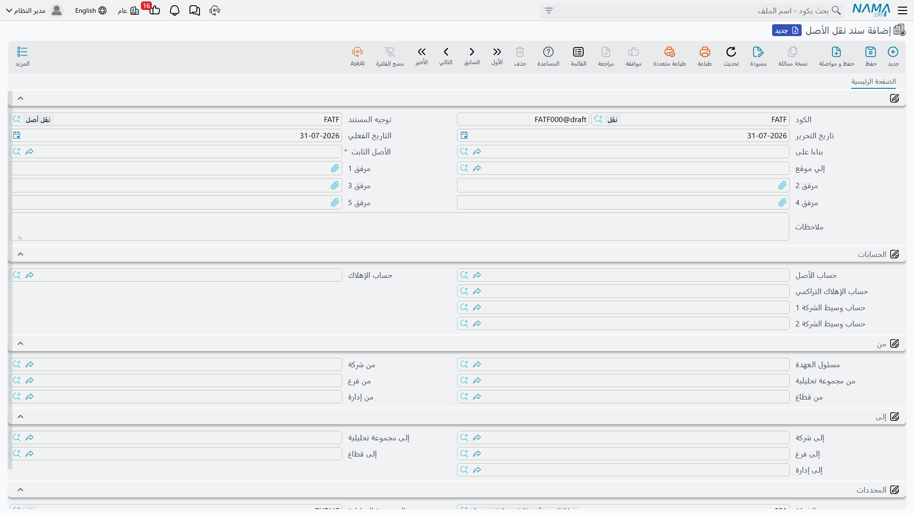
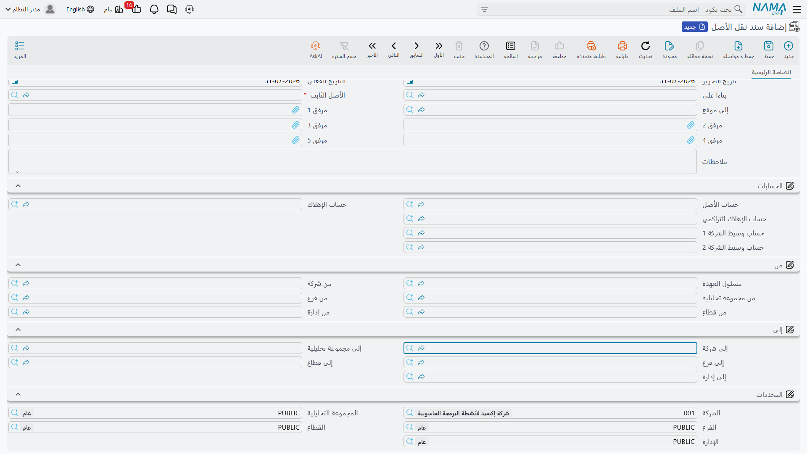
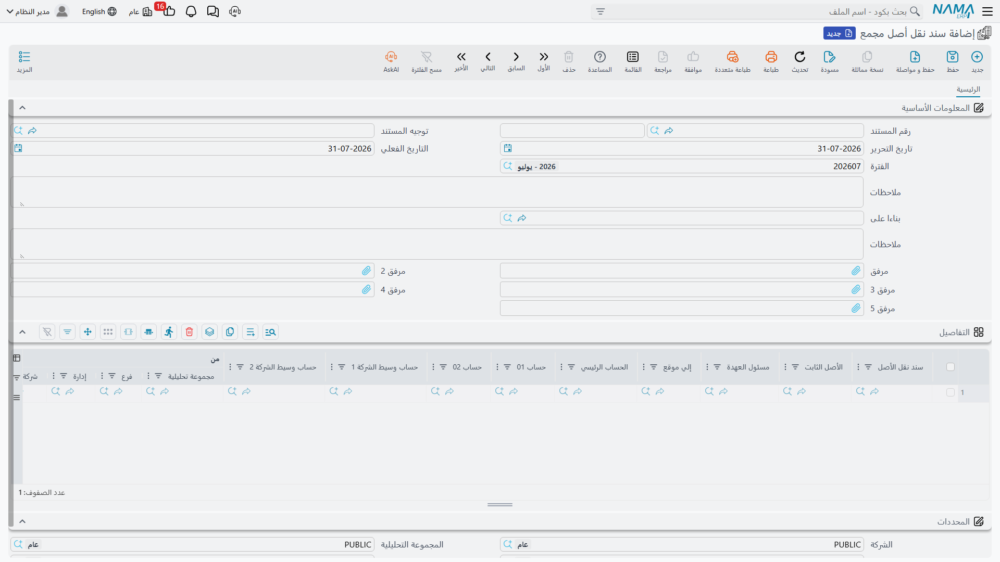

# نقل الأصل: سند نقل الأصل

نقلت شركة الواحة للصناعات ماكينة القص `MCH-0007` من صالة 2 إلى صالة 3 في مصنع الرياض. عشرون متراً،
ونصف ساعة، وفنيان اثنان. وفي وقت لاحق من العام نفسه شُحنت الماكينة إلى ورشة الدمام، وهي فرع آخر من
الشركة نفسها. ثم قررت المجموعة أن مكانها الصحيح هو شركة جدة التابعة لها.

الحركات الثلاث تُسجَّل جميعاً بالمستند نفسه — **سند نقل الأصل** — وتُنتج ثلاثة آثار محاسبية مختلفة
تماماً. الأولى لا تُنتج شيئاً على الإطلاق، والثانية تُنتج قيداً واحداً، والثالثة تُنتج قيدين. ولا
يختار المستخدم ذلك من الشاشة: **ما يُنتجه النقل محاسبياً يقرره ما غيّره النقل، لا شيء سواه.**

هذه القاعدة وحدها تفسّر معظم ما في هذه الصفحة، فلنبدأ بها:

| ما الذي تغيّر بين الوضع القديم والجديد | ما الذي تتم معالجته |
|---|---|
| الموقع الفعلي فقط | لا شيء. يُحدَّث سجل الأصل وتاريخه، ولا يُمسّ دفتر الأستاذ |
| محدِّد مؤثر محاسبياً (فرع أو قطاع أو إدارة أو مجموعة تحليلية) أو أحد حسابات الأصل، داخل الشركة نفسها | **قيد واحد** ينقل التكلفة الإجمالية ومجمَّع الإهلاك من المحدد/الحساب القديم إلى الجديد |
| الشركة | **قيدان** مرتبطان، واحد في كل شركة، يجمع بينهما حسابا وسيط |

أي المحددات الأربعة يُعد مؤثراً محاسبياً قرارٌ تتخذه مرة واحدة في
[إعدادات الوحدة](/ar/modules/fixedassets/fixedassets-configuration.md). فإذا كان القطاع غير مؤثر
محاسبياً عندك، فإن نقلاً يغيّر القطاع وحده يتصرف تصرّف النقل المكاني المحض ولا يُنتج قيداً.

## أين تجد المستند

تجده في **الأصول > عهد الأصول > سند نقل الأصل**، ويحتاج ترخيص `fixedassets` — ترخيص الوحدة العادي لا
ترخيص العهد، رغم أن مجلد القائمة اسمه «عهد الأصول».

**توجيه المستند اختياري** هنا. فبلا توجيه يعمل السند طبيعياً ويُنتج ما يقتضيه تغييره، والشيء الوحيد
الذي يستطيع التوجيه فعله هو إيقاف الأثر المحاسبي كلياً، وهو ما تشرحه فقرة «إيقاف الأثر المحاسبي»
أدناه.

## قراءة الشاشة

المستند صفحة واحدة، وهو مبني حول «من» و«إلى».

تحمل المجموعة العليا بيانات المستند المعتادة — الدفتر والكود وتاريخ التحرير والتاريخ الفعلي — ومعها
الحقول التي تقوم بالعمل الحقيقي:

- **بناءا على** — [طلب نقل أصل](/ar/modules/fixedassets/movement/fixedassets-transfer-requests.md)
  قائم، إن كانت الحركة قد طُلبت ورقياً أولاً. واختياره ينسخ الأصل والموقعين ومجموعتي المحددات
  والحسابات إلى هذا السند فلا يُكتب شيء مرتين.
- **الأصل الثابت** — الماكينة المنقولة. واختيارها يملأ كل ما عداها تقريباً: محددات «من»، والحسابات،
  وموقع الأصل الحالي.
- **إلي موقع** — الوجهة.

ولا يوجد حقل «من موقع» تملؤه بنفسك؛ فالنظام يعرف أين الأصل لأنه يعرف آخر نقل مسّه، ويكتبه نيابة عنك.

::: tip موقع الوجهة هو الذي يقود محددات الوجهة
عند اختيار **إلي موقع** يقرأ النظام ملف الموقع نفسه وينسخ منه الشركة والفرع والقطاع والإدارة
والمجموعة التحليلية إلى مجموعة «إلى» كاملة. هذه هي طريقة العمل المقصودة: اضبط كل
[موقع أصول](/ar/modules/fixedassets/master-files/fixedassets-locations.md) بالمحددات التي تخصه، فيصير
النقل بعدها اختياراً واحداً. ويبقى بإمكانك تعديل أيٍّ من الخمسة يدوياً — مجموعة «إلى» قابلة للتحرير
بالكامل — لكن كثرة التعديل اليدوي علامة على أن ملف المواقع هو ما يحتاج إلى ضبط.
:::

وتحت ذلك أربع مجموعات:

| المجموعة | ما تحمله |
|---|---|
| **الحسابات** | الحسابات الثلاثة التي يقف عليها الأصل من الآن: **حساب الأصل** و**حساب الإهلاك** و**حساب الإهلاك التراكمي**، ومعها **حساب وسيط الشركة 1** و**حساب وسيط الشركة 2** اللذان لا دور لهما إلا عند تغيّر الشركة |
| **من** | وضع الأصل الحالي: مسئول العهدة ومحدداته الخمسة الحالية، تُملأ من الأصل |
| **إلى** | الوجهة: المحددات الخمسة الجديدة |
| **المحددات** | محددات المستند **نفسه**، أي الجهة التي يُقيَّد المستند تحتها. وأثرها أكبر مما يبدو، كما ترى بعد قليل |

الحسابات مملوءة سلفاً من الأصل، فتركها كما هي يعني «أبقِ الأصل في مكانه من شجرة الحسابات». أما تغيير
أحدها فحدث حقيقي: القيد الذي يُنتجه النقل ينقل الأرصدة من الحساب القديم إلى الجديد.

::: warning شركة المستند نفسه هي التي تحدد أي دفتر يُقرأ
مجموعة **المحددات** في أسفل الشاشة ليست زينة. فحين يحسب النقل مقدار التكلفة ومجمَّع الإهلاك المطلوب
نقلهما، يقرأ أرصدة الأصل **المرحَّلة في الشركة المذكورة في تلك المجموعة**. اجعلها الشركة التي
**يغادرها** الأصل. أما إذا ذكرت شركة أخرى — شركة الوجهة أو الشركة الافتراضية للمستخدم — فلن يجد
البحث أرصدة، وتخرج كل السطور بقيمة صفر، ويُعتمد المستند بلا قيد.
:::

## الحالات الثلاث بأرقامها

الماكينة في الأمثلة التالية هي `MCH-0007`، ونلتقي بها في نهاية ديسمبر 2027 بعد تطوير وحدة التحكم
وسنتين من الإهلاك:

| | |
|---|---|
| التكلفة | 270,000 |
| مجمَّع الإهلاك | 93,900 |
| القيمة الدفترية | **176,100** |
| الموقع | `LOC-R2` — مصنع الرياض، صالة 2 |
| الفرع | مصنع الرياض |

### من صالة 2 إلى صالة 3 — لا قيد

تفتح سند نقل، وتختار `MCH-0007`، وتضع في **إلي موقع** الموقعَ `LOC-R3` (مصنع الرياض، صالة 3). هذا
الموقع يحمل الشركة والفرع والقطاع والإدارة نفسها التي تحملها صالة 2، فتعود مجموعة «إلى» مطابقة
لمجموعة «من»، والحسابات لم تُمسّ.

وعند الاعتماد يتغيّر موقع الأصل إلى صالة 3، ويُضاف سطر إلى تاريخ مواقع الأصل، **وينتهي الأمر**. لا
قيد ولا طلب أعمال ولا شيء يراجعه المحاسب. وهذه هي الحالة الشائعة، والمقصود أن تكون رخيصة: مصنع يعيد
ترتيب معداته بين الصالات كل أسبوع يستطيع تسجيل ذلك كله دون أن يُنتج قيداً واحداً.

### من الرياض إلى ورشة الدمام — قيد واحد

الآن تُشحن الماكينة إلى ورشة الدمام، وهي فرع آخر من شركة الواحة للصناعات. تختار `LOC-D1` وجهةً فتعود
مجموعة «إلى» ومعها الفرع **ورشة الدمام**.

ولأن الفرع مؤثر محاسبياً في هذا التركيب، ينقل السند رصيدَي الماكينة:

| | الحساب | المحددات | مدين | دائن |
|---|---|---|---|---|
| 1 | حساب الأصل | ورشة الدمام | 270,000 | |
| 2 | حساب الأصل | مصنع الرياض | | 270,000 |
| 3 | مجمَّع الإهلاك | مصنع الرياض | 93,900 | |
| 4 | مجمَّع الإهلاك | ورشة الدمام | | 93,900 |

مجموع القيد صفر — لم يُربح شيء ولم يُخسر، وإنما صارت الماكينة تخصّ فرعاً آخر في الدفاتر كما صارت
تخصّه في أرض المصنع. وتنتقل التكلفة الإجمالية ومجمَّع الإهلاك معاً، ولذلك يظل ميزان الفرع مُظهراً
الماكينة بصافٍ قدره 176,100.

ولو لم تكن الماكينة قد أُهلكت بعد، لخرج سطرا مجمَّع الإهلاك بقيمة صفر فحُذفا، وبقي قيد من سطرين.

### إلى شركة جدة — قيدان

الحالة الثالثة مختلفة بما يكفي لتُفرد لها صفحة. وخلاصتها أن الأصل يصل إلى الشركة المستقبِلة **بقيمته
الدفترية** — 176,100 — ويبدأ مجمَّع إهلاكه من الصفر من جديد، وتُربَط الشركتان بحسابَي وسيط. راجع
[النقل بين الشركات](/ar/modules/fixedassets/movement/fixedassets-intercompany-transfers.md) للقيدين
ولما يحتاجانه من إعداد.

::: info إلى أين تمضي قصة `MCH-0007` فعلياً
في [صفحة التخلص من الأصل](/ar/modules/fixedassets/disposal/fixedassets-disposal.md) تُباع `MCH-0007`
في 31 ديسمبر 2027 بدل أن تُنقل إلى جدة. فالنقل بين الشركات هو الطريق الآخر في القصة نفسها وبالأرقام
نفسها — ماكينة واحدة، وقيمة دفترية واحدة قدرها 176,100، ونهايتان ممكنتان.
:::

## ما الذي يكتبه النقل على الأصل

اعتماد المستند يفعل ثلاثة أشياء بسجل الأصل: يضبط **الموقع**، ويضبط **المحددات الخمسة**، ويضبط
**الحسابات الثلاثة**، وكلها من جانب «إلى» في المستند. ويكتب كذلك سطراً في تاريخ مواقع الأصل، وهو ما
تقرأه في صفحة الإحصائيات حين يسأل أحدهم أين كانت الماكينة.

وللكتابة شرط واحد: الأصل يأخذ قيم رأسه من **آخر** حركة له. فإذا أدخلت نقلاً بتاريخ سابق خلف نقل مسجّل
بالفعل، أضيف السطر إلى التاريخ في موضعه الزمني الصحيح، وبقي موقع الأصل ومحدداته كما تركهما المستند
الأحدث. وهذا هو التصرف الصحيح — فآخر حركة هي التي تصف أين الشيء الآن — لكنه يفاجئ من يتوقع أن يفوز
آخر مستند **أُدخل**.

أما مَن يحمل الأصل فمسألة منفصلة يتولاها
[سند تسليم واستلام العهد](/ar/modules/fixedassets/acquisition/fixedassets-delivery-receipt.md). وحقل
**مسئول العهدة** في مجموعة «من» يسجّل من كان يحمل الماكينة وقت تحرير الحركة، وهو جزء من الأثر الورقي
لا وسيلة لإعادة الإسناد.

::: warning اعتماد النقل يمسح مسئول العهدة عن الأصل
انتبه لهذه. فكل نقل يُعتمد يمسح **مسئول العهدة** من بطاقة الأصل ويتركه فارغاً — وليس في شاشة النقل
حقلٌ يضع بديلاً عنه. فتصل الماكينة إلى إدارتها الجديدة ولا أحد مسجَّل بحملها.

فأعد مسئول العهدة بعد كل نقل: إما بتحرير
[سند تسليم واستلام العهد](/ar/modules/fixedassets/acquisition/fixedassets-delivery-receipt.md) للحائز
الجديد — وهو الطريق الصحيح، لأنه يقيّد القيمة ويكتب تاريخ العهدة أيضاً — وإما بكتابة الحقل يدوياً على
الأصل. وإن كانت شركتك تنقل الأصول كثيراً فاسأل مسؤول النظام عن إضافة حقل مسئول العهدة الجديد إلى شاشة
النقل عبر معدِّل الشاشات.
:::

## ما الذي يمنع اعتماد النقل

يقع النقل في منتصف الخط الزمني للأصل، ولذلك فمعظم قواعده تدور حول ألا يُحدث ثقباً في ذلك الخط. وتظهر
كل حالات الرفض مجتمعة فترى القائمة كاملة دفعة واحدة.

1. **لا يمكن أن يكون النقل أول مستند على الأصل.** فالنظام يحتاج إلى وضع سابق ينقل الأصل **منه**. فإذا
   ظهرت لك رسالة *«لا يمكن أن تكون أول حركة للأصل نقلاً»* فالأصل لم يدخل الخدمة أصلاً، وما زال يحتاج
   [سند شراء](/ar/modules/fixedassets/acquisition/fixedassets-purchase-document.md) أو
   [سند افتتاحي](/ar/modules/fixedassets/acquisition/fixedassets-opening-balances.md).
2. **يجب أن يكون الأصل في الخدمة.** فالأصل الذي ما زال في حالته الإبتدائية لا يُنقل، والأصل الذي تم
   التخلص منه لا يُنقل مطلقاً. وصفحة
   [حالات الأصل](/ar/modules/fixedassets/master-files/fixedassets-asset-status.md) تسرد ما تمنعه كل
   حالة.
3. **ألا يوجد شيء بعد هذا التاريخ.** فوجود نقل لاحق، أو مستند لاحق غيّر قيمة الأصل — إهلاك أو إضافة
   وخصم أو إعادة تقييم أو تعديل خصائص — يمنع الاعتماد ويذكر المستند المعترض. ألغِ اعتماد ذلك المستند
   اللاحق، ثم أدخل النقل، ثم أعد اعتماده.
4. **أن يكون الإهلاك محدَّثاً.** فلا بد أن يكون الأصل قابلاً للإهلاك في فترة النقل، إلا أن يكون مهلكاً
   بالكامل وآخر إهلاك له سابقاً فعلاً لتاريخ النقل. وعملياً: نفّذ
   [الإهلاك](/ar/modules/fixedassets/depreciation/fixedassets-depreciation-document.md) حتى شهر الحركة
   أولاً، ثم انقل.
5. **أن يكون لكلتا الشركتين حساب وسيط** عند تغيّر الشركة — راجع
   [النقل بين الشركات](/ar/modules/fixedassets/movement/fixedassets-intercompany-transfers.md).

والتشابك يعمل في الاتجاهين. فما إن يوجد نقل حتى يُرفض إهلاك مؤرَّخ **قبله** برسالة تذكر سند النقل.
فترتيب المستندات على الخط الزمني للأصل لا يُسمح له بأن يصير ملتبساً أبداً.

## إيقاف الأثر المحاسبي

لتوجيه سند النقل خيار واحد لا غير: **بدون تاثير محاسبي**. فإذا فُعِّل، أدّى المستند عمله كاملاً في
السجل — الموقع والمحددات والحسابات والتاريخ — ولم يُرسل شيئاً إلى دفتر الأستاذ.

وهذا هو الخيار الصحيح للمنشآت التي تستعمل محددات الأصول لأغراض تحليلية بحتة ولا يريد محاسبوها قيوداً
بين الفروع تزحم الدفاتر. والخيار على مستوى التوجيه، فيمكنك الاحتفاظ بدفتر نقل عادي بجانب دفتر «بلا
أثر محاسبي» وتختار حسب المستند.

ولأن التوجيه اختياري على هذا المستند، فإن نقلاً أُدخل بلا توجيه يتصرف كأن الخيار غير مفعَّل، أي إنه
يُنتج قيداً.

## إلغاء الاعتماد والعكس

إلغاء اعتماد النقل يحذف طلبات القيد الخاصة به، ويعيد موقع الأصل ومحدداته وحساباته من الحركة
**السابقة**، ويحذف سطر التاريخ. فيعود الأصل إلى ما كان عليه تماماً، وهو المطلوب حين تُسجَّل حركة
خطأً.

والرفض الوحيد الذي قد تلقاه رسالةٌ تفيد أن موقع الأصل قد تغيّر بمستند آخر، ومعناها أن حركة **أحدث**
موجودة بالفعل وأن التراجع عن هذه سيترك تلك معلّقة. ألغِ اعتماد المستند الأحدث أولاً.

وهناك كذلك إجراء **إعادة توليد التأثير المحاسبي** في قائمة «المزيد» لحين تصحيح توجيه أو حساب بعد
الاعتماد: فهو يعيد بناء القيود من المستند بحالته الراهنة. وتعرض القائمة نفسها الحركات المحاسبية التي
أنتجها المستند، وهي أسرع طريق لمعرفة ما فعله نقل بعينه.

::: info القيود تُعالج في الخلفية
كسائر ما في الوحدة، الجانب المحاسبي للنقل طلب أعمال. يُحفظ المستند فوراً ويُنتج مُعالِج الطلبات القيدَ
بعد لحظة. فإذا فشل — لفترة مقفلة أو حساب ناقص — بقي المستند معتمداً وأُعيدت محاولة الطلب من شاشة
**طلبات الأعمال** عبر **المزيد ← إعادة معالجة**. ويجدر بك أن تتذكر أن الأرصدة تُقرأ **بتاريخ النقل
الفعلي** من سطور دفتر أستاذ **مرحَّلة**، فالنقل الذي يُدخَل بينما لا يزال مستند سابق في قائمة
الانتظار قد يقرأ رقماً قديماً. دع قائمة الانتظار تُفرَّغ قبل نقل أصل حديث الشراء.
:::

## نقل عدة أصول دفعة واحدة

حين تنتقل إدارة بأكملها، لا يكون إدخال سند لكل أصل واقعياً. و**سند نقل أصل مجمع** شاشة واحدة فيها
جدول: سطر لكل أصل، يحمل كل سطر موقع وجهته ومحددات وجهته وحساباته.

وعند الاعتماد يُنشئ **سند نقل حقيقياً عن كل سطر**، ويؤدي كل منها العمل الكامل الموصوف أعلاه — سطر
التاريخ، وتحديث الأصل، والقيد إن اقتضى التغيير قيداً. أما المجمع نفسه فلا يُنتج قيداً؛ إنما هو مصنع
مستندات.

ويجدر بك معرفة أمرين قبل استعماله:

- توجيه المجمع نفسه هو الذي يسمّي **الدفتر والتوجيه** اللذين تُنشأ بهما سندات النقل المولَّدة. وهناك
  يُضبط خيار «بدون تاثير محاسبي» إن أردته — فضبط أي شيء على توجيه المجمع لن يصل إلى الأبناء.
- تعديل مجمع معتمد يعيد اعتماد أبنائه، وإلغاؤه يحذفهم. فالأبناء ليسوا مستندات مستقلة تصونها يدوياً
  بعد ذلك.

والتحقق يجري سطراً سطراً بالقائمة نفسها أعلاه مع إضافة واحدة: **لا يجوز تكرار الأصل في الجدول**. وهذا
الفحص موجود لأن نقلين للأصل نفسه بالتاريخ نفسه يُنتجان بالضبط ذلك الالتباس الذي وُضعت قواعد الخط
الزمني لمنعه.
