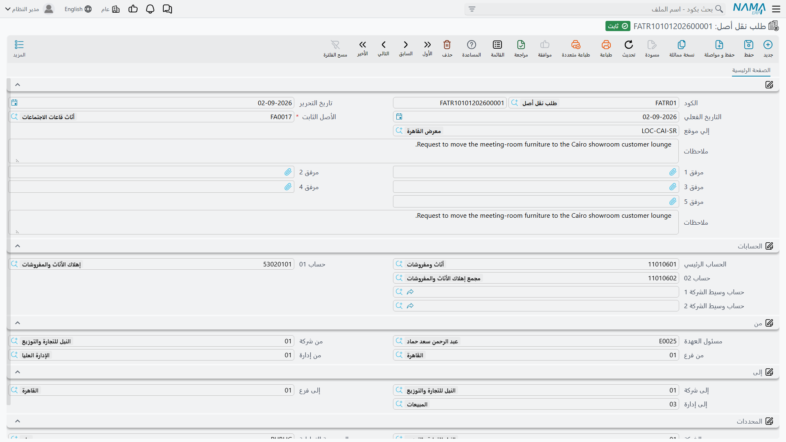
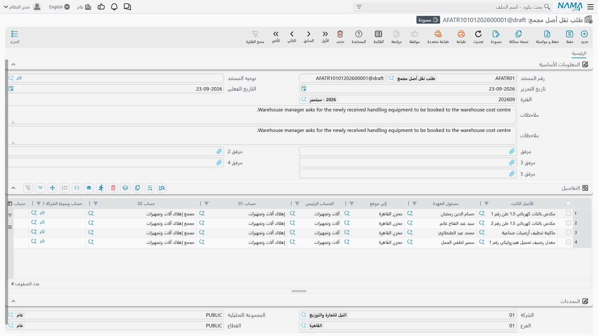

# طلب النقل: كيف يُطلب تحريك الأصل

في أغلب المصانع ليس مَن يقرر أن الماكينة ينبغي أن تنتقل هو نفسه مَن يملك صلاحية تعديل سجل الأصول.
مدير الإنتاج يريد ماكينة القص `MCH-0007` في صالة 3، ومحاسب الأصول الثابتة هو من يسجّل ذلك، ولا يسجّله
إلا بعد أن يستقر إهلاك الشهر.

و**طلب نقل أصل** موجود للشطر الأول من هذا الحوار. هو الورقة التي تقول «أرجو نقل هذا الأصل من هنا إلى
هناك وتسليمه لفلان» — وهو صريح في أنه ليس أكثر من ذلك.

## الطلب يسجّل النية ولا يفعل شيئاً غيرها

ليكن هذا واضحاً قبل أن تبني حوله إجراءً في منشأتك. طلب نقل الأصل:

- لا يغيّر شيئاً في الأصل — لا موقعه ولا محدداته ولا حساباته ولا مسئول عهدته؛
- لا يُنتج قيداً محاسبياً ولا طلب أعمال؛
- لا حالة له ولا تحقق عليه إطلاقاً. فهو يقبل أصلاً تم التخلص منه، وأصلاً ما زال في حالته الإبتدائية،
  وتاريخاً في الماضي، ووجهةً لم يوافق عليها أحد. لا شيء فيه يُفحص، لأن لا شيء فيه يسري.

كل ما يُفحص إنما يُفحص على
[سند نقل الأصل](/ar/modules/fixedassets/movement/fixedassets-transfer-document.md) حين تُسجَّل الحركة
فعلاً. وهذا هو موضعه الصحيح — لكنه يعني أيضاً أن كومة من الطلبات المعتمدة ليست دليلاً على أن الحركات
قابلة للتنفيذ.

أما فائدة الطلب الحقيقية فهي فائدة الورق نفسها: يمكن تمريره على دورة الموافقات كأي مستند آخر في نما،
ويوفّر على المحاسب إعادة كتابة ما كتبه مقدّم الطلب.

## تحرير الطلب

الطلب في **الأصول > عهد الأصول > طلب نقل أصل**، تحت ترخيص `fixedassets`، ولا يحتاج توجيه مستند.

والشاشة نسخة مبسّطة من سند النقل:

| المجموعة | الحقول |
|---|---|
| الأعلى | الدفتر والكود، تاريخ التحرير، التاريخ الفعلي، **الأصل الثابت**، **إلي موقع**، ملاحظات، وخمسة مرفقات |
| **الحسابات** | حسابات الأصل الثلاثة، بمسميات عامة هي **الحساب الرئيسي** و**حساب 01** و**حساب 02**، وهي على الترتيب حساب تكلفة الأصل وحساب الإهلاك وحساب الإهلاك التراكمي |
| **من** | **مسئول العهدة**، والشركة والفرع والإدارة التي يقف فيها الأصل اليوم |
| **إلى** | الشركة والفرع والإدارة المطلوب النقل إليها |
| **المحددات** | محددات المستند نفسه، للتصنيف والصلاحيات |

وثمة آليتان تجعلان التحرير سريعاً. فاختيار **الأصل الثابت** يملأ جانب «من» كله والحسابات ومسئول
العهدة مباشرة من سجل الأصل. ثم يملأ اختيار **إلي موقع** جانبَ «إلى» من ملف ذلك الموقع — وهو التصرف
نفسه الموجود على سند النقل، وللسبب نفسه الداعي إلى ضبط
[مواقع الأصول](/ar/modules/fixedassets/master-files/fixedassets-locations.md) ضبطاً جيداً.

فمدير إنتاج الواحة حين يطلب النقل إلى صالة 3 يكتب أربعة أشياء: الأصل `MCH-0007`، والوجهة `LOC-R3`،
وتاريخاً فعلياً، وسطر ملاحظات يبيّن السبب. وما عدا ذلك يأتي وحده.

::: info الطلب يغطي ثلاثة محددات لا خمسة
تعرض مجموعتا «من» و«إلى» في الطلب الشركة والفرع والإدارة. أما القطاع والمجموعة التحليلية فهما على سند
النقل دون الطلب، فالحركة التي هي في جوهرها إعادة إسناد قطاع أو مجموعة تحليلية تُوصف على السند نفسه لا
تُطلب على الورق.
:::

## تحويل الطلب إلى حركة

لا يوجد زر لذلك. يفتح المحاسب
[سند نقل أصل](/ar/modules/fixedassets/movement/fixedassets-transfer-document.md) جديداً ويختار الطلب
في حقل **بناءا على**. فيُنسخ الأصل والموقعان ومجموعتا المحددات ومسئول العهدة والحسابات الثلاثة — أي
الطلب كله بنقرة واحدة.

ومن هناك يصير السند سنداً عادياً: يُفحص، ويمكن تعديله قبل الاعتماد، ويُنتج ما يقتضيه تغييره. ويبقى
الرابط إلى الطلب على السند مرجعاً، وهو ما يريد أن يراه المراجع حين يسأل: من أذن بهذه الحركة؟

ولأن الطلب مرجع لا بند عمل، اجعل الترتيب من نصيب إجراءاتك أنت: قرِّر من يُغلق الدورة، واحفظ الطلبات
متى وُجد سندها.

## الإجراءات في هذه الشاشة

ليس في طلب النقل أزرار خاصة به، ولا يوجد فيه — كما يقول القسم السابق — زر *أنشئ النقل*. فالطلب
تدوين نية: تملؤه وتحفظه وتعتمده، ثم يفتح صاحب صلاحية النقل مستند نقل ويوجّه حقل **بناءا على** إلى
الطلب.

## تحرير عدة طلبات دفعة واحدة

**طلب نقل أصل مجمع** هو الفكرة نفسها بالجملة — شاشة واحدة وجدول واحد وسطر لكل أصل. وهو ما تستعمله حين
تنتقل إدارة كاملة ويلزم طلب نقل أربعين مكتباً معاً.

يحمل الجدول في كل سطر: الأصل، ومسئول عهدته، وموقع الوجهة، والحسابات الثلاثة، ومجموعتَي «من» و«إلى»
بمحدداتهما الخمسة كاملة — فبخلاف الطلب المفرد يستطيع الطلب المجمع أن يعبّر عن نقل قطاع أو مجموعة
تحليلية.

واختيار الأصل في السطر يملأ مسئول عهدة السطر ومحدداته وحساباته من سجل الأصل، تماماً كما في الطلب
المفرد.

وعند الاعتماد يُنشئ المستند **طلب نقل واحداً عن كل سطر**. أما الدفتر والتوجيه اللذان تُنشأ بهما تلك
الطلبات فيأتيان من توجيه المستند المجمع نفسه، في صفحة فيها حقلان لدفتر وتوجيه: وجّههما إلى الدفتر
والتوجيه اللذين تستعملهما مع **طلبات النقل**، فالطلبات هي ما يُنتجه هذا المستند.

وتعديل مجمع معتمد يعيد بناء أبنائه، وإلغاؤه يحذفهم، والسطر الذي تحذفه يأخذ معه الطلب الذي ولّده.
فتعامل مع المجمع بوصفه النسخة الأصلية واترك الطلبات المفردة التي أنتجها وشأنها.

والطلبات المحرَّرة بهذه الطريقة تُلتقط واحداً واحداً على سند النقل، كما تُلتقط الطلبات المكتوبة
يدوياً. أما نقل عدة أصول في إجراء واحد — لا طلبها — فيتم بسند النقل المجمع الموصوف في
[صفحة سند نقل الأصل](/ar/modules/fixedassets/movement/fixedassets-transfer-document.md).
