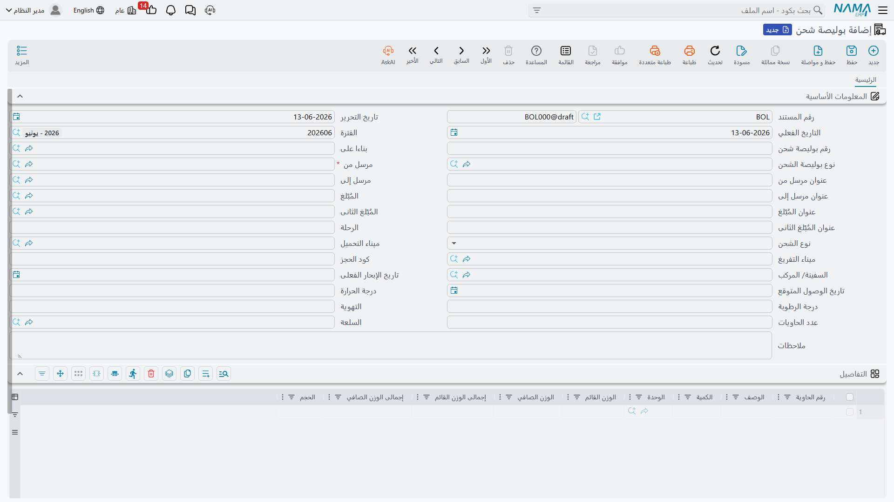

# بوالص الشحن (Bills of Lading)

بوليصة الشحن هي المستند الملاحي الرسمي الذي يثبت استلام الناقل للبضاعة وشروط نقلها وتسليمها. في Nama ERP تُنشأ عادةً من [أمر التشغيل](./operation-orders.md) بزر **إنشاء بوليصة شحن**، فترث بياناته، ويمكن أيضًا إنشاؤها مباشرة من **نظام إدارة الشحن ← المستندات ← بوليصة شحن**.

## رأس البوليصة

يحمل رأس البوليصة البيانات التي تُطبع على المستند الملاحي:

- **رقم البوليصة (Bill of Lading Number)** ونوعها (Master / House…).
- **المُصدِّر (Shipper)** — حقل إلزامي — و**المُرسَل إليه (Consignee)** و**جهتا الإخطار**، مع عنوان كلٍّ منها كما يُطبع على البوليصة.
- **نوع الأجرة (Freight Type)** — مدفوعة مقدّمًا أم تحصيل.
- **الباخرة (Ocean Vessel) والرحلة (Voyage)** ورقم الحجز لدى الناقل.
- **ميناء التحميل والتفريغ** و**تاريخ الوصول المتوقّع** و**تاريخ الإبحار الفعلي**.
- بيانات الحاويات المبرّدة: **درجة الحرارة والرطوبة والتهوية**، و**عدد الحاويات**.
- **السلعة (Commodity)** والمرفقات.

## سطور البوليصة

في تفاصيل البوليصة تُدرج البضاعة المشحونة سطرًا سطرًا:

- **رقم الحاوية** و**الكمية**.
- **الوصف والملاحظات** كما تُطبع على المستند.
- **الوزن الصافي والقائم** للسطر، وإجمالي الوزن الصافي والقائم.
- **الحجم (CBM Volume)**.
- مرفقات لكل سطر عند الحاجة.

::: info البوليصة مستند ملاحي لا مالي
بوليصة الشحن لا تُنشئ أثرًا محاسبيًا بذاتها — فالأثر المالي للشحنة يأتي من [فواتير المبيعات والمشتريات](./freight-invoicing.md). دور البوليصة هو توثيق الشحنة ملاحيًا وطباعة المستند الرسمي للعميل والناقل.
:::

## العلاقة بأمر التشغيل والفواتير

عند الفوترة، تربط فاتورة المبيعات سطور البوالص المُفوتَرة (Invoiced Bills of Lading)، فتُجمّع أرقام البوالص وأرقام الحاويات تلقائيًا في الفاتورة — وهو ما يسهّل على العميل مطابقة الفاتورة بالشحنات. بهذا تترابط الثلاثة: **أمر التشغيل** (التخطيط والخدمات) ← **بوليصة الشحن** (التوثيق الملاحي) ← **الفاتورة** (التحصيل المالي).
