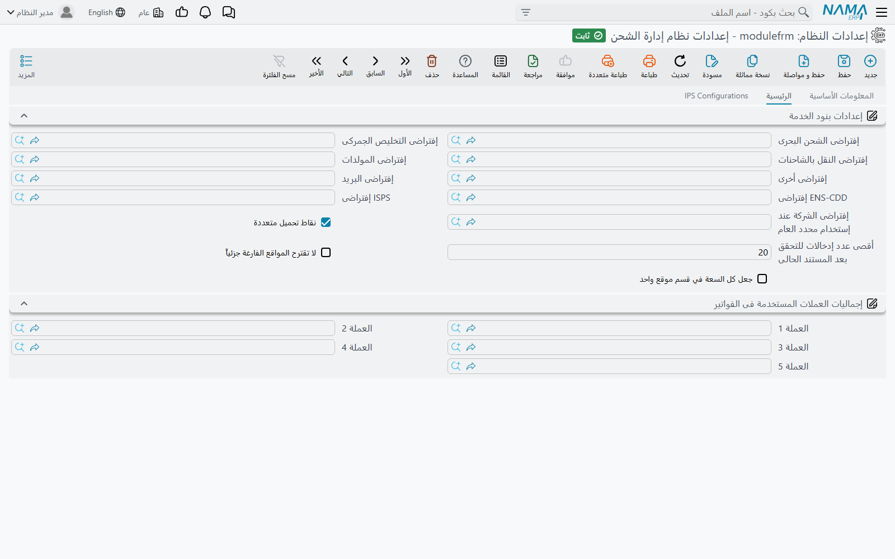
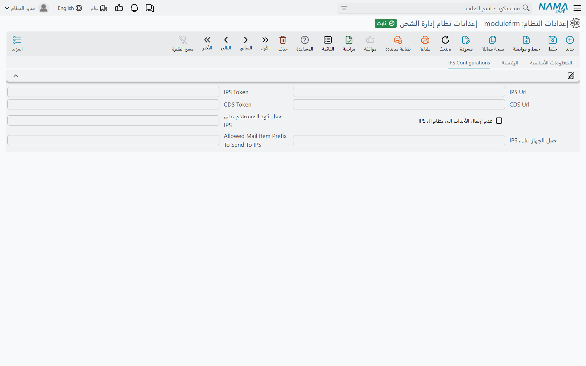

# إعدادات وحدة الشحن (Freight Configuration)

تحتفظ وحدة الشحن بقائمة قصيرة من الإعدادات العامة في شاشة واحدة: أي بند خدمة يُستخدم عندما لا
يحمل سطر قائمة الأسعار بندًا، وكيف تُقترح مواقع التخزين وتُراجَع سعتها، وأي العملات تُجمَع في
فواتير الشحن كلٌّ على حدة، وكيف يتصل الشقّ البريدي بخادم IPS الخارجي. تُضبط مرة واحدة لكل قاعدة
بيانات وتسري على كل الشركات.

افتح **نظام إدارة الشحن ← الإعدادات ← إعدادات نظام إدارة الشحن**. للشاشة تبويبان: **الرئيسية**
و**IPS Configurations**.

## تبويب الرئيسية

### إعدادات بنود الخدمة (Service Item Configuration)

**إفتراضى الشحن البحرى** و**إفتراضى التخليص الجمركى** و**إفتراضى النقل بالشاحنات** و**إفتراضى
المولدات** و**إفتراضى أخرى** و**إفتراضى البريد** تسمّي [بند خدمة](./freight-master-files.md) لكل
قسم من أقسام الخدمات في [أمر التشغيل](./operation-orders.md).

سطر الخدمة في أمر التشغيل يحتاج بند خدمة — فهو ما يُفوتَر السطر وتُحسب تكلفته تحته. وقوائم الأسعار
لا تحمل بندًا دائمًا، فإذا جلب زرّا **تحديث البيانات** و**تحديث كل الخدمات** سطرًا بلا بند خدمة،
أخذ السطر الافتراضي الخاص بقسمه. وحفظ أمر التشغيل يفعل الشيء نفسه مع أي سطر شحن بحري أو تخليص أو
نقل أو مولدات أو بريد ما زال فارغًا.

أمّا **ENS-CDD إفتراضى** و**ISPS إفتراضى** فلهما غرض آخر. يمكن لسطر الشحن البحري في أمر التشغيل أن
يحمل رسمين إضافيين، **ENS-CDD** و**ISPS**. وعند جلب سطور أمر التشغيل إلى فاتورة مبيعات أو مشتريات
شحن، يصبح كل مبلغ منهما سطرًا مستقلًا في الفاتورة تحت بند الخدمة المحدَّد هنا — فيرى العميل مثلًا
رسم الأمن سطرًا قائمًا بذاته لا مدموجًا في أجرة الشحن.

::: tip اضبط افتراضيَّي ENS-CDD وISPS قبل استخدام الرسمين
إذا حمل سطر الشحن البحري مبلغ ENS-CDD أو ISPS وكان الافتراضي المقابل فارغًا، نشأ سطر الفاتورة
الإضافي بلا بند خدمة.
:::

**إفتراضى الشركة عند إستخدام محدد العام** تقرؤه **قائمة أسعار مبيعات الخدمات** حين تكون معلَّمة
**All In**. فسعر All In يحتاج شركة يعمل فيها، وإذا كانت القائمة على الشركة العامة استُخدمت هذه
الشركة بدلًا منها. ومن دونها تُرفض القائمة — راجع [قوائم الأسعار والهوامش](./freight-pricing.md).

**نقاط تحميل متعددة** (معلَّمة افتراضيًا) تحدّد طريقة البحث عن أسعار النقل والمولدات:

- **معلَّمة** — يعمل أمر التشغيل بجدول **نقاط التحميل**، وتسعّر أزرار **تحديث البيانات** في تبويبي
  النقل والمولدات كل نقطة تحميل.
- **غير معلَّمة** — يُظهر رأس أمر التشغيل ثلاثة حقول إضافية: **ميناء الدخول** و**ميناء الخروج**
  و**نقطه التحميل**، وتبحث الأزرار نفسها عن الأسعار بها. ويجب ملء الثلاثة، وإلا توقّف الزر بالرسالة
  `gateInPort,gateOutPort,loadingPoint is required` (تظهر بالإنجليزية على الشاشات العربية أيضًا).

أمّا الإعدادات الثلاثة الأخيرة فتخصّ جانب التخزين في الوحدة — المواقع، والمستندات التي تُدخِل أوامر
التشغيل والمواد البريدية إليها وتُخرجها منها. وتجد شرحها في سياقها في
[مواقع التخزين](./freight-storage-locations.md):

| الإعداد | ماذا يفعل |
|---|---|
| **أقصى عدد إدخالات للتحقق بعد المستند الحالى** (الافتراضي 20) | عند حفظ مستند تخزين بتاريخ تليه حركات لاحقة في الموقع نفسه، يعيد النظام تمرير هذا العدد من الحركات اللاحقة ليتأكد أن الموقع لا يتجاوز سعته أبدًا. الفراغ أو الصفر يعني 1000. |
| **لا تقترح المواقع الفارغة جزئياً** | لا يقترح زر **توزيع أمر التشغيل** في مستند الاستلام إلا المواقع الشاغرة تمامًا، ويتخطّى المستخدَمة جزئيًا. |
| **جعل كل السعة في قسم موقع واحد** | يجب أن يضع **توزيع أمر التشغيل** السعة كلها داخل قسم موقع واحد؛ فيجرّب الأقسام واحدًا تلو الآخر، ويرفض إن لم يكفِ أيٌّ منها. |

### إجماليات العملات المستخدمة فى الفواتير (Currencies Used For Invoice Totals)

**العملة 1** حتى **العملة 5**. كثيرًا ما تخلط فاتورة الشحن العملات — الشحن البحري بالدولار والتخليص
بالعملة المحلية. ولكل عملة تُحدَّد هنا، تعرض فواتير مبيعات ومشتريات الشحن ومرتجعاتها وأمر البيع
حقل **إجمالي العملة 1** … **إجمالي العملة 5**: صافي قيمة السطور المسعّرة بتلك العملة. وبجانبها يحوّل
**إجمالي الفاتورة بالعملة المحلية** كل سطر بسعر صرفه.

اترك الخانة فارغة يبقَ إجماليها فارغًا.

## تبويب IPS Configurations

يربط هذا التبويب الشقّ البريدي من الوحدة (IPS) بخادم IPS الخارجي:

- **IPS Url** و**IPS Token** — عنوان خدمة IPS والرمز المرسَل مع كل استدعاء.
- **عدم إرسال الأحداث إلى نظام ال IPS** — يوقف إرسال الأحداث كله.
- **حقل كود المستخدم على IPS** و**حقل الجهاز على IPS** — حقلان في سجل المستخدم تُرسَل قيمتاهما على
  أنهما مستخدم الحدث وجهازه.
- **Allowed Mail Item Prefix To Send To IPS** — قائمة بادئات مفصولة بفواصل؛ لا يُبلَّغ إلا عن المواد
  البريدية التي تبدأ بإحداها.

ما يفعله كلٌّ منها، وكيف تتابع الأحداث التي يفشل إرسالها، تجده في
[التكامل مع نظام IPS](./ips-integration.md).

