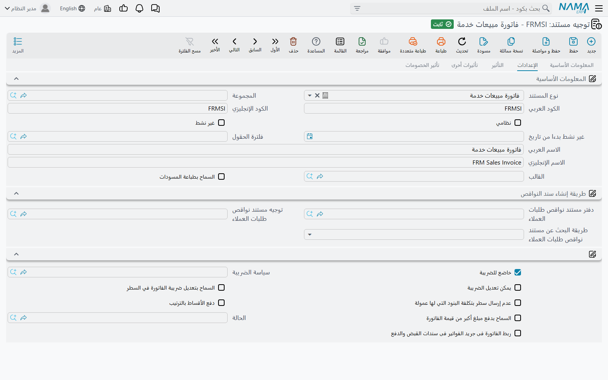
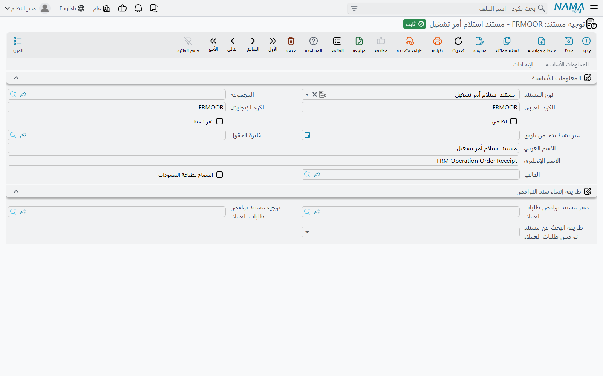
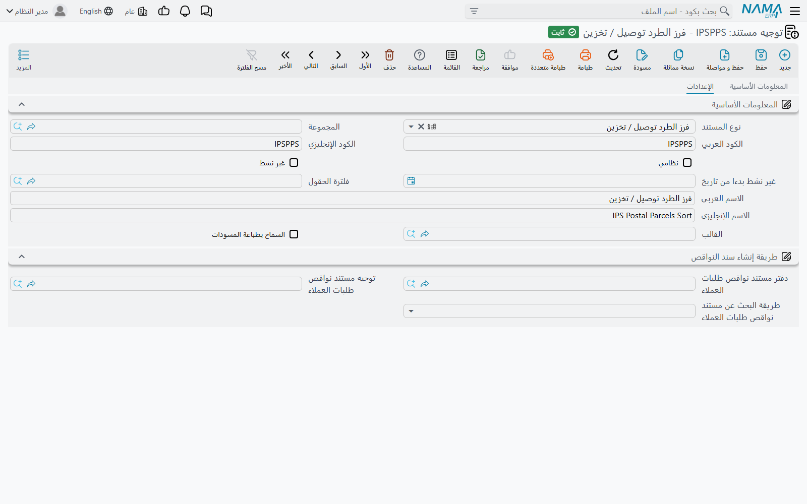

# توجيهات مستندات الشحن (Freight Document Terms)

كل مستند شحن أو بريد يُحفَظ تحت **توجيه مستند**، والتوجيه هو المكان الذي يتحدّد فيه سلوك المستند:
إلى أي الحسابات يقيّد، وأي حالة يختم بها أمر التشغيل، وأي حدث بريدي يبلّغ عنه، وهل يملأ موقع تخزين
أم يفرغه. قد يكتب مستخدمان الفاتورة نفسها فيحصلان على نتيجتين مختلفتين لأنهما اختارا توجيهين
مختلفين.

تُفتح التوجيهات من **الأساسيات ← الإعدادات ← توجيه المستند**؛ اختر نوع مستند الشحن فتظهر إعداداته
الخاصة في تبويبات التوجيه. لوحدة الشحن ثمانية أشكال من التوجيهات تشترك فيها عشرون نوع مستند. أمّا
**بوليصة شحن** و**تعديل قائمة أسعار مشتريات خدمة** فلا إعدادات شحن على توجيهيهما.

::: warning التوجيه ذو الجوانب المحاسبية الفارغة لا يقيّد شيئًا
فاتورة الشحن أو المردود أو أمر التشغيل أو مستند التوصيل الذي لا يحمل توجيهه جانبَي مدين ودائن يُحفَظ
عاديًا، ويُعالَج طلب الأعمال الخاص به عاديًا — لكنه لا ينتج أي سطور قيد. والتوجيهات التي ينشئها
معالج الإعداد لوحدة الشحن كثيرًا ما تكون على هذه الحال. فإذا لم يظهر لفاتورة شحن أثر محاسبي، فافتح
توجيهها أولًا.
:::

## توجيهات الفواتير

تشترك **فاتورة مبيعات خدمة** و**مردود مبيعات خدمة** و**أمر بيع خدمة** في شكل توجيه واحد؛ وتشترك
**فاتورة مشتريات خدمة** و**مردود مشتريات خدمة** في شكل ثانٍ؛ ولـ**أمر التشغيل** شكل ثالث. تبدو
الثلاثة متشابهة على الشاشة — التبويبات نفسها بالترتيب نفسه — وتختلف في حفنة من الحقول.

### تبويب الإعدادات

بعد معلومات الدفتر والتوجيه المعتادة تأتي مجموعة الضريبة:

| الخيار | الحقل | ماذا يفعل |
|---|---|---|
| **خاضع للضريبة** | `termConfig.taxable` | معلَّم افتراضيًا. يُنسَخ إلى رأس المستند؛ ألغِ تعليمه لتوجيه لا يحمل ضريبة أبدًا. |
| **سياسة الضريبة** | `termConfig.taxPlan` | سياسة الضريبة في رأس المستندات على هذا التوجيه. |
| **يمكن تعديل الضريبة** | `termConfig.modifiableTax` | يسمح للمستخدم بتغيير الضريبة المحسوبة على المستند. |
| **السماح بتعديل ضريبة الفاتورة في السطر** | `termConfig.allowEditingHdrTaxInDetails` | يسمح للسطر بحمل ضريبة تختلف عن الرأس. غير معلَّم افتراضيًا. |
| **دفع الأقساط بالترتيب** | `termConfig.payInstallmentsInOrder` | يجب سداد أقساط المستند بترتيبها، الأقدم أولًا. |
| **السماح بدفع مبلغ أكبر من قيمة الفاتورة** | `termConfig.allowPaymentMoreThanInvoiceAmount` | يقبل سطور دفع يتجاوز مجموعها إجمالي المستند. |

وثلاثة خيارات أخرى تخصّ عائلة المبيعات — فاتورة مبيعات خدمة ومردودها وأمر بيع خدمة. الأول يظهر في كل توجيهات الفواتير لكن لا تستخدمه إلا عائلة المبيعات؛ والآخران لا يظهران إلا في توجيهات المبيعات:

- **عدم إرسال سطر بتكلفة البنود التي لها عمولة** `termConfig.doNotSendLineForCostOfItemsWithCommission`
  — مفتاح نموذج الوكيل في الفاتورة الإلكترونية. عند تعليمه لا يُرسَل للهيئة من الخدمة التي لها بند
  عمولة إلا جزء العمولة. راجع [الفاتورة الإلكترونية](./freight-einvoicing.md).
- **الحالة** `termConfig.status` — من ملف **حالة أمر تشغيل**. عند حفظ مستند على هذا التوجيه يسجّل
  هذه الحالة على أمر التشغيل الخاص به، ويعرض أمر التشغيل أحدث حالة سُجِّلت عليه. فيمكن لتوجيه
  الفواتير النهائية أن يحمل حالة "مُفوتَر"، فتعرف من قائمة أوامر التشغيل بنظرة أي الشحنات فُوتِرت.
- **ربط الفاتورة فى جريد الفواتير فى سندات القبض والدفع**
  `termConfig.linkWithInvoiceLinesInAccountingDocument` — تُربَط الفاتورة سطرًا بسطر في جدول الفواتير
  داخل سندات القبض والصرف التي تسدّدها.

### تبويب التأثير

**تعمل مبيعات ليست مشتريات** `termConfig.isSalesNotPurchase` يظهر في كل توجيهات الفواتير، لكن لا
يقرؤه إلا **فاتورة مشتريات خدمة**. فاتورة المشتريات على توجيه كهذا تُعالَج كما تُعالَج فاتورة
المبيعات: يصبح الجانب المدين جانب الطرف والدائن جانب الشركة، وتُسدَّد بسندات قبض بدل سندات صرف.
استخدمه لمستند الشراء النادر الذي هو في حقيقته مبلغ تحصّله أنت.

وتحته مجموعتا **مدين** و**دائن** — الجانبان المحاسبيان الرئيسيان للمستند — و**إختصار القيود** تحت
الجانب الدائن.

### تبويبا تأثيرات أخرى وتأثير الخصومات

**النقدي** و**ضريبة مبيعات 1** حتى الضريبة 4 و**خصم 1** حتى **خصم 8** و**تخفيض الفاتورة** وجدول
**تأثير سندات الدفع** تعمل تمامًا كما في توجيهات فواتير سلسلة الإمداد. أمّا كيف يُبنى الجانب
المحاسبي، وما "الجانب الآخر" للضريبة، وكيف تُقيَّد الخصومات، فمشروح مرة واحدة في
[إعدادات التأثيرات المحاسبية](/ar/modules/supplychain/document-terms/doc-term-accounting-effects).

### توجيه أمر التشغيل

يحمل توجيه **أمر التشغيل** التبويبات نفسها دون حقول المبيعات. وانتبه لمعناها: أمر التشغيل يُعالَج
بالمحرّك المحاسبي نفسه الذي تُعالَج به الفاتورة الصادرة، مستخدمًا الجوانب الموجودة على توجيهه هو.
فإن أردت أن تقيّد الفواتير وحدها المبالغ — وهي الدورة المعتادة في الشحن — فاترك مدين ودائن توجيه أمر
التشغيل فارغين؛ وإلا قُيِّد الإيراد نفسه مرة من الأمر ومرة أخرى من فاتورة مبيعاته.

## توجيهات مستندات معالجة أمر التشغيل

**مستند استلام أمر تشغيل** و**مستند نقل أمر تشغيل** و**مستند تسليم أمر تشغيل** — المستندات الثلاثة
التي تُدخِل الشحنة إلى [مواقع التخزين](./freight-storage-locations.md) وتُخرجها منها — تشترك في
توجيه له إعداد واحد في تبويب **الإعدادات**:

**الحالة** `termConfig.status`. كل مستند يُحفَظ على التوجيه يسجّل هذه الحالة على أمر التشغيل الذي
يعالجه (ومستند النقل يسجّلها على كل أمر تشغيل في سطوره). فيمكن لتوجيه الاستلام أن يقول "في المخزن"
ولتوجيه التسليم أن يقول "سُلِّم"، فتتبع حالة أمر التشغيل الشحنة داخل الساحة دون أن يكتبها أحد.

## توجيهات التوصيل البريدي

يشترك **طلب توصيل** و**فاتورة توصيل** في توجيه واحد. يبدأ تبويب **التأثير** فيه بخيارات الفواتير
المعتادة — **عدم إختصار قيود مصروفات طرق الدفع** `termConfig.expandPaymentMethodEffect` و**خاضع
للضريبة** و**يمكن تعديل الضريبة** و**سياسة الضريبة** و**السماح بتعديل ضريبة الفاتورة في السطر**
و**دفع الأقساط بالترتيب** و**السماح بدفع مبلغ أكبر من قيمة الفاتورة** و**ربط الفاتورة فى جريد
الفواتير فى سندات القبض والدفع** — ثم **مدين** و**دائن**.

ويضيف توجيه **طلب توصيل** مجموعة تحوّل الطلب إلى فاتورة من تلقاء نفسه:

| الخيار | الحقل | ماذا يفعل |
|---|---|---|
| **إنشاء فاتورة توصيل تلقائى** | `termConfig.autoGenDeliveryInvoice` | عندما يُبلِّغ مستند توصيل عن نتيجة مواد الطلب، ينشئ النظام — أو يحدّث — فاتورة توصيل من الطلب. |
| **دفتر فاتورة التوصيل المنشأة** / **توجيه فاتورة التوصيل المشأة** | `termConfig.generatedInvoiceBook`، `termConfig.generatedInvoiceTerm` | الدفتر والتوجيه اللذان تُحفَظ الفاتورة المنشأة تحتهما. |
| **طريقة دفع** | `termConfig.deliveryInvoicePaymentMethod` | طريقة الدفع لسطر الدفع الوحيد الذي يوضع في الفاتورة المنشأة، ويحمل المبلغ الذي حصّله مستند التوصيل. |

وتعالج مجموعة **مصاريف الخدمة** الرسوم التي تفرضها طريقة الدفع: **خصم مصاريف خدمة 1** حتى 4 تعامل
الرسم خصمًا لا رسمًا مضافًا، وجوانب **مدين مصاريف الخدمة N** و**دائن مصاريف الخدمة N** تقيّده،
و**عدم إضافة التأثيرالمحاسبي لمصاريف الخدمة بدون الجانب المحاسبي** يتخطّى الرسم الذي جانباه فارغان
بدل تقييده على الجانبين الرئيسيين. أمّا تبويبا **تأثيرات أخرى** و**تأثير الخصومات** فكما في توجيهات
الفواتير.

دورة التوصيل كاملة في [خدمة التوصيل](./ips-delivery.md).

## توجيهات الحركة البريدية

لمستندات البريد العشرة الباقية توجيهات صغيرة، وأغلب ما تفعله يُبلَّغ إلى خادم IPS الخارجي.

الحقل `termConfig.event` إلزامي فيها جميعًا، ويظهر عنوانه على الشاشة العربية "event". يسمّي **IPS
Event** — ملف تحت **نظام إدارة الشحن ← الملفات** **كوده** هو كود الحدث البريدي الذي ينتظره خادم IPS.
عند حفظ مستند على التوجيه، توضع كل مادة بريدية (أو كيس) فيه في طابور التبليغ إلى IPS بذلك الحدث.
كيف يعمل التبليغ وكيف تعيد الإرسال تجده في [التكامل مع نظام IPS](./ips-integration.md).

::: tip أحداث الأكياس تحتاج كودًا رقميًا
يبلّغ **استلام الكيس** و**مستند إرسال الاكياس جدول الطريق** عن حدث الكيس مستخدمَين كود الحدث رقمًا،
فيجب أن تكون أكواد أحداث IPS المستخدمة في توجيهيهما أرقامًا خالصة.
:::

ما يحمله كل توجيه غير ذلك:

| المستندات | الإعدادات على التوجيه |
|---|---|
| **استلام الكيس**، **مستند إرسال الاكياس جدول الطريق** | event فقط. |
| **منافيست للجمرك**، **مذكرة تحقيق بريد** | event فقط. |
| **مستند تجميع مواد**، **سند تحويل بين المكاتب**، **سند تفريغ المخزن للجرد وإعادة التخزين**، **سند تسوية شحنة** | event و**نوع التأثير**. |
| **فرز الطرد توصيل / تخزين** | event و**نوع التأثير** و**دفتر طلب التوصيل المنشأ** و**توجيه طلب التوصيل المنشأ** وجدول **التفاصيل**. |

**نوع التأثير** `termConfig.effectType` يحدّد ما يفعله المستند في [مواقع التخزين](./freight-storage-locations.md)
المذكورة في سطوره:

- **دخول** — كل مادة بريدية تشغل وحدة واحدة من موقع سطرها. والحقل الفارغ يعمل كـ"دخول".
- **خروج** — كل مادة بريدية تحرّر وحدة واحدة.
- **بدون** — لا يمسّ المستند التخزين إطلاقًا.

فتوجيه التجميع المضبوط على "دخول" يضع المواد الواصلة على الرفوف، وتوجيه التحويل المضبوط على "خروج"
يُنزلها منها، وتوجيه الجرد المضبوط على "بدون" يعدّ فقط.

**دفتر طلب التوصيل المنشأ** و**توجيه طلب التوصيل المنشأ** في توجيه **فرز الطرد** يجعلان الفرز ينشئ
طلبات التوصيل بنفسه. عند حفظ الفرز، تُجمَّع سطوره التي ما زالت **استجابة العميل** فيها **مبدئي** حسب
رقم جوال المستلم، ويُنشأ **طلب توصيل** لكل رقم تحت هذا الدفتر والتوجيه. املأ واحدًا منهما على الأقل
لتفعيل ذلك. وتسعير هذه الطلبات موضَّح في [خدمة التوصيل](./ips-delivery.md).

