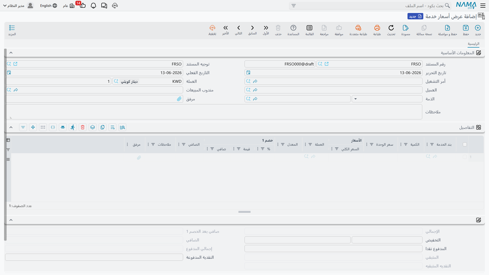
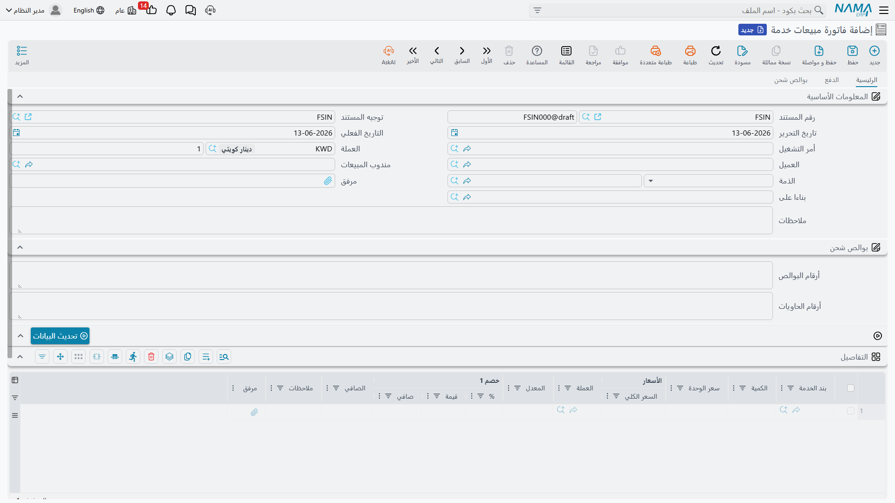
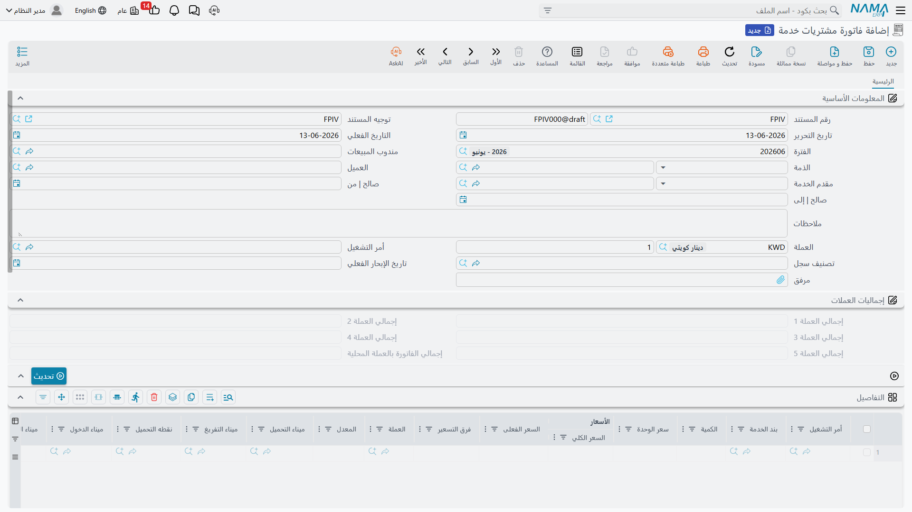

# الفواتير والمرتجعات

هنا يتحوّل العمل التشغيلي إلى أثر مالي: تبيع الخدمات للعميل، وتشتريها من الموردين، وتتابع الفرق بينهما. كل مستندات هذا القسم تجدها تحت **نظام إدارة الشحن ← المستندات**، وكلها مرتبطة عادةً بـ[أمر تشغيل](./operation-orders.md).

## دورة المبيعات

### أمر بيع خدمة (Sales Order)

نقطة البداية الاختيارية: تعرض على العميل الخدمات وأسعارها قبل تنفيذ الشحنة. أمر البيع يحمل نفس بنية الفاتورة (العميل، المندوب، أمر التشغيل، سطور الخدمة بأسعارها وضرائبها) لكنه لا يُنشئ أثرًا ماليًا — هو وعد بالخدمة، يُحوَّل لاحقًا إلى فاتورة.

### فاتورة مبيعات خدمة (Sales Invoice)

الفاتورة هي المستند الذي يسجّل البيع محاسبيًا ويحمّل العميل قيمة الخدمات. تتكوّن من:

- **العميل والمندوب وأمر التشغيل** ومقدّم الخدمة.
- **سطور الخدمة (Details)** — كل سطر ببند خدمته وكميته وسعره وعملته وضريبته، إضافةً إلى **التكلفة (Cost)** و**الفرق (Diff)** المحسوبَين تلقائيًا.
- **سطور البوالص المُفوتَرة (Invoiced Bills of Lading)** — تربط البوالص بالفاتورة، فتُجمَّع أرقام البوالص والحاويات في رأس الفاتورة.
- **سطور الفاتورة الإلكترونية (E-Invoice Details)** — نسخة مجمَّعة من السطور تُرسَل لهيئة الضرائب (انظر [الفاتورة الإلكترونية](./freight-einvoicing.md)).
- **الدفعات (Payment Lines / External Payments)** — لتسجيل التحصيل النقدي أو عبر وسائل الدفع.

::: info ربط التكلفة بالبيع تلقائيًا
عند ترحيل فاتورة المبيعات، يبحث النظام عن سطور الشراء المطابقة في نفس أمر التشغيل ويربطها بسطور البيع، فيحسب تكلفة كل خدمة ويعلّم سطور الشراء بأنها «مُستخدَمة» في هذه الفاتورة. بهذا تعرف صافي ربحك على كل خدمة، ولا تُحتسب التكلفة مرتين.
:::

### مرتجع مبيعات (Sales Return)

لعكس فاتورة مبيعات كليًا أو جزئيًا (خدمة لم تُنفَّذ، أو تصحيح فوترة)، فيُسجَّل الأثر العكسي على حساب العميل والإيراد.

## دورة المشتريات

### فاتورة مشتريات خدمة (Purchase Invoice)

تسجّل ما تشتريه من الموردين (الخط الملاحي، وكيل التخليص، شركة النقل…). تُنشأ غالبًا من [أمر التشغيل](./operation-orders.md) بزر **إنشاء فاتورة مشتريات**، فترث سطور الخدمات المشتراة. سطورها هي مصدر **التكلفة** التي تُطابَق لاحقًا بسطور البيع.

### مرتجع مشتريات (Purchase Return)

لعكس فاتورة مشتريات كليًا أو جزئيًا عند إلغاء خدمة اشتريتها من مورد أو تصحيح قيمتها.

## التوجيه (Term Config) والأثر المحاسبي

يتحكّم **توجيه المستند (Term Config)** في كيفية ترحيل كل فاتورة محاسبيًا: حسابات الإيراد/التكلفة، حسابات الضريبة (Tax / Tax 2 / ضرائب الإضافة والخصم)، حسابات الخصومات بأنواعها، والنقدية. كما يحمل توجيه فاتورة المبيعات إعدادين خاصّين بالشحن:

- **الحالة (Status)** — حالة أمر التشغيل التي تُسجَّل تلقائيًا عند ترحيل الفاتورة، فتتابع أي شحنة فُوتِرت.
- **عدم إرسال سطر تكلفة بنود العمولة** — خيار يخصّ نموذج الوكيل في [الفاتورة الإلكترونية](./freight-einvoicing.md).

::: warning تكرار البند ممنوع
لا يقبل النظام تكرار نفس بند الخدمة بنفس العملة ونفس الكمية في فاتورة واحدة، لضمان دقّة مطابقة التكلفة. إن احتجت لسطرين متطابقين، ادمجهما في سطر واحد بكمية مجمّعة.
:::
