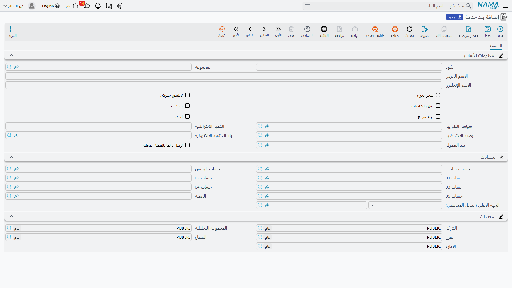
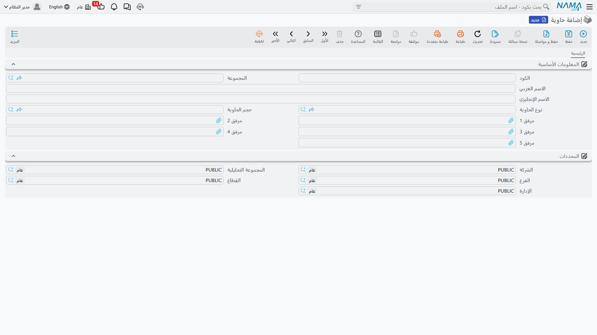
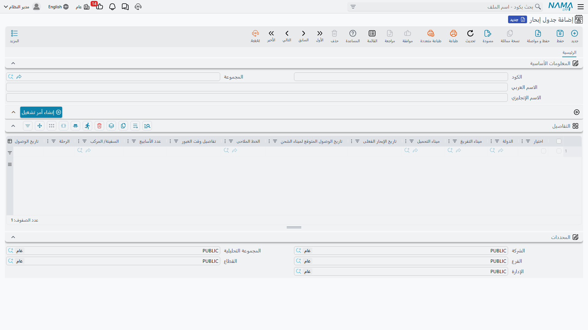

# الملفات الأساسية لإدارة الشحن

قبل أن تنشئ أول أمر تشغيل، تحتاج إلى تعريف اللبنات التي تتكوّن منها كل شحنة: ما الخدمات التي تقدّمها، وفي أي حاويات، وعلى أي بواخر، ومن وإلى أي موانئ. هذه الملفات الأساسية (Master Files) تجدها جميعًا تحت **نظام إدارة الشحن ← الملفات**، وتُعرَّف مرة واحدة ثم تُستخدم في كل المستندات.

## بنود الخدمة (Service Items)

بنود الخدمة هي "أصناف" وحدة الشحن — لكنها خدمات لا بضائع. كل بند يمثّل خدمة تبيعها أو تشتريها: شحن بحري، تخليص جمركي، نقل بري، مولّد تبريد (Genset)، بريد سريع، أو خدمة أخرى.

عند تعريف بند الخدمة تحدّد طبيعته عبر مجموعة من العلامات:

- **شحن بحري / تخليص جمركي / نقل بري / مولّدات / بريد سريع / أخرى** — تصنّف البند ضمن نوع الخدمة المناسب، فيظهر في القسم الصحيح داخل أمر التشغيل وقوائم الأسعار.
- **خطة الضريبة (Tax Plan)** — كيف تُحسب الضريبة على هذه الخدمة.
- **الحسابات الفرعية (Subsidiary Accounts)** — حسابات الإيراد/التكلفة التي يرحّل إليها البند.
- **الكمية والوحدة الافتراضية** — لتسريع إدخال السطور.

::: info حقول مرتبطة بالفاتورة الإلكترونية
يحمل بند الخدمة ثلاثة حقول تخصّ الفاتورة الإلكترونية: **كود هيئة الضرائب (Tax Authority Code)** لتصنيف الخدمة لدى الهيئة، و**بند الفاتورة الإلكترونية** لإرسال بند بديل/مجمَّع بدل البند التشغيلي، و**بند العمولة** لفصل العمولة عن التكلفة في نموذج الوكيل. تفاصيل ذلك في صفحة [الفاتورة الإلكترونية](./freight-einvoicing.md).
:::

## الحاويات وأنواعها وأحجامها

تُعرّف **الحاوية (Container)** بنوعها وحجمها:

- **نوع الحاوية (Container Type)** — جافة (Dry)، مبرّدة (Reefer)، مفتوحة السقف، خزّان… إلخ.
- **حجم الحاوية (Container Size)** — 20 قدم، 40 قدم، 40 عالية (HC)… إلخ.

تُختار الحاوية لاحقًا في أمر التشغيل وبوليصة الشحن وسطور الخدمة، وتُستخدم كأحد محدِّدات مطابقة سطور البيع بالشراء عند حساب التكلفة.

## البواخر والموانئ وجداول الإبحار

- **الباخرة (Ocean Vessel)** — ملف بسيط بكود واسم لكل سفينة تتعامل معها.
- **الميناء (Shipping Port)** — موانئ التحميل والتفريغ والوجهة النهائية، وتُستخدم في أمر التشغيل والبوليصة وسطور الخدمة.
- **جدول الإبحار (Sailing Schedule)** — جدول مرجعي يجمع في سطوره خطوط الرحلات المتاحة: الدولة، ميناء التحميل والتفريغ، الخط الملاحي، الباخرة والرحلة، التواريخ المتوقعة للإبحار والوصول، وزمن العبور (Transit Time) بعدد الأسابيع. يساعد فريق المبيعات على اختيار أنسب رحلة وأسرعها للعميل.

## السلع والدول والمواقع

- **السلعة (Commodity)** — وصف البضاعة المشحونة (إلكترونيات، مواد غذائية مبرّدة، مواد خطرة…)؛ تُستخدم في أمر التشغيل والبوليصة وكأحد محدِّدات السعر.
- **الدولة (Country)** — دول المنشأ والوجهة، وتظهر في جداول الإبحار والمواد البريدية.
- **المواقع (Location) وأقسامها وفئاتها وأنواعها** — تنظيم مكاني يُستخدم بشكل أساسي في نظام البريد لتحديد مكان حفظ المواد.

## أنواع بوالص الشحن ووحدات القياس

- **نوع بوليصة الشحن (Bill of Lading Type)** — تصنيف البوالص (Master B/L, House B/L… إلخ).
- **وحدة القياس (FRM UOM)** — وحدات القياس الخاصة بالشحن (وزن، حجم/CBM، عدد…) المستخدمة في كميات السطور.

::: tip ابدأ صغيرًا
لا تحتاج إلى تعريف كل شيء مقدّمًا. ابدأ ببنود الخدمة التي تبيعها فعلًا وأنواع الحاويات التي تتعامل معها، وأضف البواخر والموانئ والسلع تدريجيًا كلما ظهرت في شحناتك.
:::
