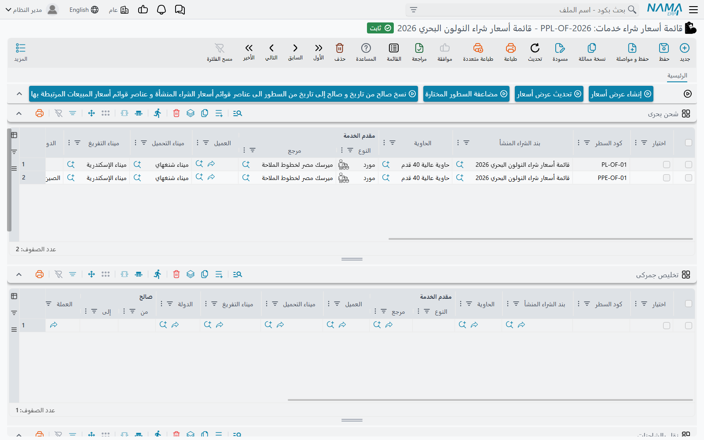
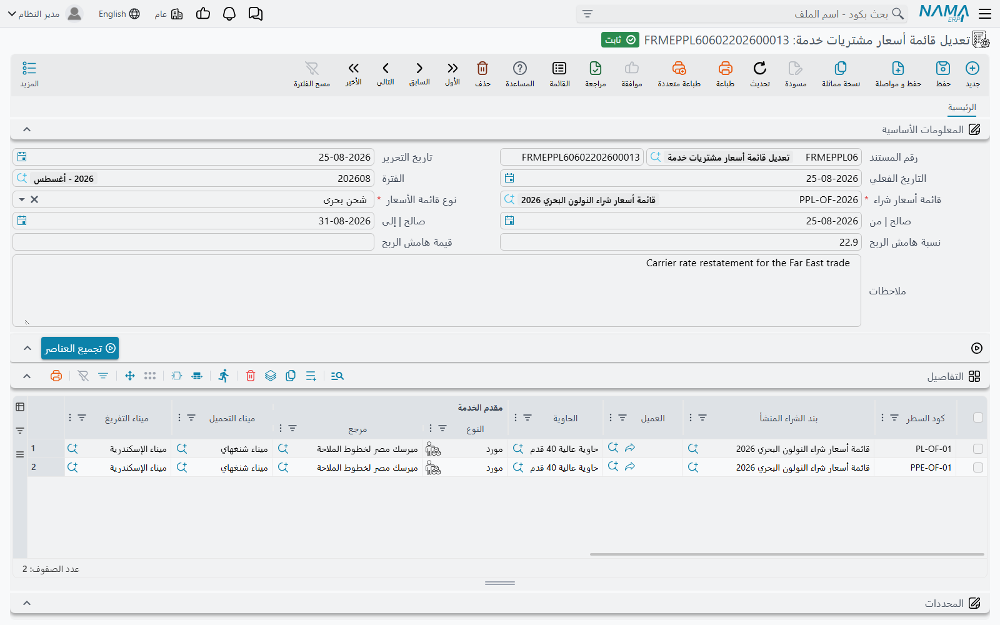

# من أسعار الموردين إلى عروض أسعار العملاء

تشرح [قوائم الأسعار والهوامش](./freight-pricing.md) ما تحمله القائمتان. وهذه الصفحة تتابع العمل الذي
يربط بينهما: يرسل خط ملاحي أسعارًا جديدة، فتُدخلها، وتحوّل ما تريده منها إلى عرض أسعار لعميل، وبعد
أشهر تغيّر الأسعار دون إعادة كتابة كل قائمة.

## العناصر وراء كل قائمة

كل سطر تحفظه في **قائمة أسعار شراء خدمات** يصبح سجلًا قائمًا بذاته، **عنصر قوائم أسعار شراء**، تحت
**نظام إدارة الشحن ← الملفات**. والشيء نفسه في جانب المبيعات: كل سطر في **قائمة أسعار مبيعات خدمات**
يصبح **عنصر قوائم أسعار بيع**. القائمة هي حيث تكتب، والعناصر هي ما تبحث فيه بقية الوحدة. فحين يبحث
زر **تحديث البيانات** في أمر التشغيل عن سعر، فإنه يبحث في العناصر.

والربط محفوظ في الاتجاهين. يعرض سطر الشراء العنصر الذي أنشأه في عمود **بند الشراء المنشأ**، ويتذكّر
سطر البيع عنصر الشراء الذي سُعِّر منه. عدّل سطرًا أو احذفه فيُحدَّث عنصره أو يُحذف معه — لذا غيّر
الأسعار في القائمة لا في العنصر، فالقائمة تكتب فوق عناصرها في المرة التالية التي تُحفَظ فيها.

## إدخال أسعار المورد

أنشئ **قائمة أسعار شراء خدمات** للمورد — و**نوع قائمة الأسعار** فيها يحدّد التبويب الذي تملؤه —
وأدخل السطور. وفي التبويب الرئيسي ثلاثة أزرار تساعد مع قائمة أسعار طويلة:

- **مضاعفة السطور المختارة** — ينسخ كل سطر علامة **اختيار** فيه معلَّمة، أسفله مباشرة، دون كود السطر
  والمرفق والعنصر. مفيد حين لا يختلف عشرون مسارًا إلا في ميناء التفريغ.
- **نسخ صالح من تاريخ و صالح إلى تاريخ من السطور الى عناصر قوائم أسعار الشراء المنشأة و عناصر قوائم
  أسعار المبيعات المرتبطة بها** — يجب حفظ القائمة أولًا. حين تمدّد صلاحية سعر في السطور، يدفع هذا
  الزر **صالح | من** و**صالح | إلى** في كل سطر إلى عنصر الشراء الخاص به، وإلى كل عنصر بيع سُعِّر من
  ذلك العنصر — فتتبع عروض الأسعار المعطاة سابقًا التواريخ الجديدة.
- **إنشاء عرض أسعار** و**تحديث عرض أسعار** — موضَّحان فيما يلي.

## تحويل الأسعار إلى عرض أسعار

علّم **اختيار** على سطور الشراء التي تريد عرضها، ثم:

- **إنشاء عرض أسعار** يفتح **قائمة أسعار مبيعات خدمات** جديدة في نافذة منبثقة، تحمل عملة قائمة
  الشراء وتواريخ صلاحيتها، والسطور المختارة منسوخة إلى التبويب المطابق لنوع قائمة الشراء.
- **تحديث عرض أسعار** يطلب قائمة أسعار مبيعات قائمة ويضيف إليها السطور المختارة.

يحتفظ كل سطر منسوخ بتكلفته، وسعر بيعه هو التكلفة مضافًا إليها هامش ربح قائمة المبيعات لذلك
التبويب: القيمة الثابتة للهامش إن وُجدت، وإلا نسبته. راجع النافذة المنبثقة، واختر العميل، واحفظ.

ويوجد الزرّان نفسهما في شاشة قائمة **عنصر قوائم أسعار شراء**، في قائمة **المزيد**، حين تفضّل انتقاء
أسعار من عدة موردين: اختر صفوف العناصر، فيبني **إنشاء عرض أسعار** قائمة أسعار مبيعات جديدة واحدة منها
جميعًا — كل عنصر في تبويب نوعه، بأسعاره كما هي — ويضيف **تحديث عرض أسعار** عناصر الشحن البحري
والتخليص والنقل والمولدات المختارة إلى قائمة قائمة.

## إعادة تسعير عرض أسعار

في **قائمة أسعار مبيعات خدمات**، لكل تبويب خدمة زر **تحديث الأسعار**. لكل سطر يعود الزر إلى عنصر الشراء
— الذي سُعِّر منه السطر، أو، للسطر المكتوب يدويًا، أول عنصر يطابق عملته وتواريخ صلاحيته وحقول المسار
في ذلك التبويب — ويحدّث السطر منه: مقدم الخدمة، والصلاحية، والعملة وسعر الصرف، والكمية، ومبلغي
ENS-CDD وISPS، والسعر مع هامش التبويب.

والسطر المكتوب يدويًا يحتاج **صالح | من** و**صالح | إلى** وعملة للبحث؛ وإن نقص أحدها أبلغ الزر عنه.

## تغيير الأسعار دفعة واحدة: تعديل قائمة أسعار مشتريات خدمة

حين يعدّل مورد جزءًا من قائمة أسعاره، يغنيك **نظام إدارة الشحن ← المستندات ← تعديل قائمة أسعار مشتريات
خدمة** عن فتح القائمة. ولا يحتاج إلى توجيه مستند.

1. اختر **قائمة أسعار شراء**، فيُملأ **نوع قائمة الأسعار**.
2. اضغط **تجميع العناصر**. تُحمَّل كل عناصر تلك القائمة في الجدول بكود السطر وشروطها الحالية.
3. غيّر ما تغيّر، وأضف سطورًا للمسارات الجديدة.
4. يمكنك ملء **صالح | من** و**صالح | إلى** في الرأس — فيحلّان عندئذٍ محلّ صلاحية كل السطور.
5. احفظ.

عند الحفظ يكتب المستند في قائمة أسعار الشراء: كل سطر يحدّث سطر القائمة الذي أنشأ عنصره، وكل سطر جديد
يصبح سطرًا جديدًا في القائمة (ومن ثمّ عنصرًا جديدًا).

## رسائل قد تظهر لك

لا نصّ عربيًا لهذه الرسائل، فتظهر بالإنجليزية على الشاشات العربية أيضًا.

| الرسالة | لماذا | ما تفعله |
|---|---|---|
| `No Price List Selected To Update` | أُكِّد **تحديث عرض أسعار** دون اختيار قائمة أسعار مبيعات. | أعد تشغيله واختر القائمة. |
| `ValidFrom is Required`، `ValidTo is Required`، `Currency is Required` | صادف **تحديث الأسعار** سطر مبيعات مكتوبًا يدويًا ينقصه الحقل اللازم للعثور على عنصر شراء. | املأ تواريخ صلاحية السطر وعملته. |
| *Details must be filled* | يُحفَظ **تعديل قائمة أسعار مشتريات خدمة** بجدول فارغ. | اضغط **تجميع العناصر** أو أضف سطورًا. |
| *duplicate Line Code {0}* | سطران في **تعديل قائمة أسعار مشتريات خدمة** يحملان كود السطر نفسه. | احذف السطر المكرَّر. |
