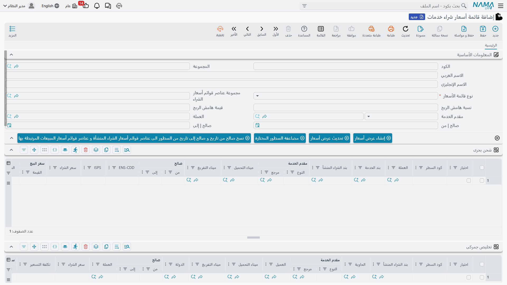
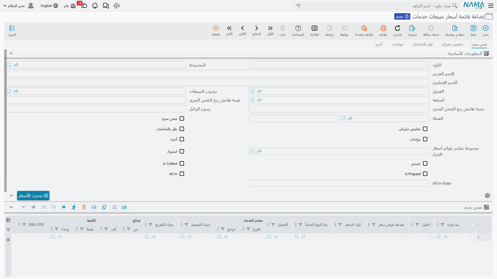

# قوائم الأسعار والهوامش

تربح شركة الشحن من الفرق بين ما تشتري به الخدمة من الموردين وما تبيعه به للعميل. قوائم الأسعار في وحدة الشحن تجعل هذا الفرق مُدارًا ومحسوبًا تلقائيًا، بدل التسعير اليدوي لكل شحنة.

تجد القوائم تحت **نظام إدارة الشحن ← الملفات**.

## قائمة أسعار الشراء (Purchase Price List)

تسجّل ما تشتري به الخدمات من الموردين. لكل قائمة:

- **مقدّم الخدمة (Service Provider)** — المورد (خط ملاحي، وكيل تخليص…).
- **بند الخدمة (Service Item)** ونوع القائمة (Price List Type).
- **فترة الصلاحية (Valid From / Valid To)** والعملة وسعر الصرف.
- **هامش (Markup)** افتراضي للقائمة.
- سطور لكل نوع خدمة: **شحن بحري، تخليص جمركي، نقل بري، مولّدات، بريد سريع، أخرى** — كلٌّ بسعره وشروطه.

## قائمة أسعار المبيعات (Sales Price List)

تسجّل ما تبيع به الخدمات للعميل. تتميّز بأنها تبني سعر البيع على سعر الشراء زائد هامش ربح لكل نوع خدمة على حدة:

- **العميل (Customer) والمندوب (Sales Man)** والسلعة، مع علامات الاستيراد/التصدير والتحصيل/الدفع المسبق.
- **هامش لكل خدمة** — *هامش الشحن البحري، هامش التخليص، هامش النقل، هامش المولّدات، هوامش أخرى* — كلٌّ منها يحمل **نسبة مئوية** و**قيمة ثابتة** معًا.
- **All-In** — خيار تسعير إجمالي موحّد بمعدّل واحد (All-In Rate) بدل تفصيل كل خدمة، مع **أتعاب وكالة (Agency Fees)**.
- **الشروط (Conditions)** النصّية لكل نوع خدمة، لتُطبع في عرض السعر للعميل.

::: tip كيف يُحسب الهامش
هامش الربح (FRM Mark) مرن: يمكن أن يكون **نسبة مئوية** فوق سعر الشراء، أو **قيمة ثابتة** تُضاف إليه، أو الاثنين معًا. هكذا تسعّر خدمة بـ «التكلفة + 10٪» وأخرى بـ «التكلفة + 50 دولارًا» وثالثة تجمع الاثنين.
:::

## من القائمة إلى أمر التشغيل

القوائم ليست مرجعًا ساكنًا — هي مصدر التسعير الفعلي. داخل [أمر التشغيل](./operation-orders.md)، يجلب زر **تحديث كل الخدمات** الأسعار من القوائم المطابقة (حسب العميل والسلعة والموانئ والحاوية ونوع الخدمة)، فيملأ تكلفة الشراء وسعر البيع في كل سطر خدمة دفعةً واحدة.

كما يتيح مستند **تعديل قائمة أسعار الشراء (Edit Purchase Price List)** تحديث أسعار الشراء بالجملة دون فتح كل قائمة على حدة.

## ربط البيع بالتكلفة

عند [فوترة المبيعات](./freight-invoicing.md)، يطابق النظام كل سطر بيع بسطر الشراء المقابل في نفس أمر التشغيل (بنفس بند الخدمة والعملة والكمية والموانئ والحاوية والسلعة)، فيحسب **التكلفة الفعلية** و**الفرق (الربح)** لكل سطر — فتعرف ربحك على مستوى الخدمة الواحدة لا الشحنة فقط.
