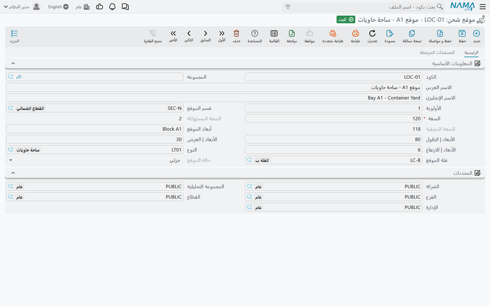
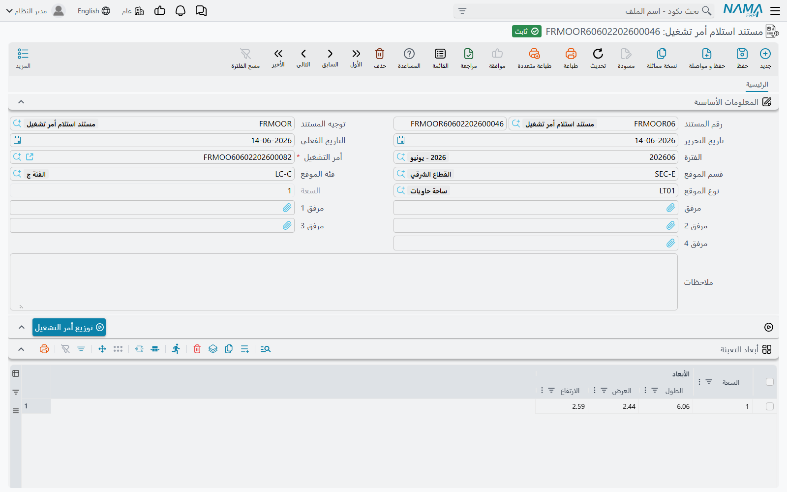
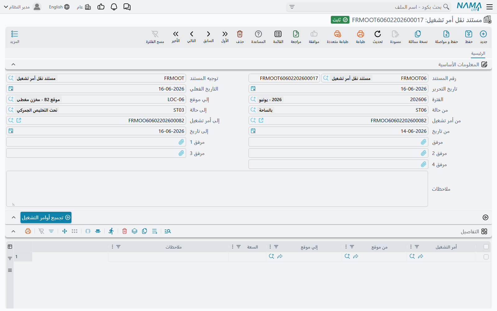

# مواقع التخزين (Storage Locations)

بعض شركات الشحن لا تكتفي بحجز مساحة على الباخرة: إنها تحتفظ بالبضاعة بنفسها — في ساحة أو مخزن جمركي
أو مخزن مبرّد — بين يوم وصولها ويوم خروجها. وتتابع وحدة الشحن ذلك عبر **مواقع** لها سعة، وثلاثة
مستندات تُدخِل بضاعة أمر التشغيل إلى موقع، وتنقلها بين المواقع، وتُخرجها. والمواقع نفسها تحمل أيضًا
المواد البريدية للشقّ البريدي من الوحدة.

لا شيء هنا يمسّ المحاسبة. فالتخزين سجلّ لمكان الأشياء ولمدى امتلاء كل مكان.

## إعداد المواقع

كل الملفات تحت **نظام إدارة الشحن ← الملفات**.

**موقع شحن** مكان يمكنه حمل البضاعة. حقوله:

- **السعة** — إلزامية ويجب أن تكون أكبر من الصفر. رقم مجرّد بأي وحدة تعدّ بها: طبليات، أمتار
  مربعة، خانات حاويات. وأوامر التشغيل والمواد البريدية تستهلكها.
- **السعة المستهلكة** و**السعة المتبقية** و**حالة الموقع** — يحدّثها النظام بعد كل حركة. الحالة
  **شاغر** ما دام لا شيء مخزّن، و**كلي** حين تبلغ السعة المتبقية صفرًا، و**جزئي** بين الحالتين.
- **الطول** و**العرض** و**الارتفاع** — المقاس الفعلي للمكان. حين توصف البضاعة بأبعادها لا تُقترح
  لها إلا المواقع التي لا يقلّ طولها وعرضها وارتفاعها عنها.
- **أبعاد الموقع** — وصف نصّي حرّ للمقاس، للقارئ البشري.
- **الأولوية** — ترتيب اقتراح المواقع: الرقم الأصغر أولًا.
- **قسم الموقع** و**النوع** و**فئة الموقع** — ثلاث طرق لتجميع المواقع. كلٌّ منها يشير إلى ملف بسيط
  من كود واسم (**قسم موقع شحن**، **نوع موقع شحن**، **فئة موقع شحن**). ويمكن قصر مستند الاستلام على
  قسم أو نوع أو فئة بعينها.

ويعرض تبويب **السندات المرتبطه** في الموقع قائمتين: **الجدول النظامى لتخزين أوامر التشغيل** — كل
حركة دخول وخروج للمكان — و**الشحنات الموجودة حاليا بالموقع**، أي المواد البريدية الموجودة فيه الآن.

::: tip رقّم الأولويات حسب المسافة من البوابة
يملأ التوزيع المواقع الأصغر أولوية أولًا. أعطِ الأماكن الأقرب إلى البوابة أصغر الأرقام، فيملأ النظام
الساحة من مقدّمتها.
:::

## كم مساحة يحتاج أمر التشغيل؟

يحمل [أمر التشغيل](./operation-orders.md) حجمه في مجموعة **أبعاد التعبئة**: رقم **السعة** واحد،
وجدول سطور أبعاد — لكل سطر **السعة** و**الطول** و**العرض** و**الارتفاع**. فإذا وُجدت سطور أبعاد كان
مجموع سعاتها هو سعة الأمر؛ ولا يُستخدم رقم الرأس إلا حين يكون الجدول فارغًا.

## الاستلام: مستند استلام أمر تشغيل

افتح **نظام إدارة الشحن ← الملفات ← مستند استلام أمر تشغيل** واختر **أمر التشغيل**. تُنسَخ سطور
أبعاده إلى جدول **أبعاد التعبئة** في المستند، حيث تصحّحها بما وصل فعلًا. ويمكنك تضييق البحث اختياريًا
بـ**قسم الموقع** أو **فئة الموقع** أو **نوع الموقع**.

ثم اضغط **توزيع أمر التشغيل**. يبني النظام جدول **التفاصيل** — سطرًا لكل موقع بالسعة الموضوعة فيه:

1. يسرد المواقع غير المعلَّمة بـ**منع الاستعمال** وغير **الكلية**، داخل القسم والفئة والنوع الذي
   اخترته، الأصغر **أولوية** أولًا.
2. إن لم تكن في المستند سطور أبعاد، يصبّ سعة أمر التشغيل في تلك المواقع واحدًا تلو الآخر، مالئًا
   السعة المتبقية لكل موقع قبل الانتقال إلى التالي.
3. وإن كانت فيه سطور أبعاد، وُضع كل سطر وحده، ولا يوضع إلا في مواقع تتّسع لطوله وعرضه وارتفاعه.

ويغيّر إعدادان في الوحدة طريقة البحث — راجع [إعدادات وحدة الشحن](./freight-configuration.md):
**لا تقترح المواقع الفارغة جزئياً** لا يقترح إلا الأماكن الشاغرة تمامًا، و**جعل كل السعة في قسم موقع
واحد** يشترط أن يتّسع قسم واحد للأمر كله، فيجرّب الأقسام واحدًا تلو الآخر.

يمكنك تعديل السطور المقترحة قبل الحفظ؛ وحين تختار موقعًا بيدك يُخفي البحث المواقع الكلية، والمواقع
الأصغر من أبعاد الأمر إن كانت له سطور أبعاد.

عند حفظ المستند تمتلئ المواقع، وتُستبدل سطور أبعاد أمر التشغيل بسطور المستند، و— إن حمل توجيه
المستند **الحالة** — يأخذ أمر التشغيل تلك الحالة (راجع [توجيهات مستندات الشحن](./freight-document-terms.md)).

::: warning مستند استلام واحد لكل أمر تشغيل
لا يُستلَم أمر التشغيل إلا مرة واحدة، ويجب أن يضع المستند سعة الأمر بالضبط — لا أكثر ولا أقل. القواعد
ورسائلها مسرودة في [أوامر التشغيل](./operation-orders.md).
:::

## النقل: مستند نقل أمر تشغيل

ينقل **مستند نقل أمر تشغيل** البضاعة المخزّنة من موقع إلى آخر — لتجميع صفّ نصف فارغ، أو لنقل شحنة
إلى منطقة التحميل.

املأ حقول الاختيار في الرأس، واختر **إلي موقع**، ثم اضغط **تجميع أوامر التشغيل**:

- **من تاريخ** / **إلى تاريخ** — أوامر التشغيل التي يقع تاريخها الفعلي في المدى.
- **من حالة** / **إلى حالة** — أوامر التشغيل التي تقع حالتها في المدى.
- **من أمر تشغيل** / **إلى أمر تشغيل** — مدى من أكواد أوامر التشغيل.

لكل أمر تشغيل مطابق، ولكل موقع ما زالت فيه بضاعته، يضيف النظام سطرًا ينقل تلك البضاعة من موقعها
الحالي إلى **إلي موقع**. عدّل السطور كما تحتاج — قسّم سعة، غيّر وجهة — ثم احفظ. ولا يعرض البحث عن
الوجهة موقعًا كليًا ولا مصدر السطر نفسه.

## الإخراج: مستند تسليم أمر تشغيل

**مستند تسليم أمر تشغيل** هو بوابة الخروج. اختر **أمر التشغيل** فيمتلئ جدول **التفاصيل** وحده بكل
موقع توجد فيه بضاعة الأمر حاليًا والسعة التي تشغلها فيه. والحفظ يفرغ تلك المواقع ويضبط حالة أمر
التشغيل من توجيه التسليم.

## المواد البريدية تتشارك المواقع

تستخدم المستندات البريدية المواقع نفسها، وحدة لكل مادة بريدية. أمّا هل يضع المستند البريدي المواد في
مواقع سطوره، أو يُخرجها منها، أو لا يمسّ التخزين، فيحدّده **نوع التأثير** في توجيهه — راجع
[توجيهات مستندات الشحن](./freight-document-terms.md).

وفي مستند **سند تفريغ المخزن للجرد وإعادة التخزين** يملأ زر **تجميع الشحنات من الموقع** الجدول بكل
مادة بريدية مخزّنة حاليًا في أي موقع، ومع كلٍّ موقعها، جاهزة للعدّ.

## الحركات بأثر رجعي

يُفحَص كل مستند تخزين عند حفظه: في تاريخه، يجب أن يتّسع كل موقع يمسّه لما يجلبه. والمستند المؤرَّخ
في الماضي يُفحَص أكثر — تُعاد الحركات التي تليه في الموقع نفسه للتأكد من أن أيًّا منها لن يفيض الآن.
ويحدّد إعداد الوحدة **أقصى عدد إدخالات للتحقق بعد المستند الحالى** (20 افتراضيًا، و1000 إن كان
فارغًا) عدد تلك الحركات اللاحقة المُعادة. أمّا المستند الذي يُنقل إلى تاريخ لاحق فيُفحَص مقابل عشرة
أضعاف هذا العدد، ولا يقلّ أبدًا عن 1000.

## رسائل قد تظهر لك

| الرسالة | لماذا | ما تفعله |
|---|---|---|
| «لا يوجد موقع بالمعايير الحالية» | لم يجد **توزيع أمر التشغيل** موقعًا فيه متّسع ويطابق القسم والفئة والنوع في المستند. | امسح القسم أو الفئة أو النوع أو غيّرها، أو حرّر بعض المساحة. |
| «لا يوجد مواقع كافية فى قسم واحد لتوزيع أمر التشغيل» | **جعل كل السعة في قسم موقع واحد** مفعَّل، ولا يوجد قسم فيه سعة حرّة كافية وحده. | حرّر مساحة في قسم واحد، أو أوقف الإعداد. |
| «لا يوجد سعة كافية بالأبعاد الآتية : الطول {0} , العرض {1} , الأرتفاع {2} , السعة {3}» | المواقع التي تتّسع لأبعاد ذلك السطر لم يبقَ فيها هذا القدر من المكان. | حرّر موقعًا كبيرًا بما يكفي، أو صحّح سطر الأبعاد. |
| «لا يوجد سعة كافية فى سكشن {0} بالأبعاد الآتية : الطول {1} , العرض {2} , الأرتفاع {3} , السعة {4}» | الحالة نفسها حين يجب أن يبقى الأمر داخل قسم واحد. والرسالة تسمّي آخر قسم جُرِّب. | كما سبق، داخل قسم واحد. |
| «السعى المتبقية {0} للموقع {1} أقل من السعة المطلوبة {2}» | في تاريخ المستند لا يتّسع الموقع لما يضعه المستند فيه. | استخدم موقعًا آخر، أو قلّل السطر، أو أخرج بضاعة أولًا. |
| «السعة المستهلكة بواسطة المستند {0} بتاريخ {1} تساوى {2} و هو اكبر من سعة الموقع {3}» | المستند يتّسع في تاريخه، لكن حركة لاحقة تسمّيها الرسالة ستفيض عندئذٍ عن الموقع. وهذا معتاد مع المستندات المؤرَّخة بأثر رجعي. | أرّخ المستند بعد تلك الحركة، أو عدّل المستند اللاحق. |
| «السعة المستهلكة لأمر التشغيل {0} تتعارض مع إدخالات المستند {1} بتاريخ {2}» | سيحمل أمر التشغيل عبر الزمن أكثر من سعته أو أقل من لا شيء — كتسليم مؤرَّخ قبل الاستلام. | راجع تواريخ وسعات استلام الأمر ونقله وتسليمه. |
| *Consumed capacity {0} must be less than or equal to location capacity {1}* | خُفِّضت **السعة** في موقع إلى أقل مما هو مخزّن فيه فعلًا. هذه الرسالة لا نصّ عربيًا لها، فتظهر بالإنجليزية على الشاشات العربية أيضًا. | أخرج بضاعة أولًا، أو أبقِ السعة كما هي. |
| «يجب ان تكون السعة أكبر من الصفر» | يُحفَظ موقع بسعة فارغة أو صفر أو سالبة. | أدخل سعة موجبة. |
