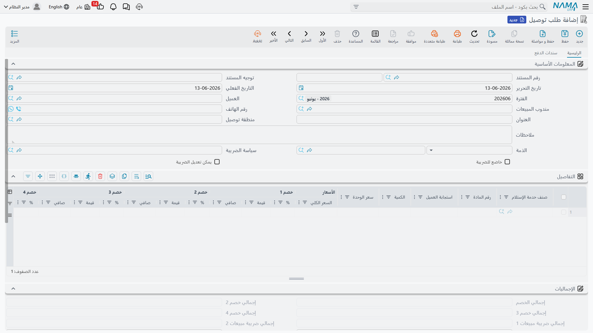
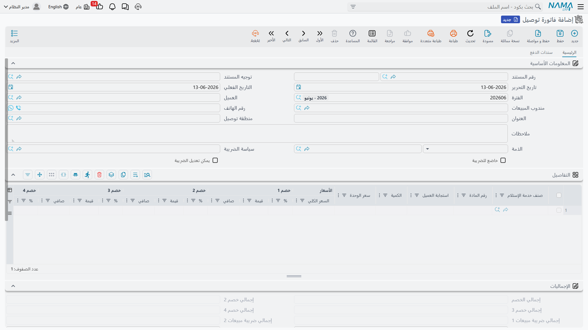

# خدمة التوصيل (Delivery)

المحطة الأخيرة في رحلة المادة البريدية: تسليمها إلى العميل وتحصيل قيمة الخدمة وأي رسوم جمركية. مستندا هذه المرحلة — **طلب التوصيل** و**فاتورة التوصيل** — يجمعان بين الجانب التشغيلي (مَن يتسلّم وأين ومتى) والجانب المالي (كم يُحصَّل)، وكلاهما يُرسَل إلكترونيًا لهيئة الضرائب.

تجدهما تحت **نظام إدارة الشحن ← المستندات**.

## طلب التوصيل (Delivery Request)

يبدأ التوصيل بطلب يحدّد العميل وعنوان التسليم وموعده:

- **العميل (Customer) والمندوب (Sales Man)**.
- **العنوان (Address) وعنوان الشحنة** و**رقم الهاتف** و**منطقة التوصيل (Delivery Area)**.
- **تاريخ التوصيل وتاريخ الاستحقاق**.
- **سطور الخدمة (Details)** — بنود خدمة التوصيل المطلوبة بأسعارها.
- **الدفعات (Payment Lines / External Payments)** لتسجيل التحصيل عند التسليم (الدفع عند الاستلام).

## فاتورة التوصيل (Delivery Invoice)

تسجّل الفاتورة قيمة خدمة التوصيل محاسبيًا وتحمّلها للعميل. تحمل نفس بنية الطلب (العميل، العنوان، منطقة التوصيل، سطور الخدمة، الدفعات)، لكنها تُنشئ الأثر المالي وتُرسَل لهيئة الضرائب كفاتورة إلكترونية. راجع [التعامل مع الفاتورة الإلكترونية](./freight-einvoicing.md) لتفاصيل الإرسال.

## تسعير التوصيل

يُبنى تسعير التوصيل على ملفّين أساسيّين:

- **بند خدمة التوصيل (Delivery Service Item)** — الخدمة التي تبيعها (توصيل عادي، سريع، رسوم جمركية…).
- **سعر خدمة التوصيل (Delivery Service Price)** — جدول الأسعار الذي يربط بند الخدمة بالسعر، غالبًا حسب **منطقة التوصيل**، فتُسعَّر الوجهات الأبعد بسعر أعلى تلقائيًا.

## معالجة عدم التسليم

ليست كل محاولة توصيل تنجح. عند تعذّر التسليم (المستلِم غير موجود، عنوان خاطئ، رفض الاستلام)، تُسجَّل الحالة بـ**سبب عدم التسليم (Non-Delivery Reason)** و**إجراء عدم التسليم (Non-Delivery Measure)** — المعرَّفَين في الملفات الأساسية — وتُعاد المادة إلى الفرز لإعادة المحاولة أو الاحتجاز. كما تتيح **أحداث (Events)** التتبُّع تسجيل محطات المادة عبر الرحلة.

::: tip التوصيل يكمّل دورة البريد
طلب وفاتورة التوصيل هما حيث تتحوّل العمليات البريدية إلى إيراد. اربط **مناطق التوصيل** بأسعار خدمة واضحة مرّة واحدة، فتُسعَّر طلبات التوصيل تلقائيًا، وتتدفّق الفواتير الإلكترونية للهيئة دون عمل يدوي.
:::
