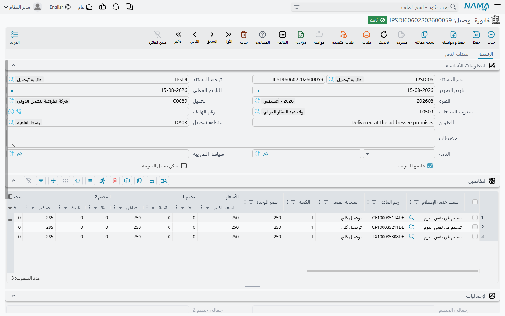

# خدمة التوصيل (Delivery)

المحطة الأخيرة في رحلة المادة البريدية: تسليمها إلى العميل وتحصيل قيمة الخدمة وأي رسوم جمركية.
مستندا هذه المرحلة — **طلب التوصيل** و**فاتورة التوصيل** — يجمعان بين الجانب التشغيلي (مَن يتسلّم
وأين ومتى) والجانب المالي (كم يُحصَّل).

تجدهما تحت **نظام إدارة الشحن ← المستندات**.

## طلب التوصيل (Delivery Request)

يبدأ التوصيل بطلب يحدّد العميل وعنوان التسليم وموعده:

- **العميل (Customer) والمندوب (Sales Man)**.
- **العنوان** و**عنوان التوصيل** و**رقم الهاتف** و**منطقة توصيل**.
- **تاريخ التوصيل وتاريخ الاستحقاق**.
- **سطور الخدمة (Details)** — سطر لكل مادة بريدية، ببند خدمة التوصيل وسعره.
- **الدفعات (Payment Lines / External Payments)** لتسجيل التحصيل عند التسليم (الدفع عند الاستلام).

ولا تُكتب الطلبات عادةً باليد. فحين يُحفَظ [فرز الطرد توصيل / تخزين](./ips-mail-items.md) على توجيه
يسمّي **دفتر طلب التوصيل المنشأ** أو **توجيه طلب التوصيل المنشأ**، ينشئ الطلبات بنفسه:

1. يأخذ سطور الفرز التي ما زالت **استجابة العميل** فيها **مبدئي** — المواد التي تنتظر الخروج.
2. يجمّعها حسب رقم جوال المستلم، فيخرج كل ما يخصّ شخصًا واحدًا معًا.
3. ينشئ **طلب توصيل** لكل رقم جوال، تحت ذلك الدفتر والتوجيه، بسطر لكل مادة بريدية.
4. يسعّر كل سطر من **ملف أسعار خدمة توصيل** (أدناه): أول مادة في المجموعة بـ**السعر لأول شحنة**، وكل
   مادة بعدها بـ**السعر للشحنات التالية**.

وإعادة حفظ الفرز تعيد بناء تلك الطلبات بدل إضافة طلبات جديدة.

## فاتورة التوصيل (Delivery Invoice)

تحمّل الفاتورة قيمة التوصيل للعميل. تحمل نفس بنية الطلب (العميل، العنوان، منطقة التوصيل، سطور الخدمة،
الدفعات). واختيار طلب في حقل **بناءا على** ينسخ منه العميل والمندوب ومنطقة التوصيل وتاريخه والعناوين
ورقم الهاتف والسطور.

ويمكن للفاتورة أن تنشئ نفسها أيضًا. فإذا كان **إنشاء فاتورة توصيل تلقائى** معلَّمًا في توجيه الطلب، ففي
اللحظة التي يبلّغ فيها مستند توصيل عن نتيجة مواد الطلب، ينشئ النظام — أو يحدّث — فاتورة التوصيل لذلك
الطلب، تحت **دفتر فاتورة التوصيل المنشأة** و**توجيه فاتورة التوصيل المشأة**، بسطر دفع واحد بـ**طريقة
دفع** التوجيه وبالمبلغ الذي حصّله مستند التوصيل. ومستند التوصيل نفسه يكتب نتيجة كل مادة في سطور الطلب
— **توصيل كلي** أو **فشل التوصيل**. وإعدادات التوجيه في [توجيهات مستندات الشحن](./freight-document-terms.md).

::: warning قرّر أيّ المستندين يقيّد الإيراد
يشترك الطلب والفاتورة في شكل توجيه واحد، وكلاهما يُعالَج بالجوانب المحاسبية في توجيهه هو. فإن كانت
الفاتورة هي التي تحمل الإيراد، فاترك مدين ودائن توجيه الطلب فارغين — وإلا قُيِّد التوصيل نفسه مرتين.
:::

## تسعير التوصيل

يُبنى تسعير التوصيل على ملفّين أساسيّين:

- **بند خدمة توصيل** — الخدمة التي تبيعها (توصيل عادي، سريع، رسوم جمركية…)، بسياسة ضريبتها وحساباتها
  الفرعية.
- **ملف أسعار خدمة توصيل** — جدول أسعار. يسمّي كل سطر فيه **فئة بريد** و**السعر لأول شحنة** و**السعر
  للشحنات التالية**، و**من تاريخ** / **إلى تاريخ** اختياريين.

حين يسعّر الفرز طلبًا، يأخذ أول سطر سعر تطابق فئة البريد فيه المادة وتغطّي تواريخه اليوم؛ والمادة التي
لا يطابقها سطر تُسعَّر بصفر. فاحتفظ بسطر ساري واحد لكل فئة بريد، وأغلق **إلى تاريخ** في السطر قبل
إضافة بديله.

## معالجة عدم التسليم

ليست كل محاولة توصيل تنجح. عند تعذّر التسليم (المستلِم غير موجود، عنوان خاطئ، رفض الاستلام)، تُسجَّل
الحالة بـ**سبب عدم التوصيل** و**إجراء عدم التوصيل** — المعرَّفَين في الملفات الأساسية — في فرز الطرد،
وتُبلَّغ إلى IPS مع حدث عدم التسليم (راجع [التكامل مع نظام IPS](./ips-integration.md)).

::: tip التوصيل يكمّل دورة البريد
طلب وفاتورة التوصيل هما حيث تتحوّل العمليات البريدية إلى إيراد. احتفظ بسعر ساري لكل فئة بريد، وأعطِ
توجيه الفرز دفترًا لطلبات التوصيل، فتُنشأ الطلبات وتُسعَّر أثناء فرز المواد.
:::
