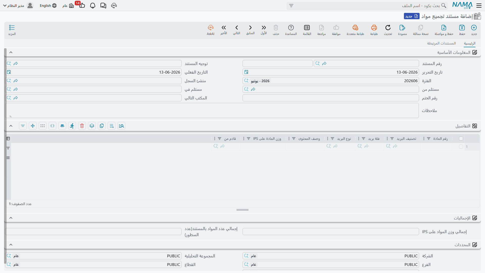
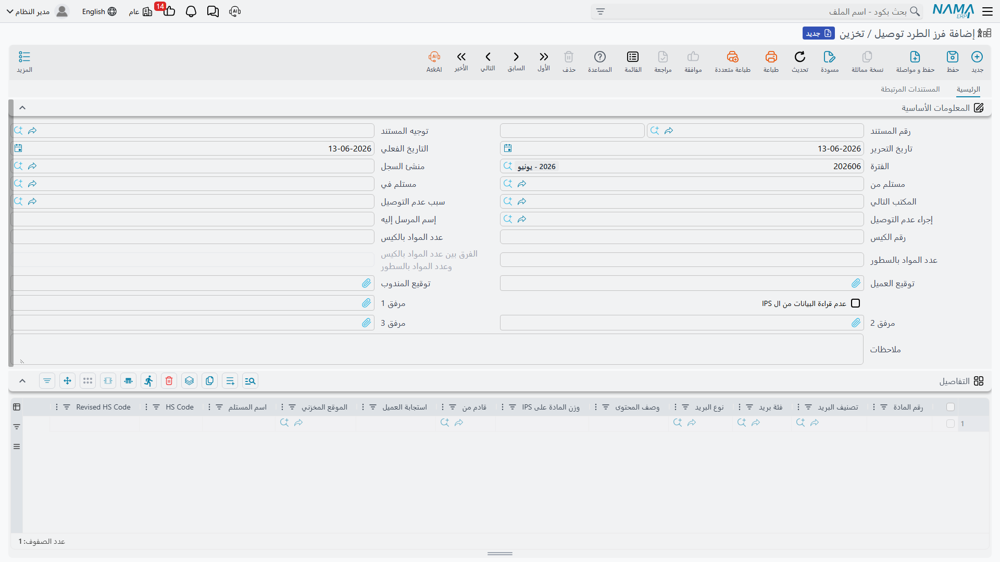

# المواد البريدية

بعد فتح الأكياس الواردة، تصبح **المادة البريدية** هي محور العمل: تُسجَّل، وتُحوَّل بين المكاتب، وتُسوَّى، وتُجرَد، وتُفرَز للتوصيل. هذه الصفحة تغطّي المستندات التي تدير دورة حياة المادة البريدية، وكلها تحت **نظام إدارة الشحن ← المستندات**.

كل هذه المستندات تشترك في رأس موحّد يحمل **المُستلَم منه** و**المُستلَم فيه** و**المكتب التالي**، وإجمالي عدد المواد ووزنها، ورقم ختم جديد عند إعادة الإغلاق.

## مستند تجميع المواد (Mail Item Manifest)

نقطة دخول المواد إلى النظام: عند فتح الأكياس الواردة، يسجّل مستند التجميع كل مادة بداخلها — معرّفها، وصنفها وفئتها، كود HS، وزنها المُعلَن والفعلي، دولة المنشأ، المستلِم، وقيمتها وعملتها. هو الذي يبني المخزون البريدي الذي تعمل عليه بقيّة المستندات.

## سند التحويل بين المكاتب (Mail Item Transfer)

تنتقل المواد من مكتب إلى آخر في طريقها للتوصيل. يسجّل سند التحويل حركة مجموعة من المواد من **المُستلَم منه** إلى **المكتب التالي**، فيحدّث موقعها في الشبكة ويترك أثرًا لتتبّعها.

## سند تسوية شحنة (Mail Item Adjustment)

لتصحيح بيانات المواد عند اكتشاف فروقات — وزن مختلف، تصنيف خاطئ، كود HS مُعدَّل، أو تصحيح عدد. يحافظ هذا المستند على دقّة المخزون البريدي دون الحاجة لإلغاء المستندات السابقة.

## سند تفريغ المخزن للجرد وإعادة التخزين (Mail Item Stock Taking)

للجرد الدوري للمواد البريدية المخزّنة: يُفرِّغ المخزن للعدّ الفعلي ثم يعيد التخزين، فتطابق ما هو موجود فعليًا بما هو مسجّل في النظام وتسوّي الفروقات.

## مذكرة تحقيق بريد (Mail Retention Document)

بعض المواد تُحتجَز ولا تُسلَّم فورًا — لأسباب جمركية أو أمنية أو لتعذّر الوصول للمستلِم. تسجّل مذكرة التحقيق المواد المحتجَزة و**سبب الاحتجاز (Retention Reason)**، لمتابعتها حتى يُبَتّ فيها (إفراج، إعادة، إتلاف).

## مستند الفرز (Postal Parcels Sort)

قبل التوصيل، تُفرَز المواد. مستند الفرز هو الأغنى في هذه المجموعة:

- يسجّل **المواد المفروزة** للتوصيل، ويقارن **عدد مواد الكيس** بـ**عدد المواد في الشبكة (Grid)**، ويُبرز **الفرق** تلقائيًا.
- يسجّل **المواد المفقودة من الكيس (Missing Mail Items)** عند اكتشاف نقص.
- يربط **سبب وإجراء عدم التسليم (Non-Delivery Reason / Measure)** للمواد المتعذّر تسليمها.
- يلتقط **توقيع العميل وتوقيع الموظف** كإثبات.
- يتيح خيار **عدم جلب البيانات من IPS** للعمل اليدوي عند الحاجة.

::: tip تصنيف المواد يحكم كل شيء
دقّة **الفئة والصنف والفئة الفرعية** (Class / Category / Subclass) وكود HS على كل مادة هي ما يجعل الفرز والتخليص والتسعير صحيحًا. اضبط ملفات التصنيف الأساسية أولًا (انظر [نظرة عامة على البريد](./ips-postal-intro.md))، ثم دع المستندات تبني عليها.
:::
