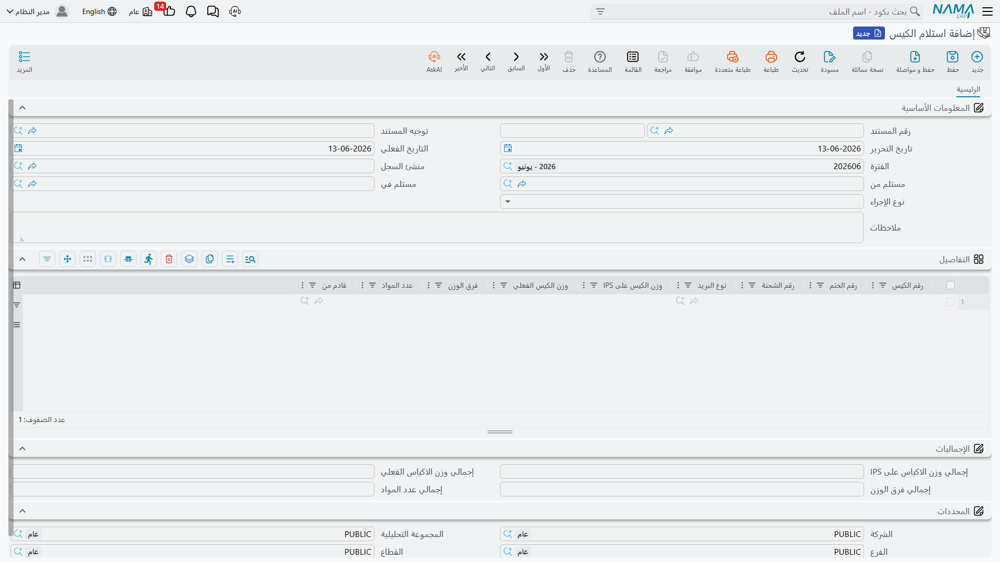

# الأكياس البريدية (Receptacles)

الكيس البريدي (Receptacle) هو حاوية النقل التي تجمع عدّة مواد بريدية للنقل بين المكاتب — كيس أو صندوق مختوم. قبل أن تتعامل مع المواد الفردية، تتعامل مع الأكياس: تستلمها، تخلّصها جمركيًا، وترسلها على خطوط الطريق. مستندات هذه المرحلة تجدها تحت **نظام إدارة الشحن ← المستندات**.

كل مستندات الأكياس تشترك في رأس يحمل **المُستلَم منه** و**المُستلَم فيه**، وإجمالي عدد المواد ووزن الأكياس.

## استلام الكيس (Receptacles Receipt)

نقطة دخول البريد الوارد. عند وصول الأكياس من الخارج، يسجّل هذا المستند كل كيس ببياناته:

- **معرّف الكيس (Receptacle ID)** و**رقم الختم (Seal No)** و**معرّف الإرسالية (Dispatch ID)**.
- **الفئة الفرعية للبريد** ودولة المنشأ.
- **عدد المواد داخل الكيس** ووزنه **المُعلَن (IPS)** مقابل **الوزن الفعلي**، مع **فرق الوزن** المحسوب تلقائيًا.
- **نوع الإجراء (Action Type)** الذي يحدّد طبيعة عملية الاستلام.

كما يجمّع المستند **إجمالي الوزن الفعلي** و**انحراف الوزن الكلّي** للمطابقة الجمركية.

::: info فرق الوزن مؤشّر مهم
المقارنة بين الوزن المُعلَن في وثائق الإرسالية والوزن الفعلي عند الاستلام تكشف النقص أو التلاعب مبكرًا. يحسب النظام الفرق على مستوى الكيس الواحد وعلى مستوى المستند كله.
:::

## منافيست للجمرك (Manifest For Custody)

لتخليص المواد الخاضعة للرقابة الجمركية، يجمّع هذا المستند المواد البريدية في منافيست يُقدَّم للجمارك. يحمل بيانات المواد (الأصناف، أكواد HS، القيم، دول المنشأ) في صورة تتوافق مع متطلّبات الإفراج الجمركي عن البريد الوارد.

## مستند إرسال الأكياس على جدول الطريق (Transfer Receptacles)

عكس الاستلام: لإرسال الأكياس الصادرة على خطوط النقل (جدول الطريق) إلى المكتب التالي أو الوجهة الخارجية. يسجّل الأكياس المُرسَلة وأوزانها ومساراتها، فيكتمل تتبّع الكيس من لحظة استلامه حتى مغادرته الشبكة.

## كيف تتّصل الأكياس بالمواد

العلاقة بسيطة ومتدرّجة: **استلام الكيس** يُدخِل الأكياس المختومة إلى الشبكة → عند فتحها يسجّل [مستند تجميع المواد](./ips-mail-items.md) المواد الفردية بداخلها → ومنها تبدأ رحلة [المادة البريدية](./ips-mail-items.md) نحو التحويل والفرز و[التوصيل](./ips-delivery.md). هكذا ينتقل العمل من وحدة النقل (الكيس) إلى وحدة التسليم (المادة).
