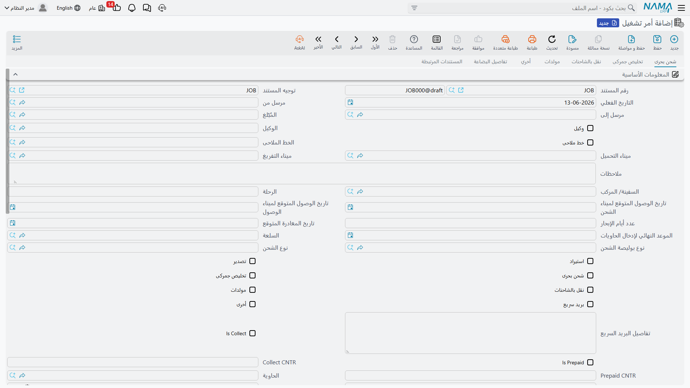

# أوامر التشغيل (Operation Orders)

أمر التشغيل هو قلب وحدة إدارة الشحن. فكّر فيه باعتباره **ملف الشحنة الكامل**: كل ما يخصّ شحنة واحدة — الأطراف، الباخرة والرحلة، الموانئ، الحاوية، والخدمات بتكاليفها وأسعار بيعها — يعيش هنا. ومن أمر التشغيل تتفرّع بوليصة الشحن وفواتير المبيعات والمشتريات.

تجده تحت **نظام إدارة الشحن ← المستندات ← أمر تشغيل**.

## أطراف الشحنة

يبدأ أمر التشغيل بتحديد مَن يشارك في الشحنة:

- **المُصدِّر (Shipper)** — العميل صاحب البضاعة المُرسِلة.
- **المُرسَل إليه (Consignee)** — الجهة المستلِمة.
- **الوكيل (Agent)** و**جهة الإخطار (Notify / Notify 2)** — الأطراف التي تُخطَر بوصول الشحنة.
- **الخط الملاحي (Shipping Line)** — المورد الذي ينفّذ الشحن البحري.
- **حساب العميل (Subsidiary)** — الجهة التي تُحاسَب ماليًا (عميل، مورد، موظف، حساب…).

كما تحدّد ما إذا كانت الشحنة **استيرادًا (Import)** أم **تصديرًا (Export)**، و**التحصيل (Collect)** أم **الدفع المسبق (Prepaid)**.

## بيانات الرحلة والحاوية

في هذا القسم تُسجِّل تفاصيل النقل:

- **الباخرة (Ocean Vessel) والرحلة (Voyage)** ورقم الحجز لدى الناقل.
- **ميناء التحميل والتفريغ والوجهة النهائية** ونقاط الدخول والخروج من الموانئ.
- **التواريخ المقدّرة** للتحميل والتفريغ والإبحار الفعلي وأيام الإبحار.
- **الحاوية ونوعها وعددها** ورقم الحاوية الإجمالي.
- بيانات الشحنات الحسّاسة مثل **درجة الحرارة والرطوبة والتهوية** للحاويات المبرّدة.
- **السلعة (Commodity)** ونوع الشحن وحالة التشغيل (Operation Status).

## الخدمات — جوهر أمر التشغيل

ما يميّز أمر التشغيل هو تقسيمه الخدمات إلى **أقسام منفصلة**، كل قسم له سطوره الخاصة بتكلفته وسعر بيعه:

| القسم | الغرض |
|------|-------|
| **سطور الشحن البحري** (Ocean Freight) | أجور الشحن من الخط الملاحي |
| **سطور التخليص الجمركي** (Custom Clearance) | رسوم وخدمات التخليص |
| **سطور الشاحنات** (Trucking) | النقل البري من/إلى الميناء |
| **سطور المولّدات** (Genset) | تشغيل وحدات التبريد |
| **سطور البريد السريع** (Courier) | إرسال المستندات |
| **سطور أخرى** (Other) | أي خدمات إضافية |
| **سطور النقل / الملاحظات** (Transport / Remarks) | ملاحظات وبيانات تشغيلية |
| **نقاط التحميل** (Loading Points) | مواقع تحميل البضاعة |
| **الشهادات والنماذج** (Certificates & Forms) | المستندات المطلوبة للشحنة |
| **الأبعاد** (Dimensions) و**السلع** (Commodity) | أوزان وأحجام البضاعة |

تتحكّم علامات مثل *شحن بحري؟ تخليص؟ نقل بري؟* في إظهار الأقسام المناسبة فقط، فلا ترى إلا ما يخصّ شحنتك.

::: tip زر "تحديث كل الخدمات"
بدل إدخال أسعار كل خدمة يدويًا، يجلب زر **تحديث كل الخدمات (Update All Services)** الأسعار من [قوائم الأسعار](./freight-pricing.md) المطابقة (حسب العميل والسلعة والموانئ والحاوية)، فتُملأ التكلفة وسعر البيع تلقائيًا.
:::

## الإجراءات على أمر التشغيل

من شريط أدوات أمر التشغيل تنفّذ خطوات دورة حياة الشحنة:

- **إنشاء بوليصة شحن (Create Bill of Lading)** — يولّد [بوليصة شحن](./bills-of-lading.md) من بيانات أمر التشغيل.
- **إنشاء فاتورة مشتريات (Create Purchase Invoice)** — يولّد [فاتورة مشتريات](./freight-invoicing.md) للموردين بقيمة الخدمات المشتراة.
- **إصدار المستندات / Telex Release** — يسجّل إفراج الشحنة (Telex Released).
- **ملحق شحنة (Short Shipment)** — لمعالجة الكميات الناقصة أو المتبقّية من الشحنة.
- **عملية مماثلة (Duplicate Operation)** — ينسخ أمر تشغيل كامل لشحنة مشابهة دون إعادة إدخال البيانات.

## حالة أمر التشغيل (FRM OO Status)

يتابع كل أمر تشغيل **حالته** عبر دورة حياته. لا تُحدَّث الحالة يدويًا فحسب، بل تتغيّر تلقائيًا عبر **قيود حالة** (Status Entries) تنشأ من الفواتير المرتبطة: فعند ترحيل فاتورة مبيعات مرتبطة بأمر تشغيل، يحمل [توجيه الفاتورة](./freight-invoicing.md) حالةً تُسجَّل على أمر التشغيل، فتعرف فورًا أي شحنة فُوتِرت وأيّها ما زالت تحت التشغيل.

## التسليم والاستلام والتحويل

إلى جانب أمر التشغيل، توفّر الوحدة مستندات مساعدة لإدارة الحركة الفعلية للحاويات والبضاعة:

- **مستند تسليم أمر تشغيل (FRM OO Delivery)** — تسليم البضاعة/الحاوية.
- **مستند استلام أمر تشغيل (FRM OO Receipt)** — استلامها.
- **مستند تحويل أمر تشغيل (FRM OO Transfer)** — نقلها بين المواقع.

تجد هذه الملفات تحت **الملفات**، وتُستخدم لتتبّع الموقع الفعلي للشحنة بمعزل عن أثرها المالي.
