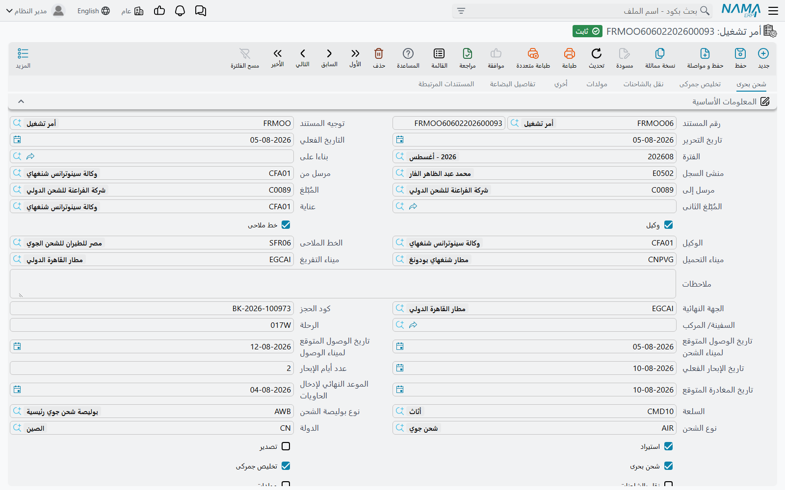

# أوامر التشغيل (Operation Orders)

أمر التشغيل هو قلب وحدة إدارة الشحن. فكّر فيه باعتباره **ملف الشحنة الكامل**: كل ما يخصّ شحنة واحدة — الأطراف، الباخرة والرحلة، الموانئ، الحاوية، والخدمات بتكاليفها وأسعار بيعها — يعيش هنا. ومن أمر التشغيل تتفرّع بوليصة الشحن وفواتير المبيعات والمشتريات.

تجده تحت **نظام إدارة الشحن ← المستندات ← أمر تشغيل**.

## أطراف الشحنة

يبدأ أمر التشغيل بتحديد مَن يشارك في الشحنة:

- **المُصدِّر (Shipper)** — العميل صاحب البضاعة المُرسِلة.
- **المُرسَل إليه (Consignee)** — الجهة المستلِمة.
- **الوكيل (Agent)** و**جهة الإخطار (Notify / Notify 2)** — الأطراف التي تُخطَر بوصول الشحنة.
- **الخط الملاحي (Shipping Line)** — المورد الذي ينفّذ الشحن البحري.
- **حساب العميل (Subsidiary)** — الجهة التي تُحاسَب ماليًا (عميل، مورد، موظف، حساب…).

كما تحدّد ما إذا كانت الشحنة **استيرادًا (Import)** أم **تصديرًا (Export)**، و**التحصيل (Collect)** أم **الدفع المسبق (Prepaid)**.

## بيانات الرحلة والحاوية

في هذا القسم تُسجِّل تفاصيل النقل:

- **الباخرة (Ocean Vessel) والرحلة (Voyage)** ورقم الحجز لدى الناقل.
- **ميناء التحميل والتفريغ والوجهة النهائية** ونقاط الدخول والخروج من الموانئ.
- **التواريخ المقدّرة** للتحميل والتفريغ والإبحار الفعلي وأيام الإبحار.
- **الحاوية ونوعها وعددها** ورقم الحاوية الإجمالي.
- بيانات الشحنات الحسّاسة مثل **درجة الحرارة والرطوبة والتهوية** للحاويات المبرّدة.
- **السلعة (Commodity)** ونوع الشحن وحالة التشغيل (Operation Status).

## الخدمات — جوهر أمر التشغيل

ما يميّز أمر التشغيل هو تقسيمه الخدمات إلى **أقسام منفصلة**، كل قسم له سطوره الخاصة بتكلفته وسعر بيعه:

| القسم | الغرض |
|------|-------|
| **سطور الشحن البحري** (Ocean Freight) | أجور الشحن من الخط الملاحي |
| **سطور التخليص الجمركي** (Custom Clearance) | رسوم وخدمات التخليص |
| **سطور الشاحنات** (Trucking) | النقل البري من/إلى الميناء |
| **سطور المولّدات** (Genset) | تشغيل وحدات التبريد |
| **سطور البريد السريع** (Courier) | إرسال المستندات |
| **سطور أخرى** (Other) | أي خدمات إضافية |
| **سطور النقل / الملاحظات** (Transport / Remarks) | ملاحظات وبيانات تشغيلية |
| **نقاط التحميل** (Loading Points) | مواقع تحميل البضاعة |
| **الشهادات والنماذج** (Certificates & Forms) | المستندات المطلوبة للشحنة |
| **الأبعاد** (Dimensions) و**السلع** (Commodity) | أوزان وأحجام البضاعة |

تتحكّم علامات مثل *شحن بحري؟ تخليص؟ نقل بري؟* في إظهار الأقسام المناسبة فقط، فلا ترى إلا ما يخصّ شحنتك.

## أزرار أمر التشغيل

تقع أزرار أمر التشغيل في التبويب الذي تعمل عليه.

**في تبويب شحن بحرى** (التبويب الأول):

- **إنشاء بوليصة شحن** — يجب حفظ الأمر أولًا. يفتح [بوليصة شحن](./bills-of-lading.md) جديدة في نافذة
  منبثقة، مملوءة من الأمر: الأطراف وعناوينهم، والباخرة، والرحلة، والموانئ، ورقم الحجز لدى الناقل،
  والسلعة، وإعدادات التبريد، ونوع البوليصة. وتاريخ الوصول المقدَّر فيها هو تاريخ الإبحار الفعلي
  مضافًا إليه أيام الإبحار في الأمر.
- **إنشاء فاتورة مشتريات** — يفتح [فاتورة مشتريات](./freight-invoicing.md) جديدة في نافذة منبثقة،
  بسطر لكل سطر خدمة علامة **اختيار** فيه معلَّمة، في أي قسم، بسعر شرائه. علّم السطور أولًا؛ فإن لم
  يكن أيٌّ منها معلَّمًا توقّف الزر.
- **تحديث كل الخدمات** — يحدّث كل قسم يستخدمه الأمر (الشحن البحري، التخليص الجمركي، النقل، المولدات،
  البريد السريع) من [قوائم الأسعار](./freight-pricing.md) المطابقة دفعة واحدة. ويحتاج **مرسل من**.
- **تحديث البيانات** — الشيء نفسه لقسم الشحن البحري وحده. ويحتاج **مرسل من** و**الخط الملاحى**
  و**ميناء التحميل** و**ميناء التفريغ**. وإن كان الأمر Collect وPrepaid معًا، سُعِّرت سطور Collect
  بعدد Collect وسطور Prepaid بعدد Prepaid؛ وإلا فبالعدد الإجمالي للحاويات.
- **عملية مماثلة** — يجب حفظ الأمر أولًا. يفتح نسخة من الأمر لشحنة مشابهة، بعد مسح رقم الحجز والباخرة
  والرحلة والتواريخ المقدَّرة وتاريخ المغادرة ووقت الإغلاق.
- **ملحق شحنة** — يفتح أمرًا تابعًا للبضاعة التي فاتتها الرحلة. يُكوَّد الأمر الجديد على كود الأصل
  بلاحقة متتالية (`OO-0012-1`، `OO-0012-2`…)، ويشير إلى الأصل في **بناءا على**، ويبدأ بكل أقسام
  الخدمات فارغة.

**وفي تبويبات تخليص جمركى ونقل بالشاحنات ومولدات وأخري**، لكل قسم زر **تحديث البيانات** الخاص به
يحدّث ذلك القسم وحده. التخليص يحتاج **مرسل من** و**ميناء التحميل** و**السلعة**؛ والنقل والمولدات
يحتاجان **مرسل من** (و، حين لا تكون الوحدة مضبوطة على **نقاط تحميل متعددة**، **ميناء الدخول**
و**ميناء الخروج** و**نقطه التحميل** — راجع [إعدادات وحدة الشحن](./freight-configuration.md))؛ وسطور
البريد السريع في تبويب أخري تحتاج **الخط الملاحى** و**الدولة**.

::: tip ما الذي يحتفظ به التحديث
يستبدل زر **تحديث البيانات** قسمه بما تعيده قوائم الأسعار. والسطر الذي علامة **تجاهل التحديث** فيه
معلَّمة يحتفظ بقيمه الحالية ما دامت قائمة الأسعار تعيد عنصر البيع الخاص به؛ والسطور التي تجلبها الأزرار
تصل وعلامة **تجاهل التحديث** معلَّمة فيها أصلًا، فلا تضغط الزر ثانية إلا بعد إلغاء تعليم السطور التي
تريد تحديثها.
:::

**وفي شاشة قائمة أوامر التشغيل**، تحوي قائمة **المزيد** الإجراء **اصدار المستندات** (Telex Released):
اختر الأوامر التي أُفرج عن بوالصها الأصلية بالتلكس وشغّله ليُعلَّم **اصدار المستندات** فيها جميعًا
دفعة واحدة.

## حالة أمر التشغيل (FRM OO Status)

يتابع كل أمر تشغيل **حالته** عبر دورة حياته. لا تُحدَّث الحالة يدويًا فحسب، بل تتغيّر تلقائيًا عبر **قيود حالة** (Status Entries) تسجّلها المستندات التي تعالج الأمر: فاتورة مبيعات خدمة وأمر بيع خدمة ومردود مبيعات خدمة، ومستندات استلام أمر التشغيل ونقله وتسليمه، كلٌّ منها يختم الحالة المضبوطة في [توجيه المستند](./freight-document-terms.md). ويعرض الأمر أحدثها، فتعرف فورًا أي شحنة في الساحة، وأيّها خرجت، وأيّها فُوتِرت.

## التسليم والاستلام والتحويل

إلى جانب أمر التشغيل، توفّر الوحدة مستندات مساعدة لإدارة الحركة الفعلية للحاويات والبضاعة:

- **مستند تسليم أمر تشغيل (FRM OO Delivery)** — تسليم البضاعة/الحاوية.
- **مستند استلام أمر تشغيل (FRM OO Receipt)** — استلامها.
- **مستند تحويل أمر تشغيل (FRM OO Transfer)** — نقلها بين المواقع.

تجد هذه الملفات تحت **الملفات**، وتُستخدم لتتبّع الموقع الفعلي للشحنة بمعزل عن أثرها المالي. وكيف تملأ المواقع وتفرغها تجده في [مواقع التخزين](./freight-storage-locations.md).

## رسائل قد تظهر لك

الرسائل الثلاث الأولى من أمر التشغيل نفسه؛ وما بعدها من **سند استلام أمر تشغيل**، فهو موضع قواعد السعة.

| الرسالة | لماذا | ما تفعله |
|---|---|---|
| «يجب أختيار بعض السطور أولا» | ضُغط **إنشاء فاتورة مشتريات** دون أن يكون أي سطر خدمة معلَّمًا بـ**اختيار**. | علّم السطور المطلوب شراؤها، ثم اضغطه ثانية. |
| `shipper is required` وسائر رسائل `… is required` لأزرار التحديث | حقل يحتاجه البحث في قوائم الأسعار فارغ — والرسالة تسمّيه باسمه الداخلي، مثل `shipper,portOfLoading,commodity is required`. لا نصّ عربيًا لهذه الرسائل. | املأ الحقول المسمّاة في الرأس واضغط الزر ثانية. |
| «يجب اختيار خدمة واحدة على الاقل من الخدمات الأربعة التالية(شحن بحري ـ نقل ـ تخليص ـ مولدات)» | لم يُعلَّم على أي من الخدمات الأربع — شحن بحري، تخليص، نقل، مولدات — في أمر التشغيل، فلا يظهر أي قسم خدمات. | علّم على الخدمات التي تصف الشحنة؛ فهي التي تُظهر أقسام الخدمات المقابلة. |
| «يجب ان تكون سعة أمر التشغيل {0} أكبر من الصفر» | أمر التشغيل الذي يستلمه السند بلا سعة صالحة: فلا سطور أبعاد السند ولا حقل السعة في الأمر يعطيان رقمًا أكبر من الصفر. | املأ السعة في أمر التشغيل، أو أدخل سطور الأبعاد في السند لتُشتق السعة منها. |
| «مجموع السعة فى سطور التفاصيل {0} يجب أن يساوى السعة فى رأس المستند {1}» | السعة المجمّعة من السند لا تساوي السعة التي يحملها أمر التشغيل. | عدّل سطور السند، أو سعة الأمر، حتى يتساوى الرقمان. |
| «يجب إدخال بعد واحد على الأقل» | سطر أبعاد في السند ارتفاعه وعرضه **وطوله** فارغة أو أصفار. | أدخل واحدًا منها على الأقل، أو احذف السطر. |
| «لا يمكن إدخال قيمة سالبة في الحقل {0}» | سطر أبعاد في السند يحمل سعة أو ارتفاعًا أو عرضًا أو طولًا سالبًا، والرسالة تسمّي الحقل. | أدخل رقمًا موجبًا. |
| «أمر التشغيل {0} مستخدم فى {1}» | يوجد سند استلام أمر تشغيل مرحَّل على أمر التشغيل هذا، والرسالة تسمّيه. فسند استلام واحد لكل أمر تشغيل. | افتح السند القائم وعدّله، أو ألغِه قبل كتابة غيره. |
