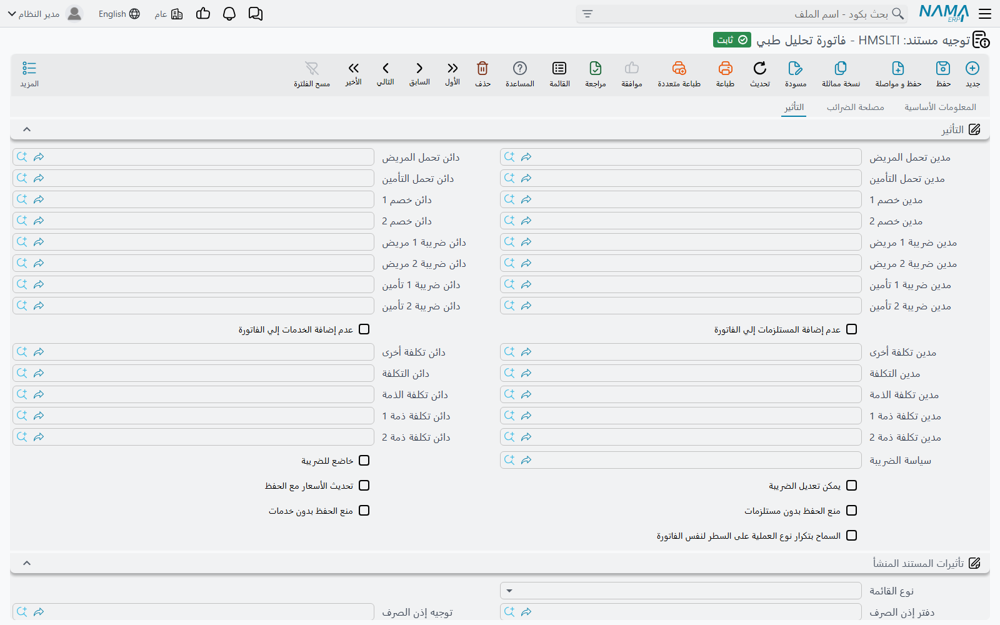
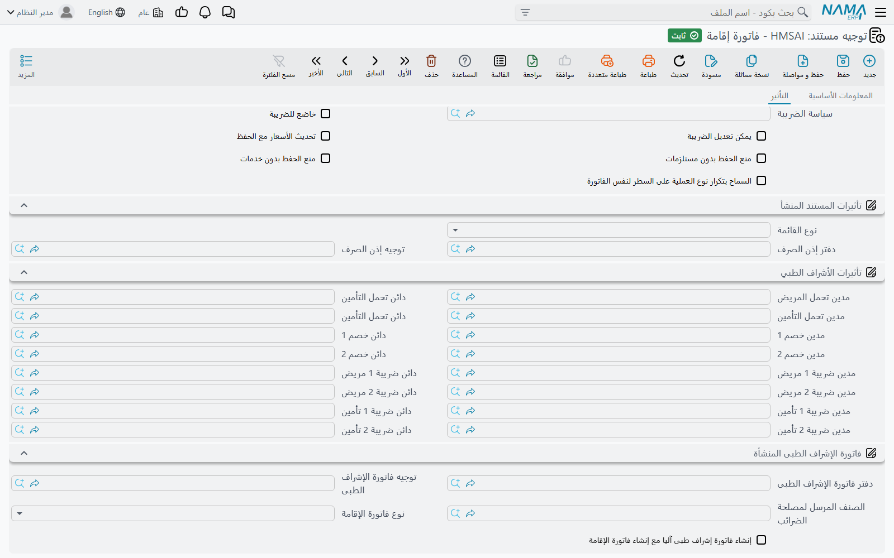
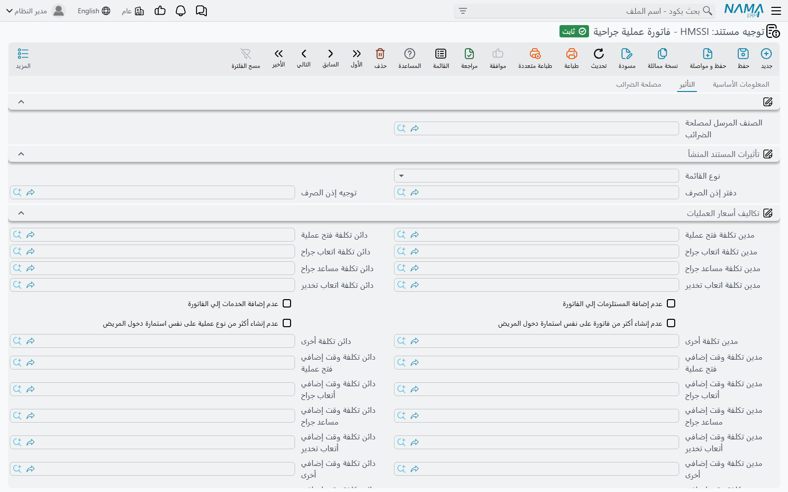
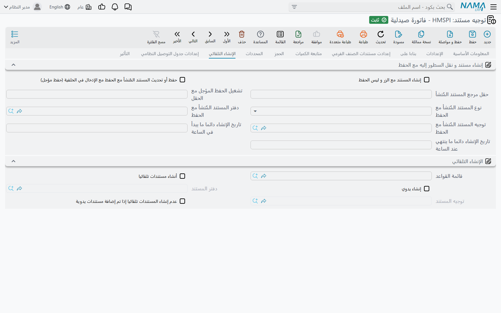

# توجيهات فواتير المستشفى

فاتورة المستشفى لا تُنشئ قيدًا من تلقاء نفسها. كل حساب تلمسه — ذمة المريض، وذمة شركة التأمين، والإيراد،
والخصومات، والضرائب، وحصة الطبيب — مسمّى في **توجيه المستند**، والفاتورة المحفوظة تحت توجيه جوانبه
فارغة تُحفظ وتُسعَّر وتُطبع دون سطر واحد في دفتر الأستاذ. حين يُسأل الدعم «لماذا لم تصل فاتورة التحليل
هذه إلى حساب المريض؟» فالجواب في الغالب على هذه الصفحة.

ستة عشر نوعًا من الفواتير والمردودات تشترك في صفحة **التأثير** نفسها. تشرح هذه الصفحة تلك الصفحة مرة
واحدة، ثم ما تضيفه كل عائلة من الفواتير. تُعدَّل التوجيهات من **الأساسيات ← الإعدادات ← توجيه
المستند**: افتح التوجيه الذي *نوع المستند* فيه هو الفاتورة التي تضبطها. أما مستندات الإقامة — استمارة
الدخول والتسكين والخروج والفاتورة الختامية والتغذية واتفاق العملية — فلها توجيهات أقصر بكثير على صفحة
[توجيهات الإقامة والعمليات](./hms-terms-stay-and-operations.md).

## كيف تتحول فاتورة المستشفى إلى قيد

كل سطر مسعّر في فاتورة المستشفى يحمل كتلة سعر: السعر، وخصمين، وحصة المريض وحصة التأمين، والضريبة 1
والضريبة 2 مقسومتين بينهما، والتكلفة، وحتى ثلاث حصص ذمم (انظر [الفوترة والمحاسبة](../hms-invoicing.md)).
عند حفظ الفاتورة يُرحَّل كل سطر زوجًا زوجًا من مجموعة التأثير:

- **الزوج لا يُنشئ أثرًا إلا إذا امتلأ جانباه.** *مدين تحمل المريض* دون *دائن تحمل المريض* لا يُنشئ
  شيئًا لحصة المريض — بلا تحذير، فالقيمة لا تصل إلى الدفتر أصلًا.
- **كل سطر رئيسي وكل سطر مستلزمات وكل سطر خدمات يُرحَّل**، إلا إذا أخرج التوجيه جدول المستلزمات أو
  الخدمات بخيار *عدم إضافة المستلزمات إلي الفاتورة* أو *عدم إضافة الخدمات إلي الفاتورة*.
- كل جانب هو جانب محاسبي عادي — حساب ثابت أو حساب يُؤخذ من مصدر في المستند — موصوف في
  [إعدادات التأثيرات المحاسبية](/ar/modules/supplychain/document-terms/doc-term-accounting-effects).
  ويضيف موديول المستشفيات مصادره: **مريض** و**طبيب** و**شركة تأمين طبى** و**تخصص طبي** من رأس
  الفاتورة، و**نوع تحليل طبي** و**نوع أشعة** و**نوع عملية جراحية** و**نوع العلاج الطبيعى**
  و**الخدمة الطبية** و**صيدلية** و**بنك دم** من السطر نفسه. الجانب الذي مصدره أحد هذه يُرحِّل إلى
  حساب ذلك السجل، وهكذا يحصل نوع التحليل أو الصيدلية على حساب إيراد خاص به.

::: tip المريض أم الطبيب؟
إذا كان في **التصنيف الطبى** (Medical Document Category) للفاتورة الخيار *استخدام الطبيب بدلاً من المريض في التأثيرات المحاسبية*
مفعّلًا، فكل جانب مصدره **مريض** يُرحِّل إلى حساب **الطبيب** بدلًا منه. هذا هو المفتاح وراء ترتيبات
مشاركة الطبيب في الإيراد — انظر [الملفات الطبية الأساسية](../hms-medical-master-files.md).
:::

## مجموعة التأثير — الجوانب

| الزوج | معرّفات الحقول | ما يُرحِّله لكل سطر |
|---|---|---|
| **مدين / دائن تحمل المريض** | `termConfig.patientValueDebit` / `termConfig.patientValueCredit` | حصة المريض من السعر. |
| **مدين / دائن تحمل التأمين** | `termConfig.insuranceValueDebit` / `termConfig.insuranceValueCredit` | حصة شركة التأمين. |
| **مدين / دائن خصم 1** | `termConfig.discount1Debit` / `termConfig.discount1Credit` | قيمة الخصم 1. |
| **مدين / دائن خصم 2** | `termConfig.discount2Debit` / `termConfig.discount2Credit` | قيمة الخصم 2. |
| **مدين / دائن ضريبة 1 مريض** | `termConfig.tax1PatientDebit` / `termConfig.tax1PatientCredit` | نصيب المريض من الضريبة 1. |
| **مدين / دائن ضريبة 2 مريض** | `termConfig.tax2PatientDebit` / `termConfig.tax2PatientCredit` | نصيب المريض من الضريبة 2. |
| **مدين / دائن ضريبة 1 تأمين** | `termConfig.tax1InsuranceDebit` / `termConfig.tax1InsuranceCredit` | نصيب التأمين من الضريبة 1. |
| **مدين / دائن ضريبة 2 تأمين** | `termConfig.tax2InsuranceDebit` / `termConfig.tax2InsuranceCredit` | نصيب التأمين من الضريبة 2. |
| **مدين التكلفة / دائن التكلفة** | `termConfig.costDebit` / `termConfig.costCredit` | قيمة تكلفة السطر من [قائمة التكاليف الطبية](../hms-pricing.md). |
| **مدين / دائن تكلفة الذمة** | `termConfig.subsidiaryDebit` / `termConfig.subsidiaryCredit` | حصة الذمة الأولى — عادةً حصة الطبيب أو المعمل الخارجي من الإيراد. |
| **مدين / دائن تكلفة ذمة 1**، **مدين / دائن تكلفة ذمة 2** | `termConfig.subsidiary1Debit` … `termConfig.subsidiary2Credit` | حصتا الذمة الثانية والثالثة. |

يظهر في المجموعة نفسها **مدين / دائن تكلفة أخرى**، لكن فاتورة العملية الجراحية وحدها تستخدمه — فهو
مكوّن «الأخرى» في سعر العملية (انظر أدناه). في كل فاتورة أخرى لا يُرحِّل شيئًا.

إعداد نموذجي لمريض نقدي ومؤمَّن عليه: *تحمل المريض* مدينه المريض (المصدر مريض) ودائنه حساب إيراد؛
و*تحمل التأمين* مدينه شركة التأمين (المصدر شركة تأمين طبى) ودائنه الإيراد نفسه؛ وزوجا الضريبة مدينهما
المريض أو شركة التأمين ودائنهما حساب ضريبة المخرجات.

::: info سطور التكاليف غير المباشرة تُرحَّل عبر بندها
التكلفة غير المباشرة التقديرية أو الفعلية في جدول التكاليف غير المباشرة بالفاتورة لا يُرحِّلها التوجيه.
كل **بند تكاليف طبية غير مباشرة** يحدد جوانب القيمة التقديرية وجوانب القيمة الفعلية الخاصة به،
وتستخدم الفاتورة الجوانب الفعلية بعد أن يعطيها [احتساب التكلفة غير المباشرة الفعلية](../hms-pricing.md)
قيمة فعلية.
:::

## مجموعة التأثير — الخيارات

| الخيار | معرّف الحقل | ماذا يفعل |
|---|---|---|
| **عدم إضافة المستلزمات إلي الفاتورة** | `termConfig.doNotAddSuppliesToInvoice` | يُخرج جدول المستلزمات من إجمالي الفاتورة ومن القيد. المستلزمات تُصرف من المخزن مع ذلك. |
| **عدم إضافة الخدمات إلي الفاتورة** | `termConfig.doNotAddServicesToInvoice` | الأمر نفسه لجدول الخدمات. |
| **سياسة الضريبة** | `termConfig.taxPlan` | سياسة الضريبة المستخدمة للسطر الذي لا تحدد خدمته أو نوعه أو غرفته سياسة ضريبة خاصة بها. |
| **خاضع للضريبة** | `termConfig.taxable` | هل تنطبق ضرائب السياسة على هذا النوع من الفواتير أصلًا. |
| **يمكن تعديل الضريبة** | `termConfig.editableTaxes` | لا تُعاد حسابات الضرائب من السياسة عند الحفظ، فتبقى الضريبة المكتوبة يدويًا في السطر. |
| **تحديث الأسعار مع الحفظ** | `termConfig.updatePricesWithSave` | كل حفظ يعيد البحث عن سعر كل سطر من موافقة شركة التأمين وقوائم الأسعار. الأسعار المكتوبة يدويًا تُستبدل — إلا إذا كان في الفاتورة *السماح بتعديل الأسعار الرئيسية* أو *أسعار الخدمات الطبية* أو *أسعار المستلزمات الطبية* مفعّلًا لذلك الجدول. |
| **منع الحفظ بدون مستلزمات** | `termConfig.preventSaveWithoutSupplies` | يرفض حفظ فاتورة جدول مستلزماتها فارغ. |
| **منع الحفظ بدون خدمات** | `termConfig.preventSaveWithoutServices` | يرفض حفظ فاتورة جدول خدماتها فارغ. |
| **السماح بتكرار نوع العملية على السطر لنفس الفاتورة** | `termConfig.allowRepeatingSurgeryTypeInInvoiceLine` | لفاتورة العملية الجراحية فقط: يجوز أن يحمل سطرا عمليات نوع العملية نفسه. |

مفاتيح *السماح بتعديل … الأسعار* الثلاثة موجودة في كل فاتورة لا في التوجيه. في الفاتورة المحفوظة
تُفعَّل من قائمة **المزيد** (*السماح بتعديل الأسعار الرئيسية*، *السماح بتعديل أسعار الخدمات الطبية*،
*السماح بتعديل أسعار المستلزمات الطبية*)، وهكذا ينجو سعر اتُّفق عليه في الاستقبال من *تحديث الأسعار مع
الحفظ*.

## تأثيرات المستند المنشأ — صرف مستلزمات فاتورة الخدمة

فواتير الخدمات تحمل جدول مستلزمات يُملأ من صفحة **المستلزمات الطبية** في الخدمة أو النوع المُفوتَر.
مجموعة **تأثيرات المستند المنشأ** (Origin Document Effect) تحوّل هذا الجدول إلى مستند مخزني:

| الحقل | معرّف الحقل | ماذا يفعل |
|---|---|---|
| **نوع القائمة** (Origin Issue Document Type) | `termConfig.issueDocType` | **صرف مخزني** يصرف المستلزمات عند الحفظ؛ **طلب صرف مخزني** يُنشئ طلبًا للمخزن بدلًا من ذلك. إن تُرك فارغًا لا يُنشأ شيء. |
| **دفتر إذن الصرف** / **توجيه إذن الصرف** | `termConfig.issueForHMSInvoiceBook` / `termConfig.issueForHMSInvoiceTerm` | دفتر المستند المنشأ وتوجيهه. لا بد من الاثنين. |

فواتير عائلة الصيدلية أدناه لا تستخدم هذه المجموعة — فهي تحرّك المخزون من صفحة **الإنشاء التلقائي** (Generation). القصة كاملة على
[الصيدلية والمستلزمات وبنك الدم](../hms-pharmacy-and-supplies.md).

## ما تضيفه كل عائلة من الفواتير

### فواتير الكشف والمرافق والتحاليل والأشعة والعلاج الطبيعي والخدمات والإشراف الطبي

هذه التوجيهات السبعة هي صفحة التأثير وصفحة أخرى هي **مصلحة الضرائب** (Tax Authority) فيها حقل واحد:
**الصنف المرسل لمصلحة الضرائب** `termConfig.taxAuthorityItem`. في **فاتورة كشف** و**فاتورة
مرافق** و**فاتورة إشراف طبي** هو الصنف الذي يُبلَّغ تحته كل سطر حين تُرسل الفاتورة لمصلحة
الضرائب. أما فواتير التحاليل والأشعة والعلاج الطبيعي والخدمات فتُبلِّغ كل سطر تحت صنف مصلحة الضرائب
الخاص بنوع التحليل أو نوع الأشعة أو نوع العلاج أو الخدمة الطبية، فيمكن ترك الحقل في توجيهاتها فارغًا.

### فاتورة الإقامة

تُرحِّل فاتورة الإقامة **سعر الإقامة** لكل سطر من سطور أيامها عبر مجموعة التأثير. أما جزء الإشراف
الطبي من السطور نفسها فيُفوتَر منفصلًا، بـ**فاتورة إشراف طبي** يمكن أن تُنشئها فاتورة الإقامة لك.
مجموعة **فاتورة الإشراف الطبى المنشأة** تضبط ذلك:

| الحقل | معرّف الحقل | ماذا يفعل |
|---|---|---|
| **إنشاء فاتورة إشراف طبى آليا مع إنشاء فاتورة الإقامة** | `termConfig.autoGenSupervisionInvoice` | عند الحفظ تُنشأ (أو يُعاد بناء) فاتورة إشراف طبى واحدة فيها سطر لكل يوم من كل سطر إقامة. الغرف المفعّل فيها *عدم إنشاء فاتورة إشراف على الغرفة* تُتخطّى. |
| **دفتر فاتورة الإشراف الطبى** / **توجيه فاتورة الإشراف الطبى** | `termConfig.supervisionInvoiceBook` / `termConfig.supervisionInvoiceTerm` | دفتر فاتورة الإشراف المنشأة وتوجيهها — وتوجيهها هو الذي يُرحِّلها بعد ذلك. |
| **الصنف المرسل لمصلحة الضرائب** | `termConfig.taxAuthorityItem` | الصنف الذي تُبلَّغ تحته سطور فاتورة الإقامة لمصلحة الضرائب. |
| **نوع فاتورة الإقامة** | `termConfig.accommodationInvoiceType` | يظهر هنا، لكن الذي يقسّم الإقامة إلى فواتير هو الحقل نفسه في توجيه **تسكين مريض** — انظر صفحة توجيهات الإقامة. |

يحمل توجيه فاتورة الإقامة أيضًا مجموعة **تأثيرات الأشراف الطبي**؛ اتركها فارغة، فرسوم الإشراف تُرحِّلها
فاتورة الإشراف الطبى المنشأة.

### فاتورة العملية الجراحية

يضع توجيه العمليات مجموعته الخاصة **تكاليف أسعار العمليات** تحت مجموعة التأثير. سعر العملية مكوَّن من
عناصر — فتح عملية، وأتعاب الجراح، ومساعد الجراح، وأتعاب التخدير، وأخرى — لكل منها تكلفة للساعات
القياسية وتكلفة إضافية للوقت الزائد، ولكل عنصر زوجه:

| الزوج | ما يُرحِّله |
|---|---|
| **تكلفة فتح عملية**، **تكلفة اتعاب جراح**، **تكلفة مساعد جراح**، **تكلفة اتعاب تخدير**، **تكلفة أخرى** (مدين / دائن) | تكلفة ذلك العنصر للساعات القياسية. |
| **تكلفة وقت إضافي فتح عملية**، **تكلفة وقت إضافي أتعاب جراح**، **تكلفة وقت إضافي مساعد جراح**، **تكلفة وقت إضافي أتعاب تخدير**، **تكلفة وقت إضافي أخرى** (مدين / دائن) | التكلفة الإضافية لذلك العنصر للساعات بعد القياسية. |
| **تكلفة وقت إضافي ذمة** (مدين / دائن) | يظهر على الشاشة؛ قيد العملية لا يُرحِّله. |

وفي المجموعة نفسها القاعدتان اللتان تحدّان فواتير العمليات لكل استمارة دخول: **عدم إنشاء أكتر من فاتورة
على نفس استمارة دخول المريض** و**عدم إنشاء أكثر من نوع عملية على نفس استمارة دخول المريض**. بعض الخيارات
تظهر مرتين على هذه الشاشة (مفتاحا المستلزمات والخدمات، والتكلفة الأخرى، ومجموعة تأثيرات المستند المنشأ)؛
والنسختان حقل واحد. ويختم التوجيه بصفحة **مصلحة الضرائب**. كيف تُسعَّر العناصر موجود في
[دورة العملية الجراحية](../hms-surgery-lifecycle.md).

### فواتير الصيدلية والمستلزمات والخدمات والمستلزمات وبنك الدم، والمردودات الثلاثة

**فاتورة صيدلية** و**مردودات صيدليات** و**فاتورة مستلزمات طبية** و**مردودات مستلزمات طبية** و**فاتورة
خدمات ومستلزمات طبية** و**فاتورة بنك الدم** و**مردودات بنوك الدم** مستندات مخزنية، فتوجيهاتها تبدأ بصفحات
توجيه سلسلة الإمداد المعتادة — الإعدادات وبناءً على ومتابعة الكميات والحجز والمحددات و**الإنشاء التلقائي** وغيرها،
وكلها موصوفة في [توجيهات مستندات سلسلة الإمداد](/ar/modules/supplychain/document-terms/) — وتنتهي
بصفحة تأثير المستشفى أعلاه.

يختلف أمران عن فواتير الخدمات:

- **المستند المخزني يأتي من صفحة الإنشاء التلقائي.** *دفتر المستند* و*توجيه المستند* (Generation Book / Generation Term) يجعلان الفاتورة تصرف
  أصنافها (والمردود يستلمها). مجموعة تأثيرات المستند المنشأ في هذه التوجيهات لا تُستخدم.
- **المردود لا يعكس الجوانب لك.** يُرحِّل الأزواج نفسها التي تُرحِّلها الفاتورة، بالاتجاه الذي يعطيه
  توجيهه، فيحتاج توجيه المردود كل زوج معكوسًا عن توجيه الفاتورة — تحمل المريض في الجانب الدائن حيث
  تجعله الفاتورة مدينًا، وهكذا.

من مجموعة التأثير تُرحِّل هذه التوجيهات قيمتي المريض والتأمين، والخصمين، وأزواج الضريبة الأربعة،
والتكلفة، وحصة الذمة الأولى.

## مستندات بلا خيارات توجيه خاصة بالمستشفى

طلبات التحاليل والأشعة ونتائجها، وطلب العملية الجراحية وموافقتها، وتشخيص المريض وحالته الصحية، وحجز
العيادات الخارجية، وتغيير خطة تسعير المريض، واحتساب التكلفة غير المباشرة الفعلية — كلها بلا صفحة توجيه
خاصة بالمستشفى. توجيهاتها تحمل الإعدادات العامة التي يحملها كل مستند فقط.
