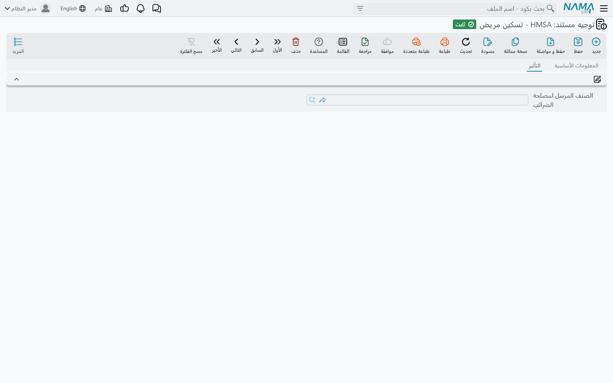

# توجيهات الإقامة والعمليات

إقامة المريض سلسلة من مستندات تُنشئ مستندات أخرى: استمارة الدخول تُنشئ التسكين، والتسكين يُنشئ فواتير
الإقامة، وفاتورة الإقامة تُنشئ فاتورة الإشراف الطبي، وصرف التغذية يُنشئ سندات صرف مخزني. أي هذه الروابط
يعمل فعلًا — وتحت أي دفتر وتوجيه يُحفظ المستند المنشأ — تقرره توجيهات المستندات في هذه الصفحة. السلسلة
التي «تتوقف» (استمارة دخول بلا تسكين، إقامة بلا فاتورة) فيها في الغالب دفتر أو توجيه فارغ في مكان ما.

تُعدَّل التوجيهات من **الأساسيات ← الإعدادات ← توجيه المستند**. أما توجيهات الفواتير — جوانب المريض
والتأمين التي يُرحِّل بها كل مستند مسعّر — فعلى صفحة [توجيهات فواتير المستشفى](./hms-terms-invoices.md).

## إستمارة دخول مريض — إنشاء التسكين

لتوجيه استمارة الدخول مجموعة واحدة هي **مستند التسكين المنشأ**:

| الحقل | معرّف الحقل | ماذا يفعل |
|---|---|---|
| **دفتر مستند التسكين** / **توجيه مستند التسكين** | `termConfig.accommodationBook` / `termConfig.accommodationTerm` | عند حفظ استمارة دخول مفعّل فيها **إنشاء مستند تسكين مريض** يُنشأ تسكين تحت هذا الدفتر والتوجيه، يحمل المريض وتاريخ الدخول ووقته والغرفة والسرير والأسعار وشركة التأمين ونسب التحمل. إن تُرك أحدهما فارغًا لا يُنشأ تسكين سواء فُعّل الخيار أم لا. وإلغاء تفعيل الخيار لاحقًا يحذف التسكين المنشأ. |
| **السماح بتداخل الإقامة في نفس الغرفة** | `termConfig.allowAccommodationIntersectionInTheSameRoom` | في العادة لا يُحجز السرير بتسكين ثانٍ والأول ما زال فيه. فعّل هذا ليسمح بتداخل إقامات هذا النوع من الاستمارات على السرير نفسه — لأم ومولودها في سرير واحد مثلًا. |

## تسكين مريض ونقل تسكين مريض — بناء فواتير الإقامة

مجموعة توجيه التسكين الوحيدة، **فاتورة التسكين المنشأة**، هي أهم توجيه في الموديول من ناحية الفوترة: فهي
تقرر كيف تصير الإقامة فواتير. ومستند خروج المريض يستخدم **هذا** التوجيه أيضًا حين يكتب الفواتير
النهائية، فلا بد من ملئه حتى لو لم تُرد فواتير مؤقتة أبدًا.

| الحقل | معرّف الحقل | ماذا يفعل |
|---|---|---|
| **دفتر فاتورة الإقامة** / **توجيه فاتورة الإقامة** | `termConfig.accommodationInvoiceBook` / `termConfig.accommodationInvoiceTerm` | الدفتر والتوجيه اللذان تُحفظ بهما كل فواتير الإقامة لهذه الإقامة. |
| **نوع فاتورة الإقامة** | `termConfig.accommodationInvoiceType` | طريقة تقسيم الإقامة: **فاتورة كل يوم** تكتب فاتورة لكل يوم يُحاسَب؛ **فاتورة في الدخول** تكتب فاتورة واحدة للإقامة كلها بتاريخ أول يوم؛ **فاتورة في الخروج** تكتب فاتورة واحدة بتاريخ يوم الخروج. |
| **إنشاء فاتورة إقامة مؤقتة بمجرد الحفظ** | `termConfig.genAccommodationInvoice` | كل حفظ لتسكين جارٍ (لا خروج له بعد) يعيد بناء فواتير الإقامة حتى اليوم عند ساعة الخروج المضبوطة، فتكون فاتورة الإقامة حتى تاريخه موجودة دائمًا. |
| **تحديث أسعار الفاتورة المنشأة مع الحفظ** | `termConfig.updateInvoicePrices` | كل حفظ يعيد بناء فواتير الإقامة بالأسعار الحالية. في التسكين يحدث هذا فقط ما دام المريض لم يخرج. |

لتوجيه **نقل تسكين مريض** خيار واحد فقط هو **تحديث أسعار الفاتورة المنشأة مع الحفظ**: فعّله كي يعيد
نقل المريض إلى غرفة أغلى أو أرخص تسعير فواتير الإقامة عند حفظ النقل أو إلغائه أو حذفه — الفواتير
النهائية إن كان المريض قد خرج، والمؤقتة فيما عدا ذلك.

عدد الأيام التي يحسبها كل سطر فاتورة يتوقف على ساعتي الدخول والخروج في
[إعدادات نظام إدارة المستشفيات](../hms-configuration.md). والسطر المفعّل فيه **عدم السماح للنظام
بتعديل السطر** في فاتورة الإقامة يبقى كما هو حين يُعاد بناء الفواتير.

## خروج مريض — الفواتير النهائية

حفظ مستند الخروج يكتب دائمًا فواتير الإقامة **النهائية**، باستخدام توجيه التسكين أعلاه. ولتوجيهه هو خيار
واحد تحت **تأثيرات المستند المنشأ**:

| الحقل | معرّف الحقل | ماذا يفعل |
|---|---|---|
| **عدم حذف الفواتير المنشأة تلقائياً مع حذف السند** | `termConfig.doNotDeleteGeneratedInvoices` | في العادة إلغاء مستند الخروج أو حذفه يحذف معه فواتير الإقامة لهذه الاستمارة، ثم يُعاد بناؤها من الإقامة الجارية. فعّل هذا للإبقاء عليها. |

## فاتورة مريض ختامية — تسويات الخروج

الفاتورة الختامية لا تُرحِّل فواتير الإقامة مرة أخرى — فكل منها رحّل نفسه بالفعل. إنها تُرحِّل فقط
**التسويات على مستوى الاستمارة** المكتوبة في رأسها، وتوجيهها يسمّي جوانبها:

| الزوج | معرّفات الحقول | يُرحِّل |
|---|---|---|
| **مدين / دائن ضريبة 1**، **مدين / دائن ضريبة 2** | `termConfig.tax1Debit` … `termConfig.tax2Credit` | قيمتي الضريبة 1 والضريبة 2 في الفاتورة الختامية. |
| **مدين / دائن رسوم 1**، **مدين / دائن رسوم 2** | `termConfig.fees1Debit` … `termConfig.fees2Credit` | قيمتي الرسوم 1 والرسوم 2. |
| **مدين / دائن خصم 1**، **مدين / دائن خصم 2** | `termConfig.discount1Debit` … `termConfig.discount2Credit` | قيمتي الخصم 1 والخصم 2. |

كما في الفواتير، لا يُرحِّل الزوج إلا إذا امتلأ جانباه، ويمكن أن يأخذ الجانب حسابه من **مريض**.

## فاتورة اتفاق عملية — تسوية الاتفاق

| الحقل | معرّف الحقل | يُرحِّل / يفعل |
|---|---|---|
| **الفرق مدين / دائن** | `termConfig.differenceDebit` / `termConfig.differenceCredit` | مجموع *الفرق* في السطور — السعر المتفق عليه مقابل السعر الفعلي. |
| **فرق الإيراد مدين / دائن** | `termConfig.revenueDebit` / `termConfig.revenueCredit` | مجموع *فرق الإيراد* في السطور. |
| **مدين / دائن خصم الفاتورة** | `termConfig.invoiceDiscountDebit` / `termConfig.invoiceDiscountCredit` | خصم رأس الفاتورة. |
| **إظهار جميع استمارات الدخول** | `termConfig.showAllPatientAdmissions` | قائمة اختيار الاستمارة تعرض في العادة استمارات المريض المفتوحة التي تحمل اتفاق عملية فقط. فعّل هذا لتعرض كل الاستمارات. |

الاتفاق نفسه مشروح في [دورة العملية الجراحية](../hms-surgery-lifecycle.md).

## حجز عملية جراحية — المهلة بين الحجوزات

لتوجيه الحجز الإعدادات العامة وخيار واحد:
**الأخذ ف الاعتبار الفرق  في الوقت بين الحجز والحجز التالي لنفس الغرفة**
`termConfig.considerDiffInTimesBetweenRoomReservations`. حين يُفعَّل يُرفض الحجز إذا وقع حجز آخر لغرفة
العمليات نفسها داخل المهلة المضبوطة في ملف الغرفة (*الفرق في الوقت بين الحجز والحجز التالي لنفس
الغرفة*). وحين لا يُفعَّل تُتجاهل المهلة.

## صرف تغذية — الوجبات من المطبخ

صرف التغذية مستند مخزني، فتوجيهه يبدأ بصفحات توجيه سلسلة الإمداد المعتادة. وما يحوّل سطوره إلى حركات
مخزنية هو آخر مجموعة في صفحة **التأثير**:

| الحقل | معرّف الحقل | ماذا يفعل |
|---|---|---|
| **دفتر سند تجميع** / **توجيه سند تجميع** | `termConfig.assemblyDocumentBook` / `termConfig.assemblyDocumentTerm` | سطر الوجبة الذي يحمل وصفة (قائمة مكونات نوع التغذية) يصير **سند تجميع** يستهلك المكونات وينتج الوجبة — سند لكل سطر. |
| **دفتر سند صرف مخزني** / **توجيه سند صرف مخزني** | `termConfig.stockIssueBook` / `termConfig.stockIssueTerm` | السطور التي بلا وصفة تُصرف معًا في **صرف مخزني** واحد. |

صرف التغذية لا يُفوتر أحدًا، فجوانب المريض والتأمين في أعلى صفحة التأثير لا تُستخدم؛ اتركها فارغة. تصل
تكلفته إلى الدفتر عبر سندات الصرف والتجميع التي يُنشئها.

## رسائل قد تظهر لك

| الرسالة | السبب | ماذا تفعل |
|---|---|---|
| «لا يمكن إنشاء فاتورة إقامة، برجاء إضافة دفتر وتوجية الفاتورة فى توجية مستند تسكين المريض.» | تسكين أو نقل أو خروج حاول بناء فواتير الإقامة، لكن توجيه التسكين ليس فيه دفتر فاتورة الإقامة أو توجيهها. | املأ الاثنين في توجيه تسكين هذه الاستمارة، ثم احفظ المستند مرة أخرى. |
| «لا يمكن إنشاء فاتورة إقامة، برجاء إضافة تحديد نوع فاتورة الإقامة فى توجية مستند تسكين المريض.» | مثل السابقة، لكن نوع فاتورة الإقامة فارغ. | اختر فاتورة كل يوم أو فاتورة في الدخول أو فاتورة في الخروج في توجيه التسكين. |
| «السند السابق {0} بتاريخ [{2} , {1}] يجب أن يكون خروج للغرفة {3} , لأنه متقاطع مع نفس الغرفة» | السرير ما زال مشغولًا بالإقامة المذكورة في الرسالة، وتوجيه الاستمارة لا يسمح بتداخل الإقامات. | اختر سريرًا آخر، أو أخرج المريض الآخر أو انقله أولًا، أو فعّل *السماح بتداخل الإقامة في نفس الغرفة* إن كانت المشاركة مقصودة. |
