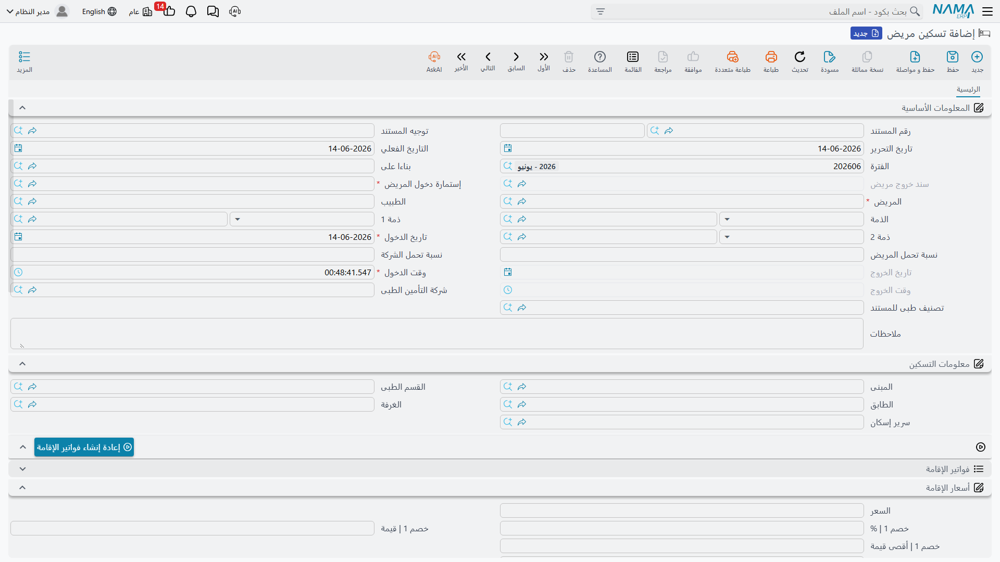
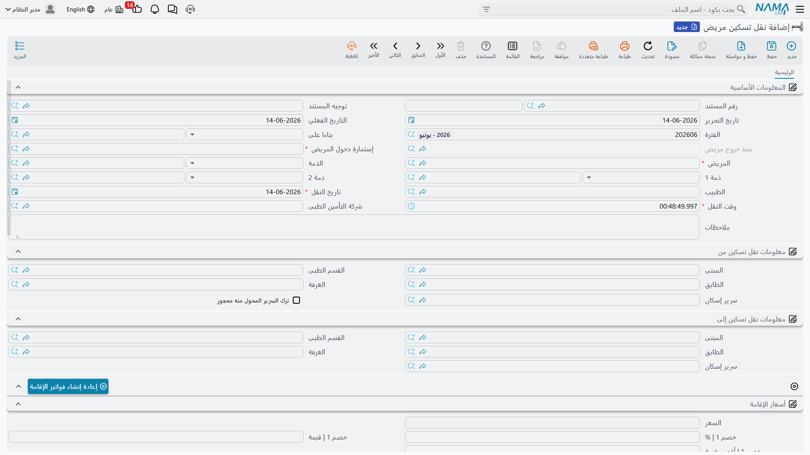
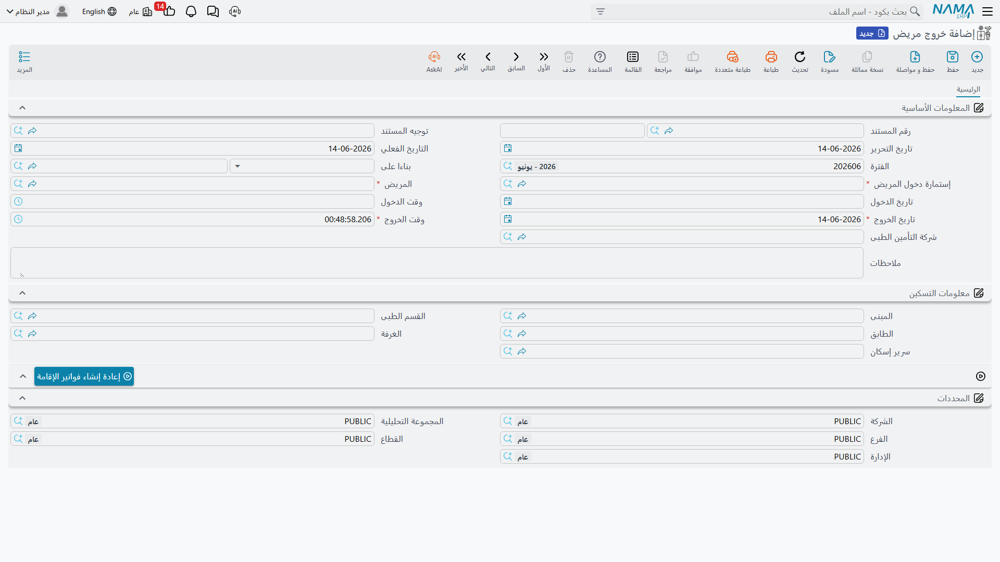
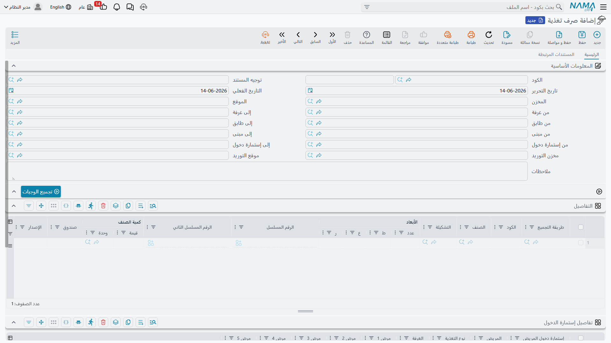

# التسكين والتغذية

بعد دخول المريض، يحتاج إلى **سرير** و**وجبات**. التسكين هو ما يحجز للمريض سريرًا، ويبدأ احتساب أجر الإقامة والإشراف الطبي يوميًا، ويتابع تنقّلاته حتى خروجه. وكل مستندات التسكين تُرحّل **إشغال السرير** وقد تُولّد **فاتورة إقامة** تلقائيًا حسب التوجيه.

## التسكين

**تسكين مريض (Accommodation)** هو سجل حجز السرير الذي يُسكِن المريض الداخلي فعليًا. غالبًا يُولَّد تلقائيًا من إستمارة الدخول (عند تفعيل "توليد سند تسكين")، ويمكن إنشاؤه يدويًا. يسجّل تواريخ وأوقات الدخول والخروج، وموقع السرير (المبنى/القسم/الطابق/الغرفة/السرير)، وسعر الليلة مقسومًا بين المريض والتأمين.

عند **الحفظ**، يُرحّل سطر **إشغال السرير** (يُعلِّم السرير مشغولًا من تاريخ/وقت الدخول)، و**إن لم يكن هناك سند خروج بعد** يُولّد **فاتورة الإقامة** (إذا فعّل التوجيه ذلك). والسرير **مطلوب** لإتمام الحفظ. وعند الإلغاء، تُزال سطور الإشغال وتُصفَّر حقول التسكين والأسعار في إستمارة الدخول. ويوجد زرّ **إعادة إنشاء فاتورة إقامة** لتوليد فاتورة الإقامة من جديد.

## النقل بين الغرف

**نقل تسكين مريض (Accommodation Transfer)** ينقل المريض الداخلي من سرير/غرفة إلى آخر (مثلًا من جناح عام إلى عناية مركّزة). يسجّل موقع **"من"** وموقع **"إلى"**، وتاريخ ووقت النقل، ويعيد تسعير التسكين الجديد. عند اختيار إستمارة الدخول يُحمَّل التسكين **الحالي** للمريض في خانة "من"، ويمكن إبقاء السرير القديم محجوزًا عبر علامة **ترك السرير القديم محجوزًا**.

## الخروج

**خروج مريض (Accommodation Exit)** هو مستند الخروج/الإفراج — يُنهي تسكين المريض ودخوله، يُحرّر السرير، ويُمهّد للفوترة النهائية. عند اختيار "من مستند" (التسكين الجاري) تُنسخ بيانات المريض وإستمارته وتواريخ الدخول والموقع تلقائيًا. ولمنع الخروج المزدوج، يقتصر اختيار المريض على **المرضى الذين لديهم دخول لم يُغلَق بخروج بعد**. ومنه تُجمَّع الإقامة في **[الفاتورة الختامية](./hms-invoicing.md)**.

## صرف التغذية

**صرف تغذية (Feeding Issue)** يصرف الوجبات للمرضى الداخليين من مخزن، **مع اختيار النظام الغذائي المناسب تلقائيًا حسب تشخيص كل مريض** — وهو جسر بين رعاية المريض والمخزون (يُنتج صرفًا مخزنيًا).

السرّ في زرّ **تجميع الوجبات**: انطلاقًا من مدى الغرف/الطوابق/المباني/الدخولات، يجد كل المرضى **الذين ما زالوا داخل المستشفى** (دخول لم يُغلَق)، ويقرأ تشخيص كلٍّ منهم، ويختار **أنسب [نوع تغذية](./hms-medical-master-files.md)** (الأعلى ترتيبًا المطابق لأمراض التشخيص)، ثم يبني تلقائيًا سطور المرضى وسطور أصناف الطعام المفصّلة — فيُغني الممرّض عن اختيار الحميات يدويًا.

