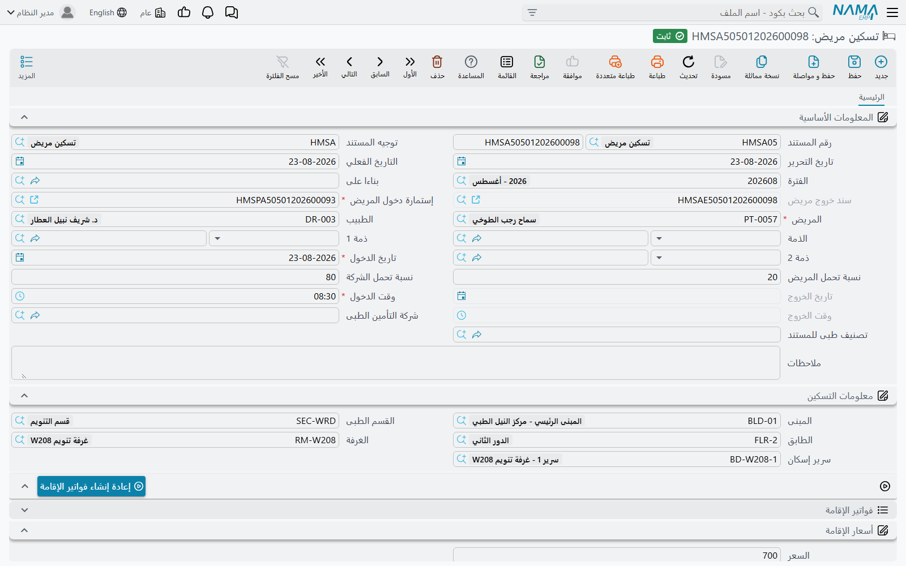
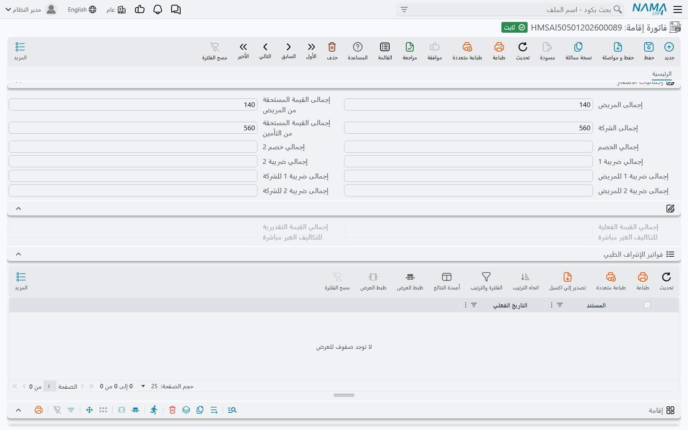
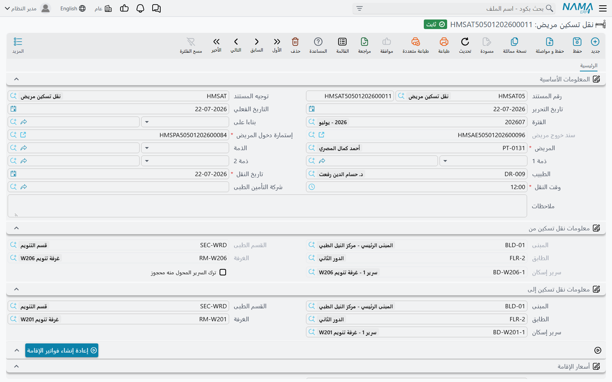
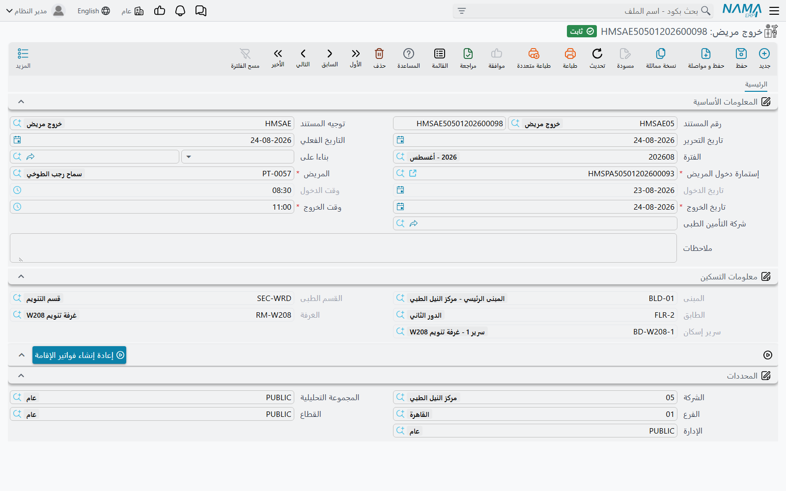
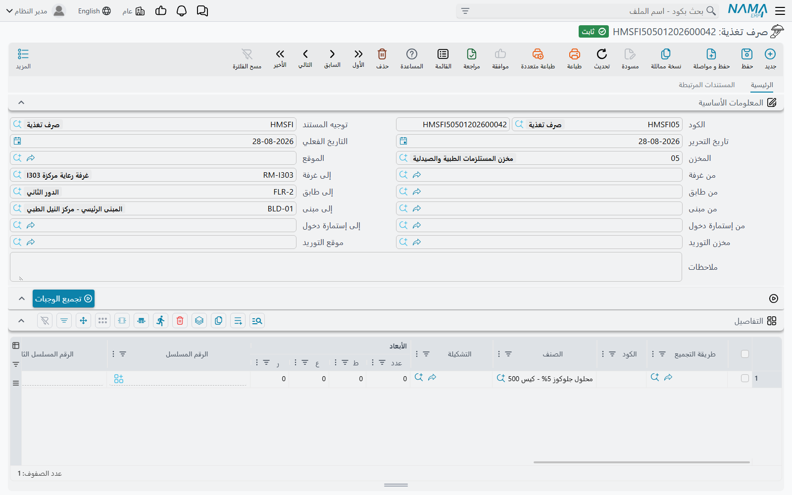

# التسكين والتغذية

بعد دخول المريض يحتاج إلى **سرير** و**وجبات**. التسكين هو ما يحجز للمريض سريرًا، ويبدأ احتساب أجر
الإقامة والإشراف الطبي يوميًا، ويتابع تنقّلاته حتى خروجه. وهو أكثر أجزاء الموديول احتفاظًا بالحالة: كل
مستند تسكين يكتب قيدًا في **سجل إقامة** استمارة الدخول، والأسرّة والغرف وملف المريض وفواتير الإقامة
كلها يُعاد بناؤها من هذا السجل في كل مرة يتغير.

| الشاشة | القائمة | أزرارها الخاصة |
|---|---|---|
| **تسكين مريض** | نظام إدارة المستشفيات ← المستندات ← تسكين مريض | **إعادة إنشاء فواتير الإقامة** |
| **نقل تسكين مريض** | نظام إدارة المستشفيات ← المستندات ← نقل تسكين مريض | **إعادة إنشاء فواتير الإقامة** |
| **خروج مريض** | نظام إدارة المستشفيات ← المستندات ← خروج مريض | **إعادة إنشاء فواتير الإقامة** |
| **صرف تغذية** | نظام إدارة المستشفيات ← التغذية ← صرف تغذية | **تجميع الوجبات** |

## سجل الإقامة: دخول، نقل، خروج

تخيّل الإقامة صفًّا من القيود في دفتر للأسرّة:

1. **تسكين مريض** يكتب قيد *دخول*: هذا المريض، هذا السرير، من هذا التاريخ والوقت.
2. كل **نقل تسكين مريض** يغلق السرير الحالي ويفتح سريرًا جديدًا — *خروج* من القديم و*دخول* إلى الجديد.
3. **خروج مريض** يكتب قيد *الخروج* الأخير.

قيود الاستمارة الواحدة يجب أن يتلو بعضها بعضًا في الزمن. النقل المؤرَّخ قبل التسكين، أو التسكين الذي ليس
أول قيد في استمارته، يُرفض برسالة تسمّي المستندين (انظر الجدول في آخر الصفحة). وللسبب نفسه لا يمكن حذف
التسكين ما دام بعده سند نقل — احذف النقل أولًا.

كل تغيير في السجل يحدّث ثلاثة أشياء معًا:

- علامة **محجوز** على السرير — السرير محجوز ما دام آخر قيد له *دخولًا*؛
- **حالة الغرفة** — فارغة أو مشغولة جزئيًا أو مشغولة بالكامل، بحسب أسرّتها؛
- **التسكين الحالي** في ملف المريض — الغرفة والسرير اللذان هو فيهما الآن.

ما لم يسمح توجيه استمارة الدخول بذلك، لا يحمل السرير إقامتين متداخلتين (انظر
[توجيهات الإقامة والعمليات](./document-terms/hms-terms-stay-and-operations.md)).

## تسكين مريض

**تسكين مريض** هو حجز السرير. يُنشئه في الغالب استمارة الدخول — حين يكون *إنشاء مستند تسكين مريض*
مفعّلًا ويحدد توجيه الاستمارة دفتر التسكين وتوجيهه — ويمكن إدخاله يدويًا. يسجّل تاريخ الدخول ووقته،
وموقع السرير (المبنى، القسم، الطابق، الغرفة، السرير)، وثلاث كتل أسعار: **أسعار الإقامة** (سعر السرير لليلة)،
و**أسعار الإشراف الطبي** (أجر الإشراف اليومي)، و**إجمالي الأسعار**. السعران يأتيان من
[تصنيف](./hms-facility.md) الغرفة مقسومين بين المريض والتأمين. والسرير **مطلوب** للحفظ.

إلغاء التسكين يزيل قيوده ويفرّغ التسكين والأسعار وعلامة *إنشاء مستند تسكين مريض* في استمارة الدخول.

## كيف تُفوتَر الإقامة

تُفوتَر الإقامة بـ**فواتير إقامة** يكتبها النظام لك من سجل الإقامة. هناك لحظتان مهمتان:

- **ما دام المريض مقيمًا**، فالتسكين المحفوظ تحت توجيه فيه *إنشاء فاتورة إقامة مؤقتة بمجرد الحفظ* يكتب
  فواتير **مؤقتة** تغطي الإقامة حتى اليوم عند ساعة الخروج المضبوطة. وكل حفظ لاحق يعيد بناءها، فتكون
  فاتورة الإقامة حتى تاريخه موجودة دائمًا.
- **حين يخرج المريض**، يكتب مستند الخروج الفواتير **النهائية** حتى تاريخ الخروج ووقته، بدلًا من المؤقتة.

طريقة تقسيم الإقامة إلى فواتير — فاتورة لكل يوم، أو فاتورة عند الدخول، أو فاتورة عند الخروج — هي *نوع
فاتورة الإقامة* في توجيه التسكين. وعدد الأيام في كل سطر تحدده ساعتا الدخول والخروج في
[إعدادات نظام إدارة المستشفيات](./hms-configuration.md): مع القيمة الافتراضية 00:00 كل يوم تقويمي لمسه
المريض يوم واحد، ومع يوم يمتد من الظهر إلى الظهر يُحاسَب المريض الذي يصل صباحًا من اليوم السابق. كل سطر
فاتورة يحمل مقطعًا واحدًا من الإقامة — غرفته، وتاريخ ووقت الدخول والخروج، وعدد الأيام، وسعري الإقامة
والإشراف من المستند الذي فتحه — فالنقل إلى غرفة أغلى يظهر سطرًا جديدًا بالسعر الجديد.

زر **إعادة إنشاء فواتير الإقامة** في المستندات الثلاثة يعيد بناء فواتير الاستمارة عند الطلب: النهائية إن
كان المريض قد خرج، وإلا فالمؤقتة حتى اليوم. استخدمه بعد تصحيح سعر أو تاريخ. والسطر المفعّل فيه **عدم
السماح للنظام بتعديل السطر** في الفاتورة يبقى كما هو.

::: tip الإشراف الطبي يُفوتَر في فاتورته الخاصة
فاتورة الإقامة تُرحِّل سعر السرير. أما أجر الإشراف الطبي للأيام نفسها فتُفوتره **فاتورة إشراف طبي** تُنشئها
فاتورة الإقامة حين يكون في توجيهها *إنشاء فاتورة إشراف طبى آليا مع إنشاء فاتورة الإقامة* مفعّلًا — سطر
لكل يوم، مع تخطّي الغرف المفعّل فيها *عدم إنشاء فاتورة إشراف على الغرفة*. انظر
[توجيهات فواتير المستشفى](./document-terms/hms-terms-invoices.md).
:::

## النقل بين الغرف

**نقل تسكين مريض** ينقل المريض الداخلي من سرير أو غرفة إلى أخرى — من جناح عام إلى العناية المركزة مثلًا.
اختيار استمارة الدخول يحمّل موقع المريض **الحالي** في **معلومات نقل تسكين من**؛ وتملأ أنت **معلومات نقل
تسكين إلى** و**تاريخ النقل** و**وقت النقل**، وتحمل كتل الأسعار سعري الإقامة والإشراف للغرفة الجديدة.
والخيار **ترك السرير المحول منه محجوز** يبقي السرير القديم محجوزًا بعد مغادرة المريض له — لمريض يُنتظر
رجوعه بعد عملية مثلًا.

إذا كان في توجيه النقل *تحديث أسعار الفاتورة المنشأة مع الحفظ* مفعّلًا، فحفظ النقل أو إلغاؤه أو حذفه يعيد
تسعير فواتير الإقامة.

## خروج مريض

**خروج مريض** هو مستند الخروج. ينهي الإقامة، ويحرر السرير، ويكتب فواتير الإقامة النهائية، ويربط نفسه
باستمارة الدخول وتسكينها وسندات نقلها. اختيار «بناءً على» (التسكين الجاري) ينسخ المريض والاستمارة
وتواريخ الدخول والموقع. وقائمة اختيار المريض تعرض فقط **المرضى الذين لم تُغلق استمارة دخولهم بخروج**،
فلا يُخرَج المريض مرتين. ولا يجوز أن يكون تاريخ الخروج قبل تاريخ الدخول.

إلغاء الخروج يحذف فواتير الإقامة — إلا إذا كان في توجيهه *عدم حذف الفواتير المنشأة تلقائياً مع حذف السند*
مفعّلًا — ويعيد بناء الفواتير المؤقتة من الإقامة التي عادت جارية. ومن الخروج تُسوّى الإقامة في
**[الفاتورة الختامية](./hms-invoicing.md)**.

## صرف التغذية

**صرف تغذية** يصرف الوجبات للمرضى المقيمين من مخزن، **ويختار نظام كل مريض الغذائي من تشخيصه** — جسر
بين رعاية المريض ومخزن المطبخ.

العمل يقوم به زر **تجميع الوجبات**: من نطاق من الغرف والطوابق والمباني والاستمارات، يجد كل مريض **ما زال
في المستشفى** (استمارته لم تُغلق)، ويقرأ تشخيص كل واحد، ويختار **[نوع التغذية](./hms-medical-master-files.md)
الأنسب** (الأعلى ترتيبًا بين الأنواع المطابقة لأمراض التشخيص)، ويبني سطور المرضى وسطور أصناف الطعام معًا
— فيعفي الممرض من اختيار الأنظمة الغذائية يدويًا.

عند الحفظ، السطور التي لوجبتها وصفة تصير **سندات تجميع** (تستهلك المكونات)، والباقي يُصرف في **صرف
مخزني** واحد، تحت الدفاتر والتوجيهات المحددة في توجيه صرف التغذية.

## رسائل قد تظهر لك

| الرسالة | السبب | ماذا تفعل |
|---|---|---|
| «تاريخ الخروج {0} لا يجب ان يكون قبل تاريخ الدخول {1}» | مستند الخروج مؤرَّخ قبل التسكين الذي يغلقه. | صحّح تاريخ الخروج ووقته. |
| «المستند {0} لا يمكن ان يكون أول مستند تسكين لإستمارة الدخول {1}» | نقل أو خروج مؤرَّخ قبل تسكين الاستمارة، فيصير أول قيد في الإقامة. | راجع التواريخ؛ كل إقامة تبدأ بتسكينها. |
| «المستند {0} الذى تاريخه [ {2} , {1}] لا يمكن ان يكون بعد مستند التسكين {3} الذى تاريخه [{4} , {5}]» | قيود الإقامة خارج ترتيبها — مثل تسكين ثانٍ بعد تسكين ما زال مفتوحًا. | صحّح تاريخ المستند المذكور أولًا، أو انقل المريض بدل فتح تسكين جديد. |
| «لا يمكن حذف هذا السند {0} , حيث هناك سند نقل تسكين {1} بعد هذا السند» | يوجد سند نقل بعد المستند الذي تحذفه. | احذف سند النقل المذكور في الرسالة أولًا. |
| «السند السابق {0} بتاريخ [{2} , {1}] يجب أن يكون خروج للغرفة {3} , لأنه متقاطع مع نفس الغرفة» | السرير المختار ما زال مشغولًا بالإقامة المذكورة في الرسالة. | اختر سريرًا آخر، أو أخرج المريض الآخر أولًا. |
| «لا يمكن إنشاء فاتورة إقامة، برجاء إضافة دفتر وتوجية الفاتورة فى توجية مستند تسكين المريض.» | كان يجب بناء الفواتير لكن توجيه التسكين بلا دفتر أو توجيه للفاتورة. | املأ *دفتر فاتورة الإقامة* و*توجيه فاتورة الإقامة* في توجيه التسكين. |
