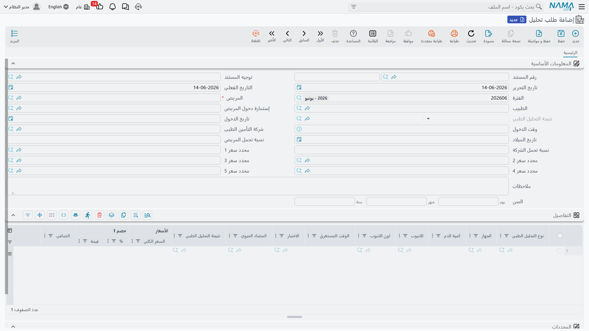
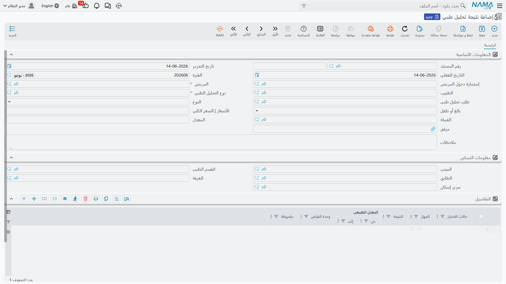
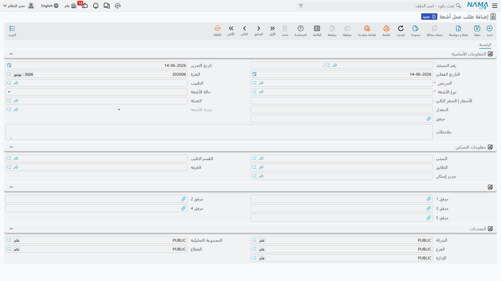
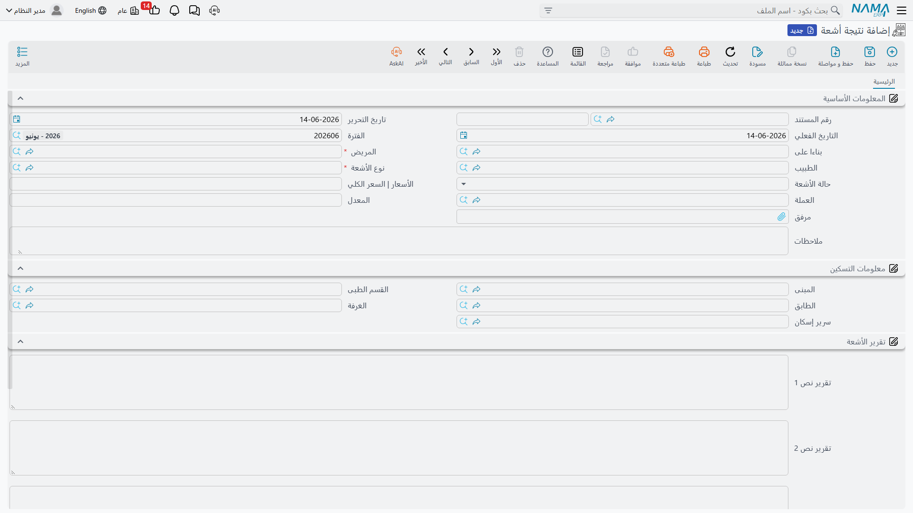
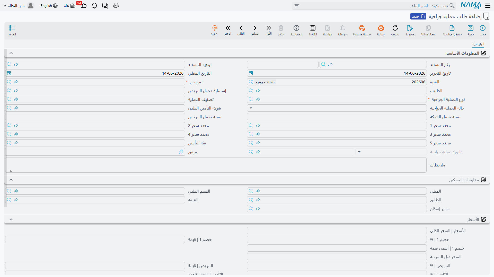
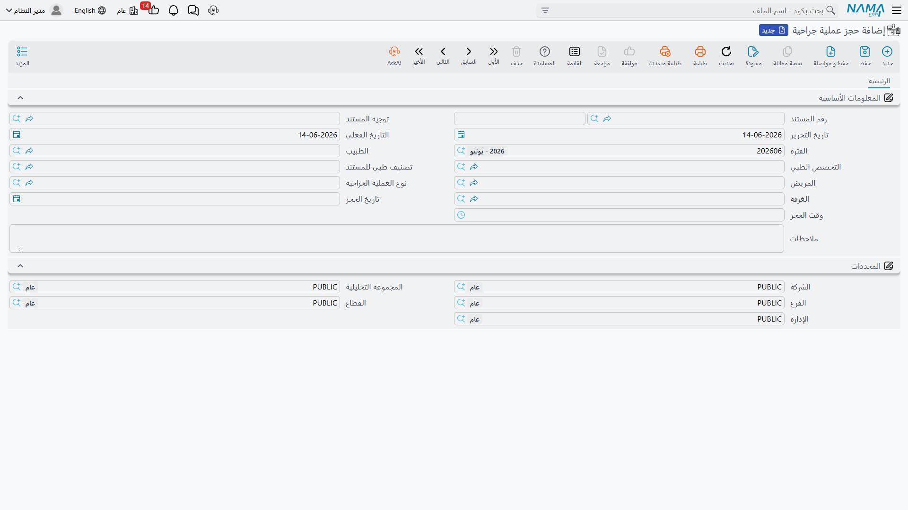
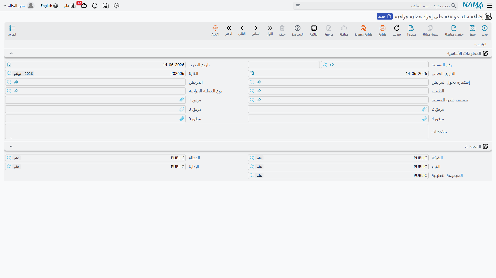
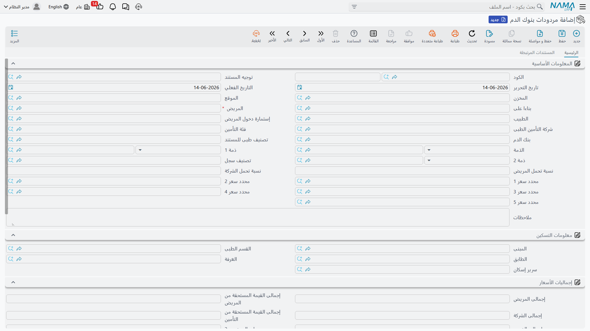

# الطلبات والنتائج الإكلينيكية

أثناء إقامة المريض (أو في زيارته الخارجية) يطلب له الطبيب فحوصًا وإجراءات: تحاليل، أشعة، عمليات. يتبع النظام في ذلك نمطًا واضحًا — **طلب** يفتحه الطبيب، ثم **نتيجة** تُدخلها المعامل أو الأقسام، ويرتبط الاثنان معًا. كل سطر مُسعَّر مقسوم بين المريض والتأمين كالعادة.

## التحاليل: طلب ثم نتيجة

**طلب تحليل (Lab Test Request)** أمر الطبيب بإجراء تحاليل: يحمل المريض والطبيب وإستمارة الدخول، وجدول التحاليل المطلوبة (نوع التحليل، الجهاز، كمية الدم، الأنبوبة ولونها، الوقت المستغرق، المضاد الحيوي) وأسعارها، ويرتبط لاحقًا بمستند النتيجة.

**نتيجة تحليل طبي (Lab Test Result)** تسجّل القيم المقيسة. وذكاؤها أنها — عند اختيار **نوع التحليل** — تُحمِّل مكوّناته (Test Cases) وتملأ **المعدّل الطبيعي المناسب لنوع المريض** (ذكر/أنثى، بالغ/طفل) تلقائيًا، فلا يُدخل الفنّي سوى القيمة المقيسة. وعند اختيار **طلب التحليل** تُنسخ بيانات المريض والطبيب، ومع طلب بنوع تحليل واحد تُحمَّل سطور النتيجة مسبقًا. كما تُرشَّح القوائم بذكاء: أنواع التحاليل المطابقة للطلب، والطلبات التي لم تُسجَّل نتيجتها بعد.

## الأشعة: طلب ثم نتيجة

**طلب عمل أشعة (Radiology Request)** أمر الطبيب بإجراء تصوير: المريض، الطبيب، **نوع الأشعة**، الحالة، السعر، ومرفقات.

**نتيجة أشعة (Radiology Result)** تقرير الأخصائي وصوره: تُنشأ من الطلب (عبر "من مستند")، وتحمل بلوك **تقرير الأشعة** بنصوصه ومرفقاته (ملفات الصور والتقرير).

## العمليات: طلب وحجز وموافقة

تمرّ العملية بثلاثة مستندات يكمّل بعضها بعضًا:

- **طلب عملية جراحية (Surgery Request)** — يطلب العملية بنوعها وتصنيفها وحالتها وتسعيرها الكامل (تقسيم المريض/التأمين)، ويرتبط بفاتورة العملية.

- **حجز عملية جراحية (Surgery Reservation)** — يحجز غرفة العمليات في موعد محدّد (الطبيب، التخصص، نوع العملية، الغرفة، تاريخ ووقت الحجز) — وهو الوجه الجدولي للطلب.

- **سند موافقة على إجراء عملية جراحية (Surgery Approval)** — الموافقة/الإقرار الموقَّع للمضيّ في العملية، مع مرفقاته الداعمة.

## بنك الدم

**بنك دم (Blood Bank)** ملف أساسي يعمل كذمّة محاسبية (مصدر/وجهة وحدات الدم). وعندما تُعاد وحدات دم (مثلًا غير المستخدمة منها) يُسجَّل ذلك في **مردودات بنوك الدم (Blood Bank Return)** — مستند بسطور مخزنية كاملة (الصنف، الكمية، اللوت، الصلاحية) وتسعير مقسوم بين المريض والتأمين، ويُنتج إذن استلام مخزني. أما صرف الدم وفوترته فيتمّان عبر **[فاتورة بنك الدم](./hms-invoicing.md)**.

