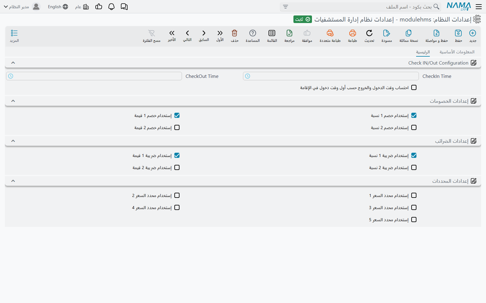

# إعدادات نظام إدارة المستشفيات

لموديول المستشفيات سجل إعدادات واحد، وهو صغير: سبعة عشر خيارًا في صفحة واحدة. أربعة منها تغيّر طريقة
تحويل الإقامة إلى أيام تُحاسَب، والباقي يحدد أي حقول الخصم والضريبة ومحددات السعر تظهر في شاشات
المستشفى أصلًا. لا شيء هنا يُنشئ قيدًا أو يمنع حفظًا، لكن المجموعة الأولى تحدد عدد الليالي التي يُحاسَب
عليها كل مريض مقيم، فاضبطها عن قصد قبل أول استمارة دخول.

تفتحه من **نظام إدارة المستشفيات ← الإعدادات ← إعدادات نظام إدارة المستشفيات**. يحمل السجل الرأس
المعتاد (الكود والاسم ومجموعة الإعدادات والمحددات التي ينطبق عليها) وصفحة واحدة هي **الرئيسية**
(Main) فيها أربع مجموعات.

## Check IN/Out Configuration — كيف تصبح الإقامة أيامًا تُحاسَب

المستشفى يحاسب على الإقامة باليوم، لكن المرضى لا يصلون عند منتصف الليل. الخيارات الثلاثة في هذه
المجموعة تحدد «اليوم» الفندقي الذي تَعُدّ به فواتير الإقامة. عنوان المجموعة نفسه يظهر بالإنجليزية على
الشاشة العربية.

| الخيار | ماذا يفعل |
|---|---|
| **CheckIn Time** | الساعة التي يبدأ عندها يوم المحاسبة. المريض الذي يصل **قبل** هذه الساعة يُحاسَب من اليوم السابق. القيمة الافتراضية 00:00. |
| **CheckOut Time** | الساعة التي ينتهي عندها يوم المحاسبة. المريض الذي يخرج **بعد** هذه الساعة يُحاسَب يومًا إضافيًا. القيمة الافتراضية 00:00. |
| **احتساب وقت الدخول والخروج حسب أول وقت دخول في الإقامة** (Check Out Time Is Based On Check In Time) | يتجاهل الساعتين السابقتين. يبدأ يوم كل مريض من وقت **أول** تسكين له وينتهي قبل ذلك الوقت بدقيقة في اليوم التالي، فتُحاسَب الإقامة بدورات من 24 ساعة تبدأ من الوصول. |

حقلا الساعة يظهران باسميهما الإنجليزيين على الشاشة العربية أيضًا (*CheckIn Time* و*CheckOut Time*)،
فالمنتج لا يحمل لهما اسمًا عربيًا.

### مثال محسوب

مريض يصل يوم 1 يناير الساعة 10:00 ويخرج يوم 3 يناير الساعة 13:00.

- **إذا تُركت الساعتان على 00:00** (الافتراضي) يُحسب كل يوم تقويمي لمسه المريض: 1 و2 و3 يناير —
  **3 أيام**.
- **إذا ضُبطت CheckIn Time وCheckOut Time على 12:00** فالوصول الساعة 10:00 قبل ساعة الدخول، فتبدأ
  الإقامة من 31 ديسمبر الساعة 12:00، والخروج الساعة 13:00 بعد ساعة الخروج فتمتد إلى 4 يناير الساعة
  12:00 — **4 أيام**.
- **إذا فُعّل خيار الاحتساب حسب أول وقت دخول** فاليوم يمتد من 10:00 إلى 09:59. الخروج الساعة 13:00
  يوم 3 يناير يتجاوز حد 09:59 الثاني — **3 أيام**. ولو خرج الساعة 09:00 في اليوم نفسه لكانت
  **يومين**.

الساعات نفسها تحدد **تاريخ الفوترة** لكل سطر في فاتورة الإقامة (السطر الذي بدأ يومه قبل ساعة الدخول
يُؤرَّخ باليوم السابق)، وهي «اليوم عند ساعة الخروج» الذي تُحاسَب عليه الإقامة الجارية حين يُعاد بناء
فواتير الإقامة المؤقتة — انظر [الإقامة والتغذية](./hms-accommodation.md).

## إعدادات الخصومات وإعدادات الضرائب — أي أعمدة تراها

كل مستند مسعّر في المستشفى يحمل كتلة السعر نفسها: السعر، وخصمين، وتقسيم المريض والتأمين، وضريبتين،
والإجماليات. معظم المستشفيات تستخدم خصمًا واحدًا وضريبة واحدة، فهذه الخيارات الثمانية تخفي ما لا
تستخدمه.

| الخيار | يُظهر | الافتراضي |
|---|---|---|
| **إستخدام خصم 1 نسبة** | نسبة الخصم 1 وقيمته وحده الأقصى في سطور الخدمات وكتل السعر | مفعّل |
| **إستخدام خصم 1 قيمة** | قيمة الخصم 1 في إجماليات المستند | مفعّل |
| **إستخدام خصم 2 نسبة** | نسبة الخصم 2 وقيمته وحده الأقصى في سطور الخدمات وكتل السعر | غير مفعّل |
| **إستخدام خصم 2 قيمة** | قيمة الخصم 2 في إجماليات المستند | غير مفعّل |
| **إستخدام ضريبة 1 نسبة** | نسبة الضريبة 1 (وقيمتها في السطور) | مفعّل |
| **إستخدام ضريبة 1 قيمة** | قيمة الضريبة 1 في كتل السعر والإجماليات | مفعّل |
| **إستخدام ضريبة 2 نسبة** | نسبة الضريبة 2 (وقيمتها في السطور) | غير مفعّل |
| **إستخدام ضريبة 2 قيمة** | قيمة الضريبة 2 في كتل السعر والإجماليات | غير مفعّل |

هذه الخيارات تُظهر الحقول أو تخفيها فقط. الخصم أو الضريبة القادمة من قائمة أسعار أو خصم طبي أو سياسة
ضريبة تظل تُحسب وتظل تؤثر في القيد حتى لو كان حقلها مخفيًا، ففعّل حقول كل خصم وكل ضريبة تستخدمها
فعلًا.

## إعدادات المحددات — محددات السعر الخمسة

الخيارات من **إستخدام محدد السعر 1** إلى **إستخدام محدد السعر 5** تضيف حقول *محدد سعر* إلى فواتير
المستشفى وجداول قوائم الأسعار. محدد السعر مفتاح مطابقة إضافي تختاره أنت — مثل «وردية ليلية» أو «جناح
كبار الزوار» — يُؤخذ من ملفات *محدد سعر مبيعات* المشتركة. سطر قائمة الأسعار الذي يحدد محددًا لا يطابق
إلا فاتورة تحمل المحدد نفسه، والسطر الذي يتركه فارغًا يطابق أي فاتورة. الخمسة غير مفعّلة افتراضيًا.

## متى يظهر التغيير على الشاشة

شاشات المستشفى تُبنى من هذه الخيارات عند توليد الشاشات، فالتغيير هنا لا يظهر على شاشة مفتوحة. بعد
حفظ الإعدادات شغّل **Regenerate UI** من Utilities (أو **Regenerate Screens** من أي
[معدِّل شاشة](/ar/platform/screen-modifier/screen-modifier-overview))، ثم اطلب من المستخدمين إعادة
تحميل صفحة المتصفح. أما ساعتا الدخول والخروج فمختلفتان: تُقرآن في كل مرة تُبنى فيها فاتورة إقامة، فتسريان
من الحفظ التالي.

::: warning تغيير الساعات لا يعيد محاسبة الإقامات القديمة
فواتير الإقامة الموجودة تحتفظ بالأيام التي بُنيت بها. وحدها الفواتير التي يُعاد بناؤها — بحفظ مستند
التسكين مرة أخرى أو بالضغط على **إعادة إنشاء فواتير الإقامة** — تستخدم الساعات الجديدة.
:::

## خيارات موجودة لكنها ليست على الشاشة

يحمل سجل الإعدادات أيضًا الخيار **Show Costs** الذي يضيف نسبة التكلفة وقيمتها إلى كتل السعر. هذا
الخيار ليس على شاشة الإعدادات، فيبقى غير مفعّل ما لم يُضبط بالاستيراد.
