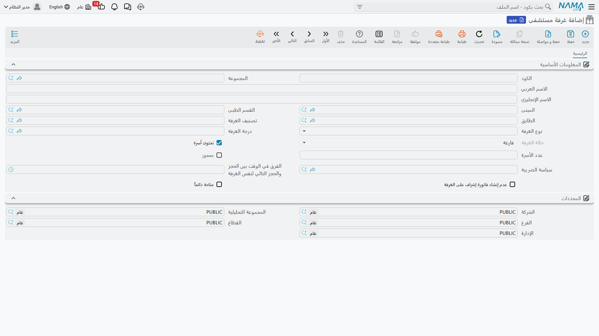
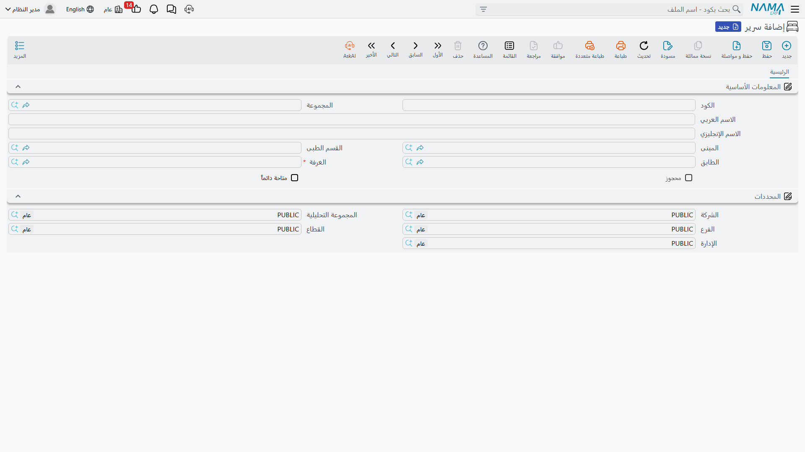
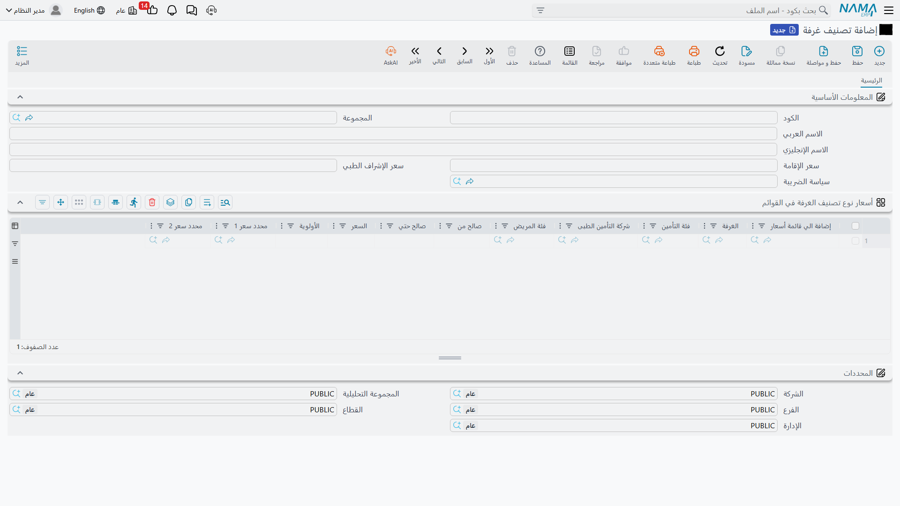
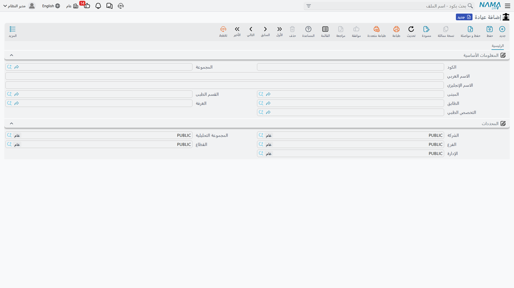

# هيكل المستشفى والغرف

قبل أن تستقبل أول مريض، تحتاج إلى رسم خريطة مبناك داخل النظام: ما المباني التي لديك، وما طوابقها وأقسامها، وأي غرف وأسرّة فيها، وأي عيادات تعمل. كل ذلك تجده تحت **نظام إدارة المستشفيات ← هيكل المستشفى**، ويُبنى مرة واحدة ثم يُستخدم في كل مستندات الدخول والتسكين.

## الهرم: مبنى ← طابق ← قسم ← غرفة ← سرير

يُنظَّم المستشفى في خمسة مستويات متداخلة:

- **مبنى (HMS Building)** — أعلى مستوى مادي. قد يكون لديك أكثر من مبنى (المبنى الرئيسي، مبنى العيادات الخارجية، جناح الولادة…). كل ما يأتي بعده يتبع مبنى ما.
- **طابق (HMS Floor)** — دور داخل المبنى، حتى تُحدَّد مواقع الغرف والأسرّة بدقة.
- **قسم طبى (Hospital Section)** — قسم تشغيلي/طبي (جراحة، باطنة، عناية مركّزة، أطفال…) يجمع الغرف والأسرّة والعيادات حسب المجال الإكلينيكي.
- **غرفة مستشفى (HMS Room)** — الوحدة الأكثر تفصيلًا (انظر أدناه).
- **سرير (Bed)** — سرير منفرد داخل غرفة، يتيح التسكين والحجز على مستوى السرير لا الغرفة فقط في الغرف متعدّدة الأسرّة.

## الغرفة: قلب الإقامة

الغرفة هي أكثر ملفات الهيكل ثراءً، لأنها تتحكّم في حجز السرير والإقامة والفوترة. إلى جانب موقعها (المبنى/القسم/الطابق)، تحمل الغرفة:

- **تصنيف الغرفة (Room Classification)** و**نوع الغرفة** و**درجة الغرفة** — مُصنِّفات تحدّد طبيعة الغرفة وسعرها.
- **تحتوى أسرّة (Have a Bed)** و**عدد الأسرّة** — هل الغرفة جناح متعدد الأسرّة أم غرفة مفردة.
- **محجوزة (Reserved)** و**حالة الغرفة** — لمتابعة الإشغال.
- **الفرق في الوقت بين الحجز والحجز التالي لنفس الغرفة** — مهلة التنظيف/التجهيز قبل أن تُتاح الغرفة لحجز جديد.
- **عدم إنشاء فاتورة إشراف على الغرفة** و**متاحة دائمًا** — استثناءات في الفوترة والإتاحة.
- **سياسة الضريبة (Tax Plan)** — كيف تُحسب الضريبة على إقامة هذه الغرفة.

والسرير ملف أبسط: موقعه (المبنى/القسم/الطابق/الغرفة) وحالته (محجوز/متاح دائمًا).

## تصنيف الغرفة: حيث يُحدَّد سعر الإقامة

هنا يحدث التسعير الفعلي للإقامة. لكل **تصنيف غرفة** (خاصة، مشتركة، VIP، عناية…):

- **سعر الإقامة (Accommodation Price)** — أجر الليلة الأساسي.
- **سعر الإشراف الطبي (Medical Supervision Price)** — أجر الإشراف الطبي اليومي على المريض في هذا التصنيف.
- **سياسة الضريبة**.

وأسفل ذلك جدول **أسعار التصنيف في القوائم** يتيح تنويع السعر حسب: شركة التأمين، فئة التأمين، فئة المريض، فترة الصلاحية (من/إلى)، وغرفة بعينها — مع أولوية لترجيح السطر المطابق. هكذا يصل سعر الليلة الصحيح تلقائيًا إلى فاتورة الإقامة بحسب حالة كل مريض.

::: info تصنيف ودرجة الغرفة
**درجة الغرفة (Room Degree)** مُصنِّف إضافي بسيط (أولى، ثانية، اقتصادية…) يُستخدم إلى جانب التصنيف والنوع، وليس له سعر مستقل — التسعير يأتي من **تصنيف الغرفة**.
:::

## العيادات

**العيادة (Clinic)** هي نقطة الكشف للمرضى الخارجيين — مكان مرتبط بموقع (مبنى/قسم/طابق/غرفة) و**بتخصص طبي**. تُستخدم لاحقًا في جدولة المواعيد وحجوزات العيادة الخارجية لتوجيه المريض إلى التخصص والمكان الصحيحين.

::: tip ابدأ بما تحتاجه فعلًا
لا تحتاج إلى إدخال كل غرفة وسرير دفعةً واحدة. ابدأ بتصنيفات الغرف وأسعارها، ثم الأقسام والغرف التي ستستقبل فيها المرضى أولًا، وأضف الباقي تدريجيًا.
:::
