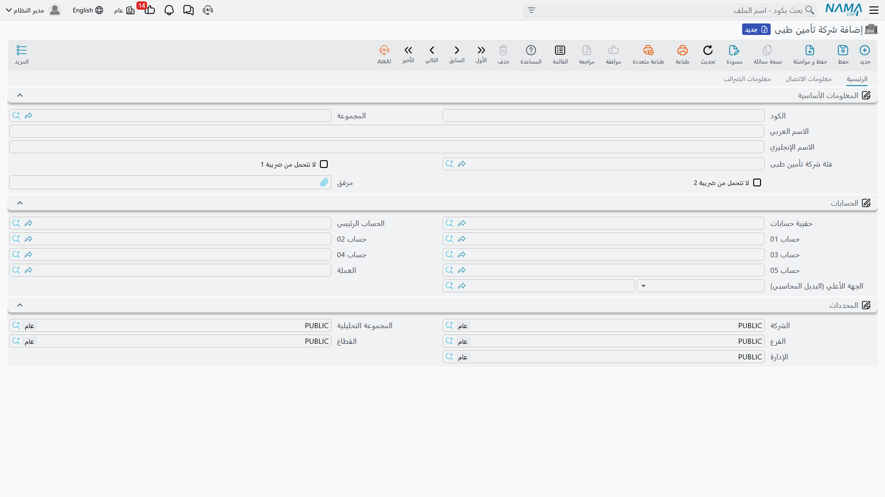
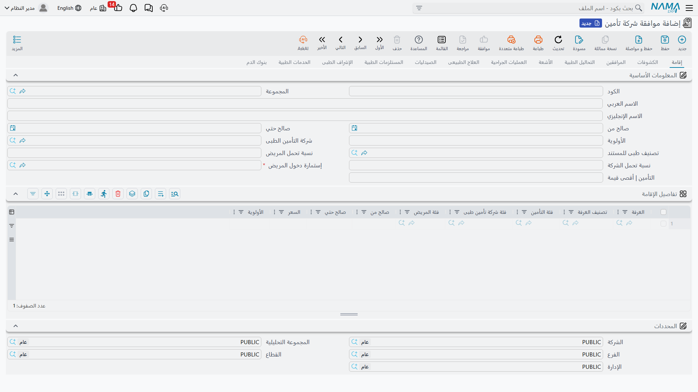

# التأمين الطبي والموافقات

التأمين هو ما يجعل فوترة المستشفى مختلفة: نادرًا ما يدفع المريض كامل الفاتورة. لذا قبل أن نُسعّر أي خدمة، نُعرّف شركات التأمين التي نتعامل معها، وكيف نُصنّفها، والأهم: **موافقة شركة التأمين** التي تحدّد الأسعار المتفق عليها وكيف تُقسَّم بين المريض والشركة.

## شركات التأمين وفئاتها

**شركة تأمين طبى (Medical Insurance Company)** هي الجهة الدافعة التي نُحاسبها على الجزء المغطّى من فواتير المرضى. وهي ذمّة محاسبية كاملة — لها حساب أستاذ تُرحَّل إليه التزامات التغطية وتُتابَع كأي مدين. تحمل علاوةً على الحسابات والضرائب وبيانات الاتصال علامتي **عدم التحمّل من ضريبة 1/2**.

ولتنظيم الأسعار والتغطية نستخدم مُصنِّفين:

- **فئة تأمين (Insurance Classification)** — درجة تغطية (ذهبية، فضية، VIP…) تُستخدم كمحدِّد على سطور الأسعار والفواتير لاختيار السعر المتفق عليه.
- **فئة شركة تأمين طبى (Medical Insurance Company Class)** — تجميع للشركات في فئة واحدة، حتى يُطبَّق سطر سعر/موافقة على فئة كاملة من الشركات بدل شركة واحدة.

## موافقة شركة التأمين: مرجع الأسعار والتغطية

**موافقة شركة تأمين (Insurance Company Approval)** هي قلب نظام التأمين. فهي قائمة الأسعار المتفق عليها مع الشركة، وهي ما يُخبر النظام — لكل نوع خدمة — بالسعر المتفق عليه و**نسبة تحمّل المريض مقابل الشركة (Endurance)**.

تُنظَّم الموافقة في **تبويب لكل نوع خدمة** (إقامة، كشف، مرافقين، تحاليل، أشعة، عمليات، علاج طبيعي، صيدلية، مستلزمات، إشراف، خدمات، بنك دم). يتكرّر في كل تبويب رأسٌ موحّد: **من/إلى تاريخ الصلاحية، الأولوية، شركة التأمين، تصنيف المستند، نسبة تحمّل المريض، نسبة تحمّل الشركة، إستمارة الدخول، والحد الأقصى للتأمين**. ثم يحمل كل تبويب جدول تسعير خاصًّا بنوع خدمته (الغرفة وتصنيفها للإقامة، الطبيب والدرجة ونوع التحليل للتحاليل، نوع العملية ومكوّنات أجرها للعمليات… وهكذا).

عند فوترة أي خدمة، يبحث النظام في الموافقة المطابقة (حسب الشركة وفئة التأمين وفئة المريض والطبيب والتاريخ) فيأخذ منها السعر ونسب التحمّل، ومنها أيضًا يأتي **الحد الأقصى لتحمّل التأمين** الذي يظهر على سطور الفواتير. بهذا تُترجَم اتفاقاتك مع شركات التأمين إلى تقسيم تلقائي صحيح على كل فاتورة.

::: tip الموافقة والأسعار العامة
الموافقة تُحدّد أسعار المريض المؤمَّن وتقسيم تحمّله. أما المرضى النقديون فتأتي أسعارهم من **[قائمة أسعار طبية](./hms-pricing.md)**. النظامان يستخدمان المُصنِّفات نفسها (فئة المريض، الطبيب، الدرجة، الفترة) فيتكاملان معًا.
:::
