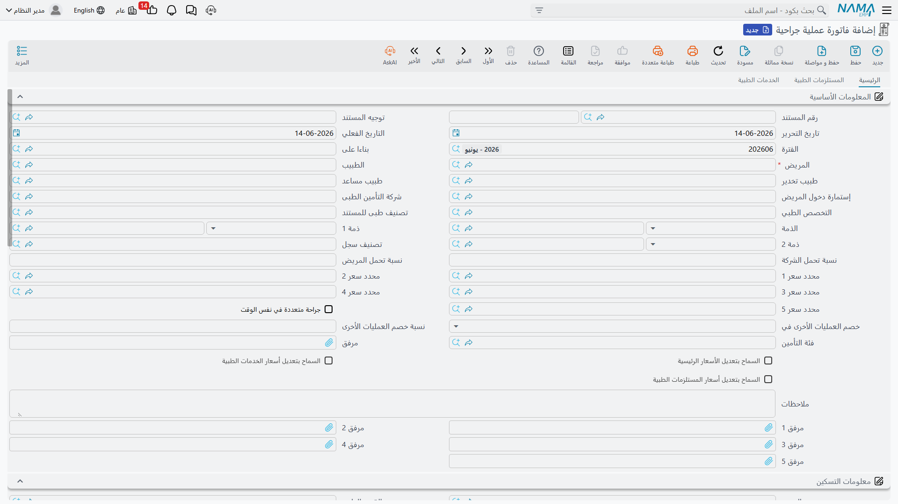
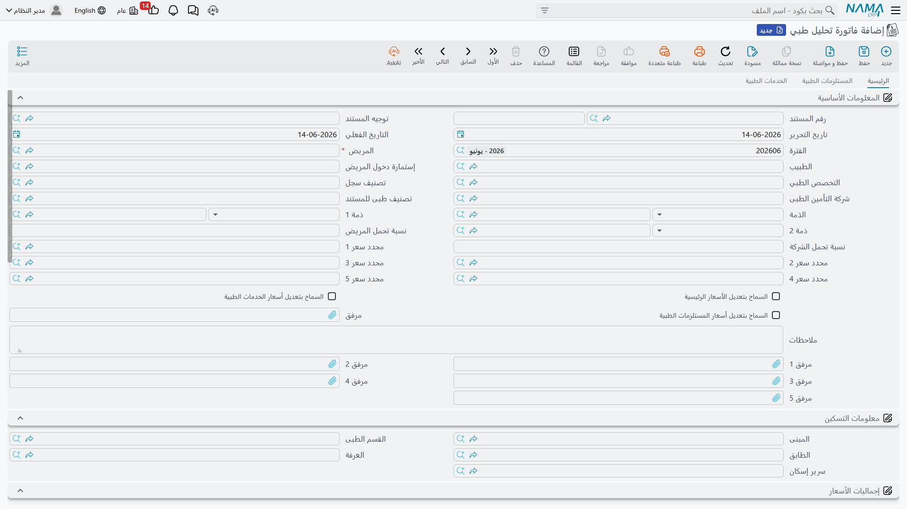
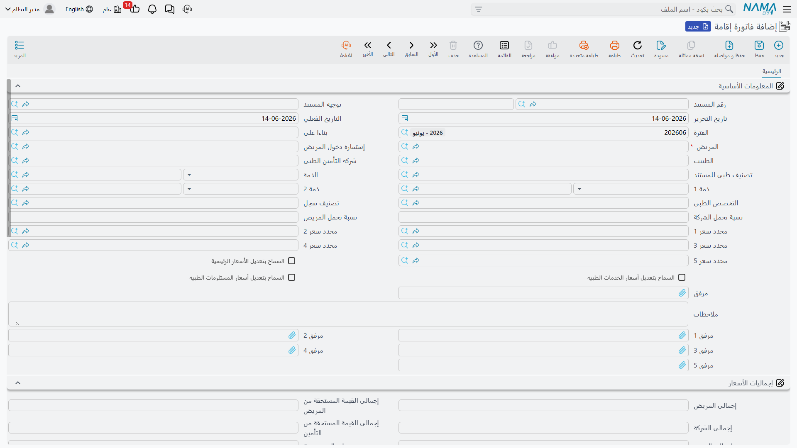
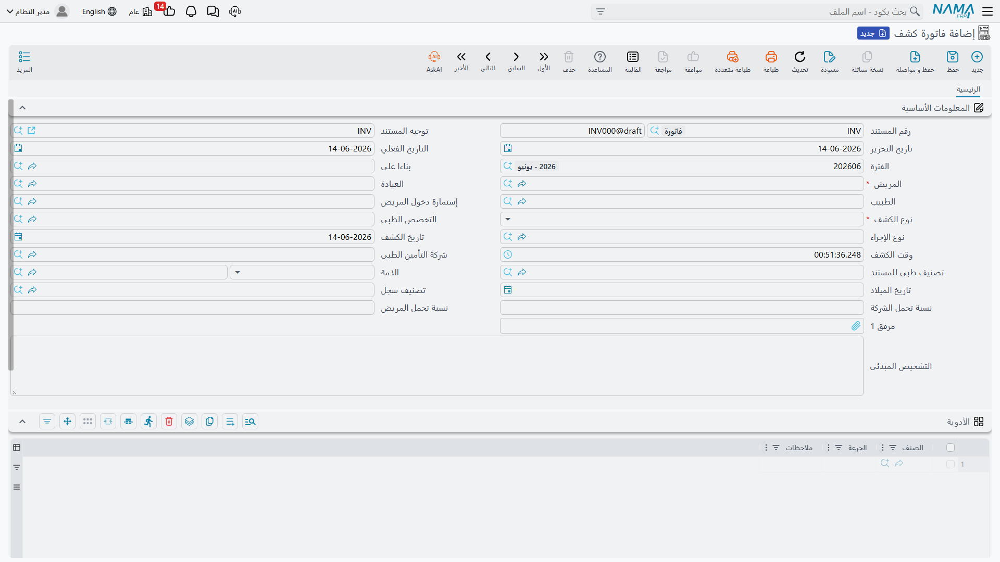
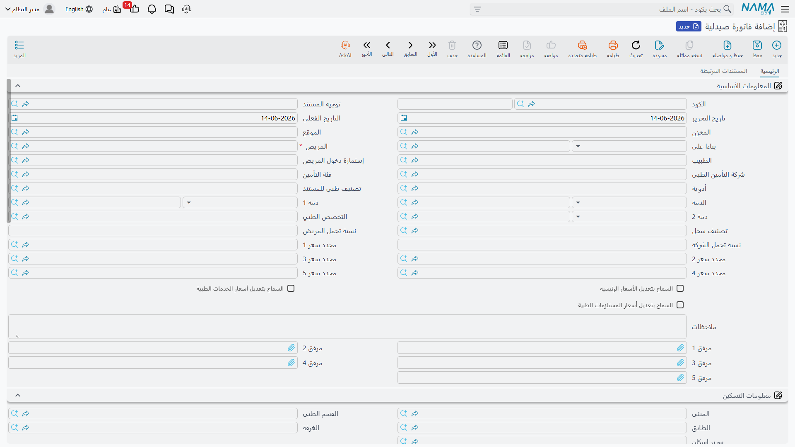
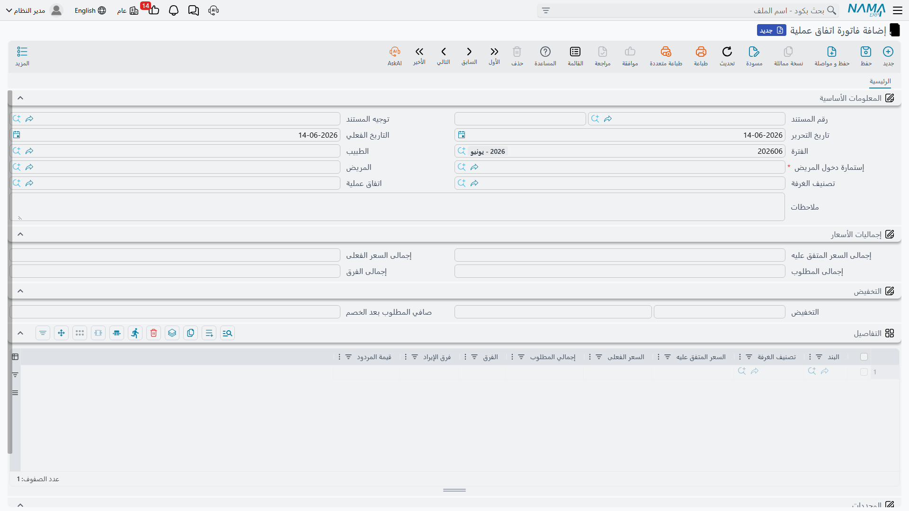
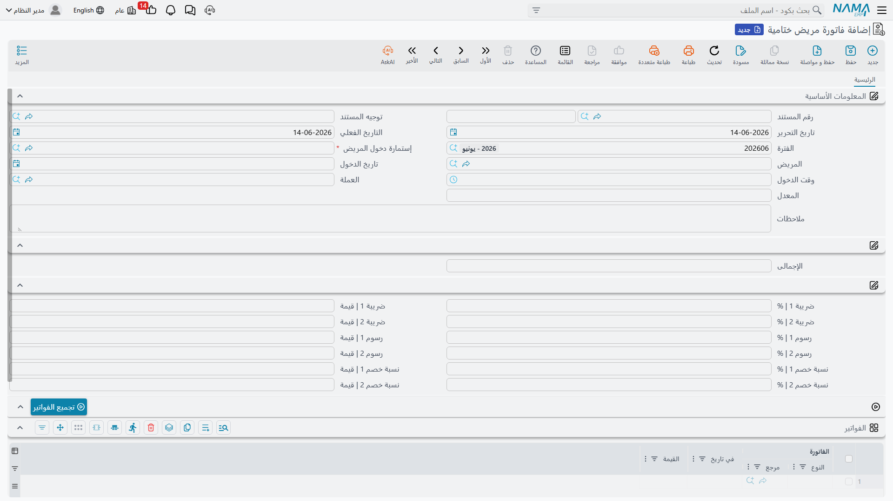

# الفواتير والمحاسبة

الفوترة هي العمود الفقري المالي للمستشفى. القاعدة بسيطة: **لكل نوع خدمة فاتورته**. تتشابه هذه الفواتير في بنيتها تشابهًا كبيرًا، ثم تختلف في سطورها بحسب نوع الخدمة. وكلها مستندات تُنتج **أثرًا محاسبيًا**.

## النمط المشترك لكل الفواتير

تتقاسم فواتير الخدمات هيكلًا واحدًا:

1. **رأس المستند** — كود المستند، التوجيه، تواريخ التحرير والاستحقاق، الفترة المالية، والمحدِّدات.
2. **سياق المريض** — المريض، **إستمارة دخول المريض** (تربط الخدمة بالدخول)، شركة التأمين وفئته، نِسَب تحمّل المريض/الشركة، وغالبًا الطبيب والتخصص وتصنيف المستند، والذمم الحاملة للتكلفة.
3. **سطور الخدمة** — ولكل سطر بلوك سعر غنيّ يحسب: السعر، الخصم 1/2، **تقسيم المريض/التأمين** (نسبة وقيمة لكلٍّ)، **الحد الأقصى لتحمّل التأمين من الموافقة ومن الدخول**، الضرائب مقسومة بين المريض والتأمين، **إجمالي مستحق المريض** و**إجمالي مستحق التأمين**، ونسبة/قيمة التكلفة وتوزيعها على الذمم.
4. **الإجماليات** — تعكس ما سبق على مستوى المستند.
5. **بنود التكلفة غير المباشرة (Overhead)** — على معظم الفواتير.

::: tip تقسيم الفاتورة هو الفكرة الأساسية
كل سطر يُقسَّم تلقائيًا إلى **نصيب مريض** و**نصيب تأمين** (بنِسَب التحمّل القادمة من [موافقة التأمين](./hms-insurance.md) والدخول)، ويُحسَب لكل نصيب ضريبته ويُرحَّل إلى حساب مستقل في **التوجيه (Term Config)**. وهذا التوجيه هو ما يربط أنواع القيم (قيمة المريض، قيمة التأمين، الخصومات، الضرائب، التكلفة، تكلفة الذمم) بحسابات الأستاذ.
:::

## فواتير الخدمات

تتبع هذه الفواتير نمط الخدمة (سعر + إشراف + تكلفة وقت إضافي في العمليات):

- **فاتورة إقامة (Accommodation Invoice)** — أجر إقامة الغرفة/السرير، وغالبًا تُولَّد تلقائيًا من مستند التسكين.
- **فاتورة مرافق (Attendant Invoice)** — إقامة مرافق المريض.
- **فاتورة تحليل طبي (Lab Test Invoice)** — التحاليل، مع إمكانية إضافة مستلزمات وخدمات.
- **فاتورة أشعة (Radiology Invoice)** — التصوير ومستلزماته.
- **فاتورة العلاج الطبيعى (Physical Therapy Invoice)** — جلسات العلاج الطبيعي.
- **فاتورة إشراف طبي (Supervision Invoice)** — إشراف الطبيب على المريض.
- **فاتورة خدمات طبية (Services Invoice)** — الخدمات الطبية العامة.
- **فاتورة كشف (Check Invoice)** — الكشف الخارجي، وتنفرد بجدول **الأدوية** الموصوفة في الزيارة.

أغنى هذه الفواتير **فاتورة عملية جراحية (Surgery Invoice)**: ثلاثة تبويبات (العملية، المستلزمات، الخدمات)، وفي رأسها طبيب التخدير والمساعد ومُصنِّفات السعر وبيانات الإقامة ومرفقات؛ ويُفصِّل سطر العملية الأجر إلى مكوّناته (جراحة مفتوحة، أجر الجرّاح، المساعد، التخدير، أخرى) بساعات قياسية وإضافية. وتبويب المستلزمات سطر مخزني كامل يُنتج صرفًا من المخزن.

## فواتير الصرف المخزني والمرتجعات

هذه الفواتير **تحرّك المخزون** وتضيف حسابات **أتعاب الخدمة (Service Fees)**، وسطرها سطر مخزني كامل (صنف، وحدة، لوت، تشغيلة، صلاحية، مخزن):

- **فاتورة صيدلية (Pharmacy Invoice)** و**مردودات صيدليات (Pharmacy Return)** — صرف الأدوية وإعادتها.
- **فاتورة مستلزمات طبية (Supplies Invoice)** و**مردودات مستلزمات طبية (Supply Return)** — صرف المستلزمات وإعادتها.
- **فاتورة خدمات ومستلزمات طبية (Service And Supply Invoice)** — خدمات ومستلزمات في مستند واحد.
- **فاتورة بنك الدم (Blood Bank Invoice)** — صرف وحدات الدم والخدمات المرتبطة (تحرّك مخزون الدم).

## فاتورة اتفاق العملية

**فاتورة اتفاق عملية (Surgery Package Invoice)** تُفوتِر عمليةً مقابل **سعر باقة متفق عليه** بدل الفوترة بندًا بندًا. تعرض **إجمالي السعر المتفق عليه** و**الفعلي** و**الفرق**، ولكل بند: السعر المتفق، السعر الفعلي، والفرق وفرق الإيراد. ومحاسبيًا تُرحّل الفرق بين سعر الباقة وتكلفة الخدمات الفعلية عبر حسابات الفرق المخصّصة.

## الفاتورة الختامية

**فاتورة مريض ختامية (Closing Invoice)** هي مستند تسوية الخروج. عندما يغادر المريض، تجمع هذه الفاتورة الواحدة **كل الفواتير الفردية التي صدرت أثناء إقامته** في كشف واحد، ثم تطبّق ضرائب ورسوم وخصومات على مستوى الدخول للوصول إلى المبلغ النهائي المستحق على المريض/التأمين.

قلبها زرّ **تجميع الفواتير (Collect Invoices)** الذي يسحب كل فواتير المريض المرتبطة بإستمارة الدخول إلى جدول التفاصيل (فاتورة، تاريخ، قيمة). ويحمل رأسها إستمارة الدخول والمريض وتاريخ الدخول، وحقول **ضريبة 1/2** و**رسوم 1/2** و**خصم 1/2** (نسبة + قيمة) لتعديلات مستوى الدخول. وتُرحّل المستحقات المجمّعة للمريض والتأمين مع تلك التعديلات.

