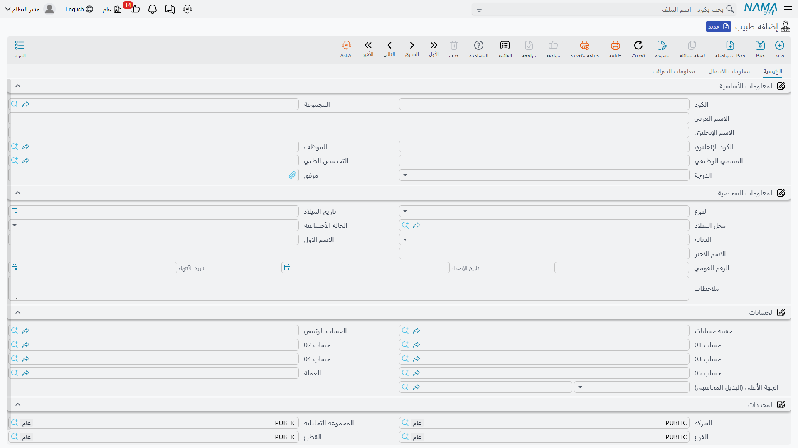
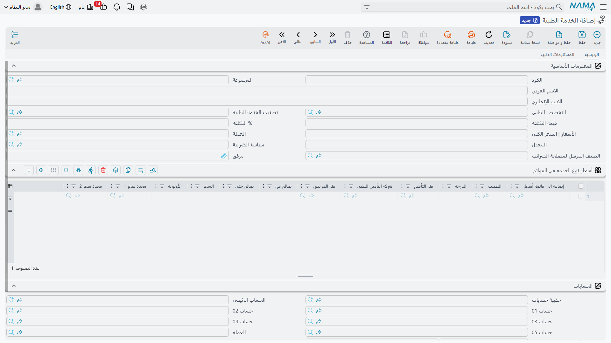
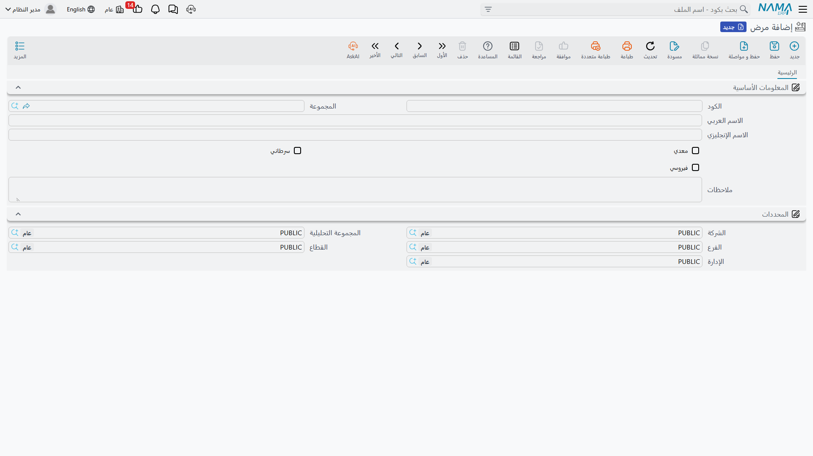
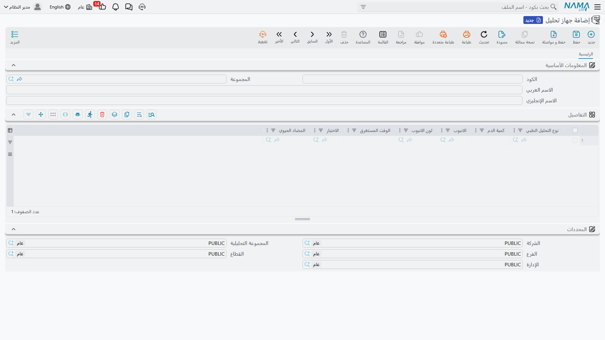
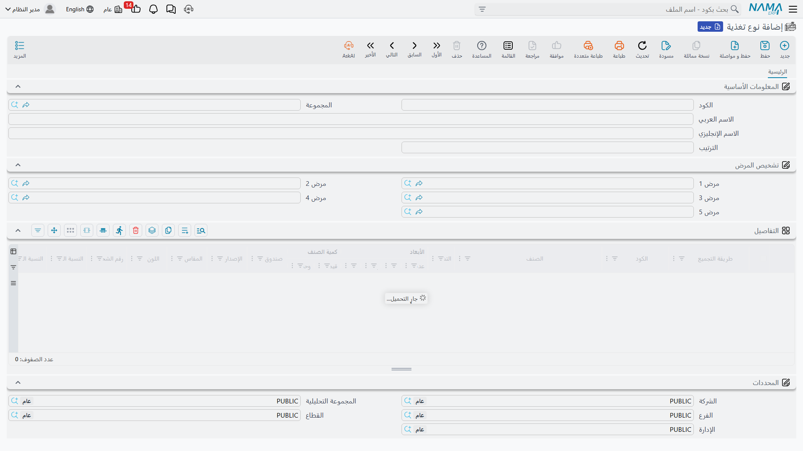
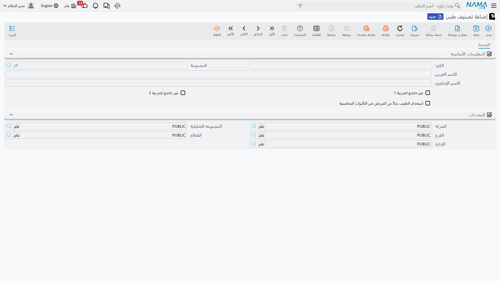

# الملفات الطبية الأساسية

بعد رسم هيكل المبنى، نُعرّف الكوادر والمفاهيم الطبية التي تتعامل معها المستندات يوميًا: الأطباء، التخصصات، الأمراض، الخدمات الطبية، أجهزة التحاليل، التغذية، وفئات المرضى. معظمها تحت **نظام إدارة المستشفيات ← الملفات** (وبعضها تحت قوائم متخصّصة كالتحاليل والتغذية كما سنشير).

## الطبيب

**الطبيب (Doctor)** من أغنى الملفات. فهو يسجّل بيانات الطبيب وتخصصه ودرجته، ويمكن ربطه بملف **موظف** في الموارد البشرية، والأهم أنه يعمل **كذمّة محاسبية** — أي له حساب أستاذ خاص يتيح صرف نصيبه/عمولته من الخدمات. تتوزّع بياناته على تبويبات: المعلومات الأساسية (التخصص، الدرجة، الوظيفة)، البيانات الشخصية (النوع، الميلاد، الرقم القومي)، الحسابات، الضرائب، بيانات الاتصال، والبيانات الضريبية. ولأن **الطبيب ودرجته** مُصنِّفان للسعر، فإن سعر الخدمة قد يختلف من طبيب لآخر.

و**التخصص الطبي (Medical Specialty)** يصنّف الأطباء والعيادات والخدمات (قلب، عظام، أطفال…)، وهو أيضًا ذمّة محاسبية فيمكن تتبّع الإيراد لكل تخصص.

## الخدمة الطبية

**الخدمة الطبية (Medical Service)** هي البند المُسعَّر الأساسي في النظام — كشف، إجراء، خدمة تمريضية… تحمل **التكلفة** و**السعر** وسياسة الضريبة و**الصنف المرسل لمصلحة الضرائب** (للفاتورة الإلكترونية)، وترتبط بتخصص وتصنيف خدمة. ومثل تصنيف الغرفة، لها جدول **أسعار في القوائم** يُنوّع السعر حسب الطبيب/الدرجة/التأمين/فئة المريض والفترة. والمميّز فيها تبويب **المستلزمات الطبية**: قائمة الأصناف التي تُستهلك عند أداء الخدمة، فيُصرف المخزون تلقائيًا عند الفوترة.

تُجمَّع الخدمات تحت **تصنيف خدمات طبية (Medical Service Category)** لتنظيم الكتالوج والتقارير.

## الأمراض والمضادات الحيوية

**المرض (Disease)** كتالوج التشخيصات المستخدم عند تسجيل تشخيص المريض، ويمكن وسم المرض بطبيعته: **معدٍ**، **سرطاني**، أو **فيروسي** — وهو ما يُفيد لاحقًا في اختيار التغذية المناسبة والإحصاءات.

و**المضاد الحيوي (Antibiotic)** قائمة تستخدمها المعامل (خصوصًا في اختبارات الحساسية/المزرعة) لتحديد المضادات التي اختُبر العيّنة ضدها. تجده تحت قائمة **التحاليل الطبية**.

## أجهزة التحاليل

رغم تسميته الإنجليزية "Medical Device"، فإن **جهاز التحليل** هو جهاز معمل، وتعريفه يحدّد **أي تحاليل يُجريها الجهاز** ومتطلبات كل تحليل: كمية الدم، نوع الأنبوبة ولونها، الوقت المستغرق، والاختبار والمضاد الحيوي المرتبط. هذا ما يقود لاحقًا تعليمات سحب العيّنة في طلبات التحاليل. تجده تحت قائمة **التحاليل الطبية**.

## التغذية وفئات المرضى وتصنيفات المستندات

- **نوع تغذية (Feeding Type)** — نظام غذائي للمريض (عادي، سكري، سائل…). يحدّد **ترتيبًا** للأولوية، والأمراض التي يُوصى به معها (حتى يُختار النظام تلقائيًا حسب التشخيص)، وقائمة المكوّنات الغذائية (كوصفة/أمر تجميع) بكمياتها وتكاليفها لصرفها من المطبخ. لهذا الملف دور محوري في **[صرف التغذية](./hms-accommodation.md)**.

- **فئة مريض (Patient Classification)** — تصنيف المريض (نقدي، موظف، شركة، إعفاء، VIP…)، وهو **مُصنِّف تسعير** أساسي: تختلف الأسعار حسب فئة المريض في قوائم الأسعار وموافقات التأمين.

- **تصنيف طبى للمستند (Medical Document Category)** — يتحكّم في **السلوك الضريبي والمحاسبي** لفئة كاملة من المستندات: إعفاؤها من ضريبة 1 أو 2، واختيار **استخدام الطبيب بدلًا من المريض في التأثيرات المحاسبية** — وهو مفيد لنموذج اقتسام إيراد الطبيب.

::: info مُصنِّفات أخرى بسيطة
يضمّ النظام أيضًا لوائح مرجعية بسيطة مثل **نوع الإجراء (Procedure Type)** لتصنيف الإجراءات الطبية. تُعرَّف بكود واسم فقط وتُستخدم للتصنيف.
:::
