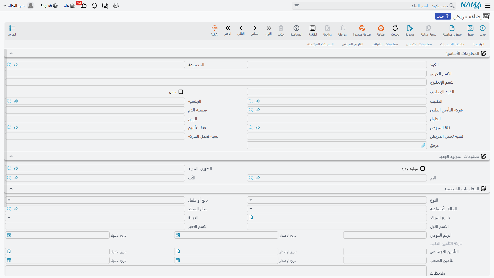
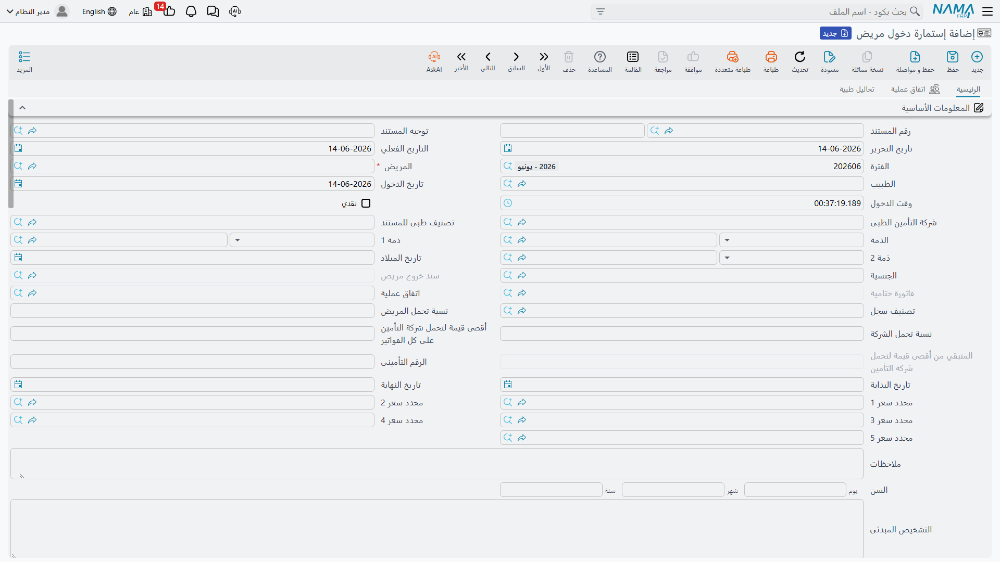
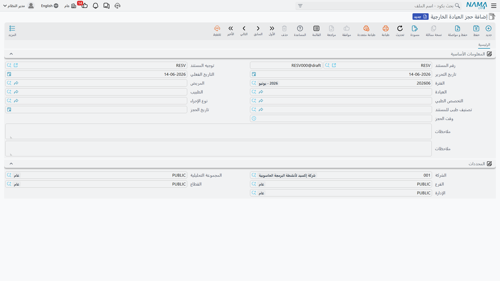
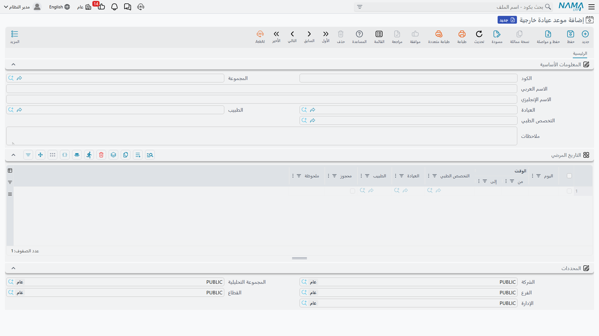
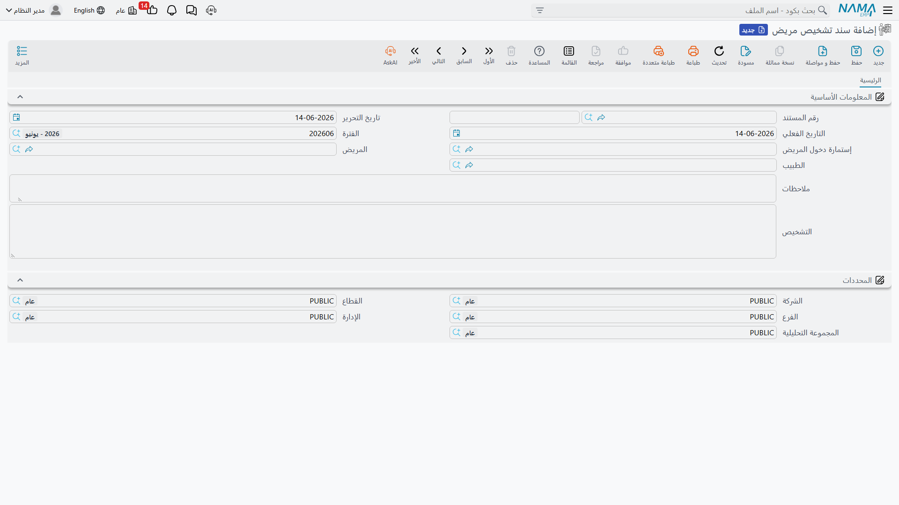
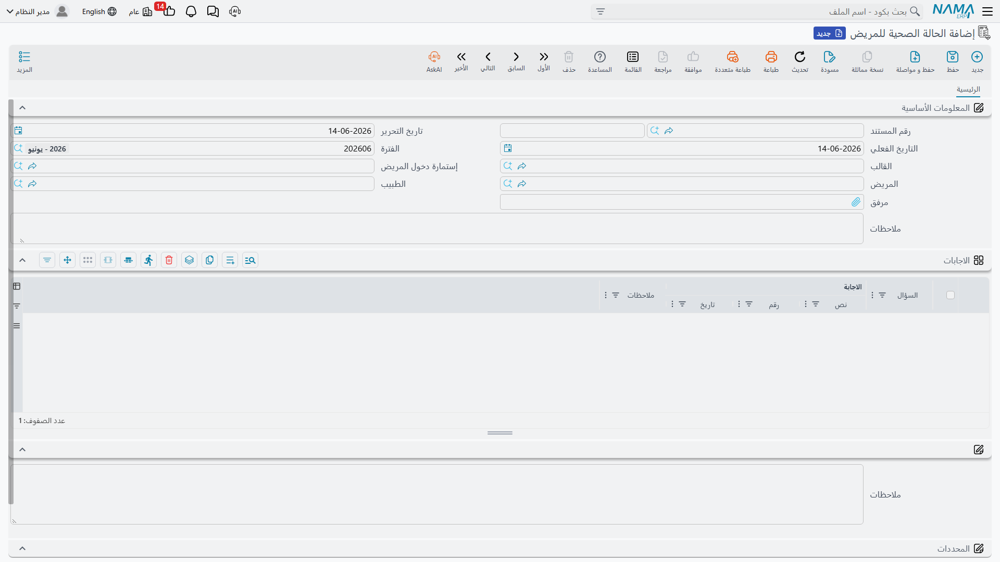
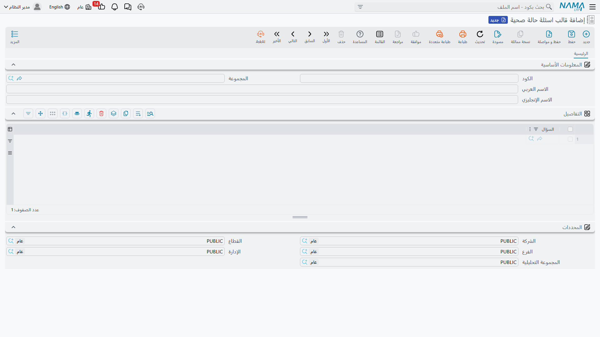

# المرضى والدخول

هنا تبدأ رحلة المريض الفعلية. في هذه الصفحة نتناول ملف المريض نفسه، وكيف يُحجز للمريض الخارجي موعد، وكيف يُنوَّم المريض الداخلي عبر إستمارة الدخول، إضافةً إلى توثيق التشخيص والحالة الصحية.

## ملف المريض

**المريض (Patient)** هو السجل المحوري الذي يتعلّق به كل شيء. وهو في الوقت نفسه ملف طبي **وذمّة محاسبية** (عبر تبويب الحسابات الفرعية)، أي يُحاسَب ويُتابَع ماليًا كأي عميل. تتوزّع بياناته على تبويبات: المعلومات الأساسية (الطبيب المعالج، فصيلة الدم، الطول، الوزن، فئة المريض، شركة التأمين، نِسَب التحمّل)، بيانات المولود الجديد (تربط الرضيع بأمّه وأبيه)، البيانات الشخصية (النوع، الميلاد — ويُحسب العمر تلقائيًا — الرقم القومي وبطاقة التأمين)، بيانات الإقامة الحالية، والحسابات والضرائب وبيانات الاتصال.

يحمل الملف أيضًا جدول **التاريخ المرضي** (تاريخ التشخيص، المرض، الدرجة، الدواء)، وتبويب **السجلات المرتبطة** يعرض لمحة 360° عن المريض: دخولاته، كشوفه، تسكيناته، تحاليله وأشعّته وعمليّاته وكل فواتيره.

::: tip من ملف المريض إلى الدخول
يحمل ملف المريض زرّ **إنشاء إستمارة دخول مريض** الذي يفتح إستمارة دخول جديدة مملوءة مسبقًا ببيانات المريض وطبيبه وتأمينه — وهي بداية رحلة التنويم.
:::

## إستمارة دخول المريض

**إستمارة دخول مريض (Patient Admission)** هي المستند المحوري للمريض الداخلي — منها يتفرّع التسكين والعمليات والتحاليل والتشخيص والفاتورة الختامية. وهي أغنى مستندات الوحدة.

في رأسها: المريض والطبيب وتاريخ ووقت الدخول، شركة التأمين وتصنيف المستند، نِسَب التحمّل، و**الحد الأقصى لتحمّل التأمين على كل الفواتير** مع عدّاد **المتبقّي** منه، ومُصنِّفات السعر، والتشخيص المبدئي، ومجموعة **أمراض التشخيص** (تُستخدم لاحقًا في اختيار التغذية). كما تربط الإستمارة سند الخروج والفاتورة الختامية واتفاق العملية إن وُجد.

من أهم خصائصها علامة **توليد سند تسكين**: عند تفعيلها وحفظ الإستمارة، يُولَّد مستند **[التسكين](./hms-accommodation.md)** تلقائيًا (حجز السرير وبدء احتساب الإقامة). كما يوجد زرّ **تحديث بيانات الأسعار على كل الفواتير** لإعادة حساب نِسَب التحمّل عبر كل فواتير الدخول عند تغيّر خطة التأمين. وتحمل الإستمارة جداول للأقارب، والخدمات المقدّمة أثناء الإقامة، وبنود اتفاق العملية، والتحاليل المطلوبة عند الدخول.

## العيادات الخارجية

للمريض الذي لا يحتاج تنويمًا، نستخدم نظام المواعيد:

- **موعد عيادة خارجية (Outpatient Schedule)** — جدول التوفّر الأسبوعي المتكرّر لعيادة وطبيب وتخصص: لكل يوم أسبوع فترات زمنية (من/إلى) مع علامة لما إذا كانت محجوزة.
- **حجز العيادة الخارجية (Outpatient Reservation)** — حجز زيارة فعلية: المريض، العيادة، الطبيب، التخصص، نوع الإجراء، وتاريخ ووقت الحجز.

## التشخيص والحالة الصحية

**سند تشخيص مريض (Patient Diagnosis)** يسجّل تقييم الطبيب للمريض (وقد يُربط بإستمارة دخول): المريض، الطبيب، ونص التشخيص.

و**الحالة الصحية للمريض (Patient Health Status)** استبيان منظّم يُملأ للمريض اعتمادًا على **قالب** جاهز. يبني القالب من **أسئلة حالة صحية** قابلة لإعادة الاستخدام:

- **سؤال حالة صحية (Health Status Question)** — سؤال واحد بنوع إجابة (نصي/اختيار/رقم/تاريخ)، ومع نوع "اختيار" يحمل قائمة الإجابات المتاحة.
- **قالب اسئلة حالة صحية (Questionnaire Template)** — حزمة أسئلة قابلة لإعادة الاستخدام تُطبَّق على المرضى.

ثم يُسجّل مستند الحالة الصحية إجابة لكل سؤال (نص/رقم/تاريخ) — وهو مثالي لاستمارات التمريض والقبول.

