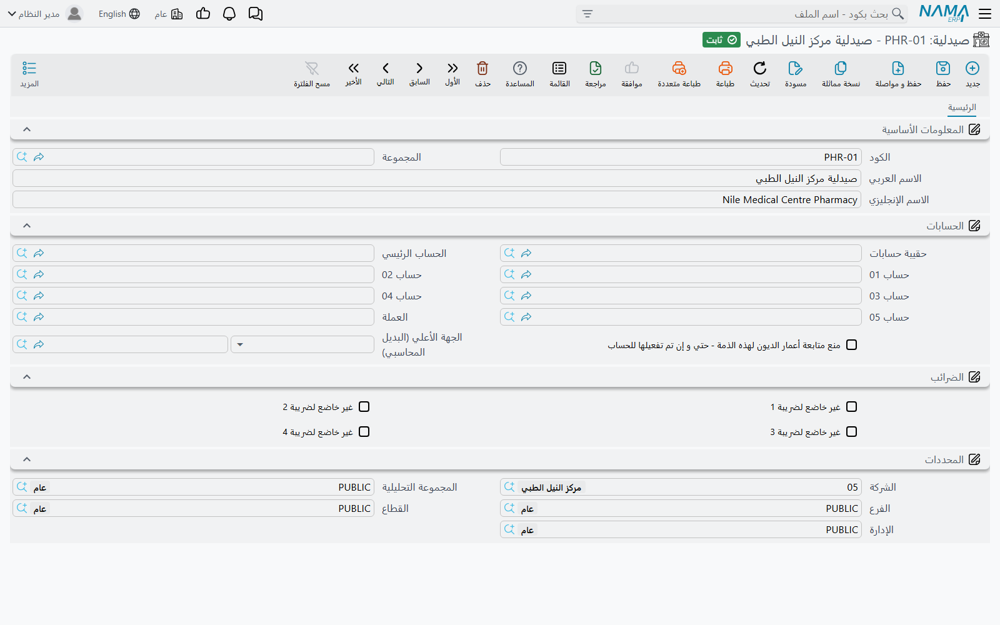
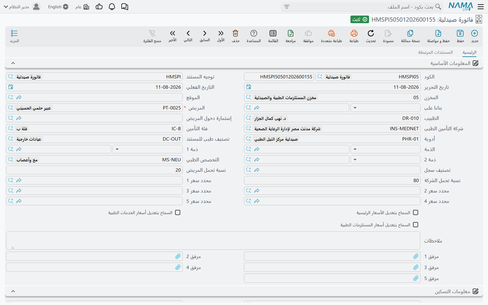
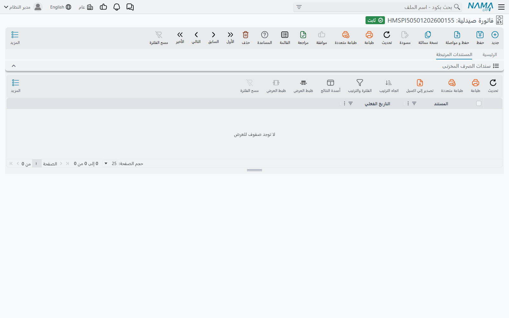
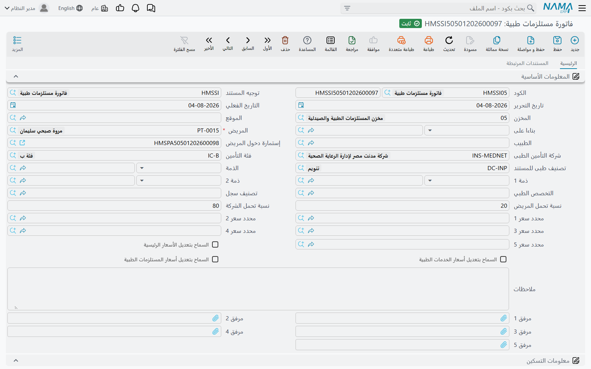
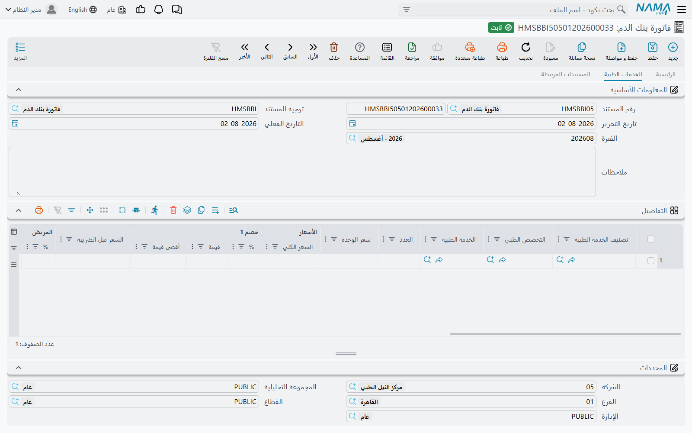
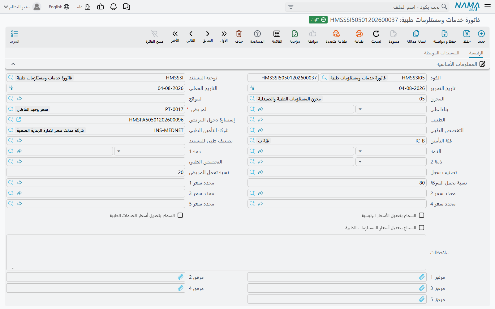

# الصيدلية والمستلزمات وبنك الدم

معظم فواتير المستشفى تبيع شيئاً لا يوضع على رف: كشفاً، أو ليلة في غرفة، أو صورة أشعة. أما هذه الصفحة فعن
النوع الآخر: الأدوية والمستلزمات الطبية ووحدات الدم، وهي تخرج من المخزن حين تُفوتَر وتعود إليه حين تُرَدّ. كل
فاتورة من هذه الفواتير تؤدي عملين معاً: تحاسب المريض وشركة التأمين بالتقسيم المعتاد
[بين المريض والتأمين](./hms-invoicing.md)، **وتحرّك المخزون** بإنشاء سند صرف مخزني (أو سند توريد مخزني في
حالة المردودات) في الخلفية.

يخرج المخزون في هذا الموديول من طريقين:

- **الفواتير المخزنية** — فاتورة صيدلية، وفاتورة مستلزمات طبية، وفاتورة خدمات ومستلزمات طبية، وفاتورة بنك الدم،
  ومردودات كل منها. كل سطر فيها سطر صنف، والجدول كله يصبح سنداً مخزنياً.
- **المستلزمات داخل فاتورة خدمة** — فاتورة تحليل أو أشعة أو عملية جراحية أو غيرها، تحمل جدول مستلزمات إلى جانب
  خدماتها. هنا جدول المستلزمات وحده هو الذي يصبح سنداً مخزنياً.

والطريقان يُضبطان في موضعين مختلفين من توجيه المستند، ولذلك نشرح كلاً منهما على حدة.

## ملف الصيدلية وملف بنك الدم

**الصيدلية** (نظام إدارة المستشفيات ← الصيدليات ← صيدلية) هي نقطة الصرف التي تصدر منها فاتورة الصيدلية:
الصيدلية الرئيسية، أو صيدلية الأقسام الداخلية، أو شباك العيادات الخارجية. الملف صغير عن قصد: كود، ومجموعة،
والاسم العربي والإنجليزي، وجزء **حافظة الحسابات**، والمحددات. وجزء الحسابات هذا هو بيت القصيد، فهو يجعل كل صيدلية
طرفاً محاسبياً يمكن أن يُرحَّل إيرادها أو حركة مخزونها على حسابها الخاص.

و**بنك الدم** (نظام إدارة المستشفيات ← بنوك الدم ← بنك دم) له الشكل نفسه — بيانات أساسية وحافظة حسابات
ومحددات — ويؤدي الدور نفسه لوحدات الدم.

وفي توجيه الفاتورة يمكن لجانب محاسبي أن يأخذ الذمة من المستند: اختر **صيدلية** مصدراً في توجيه فاتورة الصيدلية،
أو **بنك دم** في توجيه فاتورة بنك الدم، فيقع القيد على حساب الصيدلية أو بنك الدم المذكور في رأس الفاتورة.

## فاتورة الصيدلية

**فاتورة صيدلية** (نظام إدارة المستشفيات ← الصيدليات ← فاتورة صيدلية) تصرف الدواء للمريض. يحمل رأسها المريض
والطبيب واستمارة دخول المريض، وشركة التأمين وفئة التأمين، و**الصيدلية**، وتصنيف المستند الطبي، والذمم، والتخصص
الطبي، ونسبتي تحمل المريض والشركة، ومحددات السعر. وتحت ذلك بيانات الإقامة (غرفة المريض وقت الصرف)، وإجماليات
الأسعار، وإجماليات التكاليف غير المباشرة.

جدول التفاصيل سطر مخزني كامل — الصنف، والوحدة والكمية، والمخزن، والشحنة، والصندوق، والإصدار، والمقاس واللون،
وتاريخا الإنتاج والانتهاء — يليه سعر الوحدة، والتخصص الطبي، وجزء السعر الذي يقسم كل سطر بين المريض والتأمين. وتحته
جدول بنود التكلفة غير المباشرة.

حين تختار الصنف يُبحث عن سعره كأي خدمة أخرى في الموديول: بالصنف والوحدة والكمية، والمريض، وشركة التأمين
وفئتها، والطبيب، ومحددات السعر، في [موافقة شركة التأمين](./hms-insurance.md) و[قائمة الأسعار الطبية](./hms-pricing.md).

حفظ الفاتورة يُنشئ **سند صرف مخزني** لجدول التفاصيل، ويأخذ المخزن والموقع من رأس الفاتورة. وتعرضه صفحة
**السندات المرتبطه** تحت **سندات الصرف المخزنى**، فتفتح السند المخزني من الفاتورة نفسها. إن عدّلت الفاتورة
تحدّث سند الصرف، وإن حذفتها أو ألغيتها حُذف معها. وإن أفرغت الجدول حُذف سند الصرف.

::: info سند الصرف يأتي من صفحة الإنشاء التلقائي
في فاتورة الصيدلية وسائر الفواتير المخزنية في هذه الصفحة لا يُنشأ السند المخزني إلا إذا حُدّد في صفحة
**الإنشاء التلقائي** من توجيه المستند **دفتر المستند** و**توجيه المستند**. هذان الحقلان يحددان الدفتر والتوجيه
اللذين يُحفظ بهما سند الصرف (أو سند التوريد في المردودات). اترك أحدهما فارغاً تُحفظ الفاتورة ويُنشأ قيدها، لكن لا
يتحرك شيء من المخزون.
:::

### رد الأدوية: مردودات صيدليات

**مردودات صيدليات** هو المستند المقابل للأدوية التي تعود دون استعمال. له الرأس نفسه (المريض، والطبيب، والاستمارة،
والتأمين، والصيدلية، ونسب التحمل، ومحددات السعر) وجدول الأصناف نفسه، لكن حفظه يُنشئ **سند توريد مخزني** بدل سند
الصرف، وتعرضه صفحة السندات المرتبطه تحت **سندات التوريد المخزنى**. وليس فيه جدول تكاليف غير مباشرة.

يُرحّل المردود من خلال الجوانب المحاسبية نفسها التي في الفاتورة (تحمل المريض، وتحمل التأمين، والخصومات،
والضرائب، والتكلفة)، ولا شيء فيه يعكس الاتجاه نيابةً عنك: يجب أن يحمل توجيه المردود نفسه الجوانب معكوسة عن توجيه
الفاتورة. ضع تحمل المريض في جانب الدائن حيث يضعه توجيه الفاتورة في جانب المدين، وهكذا مع كل زوج.

## فواتير المستلزمات ومردوداتها

**فاتورة مستلزمات طبية** (نظام إدارة المستشفيات ← الخدمات الطبية ← فاتورة مستلزمات طبية) تصرف المستلزمات
الطبية للمريض — الضمادات والحقن والقساطر. رأسها مثل رأس فاتورة الصيدلية عدا الصيدلية، وجدول أصنافها هو نفسه، ومعه
جدول التكاليف غير المباشرة. حفظها يُنشئ سند صرف مخزني يظهر تحت **سندات الصرف المخزنى** في صفحة السندات المرتبطه.

**مردودات مستلزمات طبية** تستعيد المستلزمات: الرأس نفسه وجدول الأصناف نفسه، بلا تكاليف غير مباشرة، وحفظها يُنشئ
سند توريد مخزني. وكما في مردودات الصيدليات، يجب أن تكون جوانب توجيهها معكوسة.

**فاتورة خدمات ومستلزمات طبية** تحاسب على الخدمات والمستلزمات في مستند واحد. صفحتها الرئيسية تحمل جدول الأصناف
أولاً ثم جدولاً ثانياً هو **تفاصيل الخدمات الطبية**، كل سطر فيه يذكر فئة الخدمة والتخصص الطبي والخدمة الطبية مع
العدد وجزء سعر خاص به. جدول الأصناف وحده يصبح سند الصرف؛ أما سطور الخدمات فتُحاسَب ولا تحرّك مخزوناً.

## فاتورة بنك الدم ومردوداتها

**فاتورة بنك الدم** (نظام إدارة المستشفيات ← بنوك الدم ← فاتورة بنك الدم) تصرف وحدات الدم وتحاسب عليها. يذكر
رأسها **بنك الدم**؛ وجدولها الرئيسي جدول أصناف مثل جدول الصيدلية، وفي صفحة ثانية هي **الخدمات الطبية** سطور خدمات
(كاختبار التوافق مثلاً) تُحاسَب معها. حفظها يصرف وحدات الدم بسند صرف مخزني يظهر تحت **سندات الصرف المخزنى**.

**مردودات بنوك الدم** تعيد الوحدات غير المستعملة إلى مخزن بنك الدم بسند توريد مخزني، وقد شرحناها مع المستندات
الإكلينيكية في [الطلبات والنتائج الإكلينيكية](./hms-clinical-orders.md).

## المستلزمات داخل فواتير الخدمات

الطريق الثاني يبدأ من الملفات. **الخدمة الطبية** وكل نوع قابل للبيع — نوع التحليل والأشعة والعلاج الطبيعي والعملية
الجراحية — يحمل صفحة **المستلزمات الطبية**: الأصناف التي تُستهلك كلما أُدّيت تلك الخدمة، بكمياتها ومخزنها وعلامة
**الصنف المجانى**. (راجع [الملفات الطبية الأساسية](./hms-medical-master-files.md) و[كتالوج الخدمات الطبية](./hms-service-catalog.md).)

حين تختار تلك الخدمة أو ذلك النوع في سطر من فاتورة خدمة، تُنسخ مستلزماته الطبية إلى جدول المستلزمات في الفاتورة
وتُسعَّر، وتُنسخ خدماته المرتبطة إلى جدول الخدمات. والمستلزم المعلَّم **الصنف المجانى** يُصرف ولا يُحاسب عليه: عند
الحفظ يُفرَّغ سعره، فيحرّك المخزون دون أن يزيد الفاتورة.

وهذه المستلزمات تتحول إلى سند مخزني من خلال مجموعة **تأثيرات المستند المنشأ** في توجيه فاتورة الخدمة:

| الحقل | ماذا يفعل |
|---|---|
| **نوع القائمة** (Origin Issue Document Type) | **صرف مخزني** يصرف المستلزمات فوراً. **طلب صرف مخزني** يُنشئ طلباً بدلاً من ذلك ليلبّيه المخزن. اتركه فارغاً فلا يُنشأ أي سند مخزني. |
| **دفتر إذن الصرف** / **توجيه إذن الصرف** | الدفتر والتوجيه اللذان يُحفظ بهما المستند المنشأ. يجب ملء الاثنين، وإلا لم يُنشأ شيء. |

يأخذ المستند المنشأ مخزنه من رأس الفاتورة، ويبقى متوافقاً معها: تعديل جدول المستلزمات يحدّثه، وإفراغ الجدول يحذفه،
وإلغاء الفاتورة يحذفه.

وخياران في التوجيه نفسه يحددان كيف تُحاسب المستلزمات. **عدم إضافة المستلزمات إلي الفاتورة** يُبقي جدول المستلزمات
خارج إجمالي الفاتورة وخارج قيدها — تُصرف المستلزمات من المخزن، لكن المريض لا يُحاسب عليها في هذه الفاتورة.
و**عدم إضافة الخدمات إلي الفاتورة** يفعل الشيء نفسه مع جدول الخدمات.

## الأسعار في هذه الفواتير

خياران في التوجيه وثلاثة إجراءات تحدد هل تتغير أسعار الفاتورة بعد حفظها.

**تحديث الأسعار مع الحفظ** في توجيه المستند يعيد تسعير كل السطور من الموافقة وقوائم الأسعار في كل مرة تُحفظ فيها
الفاتورة. وهذا يُبقي الفاتورة متوافقة مع الاتفاقات الحالية، لكنه يكتب أيضاً فوق أي سعر أدخله أحد يدوياً. وللاستثناء
تحمل كل فاتورة في هذه الصفحة — عدا المردودات الثلاثة — ثلاثة إجراءات في قائمة **المزيد**:

| الإجراء | ماذا يفعل |
|---|---|
| **السماح بتعديل الأسعار الرئيسية** | يعلّم الحقل الذي يحمل الاسم نفسه في الفاتورة المحفوظة، فلا يُعاد حساب أسعار الجدول الرئيسي عند الحفظ. |
| **السماح بتعديل أسعار الخدمات الطبية** | الشيء نفسه لجدول الخدمات. |
| **السماح بتعديل أسعار المستلزمات الطبية** | الشيء نفسه لجدول المستلزمات. |

يجب حفظ الفاتورة قبل الضغط عليها. وبعد تعليم الحقل تبقى أسعار ذلك الجدول كما أُدخلت في كل حفظ لاحق.

وخياران آخران في التوجيه يخصّان الفواتير المخزنية. **منع الحفظ بدون مستلزمات** يرفض حفظ فاتورة جدول أصنافها فارغ،
و**منع الحفظ بدون خدمات** يرفض فاتورة جدول خدماتها فارغ — فلا تعلّم الثاني إلا في توجيه مستند له جدول خدمات (فاتورة
خدمات ومستلزمات طبية وفاتورة بنك الدم).

## رسائل قد تظهر لك

| الرسالة | السبب | ماذا تفعل |
|---|---|---|
| «لا يمكنك ترك نفاصيل الرئيسية فارغة» | التوجيه معلَّم عليه *منع الحفظ بدون مستلزمات* وجدول الأصناف في فاتورة الصيدلية أو المستلزمات أو الخدمات والمستلزمات أو بنك الدم (أو أحد المردودات) فارغ. | أضف الأصناف المصروفة أو المردودة، أو ألغِ تعليم الخيار في التوجيه. |
| «لا يمكنك ترك نفاصيل الخدمات فارغة» | التوجيه معلَّم عليه *منع الحفظ بدون خدمات* وجدول الخدمات فارغ. وفي مستند ليس له جدول خدمات، كفاتورة الصيدلية، يجعل هذا الخيار كل حفظ يفشل. | أضف سطر خدمة، أو ألغِ تعليم الخيار في ذلك التوجيه. |
| «سعر الوحدة لا يمكن أن يكون سالب» | سعر الوحدة في أحد السطور أقل من صفر. | صحّح سعر الوحدة؛ وإن أردت إعطاء شيء مجاناً فاستعمل الخصم، أو علامة الصنف المجانى في سطر مستلزمات داخل فاتورة خدمة. |
| «المريض {0} لا يطابق المريض {1} الموجود فى إستمارة الدخول {2}» | المريض في الفاتورة ليس هو المريض في استمارة الدخول المذكورة فيها. | اختر الاستمارة الخاصة بهذا المريض، أو صحّح المريض. |
| «مجموع حقلى نسبة تحمل المريض ونسبة تحمل الشركة يجب أن يساوى 100» | نسبتا تحمل المريض والشركة، في الرأس أو في سطر، لا يبلغ مجموعهما 100. | عدّل النسبتين حتى يكون مجموعهما 100. |
| «بند التكلفة الغير مباشرة {0} مكرر في السطر {1}» | البند نفسه مذكور مرتين في جدول التكاليف غير المباشرة بالفاتورة. | احذف السطر المكرر. |
