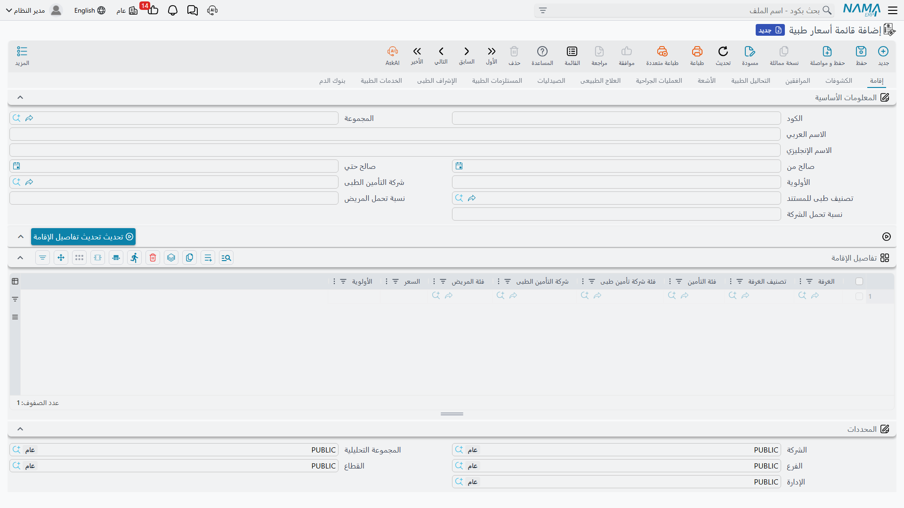
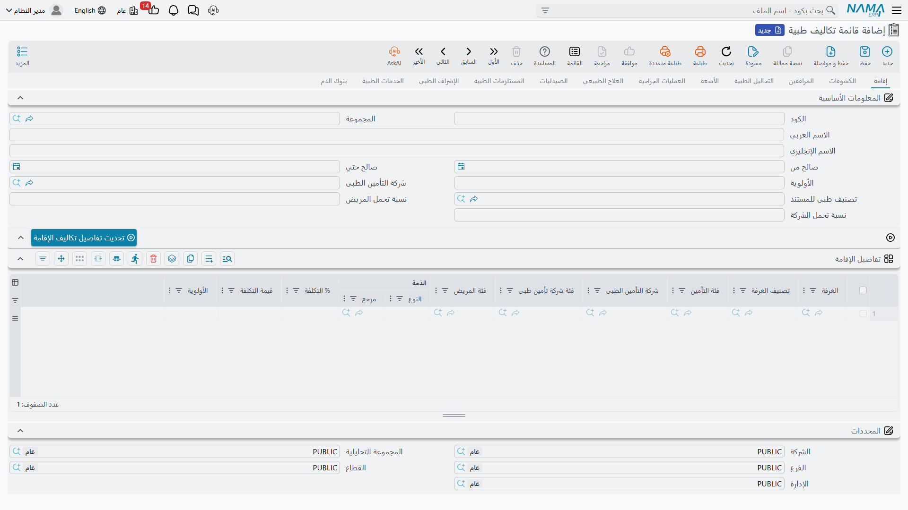
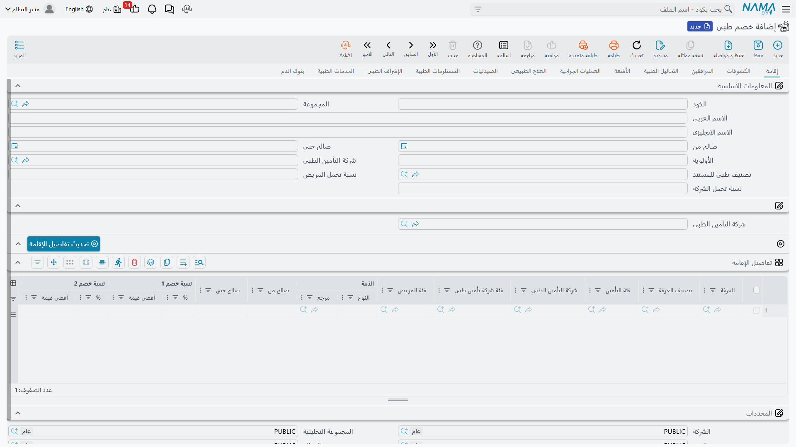
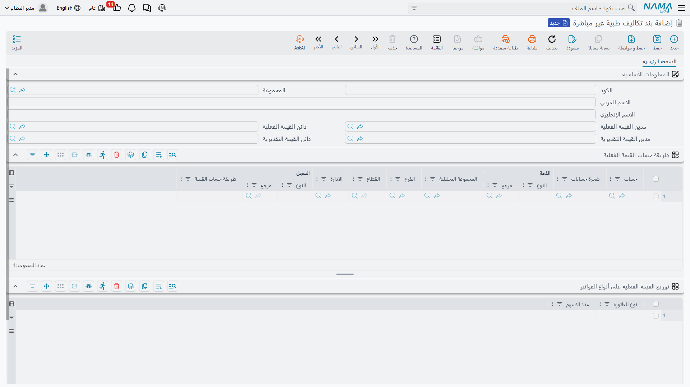
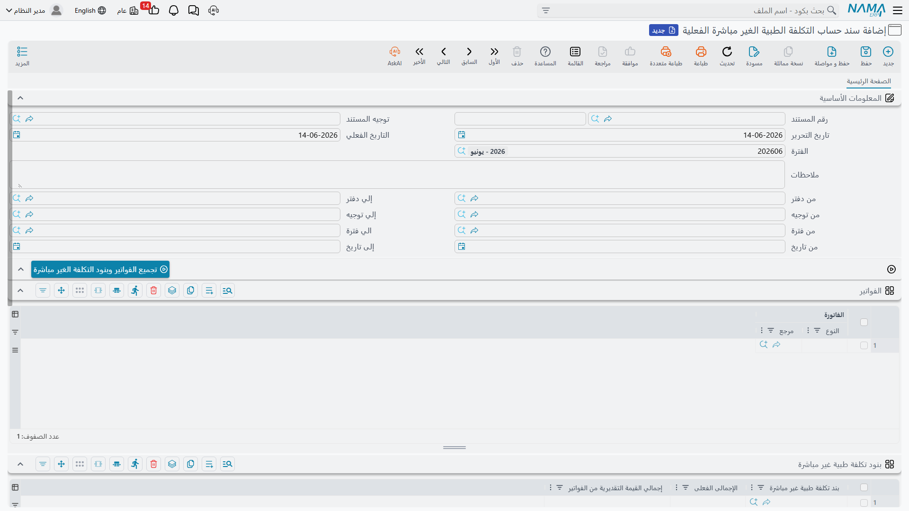
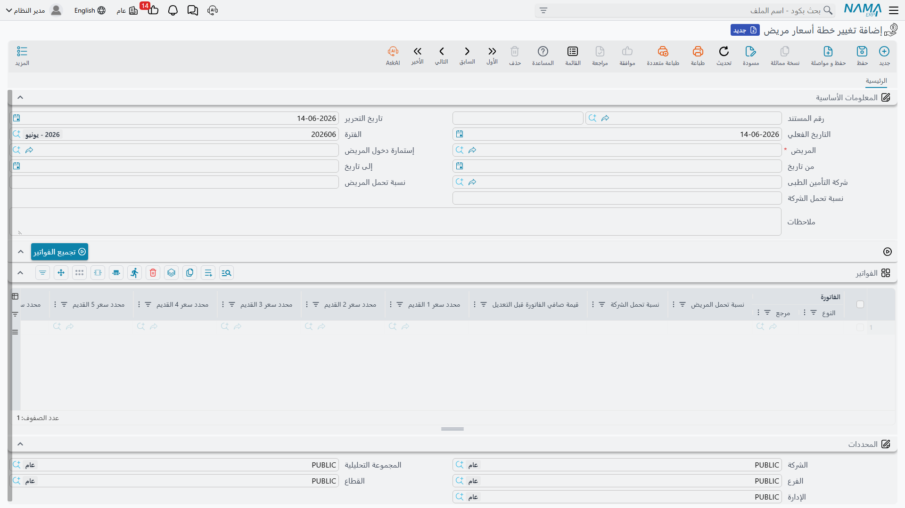

# الأسعار والتكاليف والخصومات

كل خدمة في المستشفى لها سعر بيع وتكلفة. وكلما كبر المستشفى صار من غير العملي تسعير كل خدمة على حدة، فجاءت **قوائم** تجمع الأسعار والتكاليف والخصومات في مكان واحد. وتتقاسم هذه القوائم جميعها بنيةً واحدة تجعل تعلّمها مرة واحدة كافيًا.

## البنية المشتركة: تبويب لكل نوع خدمة

**قائمة الأسعار، قائمة التكاليف، الخصومات، وقائمة التكاليف غير المباشرة** كلها تتبع النمط نفسه: تبويب لكل مجال خدمة (إقامة، كشف، مرافقين، تحاليل، أشعة، عمليات، علاج طبيعي، صيدلية، مستلزمات، إشراف، خدمات، بنك دم)، وفي كل تبويب جدول سطور.

يتكرّر في كل تبويب رأسٌ موحّد: الكود والاسم، **من/إلى تاريخ الصلاحية**، **الأولوية**، **شركة التأمين**، **تصنيف المستند**، و**نسبة تحمّل المريض/الشركة**. وتشترك سطور كل الجداول في **مُحدِّدات المطابقة** نفسها التي يُختار بها السطر وقت الفوترة: المرجع المناسب للخدمة (غرفة/طبيب/نوع تحليل/نوع أشعة/نوع عملية/صنف…)، الدرجة، **فئة التأمين، شركة التأمين، فئة شركة التأمين، فئة المريض**، الفترة، والأولوية لترجيح الأقرب. ما يختلف بين القوائم هو **أعمدة القيمة** فقط.

## قائمة الأسعار الطبية

**قائمة أسعار طبية (Medical Sales Price List)** هي دفتر أسعار البيع — العمود الأساسي فيها هو **السعر**. وتُضيف تبويبات بعينها أعمدةً خاصة (تبويب العمليات يفصّل الساعات القياسية وأجر الجرّاح والمساعد والتخدير… وتبويبات الصيدلية والمستلزمات والدم تضيف الكمية والوحدة). هذه القائمة هي ما يحدّد ما يُحاسَب به المريض على كل خدمة، مع تنويعه حسب الطبيب والتأمين وفئة المريض والفترة.

## قائمة التكاليف الطبية

**قائمة تكاليف طبية (Medical Cost List)** بالشكل نفسه، لكن أعمدتها تلتقط **التكلفة** بدل السعر: **نسبة التكلفة وقيمتها**، مع ما يصل إلى ثلاثة توزيعات على **ذمم** (نصيب الطبيب/المعمل/جهة خارجية من الإيراد) لكل سطر. وفي تبويب العمليات تتوسّع كل مكوّنات الأجر إلى نسبة + قيمة + تكلفة الوقت الإضافي. تُستخدم هذه القائمة لاقتسام الإيراد مع الأطباء وحساب الربحية.

## الخصومات الطبية

**خصم طبى (Medical Discount)** يطبّق خصمين متتاليين لكل سطر: **خصم 1** و**خصم 2** (نسبة لكلٍّ منها وحد أقصى للقيمة). ولكل تبويب زرّ لتحديث سطور الخصم دفعةً واحدة لشركة تأمين معيّنة من رأس المستند. يُستخدم لتطبيق خصومات خاصة بمريض أو بشركة تأمين على الخدمات.

## التكاليف غير المباشرة (Overhead)

ليست كل تكلفة مباشرة؛ فهناك الكهرباء والنظافة والإدارة. يوزّع النظام هذه التكاليف على الخدمات عبر منظومة من ثلاث قطع:

- **بند تكاليف طبية غير مباشرة (Overhead Item)** — يُعرّف بند تكلفة واحدًا (كهرباء، نظافة…) وحساباته، و**طريقة قراءة قيمته الفعلية** من دفتر الأستاذ، و**طريقة توزيعه** على أنواع الفواتير بأوزان (عدد أسهم).

- **قائمة تكاليف طبية غير مباشرة (Overhead List)** — القيمة **التقديرية** للتكلفة غير المباشرة المحمّلة على كل خدمة (تتبع البنية المشتركة بتبويباتها)، فتُحمَّل تلقائيًا على الفواتير.

- **سند حساب التكلفة الطبية الغير مباشرة الفعلية (Actual Overhead Calculation)** — مستند دوري في نهاية الفترة يحسب التكلفة غير المباشرة **الفعلية** ويوزّعها. تعمل عليه ثلاثة أزرار بالترتيب: **تجميع الفواتير وبنود التكلفة**، ثم **حساب قيمة التكلفة غير المباشرة**، ثم **توزيع القيمة الفعلية** — ليُرحّل الفرق بين المُقدَّر والفعلي.

## تغيير خطة أسعار المريض

أحيانًا تتأكّد تغطية التأمين بعد دخول المريض وإصدار فواتيره. هنا يأتي مستند **تغيير خطة أسعار مريض (Change Patient Price Plan)** ليعيد تسعير فواتير المريض الصادرة بأثر رجعي. تختار المريض وإستمارة دخوله والفترة وشركة التأمين ونِسَب التحمّل الجديدة، ثم يجمع زرّ **تجميع الفواتير** فواتيره ضمن المدى، ويعرض الجدول لكل فاتورة **الإجمالي قبل التغيير** و**بعده** ومُصنِّفات السعر القديمة والجديدة.

