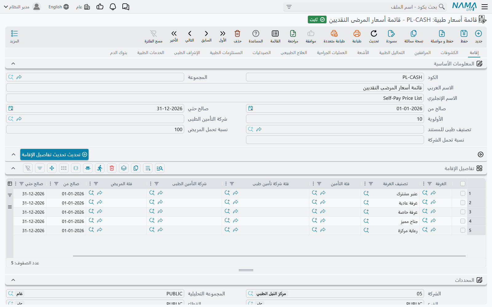
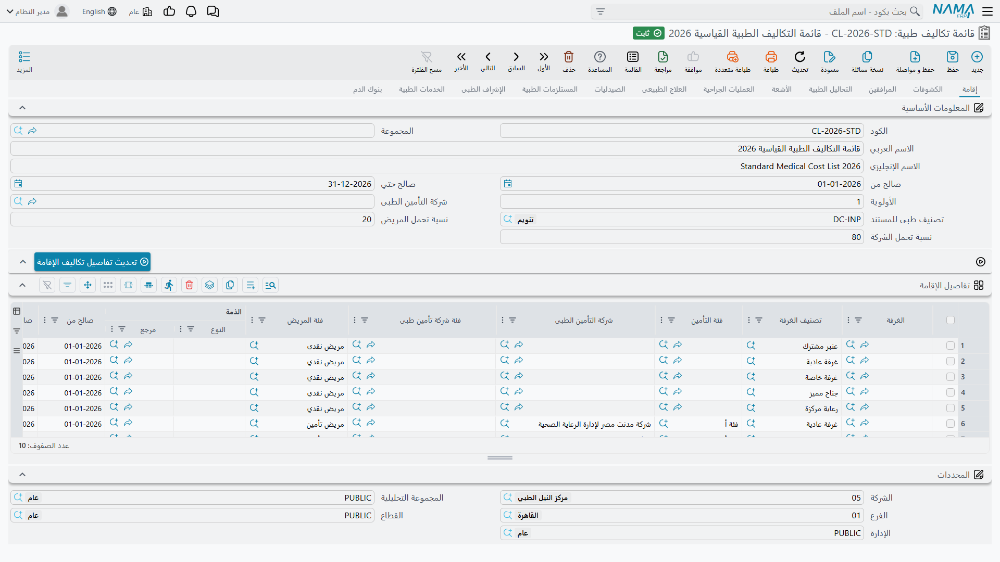
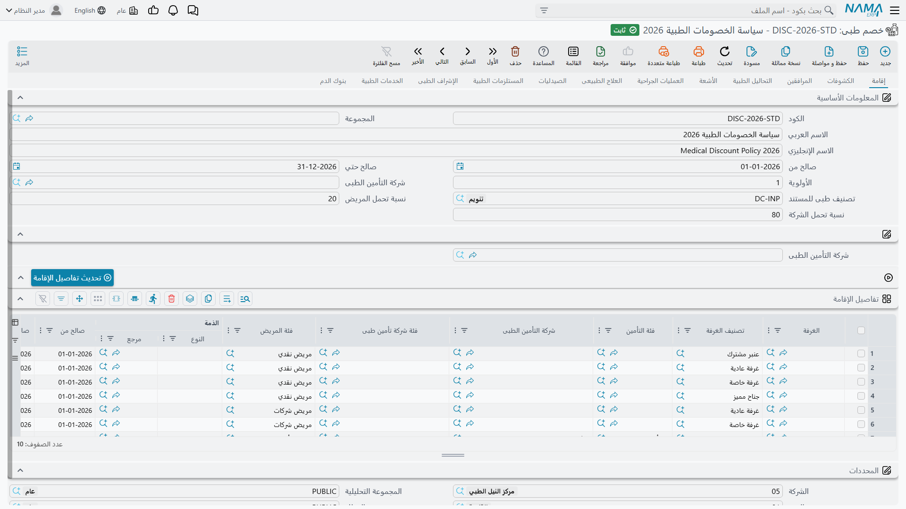
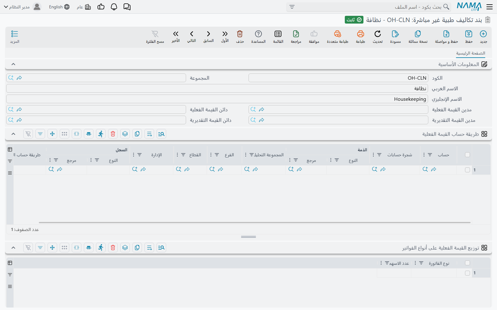
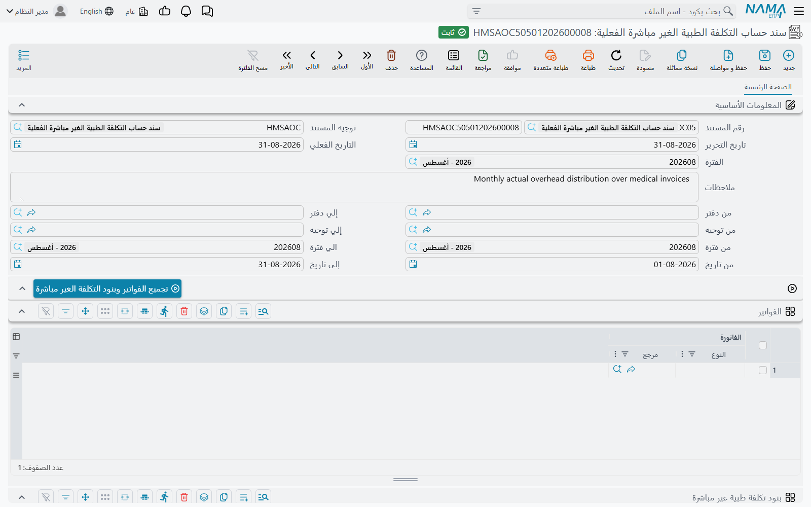
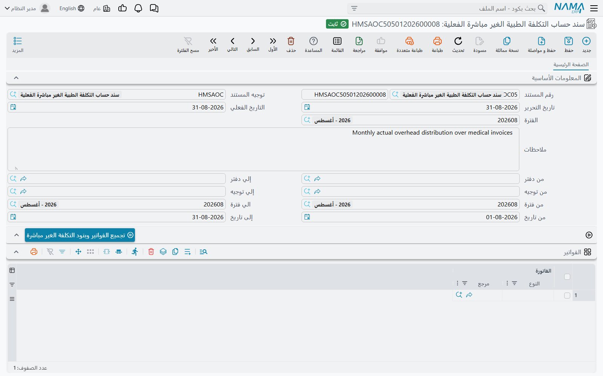
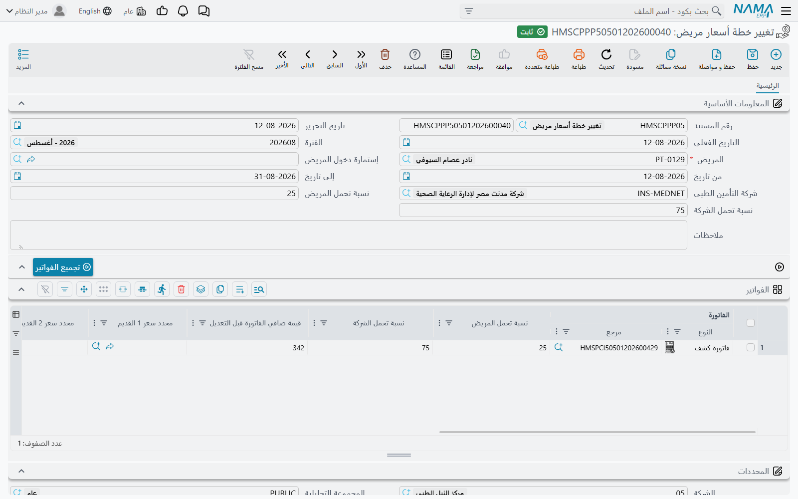

# الأسعار والتكاليف والخصومات

كل خدمة في المستشفى لها سعر بيع وتكلفة. وكلما كبر المستشفى صار من غير العملي تسعير كل خدمة على حدة، فجاءت **قوائم** تجمع الأسعار والتكاليف والخصومات في مكان واحد. وتتقاسم هذه القوائم جميعها بنيةً واحدة تجعل تعلّمها مرة واحدة كافيًا.

| الشاشة | القائمة | أزرارها الخاصة |
|---|---|---|
| **قائمة أسعار طبية** | نظام إدارة المستشفيات ← الملفات ← قائمة أسعار طبية | زر تحديث لكل تبويب |
| **قائمة تكاليف طبية** | نظام إدارة المستشفيات ← الملفات ← قائمة تكاليف طبية | زر تحديث لكل تبويب |
| **خصم طبى** | نظام إدارة المستشفيات ← الملفات ← خصم طبى | زر تحديث لكل تبويب |
| **بند تكاليف طبية غير مباشرة** | نظام إدارة المستشفيات ← التكاليف الطبية الغير مباشرة ← بند تكاليف طبية غير مباشرة | لا يوجد |
| **قائمة تكاليف طبية غير مباشرة** | نظام إدارة المستشفيات ← التكاليف الطبية الغير مباشرة ← قائمة تكاليف طبية غير مباشرة | زر تحديث لكل تبويب |
| **سند حساب التكلفة الطبية الغير مباشرة الفعلية** | نظام إدارة المستشفيات ← التكاليف الطبية الغير مباشرة ← سند حساب التكلفة الطبية الغير مباشرة الفعلية | **تجميع الفواتير وبنود التكلفة الغير مباشرة**، **حساب قيمة التكلفة الغير مباشرة**، **توزيع قيمة التكلفة الغير مباشرة الفعلية** |
| **تغيير خطة أسعار مريض** | نظام إدارة المستشفيات ← المستندات ← تغيير خطة أسعار مريض | **تجميع الفواتير** |

## البنية المشتركة: تبويب لكل نوع خدمة

**قائمة الأسعار، قائمة التكاليف، الخصومات، وقائمة التكاليف غير المباشرة** كلها تتبع النمط نفسه: تبويب لكل مجال خدمة (إقامة، كشف، مرافقين، تحاليل، أشعة، عمليات، علاج طبيعي، صيدلية، مستلزمات، إشراف، خدمات، بنك دم)، وفي كل تبويب جدول سطور.

يتكرّر في كل تبويب رأسٌ موحّد: الكود والاسم، **من/إلى تاريخ الصلاحية**، **الأولوية**، **شركة التأمين**، **تصنيف المستند**، و**نسبة تحمّل المريض/الشركة**. وتشترك سطور كل الجداول في **مُحدِّدات المطابقة** نفسها التي يُختار بها السطر وقت الفوترة: المرجع المناسب للخدمة (غرفة/طبيب/نوع تحليل/نوع أشعة/نوع عملية/صنف…)، الدرجة، **فئة التأمين، شركة التأمين، فئة شركة التأمين، فئة المريض**، الفترة، والأولوية لترجيح الأقرب. ما يختلف بين القوائم هو **أعمدة القيمة** فقط.

كل تبويب في القوائم الأربع ينتهي بزر **تحديث** خاص به — في تبويب الإقامة بقائمة الأسعار اسمه
«تحديث تحديث تفاصيل الإقامة» (هكذا مكررًا في المنتج)، ولكل تبويب زر باسم نوع خدمته. الزر ينسخ قيم رأس
التبويب — الأولوية، ومن/إلى تاريخ الصلاحية، ومحددات السعر، وشركة التأمين، ونسبتي تحمّل المريض والشركة،
والتصنيف الطبى — إلى **كل سطور جدول ذلك التبويب**، فتُدخل كتلة من السطور ثم تختمها بمجموعة واحدة من مفاتيح
المطابقة بدل ملء كل سطر يدويًا. تتغير السطور على الشاشة؛ احفظ القائمة لتبقى.

## قائمة الأسعار الطبية

**قائمة أسعار طبية (Medical Sales Price List)** هي دفتر أسعار البيع — العمود الأساسي فيها هو **السعر**. وتُضيف تبويبات بعينها أعمدةً خاصة (تبويب العمليات يفصّل الساعات القياسية وأجر الجرّاح والمساعد والتخدير… وتبويبات الصيدلية والمستلزمات والدم تضيف الكمية والوحدة). هذه القائمة هي ما يحدّد ما يُحاسَب به المريض على كل خدمة، مع تنويعه حسب الطبيب والتأمين وفئة المريض والفترة.

## قائمة التكاليف الطبية

**قائمة تكاليف طبية (Medical Cost List)** بالشكل نفسه، لكن أعمدتها تلتقط **التكلفة** بدل السعر: **نسبة التكلفة وقيمتها**، مع ما يصل إلى ثلاثة توزيعات على **ذمم** (نصيب الطبيب/المعمل/جهة خارجية من الإيراد) لكل سطر. وفي تبويب العمليات تتوسّع كل مكوّنات الأجر إلى نسبة + قيمة + تكلفة الوقت الإضافي. تُستخدم هذه القائمة لاقتسام الإيراد مع الأطباء وحساب الربحية.

## الخصومات الطبية

**خصم طبى (Medical Discount)** يطبّق خصمين متتاليين لكل سطر: **خصم 1** و**خصم 2** (نسبة لكلٍّ منها وحد أقصى للقيمة). وكما في القوائم الأخرى، زر التحديث في كل تبويب يختم سطوره بشركة التأمين والفترة والأولوية ونسب التحمّل من الرأس. يُستخدم لتطبيق خصومات خاصة بمريض أو بشركة تأمين على الخدمات.

## التكاليف غير المباشرة (Overhead)

ليست كل تكلفة مباشرة؛ فهناك الكهرباء والنظافة والإدارة. يوزّع النظام هذه التكاليف على الخدمات عبر منظومة من ثلاث قطع:

- **بند تكاليف طبية غير مباشرة (Overhead Item)** — يُعرّف بند تكلفة واحدًا (كهرباء، نظافة…) وحساباته، و**طريقة قراءة قيمته الفعلية** من دفتر الأستاذ، و**طريقة توزيعه** على أنواع الفواتير بأوزان (عدد أسهم).

- **قائمة تكاليف طبية غير مباشرة (Overhead List)** — القيمة **التقديرية** للتكلفة غير المباشرة المحمّلة على كل خدمة (تتبع البنية المشتركة بتبويباتها)، فتُحمَّل تلقائيًا على الفواتير.

- **سند حساب التكلفة الطبية الغير مباشرة الفعلية (Actual Overhead Calculation)** — مستند نهاية الفترة الذي يستبدل بالتقدير في كل فاتورة نصيبها من التكلفة **الفعلية** (انظر أدناه).

### إجراء نهاية الفترة

كل فاتورة تحمل أصلًا تكلفة غير مباشرة **تقديرية** من قائمة التكاليف غير المباشرة، تُرحَّل عبر جوانب القيمة
التقديرية في البند. وفي نهاية الفترة يحسب سند حساب التكلفة الفعلية ما كلّفته التكلفة غير المباشرة حقًا،
ويوزّعه على الفواتير نفسها. أزراره الثلاثة تُضغط بالترتيب:

1. **تجميع الفواتير وبنود التكلفة الغير مباشرة** — املأ نطاق تواريخ أو نطاق فترات (ونطاقا الدفتر والتوجيه
   يضيّقانه أكثر) ثم اضغطه. يسرد كل فواتير المستشفى في النطاق في جدول **الفواتير**، وكل بنود التكلفة
   التي تحملها تلك الفواتير في جدول **بنود التكلفة**. احفظ المستند.
2. **حساب قيمة التكلفة الغير مباشرة** — يقرأ لكل بند سطور طريقة حساب القيمة الفعلية (كيف تُجمع تكلفته
   الحقيقية من دفتر الأستاذ) ويكتب الناتج في جدول **التكاليف الفعلية**.
3. **توزيع قيمة التكلفة الغير مباشرة الفعلية** — يجمع القيمة الفعلية لكل بند والقيمة التقديرية التي حملتها
   الفواتير المجمّعة له.

اعتماد المستند هو ما يكتب النتيجة: الإجمالي الفعلي لكل بند يُقسم بين أنواع الفواتير بحسب **الأسهم** في
البند، وكل فاتورة من ذلك النوع تأخذ جزءًا يتناسب مع تقديرها هي. ومن ثم يحمل سطر التكلفة غير المباشرة في
الفاتورة قيمة فعلية، وتُرحَّل تكلفتها عبر جوانب **القيمة الفعلية** في البند بدل التقديرية. وإلغاء السند
يمسح تلك القيم الفعلية من جديد.

## تغيير خطة أسعار المريض

أحيانًا تتأكّد تغطية التأمين بعد دخول المريض وإصدار فواتيره. هنا يأتي مستند **تغيير خطة أسعار مريض (Change Patient Price Plan)** ليعيد تسعير فواتير المريض الصادرة بأثر رجعي. تختار المريض وإستمارة دخوله والفترة وشركة التأمين ونِسَب التحمّل الجديدة، ثم يجمع زرّ **تجميع الفواتير** فواتيره ضمن المدى، ويعرض الجدول لكل فاتورة **الإجمالي قبل التغيير** و**بعده** ومُصنِّفات السعر القديمة والجديدة.

## رسائل قد تظهر لك

| الرسالة | لماذا | ما تفعله |
|---|---|---|
| «لا يمكن ملءالحقل {0} والحقل {1} معاً» | سطر في تبويب **العمليات** بقائمة أسعار البيع الطبية يسمّي نوع العملية وتصنيف العملية معًا. والسطر يُفتَّح على أحدهما لا عليهما. | افرغ الحقل الذي ليس مفتاح المطابقة الذي تريده، وأضف سطرًا ثانيًا إن احتجت النوعين من القواعد. |
| «لا يمكنك استخدام بند التكلفة الطبية {0} حيث أنه بالفعل مستخدم في نفس الفترة في المستند {1}» | مستند حساب تكلفة غير مباشرة فعلية آخر مرحَّل، فتراته وتواريخه متداخلة مع هذا المستند، يوزّع البند نفسه؛ والرسالة تسمّيه. | احذف البند من هذا المستند، أو ضيّق نطاق الفترة حتى لا يتداخل الاثنان — فبند التكلفة يوزَّع مرة واحدة لكل فترة. |
| «يجب على الأقل ملء الحقول من تاريخ - إلى تاريخ أو من فترة إلى فترة» | ضُغط **تجميع الفواتير وبنود التكلفة الغير مباشرة** دون أي نطاق. | املأ نطاق تواريخ أو نطاق فترات ثم اضغطه من جديد. |
| «الفاتورة {0} مكررة» | الفاتورة نفسها مسرودة مرتين في جدول سند تغيير خطة سعر المريض، وغالبًا بعد ضغط *تجميع الفواتير* فوق سطور موجودة أصلًا. | احذف السطر المكرر، أو افرغ الجدول وأعد التجميع. |
| «الفاتورة {0} لا تخص المريض {1}» | سطر في الجدول يسمّي فاتورة صادرة لمريض آخر — وعادة سطر كُتب بخط اليد، أو بقي بعد تغيير المريض في الرأس. | افرغ الجدول واضغط *تجميع الفواتير* من جديد ليُسرد فواتير ذلك المريض وحده. |
