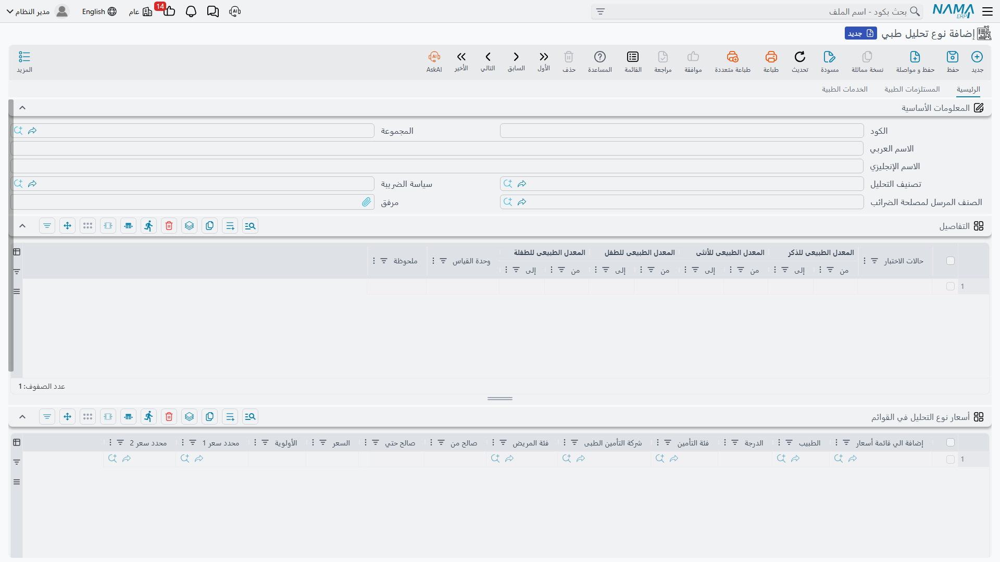
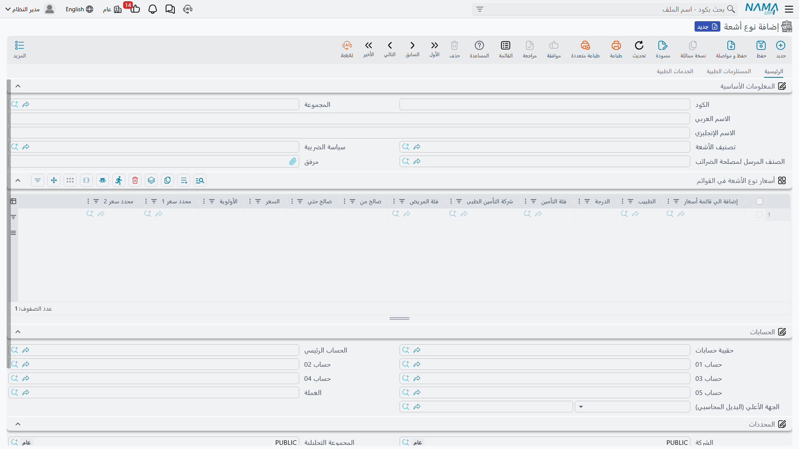
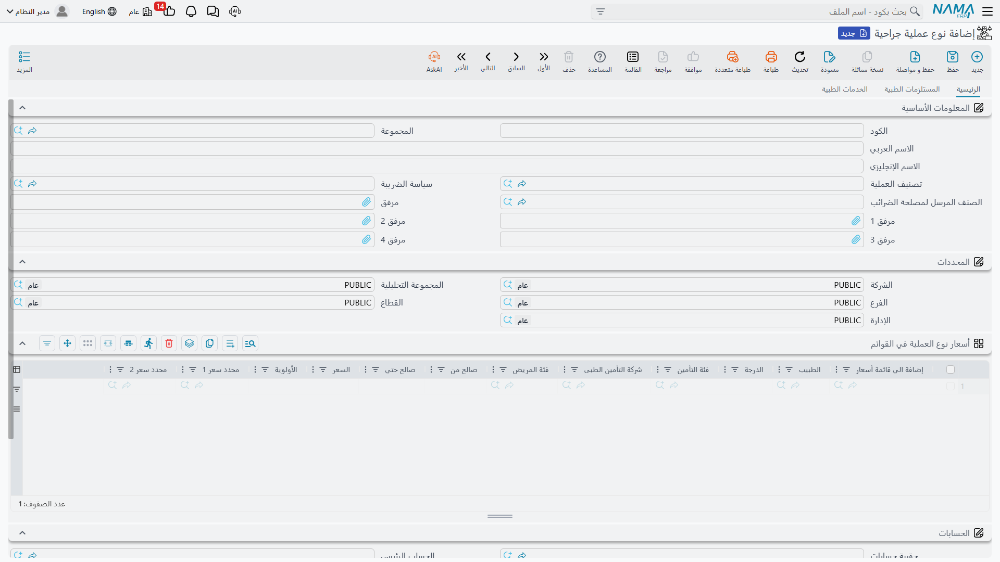
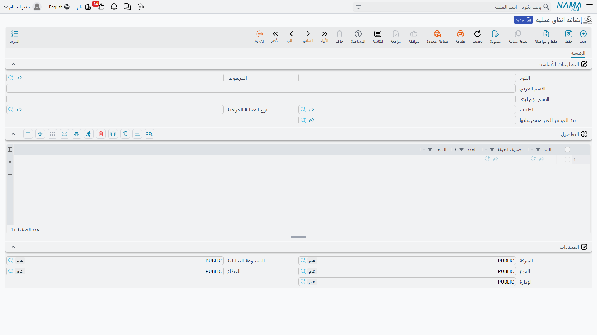

# كتالوج الخدمات الطبية

إلى جانب الخدمات الطبية العامة، يحتفظ المستشفى بكتالوجات متخصّصة لكل نوع من الأنشطة الإكلينيكية: **التحاليل**، **الأشعة**، **العلاج الطبيعي**، و**العمليات الجراحية**. هذه الكتالوجات هي ما يطلبه الطبيب وما تُسعَّر به الفواتير لاحقًا.

## نمط مشترك: "نوع خدمة قابل للبيع"

أنواع التحاليل والأشعة والعلاج الطبيعي والعمليات تشترك جميعها في الشكل نفسه — فهي البنود التي يُحاسَب عليها فعلًا:

- **المعلومات الأساسية:** الكود، الاسم، **التصنيف** الأب، **سياسة الضريبة**، و**الصنف المرسل لمصلحة الضرائب** (للفاتورة الإلكترونية).
- **جدول الأسعار في القوائم:** طريقة سريعة لدفع سعر هذا البند مباشرةً إلى قائمة أسعار واحدة أو أكثر، مع تنويع حسب الطبيب/الدرجة/التأمين/فئة المريض والفترة.
- **الحسابات والضرائب:** فكل نوع يتصرّف كذمّة محاسبية مستقلة.
- **تبويب المستلزمات الطبية:** الأصناف الافتراضية التي تُصرف من المخزن عند أداء الخدمة.
- **تبويب الخدمات الطبية:** خدمات طبية افتراضية مرتبطة.

## التحاليل

**نوع تحليل طبي (Laboratory Test Type)** هو تعريف تحليل واحد يقدّمه المعمل (صورة دم كاملة، سكر صائم…). بالإضافة إلى النمط المشترك، له تبويب فريد يحدّد **المعدّلات المرجعية الطبيعية** لكل مكوّن نتيجة، مقسومةً حسب الفئة: ذكر/أنثى/طفل ذكر/طفلة أنثى (من–إلى) ووحدة القياس. هذا الجدول هو ما يحدّد لاحقًا إن كانت نتيجة المريض ضمن المعدّل أم خارجه.

وتُجمَّع التحاليل تحت **تصنيف تحليل طبى (Laboratory Test Category)**. كما يضمّ النظام لوائح مساندة للمعمل: **اختبار (HMS Test)** كمكوّن نتيجة، و**أنبوبة اختبار (Test Tube)** و**لون أنبوبة الاختبار (Test Tube Color)** لوصف أنابيب سحب العيّنات وألوانها المتعارف عليها.

## الأشعة والعلاج الطبيعي

**نوع أشعة (Radiology Type)** يُعرّف إجراء تصوير واحدًا (أشعة عادية، مقطعية، رنين، موجات فوق صوتية…) ويتبع النمط المشترك، ويُجمَّع تحت **تصنيف أشعة (Radiology Category)**.

وبالمثل **نوع العلاج الطبيعى (Physical Therapy Type)** يُعرّف جلسة/إجراء علاج طبيعي، ويُجمَّع تحت **تصنيف علاج طبيعى (Physical Therapy Category)**.

## العمليات الجراحية

**نوع عملية جراحية (Surgery Type)** يُعرّف العملية التي يجريها المستشفى، ويضيف على النمط المشترك تفاصيل خاصة بالجراحة: عدد الساعات القياسية وسعر الساعة الإضافية، و**مكوّنات الأجر** (أجر الجرّاح، المساعد، التخدير، الجراحة المفتوحة، أخرى)، إلى جانب مخزن المستلزمات ومرفقات المستندات الجراحية. ويُجمَّع تحت **تصنيف عملية جراحية (Surgery Classification)** الذي يُستخدم كمحدِّد تسعير.

## اتفاقات العمليات (Packages)

بدلًا من فوترة عملية بندًا بندًا، يمكن الاتفاق على **سعر إجمالي ثابت** لها عبر **اتفاق عملية (Surgery Package)**. يربط الاتفاق طبيبًا ونوع عملية ببند للفواتير غير المتفق عليها (ما يخرج عن الباقة)، وفي تفاصيله قائمة من **بنود اتفاق العملية** كلٌّ بسعره وربما حسب تصنيف الغرفة.

و**بند اتفاق عملية (Package Item)** هو السطر الذي يظهر داخل الباقة، ويحمل علامات تحدّد **ما الذي يغطّيه هذا البند** (مستلزمات، كشف، إقامة، مرافق، إشراف، تحاليل، أشعة، علاج طبيعي، صيدلية، خدمة، جراحة، بنك دم…) — أي يربط سطر الباقة بفئة الخدمة الحقيقية التي يقابلها. تُفوتَر الباقة لاحقًا عبر **[فاتورة اتفاق عملية](./hms-invoicing.md)** التي تقارن السعر المتفق عليه بالسعر الفعلي وتُرحّل الفرق.
