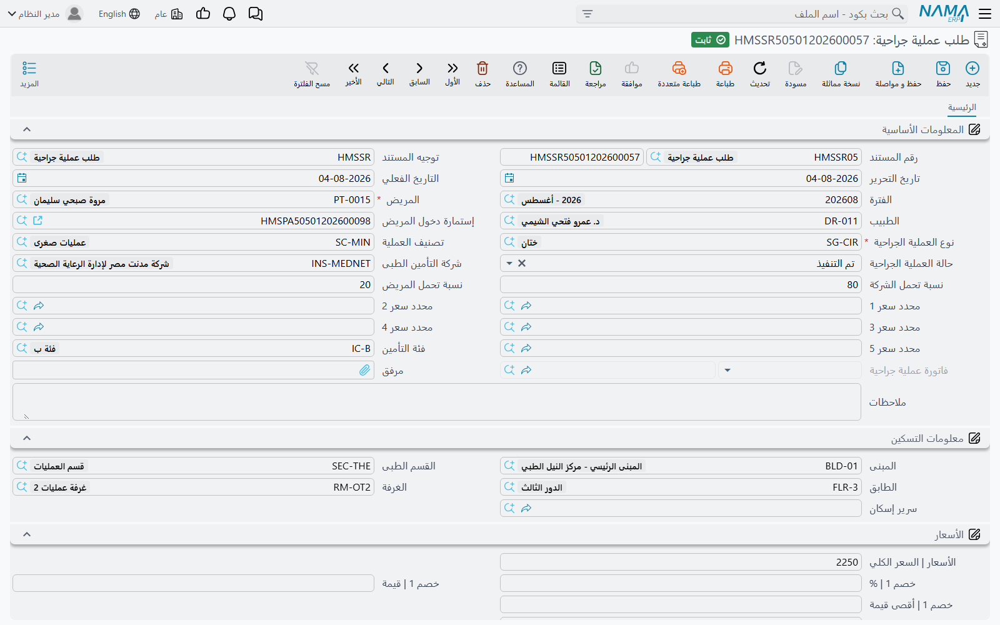
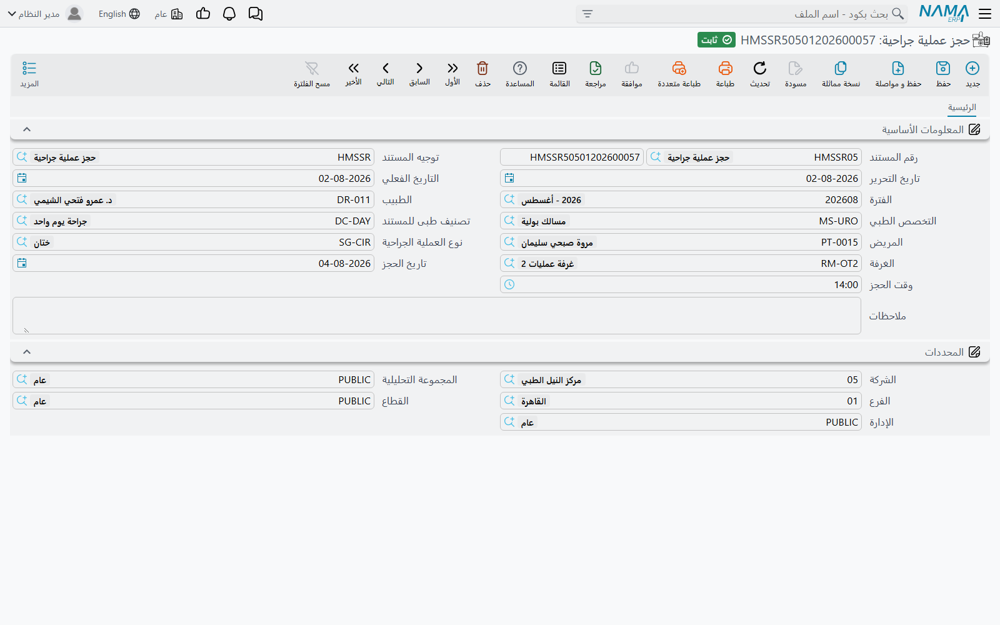
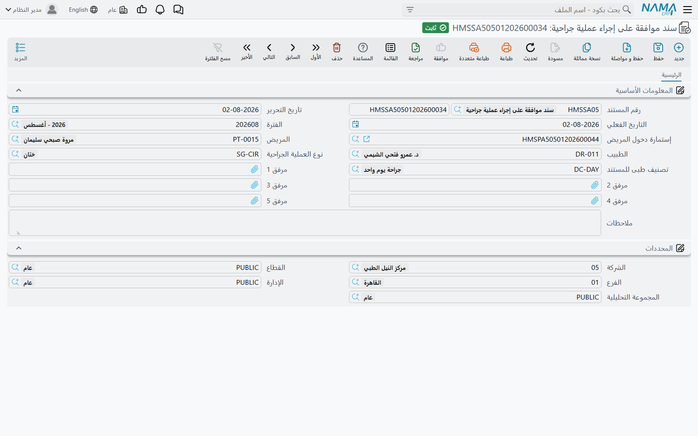
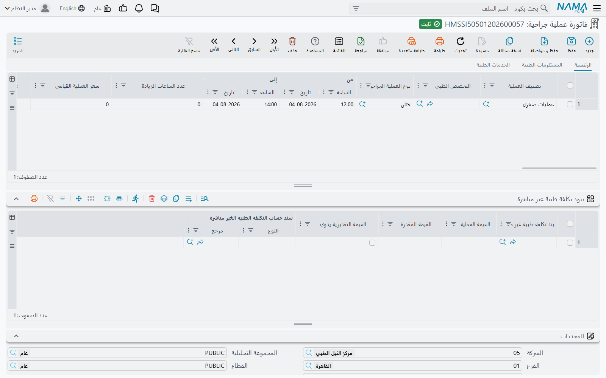
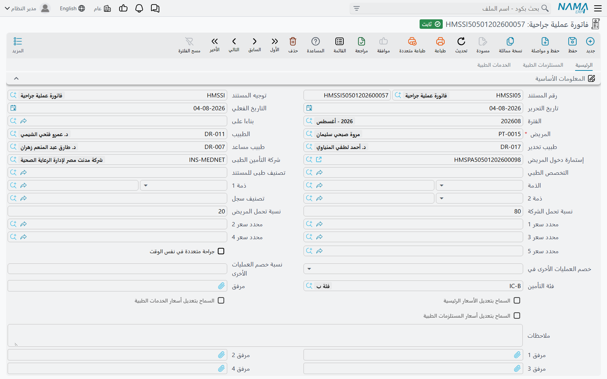
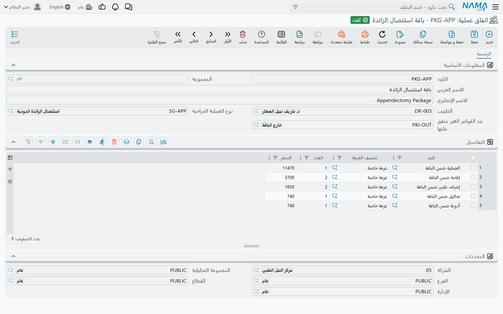
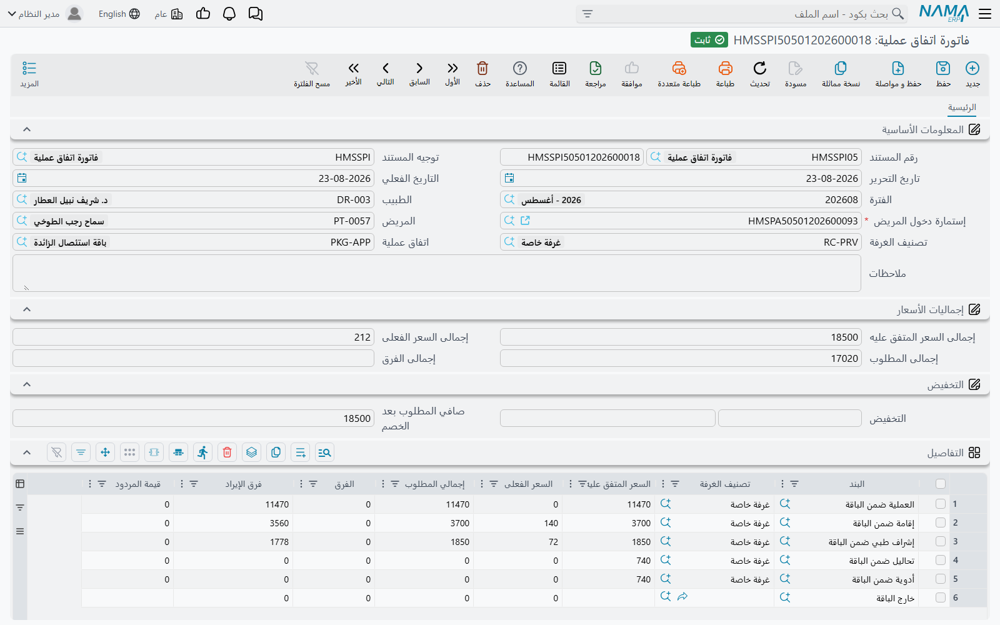
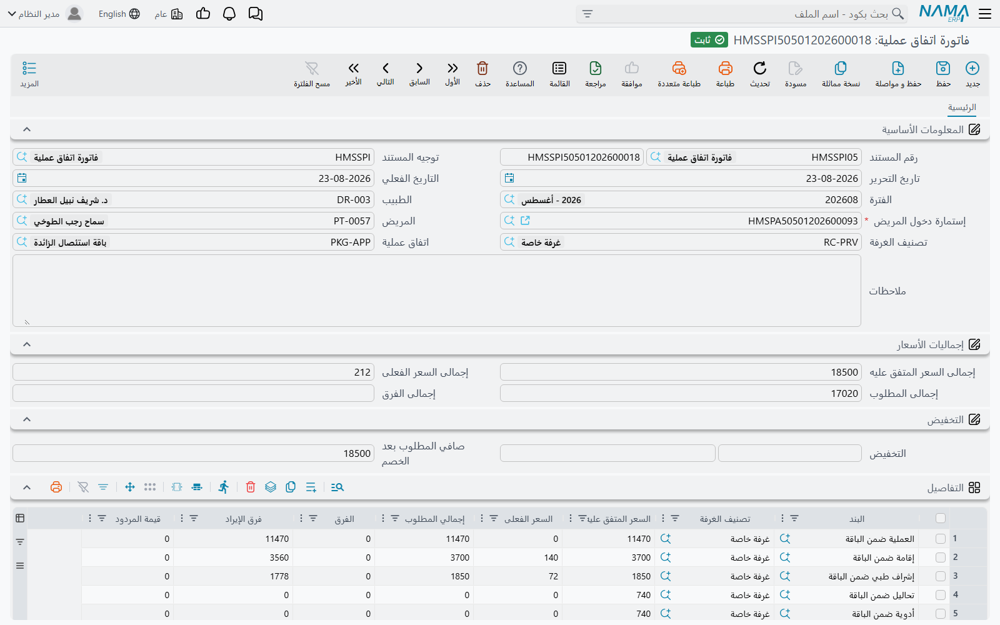

# دورة العملية الجراحية

العملية الجراحية تمر بشاشات أكثر من أي خدمة أخرى في المستشفى: الجراح يطلبها، وغرفة العمليات تُحجز، والمريض
يوقّع موافقته، ثم تُفوتر العملية بمستلزماتها وخدماتها — وإذا كان المستشفى قد باع للمريض «اتفاق عملية» بسعر
شامل، تُسوّى الإقامة كلها لاحقًا مقابل السعر المتفق عليه. تتبع هذه الصفحة عملية واحدة عبر كل هذه الشاشات
بالترتيب الذي يقابلها به المستشفى.

الشاشات موزعة على ثلاث مجموعات في القائمة، وهذا أول ما تحتاج معرفته عند البحث عنها:

| الشاشة | مكانها في القائمة |
|---|---|
| طلب عملية جراحية (HMSSurgeryReq) | نظام إدارة المستشفيات ← العمليات الجراحية |
| فاتورة عملية جراحية (HMSSurgeryInvoice) | نظام إدارة المستشفيات ← العمليات الجراحية |
| سند موافقة على إجراء عملية جراحية (HMSSurgeryApproval) | نظام إدارة المستشفيات ← المستندات |
| حجز عملية جراحية (HMSSurgeryReservation) | نظام إدارة المستشفيات ← اتفاقات عمليات |
| اتفاق عملية (HMSSurgeryPackage) | نظام إدارة المستشفيات ← اتفاقات عمليات |
| فاتورة اتفاق عملية (HMSSurgeryPackageInvoice) | نظام إدارة المستشفيات ← اتفاقات عمليات |

لا يُنشئ أي مستند المستند التالي آليًا. كل مستند يُدخل وحده، وتربط بينها المريض واستمارة الدخول، وبين
الطلب والفاتورة حقل **بناءا على**.

## 1. طلب العملية الجراحية

**طلب عملية جراحية** هو أمر الجراح: أي مريض، وأي استمارة دخول، و**نوع العملية الجراحية**، و**تصنيف
العملية**، و**حالة العملية الجراحية** التي تنتقل بين *مبدئي* و*قيد التنفيذ* و*تم التنفيذ*. ويحمل كذلك
بيانات التأمين التي تحتاجها الفاتورة — **شركة التأمين الطبى** و**فئة التأمين** و**نسبة تحمل الشركة**
و**نسبة تحمل المريض** ومحددات السعر — مع **معلومات التسكين** للمريض (المبنى، القسم، الطابق، الغرفة،
السرير) ومجموعة **الأسعار**.

الطلب لا يُنشئ أي أثر محاسبي وليس له أزرار خاصة. حقل **فاتورة عملية جراحية** فيه يبقى فارغًا إلى أن تُحفظ
فاتورة بناءً عليه، وهو ما يخبرك أن الطلب قد فُوتر.

## 2. حجز غرفة العمليات: حجز عملية جراحية

**حجز عملية جراحية** يحجز غرفة عمليات في تاريخ ووقت: **الطبيب** و**التخصص الطبي** و**المريض** و**نوع
العملية الجراحية** و**الغرفة** و**تاريخ الحجز** و**وقت الحجز**. وهو غير مرتبط بالطلب ولا باستمارة الدخول؛
إنه سجل الجدولة.

تحتاج الغرفة وقتًا بين العمليات للتنظيف والتجهيز. كل غرفة تحمل حقل **الفرق في الوقت بين الحجز والحجز
التالي لنفس الغرفة**، وإذا كان في توجيه الحجز الخيار «الأخذ ف الاعتبار الفرق  في الوقت بين الحجز والحجز
التالي لنفس الغرفة» مفعّلًا، يفحص الحفظ كل الحجوزات المحفوظة الأخرى لنفس الغرفة. فإذا بدأ أحدها داخل هذا
الفرق قبل حجزك أو بعده — فرق 60 دقيقة مع حجز قائم في الساعة 10:00 يمنع أي حجز من 09:00 إلى 11:00 — يُرفض
الحجز وتذكر الرسالة الحجز المتعارض. ومع تفعيل الخيار يصبح حقل الفرق في ملف الغرفة إلزاميًا أيضًا، فيجب
تعبئته.

## 3. الموافقة: سند موافقة على إجراء عملية جراحية

**سند موافقة على إجراء عملية جراحية** يسجّل موافقة المريض (أو وليّه) على العملية: **إستمارة دخول المريض**
و**المريض** و**الطبيب** و**نوع العملية الجراحية** و**تصنيف طبى للمستند** وحتى خمسة مرفقات للنماذج
الموقّعة. ليس له أزرار، ولا ينشئ أثرًا، ولا يفحص وجوده أي مستند آخر — إنه سجل المستشفى المحفوظ على
استمارة الدخول.

## 4. فوترة العملية: فاتورة عملية جراحية

**فاتورة عملية جراحية** هي حيث المال. لها ثلاث صفحات — **الرئيسية** (العمليات نفسها) و**المستلزمات
الطبية** و**الخدمات الطبية** — وكل سطر مسعّر يُقسم بين المريض والتأمين كما في أي فاتورة أخرى في المستشفى
(انظر [الفوترة والمحاسبة](/ar/modules/hms/hms-invoicing)).

### البدء من الطلب

اختر الطلب في حقل **بناءا على** فتملأ الفاتورة نفسها: يُنسخ المريض والطبيب واستمارة الدخول وشركة التأمين
وفئته ونسب التحمل ومحددات السعر ومعلومات التسكين والملاحظات، ويُضاف سطر عملية واحد بنوع العملية وتصنيفها
وحالتها من الطلب، مسعّرًا من جديد من مصادر الأسعار. لا تعرض قائمة البحث في **بناءا على** إلا الطلبات غير
المفوترة (أو المفوترة على هذه الفاتورة نفسها)، فالطلب يُفوتر مرة واحدة؛ وحفظ الفاتورة يكتبها في حقل
**فاتورة عملية جراحية** في الطلب، وإلغاؤها أو حذفها يُفرغ هذا الحقل.

ويمكنك أيضًا ترك **بناءا على** فارغًا وإدخال السطور مباشرة.

### سطور العمليات وساعاتها

اختيار **نوع العملية الجراحية** في السطر يفعل أشياء كثيرة معًا:

- يملأ **تصنيف العملية** من نوع العملية؛
- يسعّر السطر، بما في ذلك **سعر العملية القياسي** و**عدد الساعات القياسي** و**سعر الساعة الزيادة عن عدد
  ساعات العملية**، وتوزيعه على مكونات الأتعاب **فتح عملية** و**اتعاب جراح** و**مساعد جراح** و**اتعاب
  تخدير** و**آخري**، لكلٍّ منها نسبة تكلفة وقيمتها؛
- يُحمّل المستلزمات الافتراضية لنوع العملية في صفحة **المستلزمات الطبية** وخدماته الافتراضية في صفحة
  **الخدمات الطبية**، مسعّرة، مع أخذ **الكمية المخططة** للمستلزمات من نوع العملية؛
- يعيد حساب بنود التكلفة غير المباشرة.

العمليات تطول كثيرًا عن المخطط، وحقلا **من** و**إلى** (التاريخ والساعة) في السطر يعالجان ذلك. عند الحفظ
يقيس النظام المدة الفعلية، ويطرح منها الساعات القياسية، ويكتب الباقي في **عدد الساعات الزيادة**. فيصبح سعر
السطر هو السعر القياسي + عدد الساعات الزيادة × سعر الساعة الزيادة. عملية ساعاتها القياسية 2 بسعر 5,000
و800 لكل ساعة زيادة، استمرت من 10:00 إلى 13:30، تُفوتر 5,000 + 1.5 × 800 = 6,200.

وتتبع تكلفة هذا الوقت الإضافي لكل مكوّن من مكونات الأتعاب: علامات **احتساب الوقت الإضافي لـ …** (لفتح
العملية، وأتعاب الجراح، ومساعد الجراح، وأتعاب التخدير، وأخرى، والذمة) تحدد أي المكونات تحمل قيمة تكلفة
وقت إضافي. إذا أزلت العلامة عن أحدها صارت تكلفة وقته الإضافي صفرًا.

### خيارات أخرى في رأس الفاتورة

- **جراحة متعددة في نفس الوقت** — عند إجراء عدة عمليات في جلسة واحدة، يحتفظ السطر الأعلى سعرًا بسعره،
  ويحصل كل سطر آخر على نسبة **نسبة خصم العمليات الأخرى** كخصم، يوضع في خصم 1 أو خصم 2 حسب **خصم العمليات
  الأخرى في**. وتنقص قيم التكلفة والذمة لهذه السطور بنفس النسبة.
- **طبيب تخدير** و**طبيب مساعد** — يُسجّلان مع الجراح.
- **عدم مسح سطور المستلزمات و الخدمات عند حذف نوع عملية** — حذف سطر عملية يحذف عادةً سطور المستلزمات
  والخدمات التي جاءت معه. فعّل هذا الخيار للإبقاء عليها.
- **المخزن** و**مستند الصرف المنشأ** في صفحة المستلزمات الطبية — المخزن الذي تُصرف منه المستلزمات، وإذن
  الصرف المنشأ لها حسب التوجيه.

كل سطر مستلزمات أو خدمة ينتمي إلى إحدى العمليات في الفاتورة (عمود **نوع العملية الجراحية**)؛ وإذا تُرك
فارغًا يُملأ عند الحفظ بنوع أول عملية.

### تثبيت الأسعار: إجراءات قائمة المزيد

قد يكون في توجيه الفاتورة الخيار **تحديث الأسعار مع الحفظ** مفعّلًا. حينها يعيد كل حفظ تسعير السطور من
مصادر الأسعار، فتبقى الفاتورة متوافقة مع قوائم الأسعار وموافقات التأمين، لكن أي سعر كُتب يدويًا يُستبدل.
وفي قائمة **المزيد** للفاتورة المحفوظة ثلاثة إجراءات توقف إعادة التسعير لجزء من هذه الفاتورة:

| الإجراء | ما يبقى كما أُدخل |
|---|---|
| **السماح بتعديل الأسعار الرئيسية** | سطور العمليات |
| **السماح بتعديل أسعار الخدمات الطبية** | سطور الخدمات الطبية |
| **السماح بتعديل أسعار المستلزمات الطبية** | سطور المستلزمات الطبية |

كل إجراء يفعّل علامة الاختيار التي تحمل نفس الاسم في رأس الفاتورة، وتُعاد تهيئة الشاشة. ومن بعدها تبقى
الأسعار التي تكتبها في ذلك الجزء بعد الحفظ.

### خيارات التوجيه الخاصة بفواتير العمليات

ثلاثة خيارات في التوجيه موجودة أساسًا للعمليات:

- **السماح بتكرار نوع العملية على السطر لنفس الفاتورة** — يسمح بأن تحمل الفاتورة نفس نوع العملية في
  سطرين. وبدونه يُرفض السطر الثاني.
- **عدم إنشاء أكتر من فاتورة على نفس استمارة دخول المريض** — فاتورة عمليات واحدة لكل استمارة دخول.
- **عدم إنشاء أكثر من نوع عملية على نفس استمارة دخول المريض** — يُفوتر نوع العملية مرة واحدة فقط لكل
  استمارة دخول، عبر كل الفواتير.

ويحدد التوجيه أيضًا الأثر المحاسبي: إلى جانب حسابات المريض والتأمين والخصم والضريبة والتكلفة المعتادة،
يحمل توجيه العمليات زوج حسابات لكل مكوّن من مكونات الأتعاب ولكل تكلفة وقت إضافي (**تكاليف أسعار
العمليات**).

## 5. مسار اتفاق العملية

بعض المرضى يشترون العملية كاتفاق: سعر واحد متفق عليه للعملية، وغالبًا للإقامة المحيطة بها. هذا المسار
يضيف شاشتين.

### اتفاق العملية واستمارة الدخول

**اتفاق عملية** يحدد **الطبيب** و**نوع العملية الجراحية**، و**بند الفواتير الغير متفق عليها** لكل ما
يُفوتر خارج الاتفاق، وجدول تفاصيل من بنود الاتفاق، لكلٍّ منها تصنيف غرفة و**العدد** و**السعر** — السعر
المتفق عليه لذلك الجزء من الإقامة. واختيار البند يملأ تصنيف الغرفة منه. راجع
[كتالوج الخدمات الطبية](/ar/modules/hms/hms-service-catalog) لبنود الاتفاق.

يرتبط الاتفاق بالمريض عن طريق **إستمارة دخول المريض**: حقل **اتفاق عملية** فيها، وصفحة **اتفاق عملية**
في الاستمارة التي تعرض بنود الاتفاق وأسعارها المتفق عليها عند حفظ الاستمارة. ثم تُفوتر كل فواتير الإقامة
بشكل عادي — فاتورة العمليات والإقامة والصيدلية وغيرها.

### تسوية الاتفاق: فاتورة اتفاق عملية

في النهاية تقارن **فاتورة اتفاق عملية** بين المتفق عليه وما فُوتر فعلًا. اختر **إستمارة دخول المريض** —
تعرض قائمة البحث استمارات المريض المختار التي تحمل اتفاقًا ولم تُغلق بعد بخروج من التسكين؛ وخيار التوجيه
**إظهار جميع استمارات الدخول** يلغي هذا الفلتر — فتملأ الفاتورة المريض والاتفاق، ثم تبني سطرًا لكل بند من
بنود الاتفاق:

- **السعر المتفق عليه** — من الاتفاق.
- **السعر الفعلى** — إجمالي فواتير الاستمارة المحفوظة التي يغطيها البند، حسب علامات البند (فاتورة العمليات
  تُطابق على ثلاثة أجزاء: عملياتها، ومستلزماتها، وخدماتها). وتُطرح المردودات (الصيدلية، المستلزمات، بنك
  الدم) وتظهر في **قيمة المردود**.
- **إجمالي المطلوب** — الأكبر بين الاثنين.
- **الفرق** — مقدار تجاوز الفعلي للسعر المتفق عليه.
- **فرق الإيراد** — الجزء غير المستخدم من السعر المتفق عليه.

الفواتير التي لا يغطيها أي بند تُجمع في سطر أخير تحت **بند الفواتير الغير متفق عليها** للاتفاق، وليس له
سعر متفق عليه، فيكون سعره الفعلي كله مطلوبًا. ويعرض رأس الفاتورة **إجمالى السعر المتفق عليه** و**إجمالى
السعر الفعلى** و**إجمالى المطلوب** و**إجمالى الفرق**، ومجموعة **التخفيض** (نسبة أو قيمة، كلٌّ منهما يملأ
الآخر) تعطي **صافي المطلوب بعد الخصم**. وتُعاد بناء السطور من فواتير الاستمارة عند كل حفظ.

عند الحفظ تنشئ الفاتورة ثلاث قيود، كلٌّ منها فقط إذا كان في التوجيه طرفا زوجه: إجمالي **الفرق** (الفرق
مدين / دائن)، وإجمالي **فرق الإيراد** (فرق الإيراد مدين / دائن)، وخصم الرأس (مدين / دائن خصم الفاتورة).
الفواتير الفردية أنشأت بالفعل مستحقات المريض والتأمين؛ وهذا المستند ينشئ فقط التسوية مقابل الاتفاق.

ليس لفاتورة اتفاق العملية أزرار خاصة.

## رسائل قد تظهر لك

| الرسالة | السبب | ما العمل |
|---|---|---|
| «يوجد سند حجز {0} على الغرفة {1} تم الحجز في {2} والوقت المسموح به لعمل حجز آخر على نفس الغرفة هو {3}» | حجز عملية جراحية آخر محفوظ يحجز نفس الغرفة داخل فرق الوقت الخاص بها، وخيار مراعاة الفرق في الوقت مفعّل في توجيه الحجز. | انقل الحجز خارج الفرق، أو احجز غرفة أخرى، أو راجع الفرق في ملف الغرفة. |
| «لا يمكنك ترك نفاصيل الرئيسية فارغة» | فاتورة العمليات بلا سطر عملية. | أضف العملية المطلوب فوترتها. |
| «نوع عملية {0} مكرر» | سطرا عمليات بنفس نوع العملية والتوجيه لا يسمح بالتكرار. | ادمج السطرين، أو فعّل «السماح بتكرار نوع العملية على السطر لنفس الفاتورة» إذا أُجريت عمليتان فعلًا. |
| «نوع العملية {0} غير موجود فى سطور العمليات الجراحية» | سطر مستلزمات أو خدمة منسوب إلى نوع عملية ليس له سطر عملية. | صحّح نوع العملية في السطر، أو أضف سطر العملية الناقص. |
| «من تاريخ يجب أن يكون قبل إلى تاريخ» | في سطر عملية، تاريخ وساعة «من» بعد تاريخ وساعة «إلى». | صحّح الساعات؛ العملية التي تتجاوز منتصف الليل تحتاج التاريخ الأحدث في «إلى». |
| «مجموع حقلى نسبة تحمل المريض ونسبة تحمل الشركة يجب أن يساوى 100» | في سطر عملية أو خدمة، نسبتا المريض والتأمين لا تساويان 100. | صحّح النسبتين في السطر. |
| «طلب العملية الجراحية مستخدم بالفعل فى فاتورة عملية جراحية اخرى» | حقل بناءا على يشير إلى طلب فُوتر بالفعل في فاتورة عمليات أخرى. | افتح الطلب؛ حقل فاتورة عملية جراحية فيه يذكر الفاتورة التي فوترته. |
| «لا يمكنك إنشاء أكثر من فاتورة على استمارة دخول المريض {1}، حيث يوجد فاتورة {0} على نفس استمارة دخول المريض» | التوجيه يسمح بفاتورة عمليات واحدة لكل استمارة دخول وتوجد فاتورة محفوظة. | أضف السطور إلى الفاتورة الموجودة، أو ألغها أولًا. |
| «يوجد فاتورة {0} للاستمارة {1} لنوع العملية {2} - لا يمكنك انشاء اكثر من فاتورة لنفس نوع العملية الجراحية» | التوجيه يسمح بكل نوع عملية مرة واحدة لكل استمارة دخول وفاتورة محفوظة تفوتره بالفعل. | فوتره على الفاتورة الموجودة، أو خفّف الخيار في التوجيه. |
| «إستمارة الدخول {0} ليس بها اتفاق عملية» | فاتورة الاتفاق تشير إلى استمارة دخول بلا اتفاق عملية. | ضع الاتفاق على الاستمارة، أو فوتر بفاتورة عمليات عادية. |
